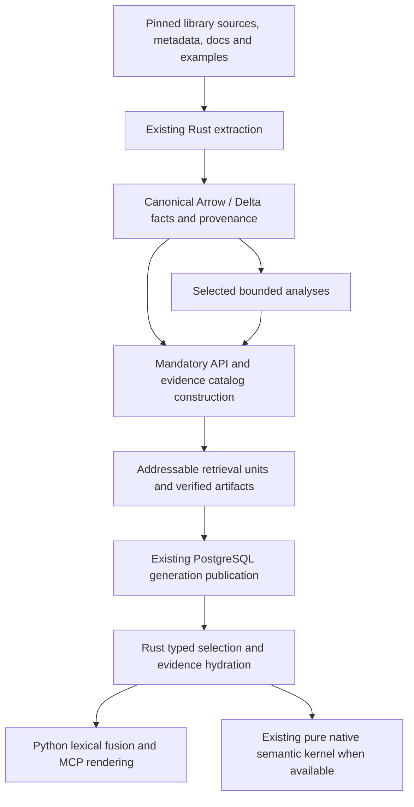

# API and evidence product target

**Target, 2026-09-29.** [§15](semantic-model.md) (ADR-0085/0083/0084) is the accepted target, and the [cutover plan](../../plans/semantic-model-cutover-plan_2026-09-29.md) delivers it layer by layer. Phases 4–5 move the catalog, associations, selection and retrieval onto §15 relations; product work beyond PR5 pauses until phase 5. Until that phase exits, this page describes the implemented legacy pipeline.

## §14 Purpose, status and decision

**Accepted target; PR1–PR5 implemented, PR5 bounded qualification passed, 2026-09-29.** This is the comprehensive replacement
product target under ADR-0071. It replaces general behavioral-model completion as the route to a
first useful release. It preserves sound behavioral analysis as one source of evidence. It does
not declare Stage 3 finished or certify an advantage over Context7.

The product helps a coding agent **find a built-in library capability, select its exact public
API and configuration, implement or deploy it, and inspect the evidence and limitations behind
that choice**. Its distinguishing contract is executable structured selection and connected,
version-scoped evidence—not a larger volume of prose or a lower count of unknown behaviors.

The [forward plan](../../plans/behavioral-model-forward-plan_2026-09-24.md) is the single execution
and finding-disposition owner. The [target review](../../design_review/reviews/design_review_api-evidence-product_2026-09-28.md)
assesses this target against the actual `739f9df` baseline. The two supplied external reviews are
inputs, not contract authorities: [pathway](../../external-review-pathway-working-product.md) and
[R01–R08 recommendations](../../library_context_product_recommendations_739f9df.md).
The [catalog library-fit review](../../design_review/reviews/design_review_catalog-library-fit_2026-09-28.md)
supplies the interface evidence and CLF findings for ADR-0073's accepted contract/derivation target.
Its PR2 foundations are Implemented; PR3–PR5 extend them. The forward plan §6.2 owns finding
status and the qualification boundary.

Unless explicitly labeled otherwise, all new behavior in this section is **Proposed**. Names below
are logical contracts to refine in `cpg-schema`, not independently authoritative SQL schemas.

> Decision: ADR-0071

## §14.1 What must be different from Context7

**Interface-checked, 2026-09-28.** Context7 already offers query-ranked documentation/examples,
library/version targeting and source links. Its Search API accepts library, version and language
hints; its response can identify snippets recovered from a dynamic source-code index. Source
examples can also be generated when public documentation is sparse. Thus source access, version
awareness, semantic search and examples are insufficient differentiation by themselves.
[Search contract](https://context7.com/docs/api-reference/search/search-context7-documentation),
[indexing policy](https://context7.com/docs/adding-libraries),
[Search API](https://context7.com/docs/search-api).

**Proposed advantage:** a query can require an actual declared parameter, a configuration-field
domain, a particular invocation form and a linked usage/deployment example, then receive separate
supported and unresolved results with a witness for each requirement. Following a result gives
the original evidence and a coherent invocation packet under the same generation. This avoids
repeatedly asking an agent to rediscover identities and reconcile scattered snippets. Whether
that improves task success is tested in §14.12; the published API documentation does not establish
that Context7 could never reproduce such an answer through its caller's reasoning.

| Agent journey | Required product answer | Differentiating mechanism |
|---|---|---|
| Find a built-in registration feature with a timeout option | Public registration surface, option owner/default and exact matching evidence | Typed option lookup joined to public identity and original scenario |
| Choose object configuration versus a per-call setting | Both locations, declared defaults, supported field/reader links and unresolved precedence | Configuration scope is explicit; no inferred global precedence |
| Use an asynchronous context-manager API | Factory signature, `async with` use, setup/teardown context and qualification | Invocation model distinct from full cleanup proof |
| Deploy a supported transport | Exact package/extras declarations, original launch/config material, relevant options and external prerequisites | Source/version-scoped deployment evidence joined to APIs |
| Find a capability whose wrapper is unmodeled | Source declaration and documented/observed usage, with effective signature unresolved | Local uncertainty preserves useful evidence without admitting body behavior |
| Combine two requirements | Per-requirement witnesses and joint-applicability status | Matching independent records never becomes proof of simultaneous support |

FastMCP 4.0.5 remains the first supported pilot. A usable pilot can precede comparative acceptance;
the user's differentiation objective is complete only when the frozen comparison demonstrates
material benefit. A second library is required before a library-general claim, not before pilot use.

## §14.2 Assessing the recommendations

**Interface-checked, 2026-09-28; new outcomes Proposed.** The newer review correctly incorporates
PostgreSQL. Several suggestions in the earlier pathway describe a superseded baseline.

| Recommendation | Decision and improvement | Work type / product exit |
|---|---|---|
| R01 independent catalog readiness | Adopt; move public-surface and catalog construction outside optional analysis, not merely omit malformed briefs. Declare semantic capability availability separately | Pipeline boundary; an undocumented, unresolved API remains browsable/searchable without a brief; corrupt claimed evidence still fails |
| R02 API contracts and packets | Adopt; distinguish member, binding/access path, declaration and signature variant. Include generated constructors, properties and class search units | Mostly projection; complete ordered signature and origin survive PG/MCP |
| R03 decorator surface | Adopt selectively; one normalization owner must replace the weak brief invocation classifier as well as feed the strict behavioral classifier | Bounded normalization/models; no general decorator evaluator |
| R04 options and relationships | Adopt; defaults/factories are not all present today. Add syntax associations where needed; distinguish declared domains, documented choices and branch-tested literals | Projection plus small field/delegation analyses; no cross-field dependency leakage |
| R05 docs/scenarios/evidence roots | Adopt; preserve enclosing receiver mutations, registrations and fixture context, not only free-variable definitions. Classify expected-failure tests separately | Corpus/association work; useful evidence outside brief seeds and correct root closure |
| R06 units, views and witnesses | Adopt; add class/config/doc units, one finite view catalog and family-normalized fusion. Return winning units, not a second approximate explanation search | Retrieval migration; option/example matches retain identity through native IPC |
| R07 strict/discovery/joint support | Adopt; add per-predicate closed-world scope, conflict and availability states. A missing declared formal is not proof that a keyword is rejected | Typed query contract; one Rust classifier for all ranked and exhaustive consumers |
| R08 agent-task evaluation | Adopt; freeze development and independent confirmation tasks early, include deployment, and distinguish pilot usability from measured differentiation | Evaluation; parity with Context7 is an unmet product objective, not success |
| Runtime surface inspection | Conditional escape hatch for a central inaccessible API; explicit isolated observations, never automatic request-time import | Only after a documented source/doc/scenario gap blocks a selected task |
| `pg_trgm` / PostgreSQL FTS | Defer; retain exact symbols and current BM25. Trigram suggestions need a measured symbol-discovery gap; FTS is a separate ranking change | No prerequisite to the first product |
| Earlier 4096-vector/driver/testcontainers advice | Already superseded: 1024, SQLx/pgpq, pgvector and real PG tests are implemented | Reuse PG0–PG17; no driver/pool swap or ANN retuning project |
| Earlier shared token-admission repair | Already implemented in `embed::Session::texts`, including operations | Retain boundary tests; change the stale brief-specific instruction through a spec migration |
| Separate rebuild identities | Adopt coarse dependency-aware rebuilds over existing immutable publication | No new incremental framework or independently mutable catalog database |

Additional required design: deployment/package metadata (§14.6), safe handling of negative usage
examples, evidence conflict/version alignment, deterministic comparison of candidate APIs, and a
clear supported-surface/coverage report. These directly serve the product rather than expanding
the general analysis substrate.

## §14.3 Responsibilities and representation flow

> Decision: ADR-0071, ADR-0078, ADR-0073, ADR-0074

| Owner | Responsibility and retained decisions | Consumer boundary |
|---|---|---|
| `cpg-extract`, acquisition in `library.rs` | Pinned source/environment, declarations, types, docs, package metadata and source spans | Attributed observations; no library import to produce static facts |
| `cpg-schema` | Canonical public/signature/options/evidence relations plus finite typed wire requests, contextual witnesses, envelopes and view vocabulary | Arrow remains the fact authority; Schemars derives input/output schemas from Rust wire contracts; codebooks stay append-only |
| Catalog loading/index owner in `cpg-core` | Load exact fact inputs and declare scanned relations, membership, coverage and policy dependencies; build reused indexes | Immutable validated input bundle; DataFusion joins remain available; no store handle inside pure derivation |
| Catalog derivation functions in `cpg-core` | Normalize supported surface forms, construct contracts and associate options/scenarios from explicit inputs | Pure transforms with deterministic output and evidence; effects follow derivation; no new framework/crate required |
| `lctx-analytics`, `flow_model`, condition kernel | Optional bounded inference and existing behavioral admission | Model-scoped claims with evidence and local boundaries |
| Existing `cpg-core` publication/bundle | Canonical persistence, catalog/retrieval artifacts and generation manifest | Validate all advertised capabilities before existing publication boundary |
| `lctx-postgres`, SQLx/pgpq | Finite imports, typed SQL selection, bounded hydration, generation pins and physical index admission | No second Python semantics engine in SQL |
| `lctx_storage`, pure semantic extension | Coarse asynchronous requests and explicit native capability loading | Existing lifespan/pool ownership; pure semantic computation stays separate |
| `lctx_mcp` | Existing lexical/name/fusion policy, packet rendering and schema-backed FastMCP Tool transport | Generated wire schemas and Rust decoding/classification; no second facet interpreter or independently authored semantic Pydantic contract |
| Evaluation tooling | Tasks, exact environments, independent task checks and paired agent runs | No evaluation answers or skill-derived gold enter compiler inputs |

The catalog is a **compiled projection of canonical evidence**, not an authored second knowledge
store. Core query dimensions use typed relations; JSON payloads hold genuinely variable details.
PostgreSQL stores product-selected records and their evidence closure, not every raw AST node.
Original evidence is captured and content-addressed before serving; opening a citation never
silently fetches a mutable current website to replace the pinned bytes.

**Implemented for PR2 (ADR-0073/0074); qualification is recorded in the forward plan.** Compilation separates
`load_catalog_facts → indexed inputs → pure derivations → canonical rows/evidence → retrieval and
embedding → publication`. Index repeated declaration-owner, signature-parameter, parameter-doc,
ancestry and type-parent lookups once where used. Preserve one-to-many observations and alternatives;
indexing cannot silently select one conflicting provider record. Keep suitable bulk relations in
DataFusion, and finite type closure in an indexed worklist. New surface/scenario fixtures can test
the derivation without acquisition, embedding or PostgreSQL setup. `CatalogFacts` owns exact loaded
rows; `PreparedCatalog` owns immutable declaration, parameter, ancestry, member and type-parent
indexes. Public/catalog member selection shares the ordered MRO/shadowing relation. Table reads
declare their real dependencies. PR3 extends these pure inputs and PR5 qualifies coarse reuse;
no production incremental engine or general performance gain is claimed.

## §14.4 Public API and configuration contracts

**PR2 Implemented and Tested, 2026-09-28; qualification is recorded in the forward plan:** resolved ordered normalization has one owner and returns
separate source, binding, accessor, wrapper, protocol, registration and behavioral-admission
aspects. Configuration declaration associations never imply unchanged runtime field storage;
exact links require a supported constructor and receiver/field proof. Original expressions and
named uncertainty remain available. `catalog_surfaces`, `catalog_configurations` and
`catalog_field_links` preserve these records and source citations through the current bundle16/projection6.
Storage proofs cover plain generated dataclasses and bounded direct constructors; reader links
identify receiver-field accesses and leave intervening mutation unresolved. Provider metadata
for attrs/Pydantic/NamedTuple/TypedDict never silently becomes a runtime-storage proof.
All six existing MCP tools and the capability resource use the Rust wire owner under ADR-0073;
new PR4 query semantics keep their own schedule.

> Decision: ADR-0071, ADR-0078, ADR-0074

**Public identity.** Introduce a `PublicMember` identity over the snapshot's public exposure
(exposed owner/name and access path), independent of later binding interpretation. Binding/access
forms are attributed associations, so better knowledge cannot rename the public slot. It references
zero, one or several existing declarations; it never overwrites
their node IDs. Alias/access-path records retain defining and inherited origin, binding mode and
source. A method inherited by two public classes can share an implementation while retaining each
public exposure. Group aliases only when the exposure equivalence is established. Ambiguous names
return choices rather than selecting an arbitrary declaration. Modules become browse groups, not
fictional callable operations. Existing declaration-based identifiers remain resolvable when unique.

**Signature variants.** A signature has a target role (source declaration, effective public
surface, provider-synthesized constructor, documented form, or runtime observation), ordered
parameters, type terms, return information and its own evidence. Preserve overload variants and
their conditions; never merge them into an invented union call signature. Parameters retain
positional-only/positional-or-keyword/keyword-only/variadic kind, requiredness, raw default
expression, exact literal when available and documentation. `None`, no default, unknown default
and a factory expression are different. Rendering a default never evaluates it. Provider-generated
constructor information joins `synthetic_callables`/parameter facts; absence of public `__init__`
does not mean no constructor contract. Original return/yield/raises documentation remains retrievable
before a selected task warrants additional typed section parsing.

**Invocation forms.** Represent function call, bound/unbound method, static/class method, property
read/write/delete, awaitable result, generator iteration and modeled context-manager use separately.
A form states what establishes it. A property has accessor associations; the last setter declaration
must not masquerade as the entire property. Source `async def` is an observation, not a blanket
promise about the exported wrapper. Preserve source-known/effective-unresolved side by side.

**Decorator normalization.** One ordered `DecoratorApplication` representation carries resolved
identity/candidates, source order, application order, argument expression/literals, evidence and
unresolved remainder. Selected models may establish receiver binding, accessor composition,
metadata association, context-manager use or registration separately. No single transparency bit
stands for all these effects. Initial models cover resolved built-in descriptors, selected metadata
stacks actually needed by the pilot, `contextlib` factories and pilot registration forms. Composition
is accepted only for declared order/shape cases. `wraps`/`__wrapped__` is a link, not behavioral
equivalence. Delete the independent trailing-name form decision in `synth.rs`; both briefs and
packets consume this normalization, while `flow_model` keeps strict claim admission.

**Options.** An `Option` belongs to a signature parameter, config field or explicitly documented
deployment control. It includes scope, type, default/factory evidence, aliases, requirement and
configuration-object association. Domain evidence is separately typed: declared Literal/enum domain,
documented choices, or source-tested values. A branch testing `x == "http"` does not prove the set of
accepted transports. Field flags and source factory/default expressions are implemented through existing Ruff parse
observations; expressions are retained without execution. Nested options are bounded by depth and cycle references, never flattened into
misleading dotted keyword parameters.

**Field analysis is deliberately small.** For supported records, derive constructor-formal → exact
field initialization and exact field read → consumer links. Preserve argument binding, receiver
identity, field name, scope and intervening-mutation boundary. Unknown initialization, aliases or
overrides produce an unresolved edge, not an all-fields taint join. `Config(timeout=t, title=n)` must
not attribute reading `title` to `t`. No general heap analysis is required.

## §14.5 Evidence, scenarios and useful relationships

> Decision: ADR-0076

Each evidence item names artifact digest, source kind, revision/release alignment, span or stable
document anchor, original bytes and extraction method. An association names its subject and role:
declares, documents, demonstrates, invokes, tests a failure, or suggests a candidate. Exact symbol
resolution, explicit cross-reference, ambiguous textual mention and similarity remain distinct.
Conflicting sources are retained with their individual scopes; a preferred display order cannot
silently reconcile a contradiction. Version alignment is `exact`, `mapped_with_evidence`, `other`
or `unknown`; only an appropriate basis can satisfy an exact-release predicate.

**Scenarios** contain ordered original spans, enclosing block/function/example, linked public APIs,
explicit option bindings, dependency/context requirements, and provenance. Prefer a larger faithful
excerpt over a surgically shortened example that changes behavior. Preserve `with`/`async with`,
exception branches, previous receiver mutations and registrations, imports and fixture setup.
Do not synthesize missing setup or join fragments from unrelated examples into a working recipe.

Use independent status dimensions, not a single quality ladder:

- extraction/context: complete excerpt, context-dependent, truncated/refused;
- checks: parse/binding/environment/execution each `passed`, `failed`, `not_run` or `blocked`;
- intent/outcome: demonstration, assertion/test, expected failure, skip/xfail, mixed, unknown;
- execution observation, if any: exact environment, selected inputs, result and limits.

An example parsed successfully is not an executed example. A passing test that expects an exception
is not a successful-use recipe. Default packets prefer relevant positive demonstrations; negative
cases appear as caveats with their intent. Missing runnable examples are disclosed, not fabricated.

**PR3 Implemented and Tested (2026-09-28); qualification is recorded in the forward plan.** `cpg-core::evidence` consumes
immutable acquired/catalog/coverage observations through its own pure pass. Five canonical
relations separate original artifacts, byte spans, scenarios, deployment records and associations.
Release-level package metadata is associated once with its compiled release. Serving returns
explicit release subjects alongside member subjects, without implying API-specific requirements.
Associations preserve provider edge/fact identity, modality, invocation phase and site coordinates;
a singleton candidate does not become a resolved invocation. Python/MDX synthetic coordinates are
explicitly separate from original fences. Enclosing functions/classes, module and import references,
original argument expressions and unresolved test parameters survive compilation. Mixed scenarios
keep per-site intent; expected-failure context stops at deferred bodies and excludes manager headers.
Parse status comes from declared extraction coverage, including recovered syntax errors.

Wire4 exposes evidence associations through the independently paged operation evidence section,
with at most two positive demonstration references in the mandatory packet. References use nominal span/scenario/deployment IDs. `get_evidence`
returns generation-qualified original bytes, source identity and context in 32 KiB default or
256 KiB expanded packets. Metadata admission precedes body reads. Oversized typed detail is explicitly marked
`metadata_omitted`; its primary original span remains independently readable and paginated.
Canonical metadata is preserved. Optional demonstrations retain their reference when omitted. Cursors bind target, generation and representation.
Pagination does not upgrade context/execution status or turn a partial source into a runnable recipe.

**Independent evidence roots.** API contracts, options, scenarios and relationships seed the existing
closure mechanism alongside behavioral claims and briefs. Export original code/docs and their
support without inventing an assertion solely to make a source span survive. All links are checked
within one generation; a dangling or foreign-generation reference remains a publication failure.

| Relationship | Meaning and first consumer | Limit |
|---|---|---|
| facade delegates to helper | Resolved callsite path with direct argument bindings; inspect built-in implementation | Default two steps, explicit frontier; no inherited callee capability |
| option initializes field / field read by member | Supported field identity and read/write evidence; object-vs-call configuration | Local mutation/alias qualification; not general instance equivalence |
| producer handed to consumer | Original scenario expression flow or established direct binding | Distinct from type-compatible suggestion |
| callable parameter declared / stored / registered / invoked | Separate extension-point relations with location and scope | `Callable` type alone never proves invocation |
| related API | Explicit doc link, same owner, scenario co-use or typed handoff, each labeled | Statistical similarity is a navigation suggestion only |

Relationship expansion is finite and budgeted. Distinct types replace generic `supports` edges.
Persist routes needed by product queries; no arbitrary graph traversal or composition planner.

## §14.6 Deployment evidence and reproducible use

> Decision: ADR-0076

Deployment is a first-product feature, not a synonym for our own PostgreSQL runbook. Acquire exact
distribution metadata (`Requires-Python`, `Requires-Dist` and markers, `Provides-Extra`, entry
points), selected environment/lock identity, and pinned source configuration/docs. Reuse existing
acquisition artifacts; add bounded metadata parsing rather than another package resolver. A declared
extra is distinct from a validated minimal install. The pilot currently installs many extras;
that environment cannot prove which subset is sufficient for a requested feature.

Capture original CLI/shell blocks, configuration snippets, documented environment-variable names,
transport/setup relationships and required external services. Environment-variable reads are
source observations; they do not establish deployment necessity or acceptable production values.
Never capture the operator's actual secret values. Shell/config examples remain source data and are
not executed by indexing or by a search request.

**PR3 Implemented and Tested (2026-09-28); qualification is recorded in the forward plan.** Acquisition verifies METADATA and
entry-point bytes against RECORD before parsing. `pep508_rs::Requirement<url::Url>`, raw UTF-8
mailparse headers and case-sensitive rust-ini preserve conditional requirements, duplicate fields,
extras and interpretation failures. Selected JSON configuration fields and their explicit relative
Python source references are observations; effective CLI acceptance remains unchecked. Distribution
ownership and first-party release membership are separate association bases.

The explicit `scripts/deployment_check.py` policy runs the selected original FastMCP config server
in a disposable copy of the pinned environment, through its programmatic entry point and CLI. It
performs actual MCP listing and `add(2,3)` interaction, owns subprocess groups, and bounds time and
output. Receipts record source/runner hashes, command, exact lock, interpreter and runtime-file
digests, selected inputs and observed outcome. `lctx compile --evidence-observations PATH` verifies
these explicit inputs; stale receipts are refused and failed outcomes remain attributed. Compilation
and requests never execute examples. These checks use the full locked extras environment and do
not prove minimal installation, arbitrary transports, services or platforms.

A deployment section returns the supported release/Python range, declared package or extra,
original launch/config excerpt, relevant public APIs/options, external prerequisites and validation
state. Version conflicts and missing prerequisites are local uncertainty. Claims such as “this
minimal install works” or “this command starts the requested transport” require a recorded isolated
task check. A finite successful check establishes the tested configuration, not every platform.

For the pilot, qualify at least one programmatic setup and one CLI/config deployment task in a
pinned, disposable environment. Avoid introducing a generic shell/config semantics engine, network
provisioner or mandatory library-wide runtime probing.

## §14.7 Query semantics and customizable requirements

> Decision: ADR-0071, ADR-0073, ADR-0076, ADR-0081, ADR-0077

One finite typed request/classification contract lives in Rust. PostgreSQL performs relational
selection; the existing pure condition kernel supplies any supported semantic decision. MCP
validates/transports the same contract and does not restate its rules. Do not expose arbitrary SQL,
an unconstrained predicate DSL or another general query planner.

**PR4 Implemented and bounded Tested under the live-embedding waiver, 2026-09-28 (ADR-0077).** A focused `cpg-schema` module owns
tagged request/requirement variants, quantifier/domain/operator enums, contextual witnesses and
serializable result envelopes. Matching flat components derive from canonical table/query-row
declarations; nesting and presentation differences use explicit typed adapters. Private nominal
wrappers distinguish `PublicMemberId`, `BindingId`, `SignatureId`, `EvidenceId`, `TypeTermId`,
`SnapshotId`, `GenerationDigest` and `RetrievalUnitId` at request/witness/hydration boundaries.
Existing hashes and stored widths remain; generation membership and relation role are checked
after decoding, independently of nominal type and string syntax.

A finite descriptor for each predicate declares arguments, supported domains/quantifiers,
relations/capabilities read, witness shape, completeness scope and explanation metadata. Derive
agent vocabulary/help from it; keep semantic evaluation in the Rust owner. This is no dynamic
plugin registry. Unsupported predicates fail before database work, never disappear from a request.

Schemars generates separate deserialization and serialization schemas using explicit draft2020-12
settings, tagged variants, closed request objects and the actual hex-string ID representation.
Bounded types share constraints with decoding. New bounded selector/filter text uses at most
500 Unicode scalar values, distinct from encoded-byte/depth budgets; the legacy native 2,000-byte
limit requires an explicit migration. Field-specific limits, missing/null, defaults, ID spelling,
integer/boolean and numeric-coercion policies are explicit. Arbitrary custom Rust predicates are
not automatically expressible in JSON Schema. Contextual validity, evidence closure and compatible
overloads remain Rust/runtime obligations even when JSON is schema-valid.

Version the wire contract and schema-generation settings; snapshot generated schemas with existing
`insta`. A changed schema hash alone does not determine compatibility. The typed vocabulary begins
with PR2; the PR4 classifier consumes the canonical declaration/evidence catalog. Behavioral facets remain typed predicates with their existing scoped meaning; the old request adapter is removed.

Initial predicates cover public path/module/class/kind, invocation form, declared parameter name/
kind/type/default, configuration field/domain/scope, explicit relationship kind/target, scenario
intent/check status, source/version alignment and declared deployment metadata. Start with a
bounded conjunction (maximum 16 requirements); selected enum/set alternatives are local to a term.
New predicates are added with a semantic definition, evidence basis and absence/completeness scope.
Unsupported predicates are rejected explicitly, never ignored.

Initial type operators test structural declarations: canonical type-term/category, nominal identity
or explicit declared union membership. Display-text similarity is a discovery hint, not type
equality or runtime assignability. Any later compatibility predicate must name the bounded semantic
model and its unresolved cases instead of silently extending these structural operators.

Each predicate declares its domain and quantifier. The default declaration query is existential
over the selected member's applicable signature variants/public exposures; witnesses retain variant,
binding and configuration-owner IDs. A complete variant lacking a formal cannot refute the member
if another applicable overload has it or the effective surface is unresolved. Member-level absence
requires closure over the entire requested variant/exposure domain. A joint invocation requires
compatible witnesses in one admissible variant, public binding and configuration context; options
from different overloads or unrelated instances cannot be combined. Universal predicates are not
implicitly inferred from existential matches.

Every requirement result carries `supported`, `contradicted`, `unresolved` or `conflicting`, plus
basis, context/model, witnesses and coverage. These are **selection outcomes**, not replacements
for the five behavioral verdicts. Native verdicts remain intact when cited. For example:

- `declares_parameter(name="timeout")` can be false over a complete signature variant.
- That does not establish `accepts_keyword("timeout")=false` with `**kwargs`, aliases or an
  unmodeled decorator. These are different predicates.
- A missing branch literal does not refute an option value. A test passing only proves its tested
  inputs/environment. A bounded or incomplete search cannot prove no implementation exists.

`discovery` is the typed-request default. `strict` admits supported requirements under the declared basis. `discovery` additionally returns
relevant unresolved candidates in a **separate group**, naming the unresolved requirements.
Contradicted candidates are excluded from supported groups; explicit comparison can show why an
alternative fails. Conflicting evidence is never auto-promoted. Sort/page groups independently so
an unknown semantic hit does not displace a supported exact-symbol hit without disclosure.

Aggregation is explicit: any contradicted requirement excludes the candidate from both ordinary
supported and discovery groups (available only through explicit comparison); otherwise any conflict
produces a separate conflict group, then any unresolved requirement produces unresolved discovery,
and only all-supported results enter the supported group. Requested joint applicability can downgrade
an all-supported record match to unresolved or contradicted. Never select the best verdict across
requirements or incompatible contexts.

**Implemented request preparation (2026-09-28).** `Requirement` owns both table dependencies and
consumed context-domain kinds. PostgreSQL projects complete selected domain objects while retaining
the original canonical `domain_id`; unrequested domains are not loaded and cannot establish absence.
Canonical publication validates the full record. Non-type parameter predicates do not load type
observations. One pure classifier consumes full or projected inputs with identical witness identities.
Transient per-relation conversion and request-wide retained-input estimates each have a 64 MiB
admission bound; they may coexist and are not a measured process-memory ceiling. Aggregate rows,
indexed work and returned evidence have separate bounds. Broad source/association requests may
explicitly refuse at these limits; no whole-corpus capacity claim is implied.

**Joint applicability** is a separate result: independent records, compatible modeled context,
demonstrated combination, contradictory modeled context, or not established. Existing facets prove
record membership, not simultaneous behavior. A new request asking for one configuration requires
the compatible-context or appropriately scoped demonstration basis; otherwise it remains unresolved.
Use bounded existing conditions only when atoms share the same evaluation/context identity. No
general solver is introduced to close arbitrary combinations. The contradictory-mode fixture must
remain unresolved/contradicted for simultaneous use even when both individual tags exist.

The result envelope distinguishes complete supported-domain enumeration from ranked retrieval,
and includes match/unknown/conflict counts, absent/not-requested capabilities, budget refusal and
continuation. Corpus coverage is independent of analyzer coverage. Cursors bind generation,
normalized requirements, selection/joint policy, result group and ordering profile. All retrieval
legs consume the same classified eligible sets before their final limit; no vector top-k followed
by a silent lossy structural filter. Bounded ranked results never claim exhaustiveness.

## §14.8 Retrieval units, witnesses and ranking

> Decision: ADR-0077

Make each retrieval unit independently addressable: stable unit ID, parent/associated subjects,
evidence family, original source/fact references, rendering version, input digest and embedding
spec. A unit can reference several APIs; conceptual documentation and deployment pages may have
no exact API link and remain searchable as evidence results. Avoid forcing every useful passage
into a guessed `operation_id`.

Retrieval artifacts are derived after canonical publication from immutable snapshot inputs; units,
fragments and vectors have distinct identities. Identical family/rendered text is deduplicated before
BM25 corpus statistics while preserving all original occurrences and member associations.

One finite `cpg-schema` view catalog drives materialization, validation, import, ranking and
qualification. Initial families are API/signature/options, source implementation, usage scenario,
and documentation/deployment. Existing brief retrieval remains its own consumer. Include class,
property and config-object units. The former operation-document projection is removed. Source
windows carry enclosing identity/context for retrieval while citations retain exact original spans.

Keep Qwen3, 1024 dimensions, exact PostgreSQL vector ranks, BM25 and exact-name behavior. Replace
the brief-specific query instruction through the existing hashed-spec migration. Shared token
admission already exists; apply it to every new unit. Long evidence remains addressable even when
its embedding view is split or refused. Lexical-only availability is labeled. A query-instruction
change cannot silently mix old/new vectors; follow the current full-spec invalidation rule first,
rather than introducing an unqualified cross-spec reuse optimization.

The rank result retains winning unit ID and supporting lexical/vector channel, plus score/rank
metadata. Collapse duplicates deterministically within each family/API; use one best contribution
per family and stable unit-ID ties. Fuse lexical/vector ranks with RRF K60 within each family, rerank families, then fuse the four
family ranks with equal-weight RRF K60. Exact-symbol priority is an explicit primary ordering. Ten duplicate examples are not ten votes. Reserve an explicit evidence-type
budget for explanations; an explanation is the unit that actually matched, not a fresh similar
passage fetched afterward. Distinguish a **ranking witness** from evidence that **establishes a
requirement**; both can appear in one hit but have different roles.

The shared rank schema carries finite family/channel identities; old fixed-view masks and anonymous operation ranks are removed. Migration012 installs the expanded unit/view contract. Exact is the sole current route. A future ANN implementation must qualify the current content and physical realization under ADR-0078.

The materialization receipt hashes every produced file, including embedding status/vector bytes; its immutable leaf is independent of the canonical snapshot and embedding-spec identity. Publication validates the snapshot binding before atomically selecting the current artifact for cold reconstruction. Unit headers bound subjects, anchors and title with an explicit `metadata_omitted` flag; continuation still visits every original anchor.

## §14.9 Agent interface and bounded implementation packet

> Decision: ADR-0071, ADR-0073, ADR-0076, ADR-0081

The PR5 interface is **Implemented (2026-09-29)** under Wire4. The forward plan records its bounded qualification; comparative value remains Proposed.

All ten tools use a thin FastMCP `Tool` adapter: native-exported generated `parameters` and
`output_schema`, a bounded `run`, and Rust-owned request decoding/semantic validation. A custom
Tool does not inherit FunctionTool's Pydantic validation; explicit validation precedes effects.
Retain the existing lifespan, errors, total deadlines, native cancellation/lease behavior and
`ToolResult` structured output. Root-object, `$defs`, tagged unions and missing/null behavior must
survive actual MCP listing and invocation, not only a direct Python function call.

PR2 removes the existing semantic Pydantic packet/request definitions and the Python value-path
cursor/assembly decisions. Rust owns complete nested packets; Python retains lexical ranking and
Markdown rendering. PR5 tools consume the same contracts. Preserve genuinely
rendering-specific Python models. Generated Python domain classes are deferred until a concrete Python consumer
needs them. Existing/spec'd additive tools and structures remain; deprecating a duplicate encoding
does not authorize deleting the underlying query capability.

| Tool route | Target responsibility |
|---|---|
| `search_operations` | Natural-language task plus typed requirements; supported and unresolved API groups, match witnesses and joint status |
| `find_operations` | Exhaustive selection over the supported catalog predicate domain, coverage/counts and stable pagination |
| `get_operation` | Resolve public member/path/declaration unambiguously and return the bounded implementation packet |
| `browse_library` (new) | Deterministic module/class/member outline, supported facets and scoped counts; discover the usable query vocabulary |
| `get_evidence` (PR3) | Generation-qualified typed span/scenario/deployment expansion with bounded original-byte pages |
| `search_evidence` (PR5) | Independent documentation, scenario and deployment discovery |
| `compare_operations` (new, thin composition) | At most five named candidate APIs against the same requirements; reuse classifier and packet sections, no new inference |
| Existing brief and native semantic tools | Optional enrichments with explicit generation capability availability; preserve honest failure/unknown behavior |

Do not add a separate `get_recipe` knowledge store: scenarios and packet sections already satisfy
that consumer. Evidence retrieval also supplies immediate explanation without waiting for a general
capability registry or Stage 4 `explain` engine.

PR5 (Implemented, ADR-0081) separates a mandatory packet from typed, independently hydrated optional
sections on the same `get_operation` route. Cursors bind generation/member/section/representation.
Original bytes use `get_evidence`; the default packet carries references. Concise MCP text avoids
duplicating structured JSON, and the final serialized result has the same byte bound as domain
admission. Required signatures are indivisible; optional enrichment cannot prevent core access. A singleton retains its public member identity and explicitly names the effective class operation. Field evidence is scoped to the named singleton global; a class query never chooses an instance implicitly.

The packet contains: identity and release; preferred public access/import with provenance; supported
invocation/signature variants; options/configuration; up to two relevant original positive scenarios;
deployment prerequisites when applicable; up to five relationship links; evidence references; and
field-specific limitations/conflicts. The brief is an optional link. Prefer exact current public
paths deterministically, but do not label an alias deprecated or unrecommended without evidence.

Implemented limits: browse/evidence pages default to 20 with a maximum of 100; selection accepts at most 16 requirements; operation packets use a 32 KiB default and 256 KiB expanded final MCP response budget. Comparison accepts one to five candidates. Multi-step relationship expansion remains Proposed. Paginate expandable evidence. Return omitted-section/continuation or explicit
resource refusal, never truncate a required signature silently. These are engineering limits to
qualify, not measured latency claims. Reuse existing statement/pool/cancellation budgets.

A natural-language query may nominate APIs or option terms. It cannot manufacture a structured
requirement match. The caller agent composes code from the supplied material; the server neither
generates new recipes nor executes library code in the query path.

## §14.10 Publication, optional analyses and rebuild boundaries

> Decision: ADR-0071, ADR-0078, ADR-0073, ADR-0077, ADR-0081

Make public roots and API catalog construction mandatory product inputs independent of `Some(analysis)`.
Use an explicit compile capability selection, initially `catalog` and the retained `behavioral`
profile; identity includes the selection. Unselected deep passes yield `not_requested`, not an empty
result that means no behavior. A selected pass may report declared partial/unsupported results;
an unhandled crash or invalid required output still fails the attempt. No generic catch-and-publish.

Brief construction is optional and only emits valid briefs. Skip a seed lacking an admissible
Outcome; do not weaken `documentation-only-has-outcome`. Catalog generation readiness checks
mandatory identities, contracts, associations, original evidence and search artifacts independently.
If a generation advertises semantic capability, its complete required native closure must validate.
If it does not, the manifest declares this explicitly and MCP does not unconditionally construct a
semantic executor. Corrupt advertised native artifacts remain fatal; no fallback to another backend.

Use a capability declaration inside the existing projection manifest, not a second readiness
service. Readiness/availability/coverage remain distinct: published complete catalog versus missing
artifact, unknown effective signature, unselected analysis and absent optional scenario. Restore and
diagnostics consume the same declaration; retain generation/role/COPY/recovery contracts from PG17.

Separate coarse rebuild inputs without creating another incremental framework:

| Change | Required rebuild | Must remain reusable |
|---|---|---|
| Source/environment/provider meaning | Canonical extraction and affected selected analyses, then catalog/retrieval | Exact unchanged stage inputs within the current validated publication |
| Add API/default/deployment facts not captured | New canonical extraction/schema version, then consumers | Nothing reinterprets old missing values as false |
| Change catalog/scenario association using captured facts | Catalog projection and dependent units/artifact closure | Exact input fact snapshot |
| Add/re-render retrieval unit or embedding spec | Retrieval artifacts and a new serving generation referencing the catalog | Canonical facts; cached vectors only for exact admitted keys |
| Change ranking/display budget | Versioned retrieval/response policy; no source analysis | Content units/vectors if their definitions are unchanged |

The loader's dependency declarations name actual scanned relations. Reuse also depends on group
membership, missing lookups, coverage, roots/profile, provider meaning and policy versions. An
empty scanned-dependency list cannot stand for a table read; a correct list alone is insufficient
to establish complete invalidation. PR2 repairs declarations; PR5 qualifies coarse rebuild reuse
with insert/delete, previously missing lookup and evidence-only changes.

Separate semantic shape from current evidence binding only where their contracts permit reuse.
An unchanged signature with moved spans or new attribution still needs current snapshot/fact IDs,
source digests and citations. Do not exclude evidence-bearing fields from equality to increase
cache hits. Compare reused outputs with a clean rebuild, including provenance and absence states.
**Implemented and bounded Tested (2026-09-29).** `lctx rebuild catalog` reads a published
fact snapshot and validates a fresh publication; `lctx rebuild retrieval` keeps the canonical
snapshot. Current-only Arrow stage artifacts bind complete scans and executable source identities.
Cache admission re-derives its pure output and compares canonical batches, so even validly encoded
but semantically wrong cache data is a miss. Full stored-Delta validation remains mandatory.
This is reuse of admitted stage artifacts and unchanged selected analysis, not a measured reduction
in pure-stage validation cost. Shared semantic dependencies invalidate conservatively.

Salsa persistence, if later admitted under §14.11, is a disposable version-qualified cache;
incompatible cache state is discarded, while canonical/serving validation remains mandatory.

The final serving generation references exact fact snapshot, catalog definition/content, retrieval
unit/spec set, advertised capabilities and artifact closure. Existing retrieval policy/physical
admission remains a separate identity, bound to requests/cursors. Publish validated artifacts and
rows first; then use the existing ready/selection transitions. Do not merge readiness and selection
merely because the earlier external sketch shows one arrow. Old processes keep their original pins.

## §14.11 Library fit, retained work and exclusions

> Decision: ADR-0071, ADR-0073, ADR-0076, ADR-0081, ADR-0074

**PR2 library foundation Implemented (2026-09-28); conditional additions remain Proposed.** Reuse Ruff/Pyrefly/ty,
Arrow/DataFusion/Delta, SQLx/pgpq/pgvector, existing graph/condition kernels, PyO3 async lifetime,
FastMCP, BM25 and the embedding cache. No new broad analyzer, solver, graph store, ORM or orchestration
system is selected. The domain-specific catalog/association rules belong in ordinary Rust modules.

Use pinned **Schemars 1.2.2** with direct `std`/`derive` features for §14.7 wire-schema generation.
Use Rust **`jsonschema` 0.58.2**, default features disabled, as
a dev dependency for independent input/output conformance: compiled validators, explicit draft and
format policy, approved embedded references, no HTTP/file resolution and offline refusal of unknown
references. Production uses typed decoding and shared domain validation; double validation needs a
dynamic-schema consumer. **`trybuild`** is selected conditionally for meaningful cross-module
nominal-ID/state compile-fail cases, with passing controls; a private wrapper can use a doctest.
Retain `insta`/`proptest`. Input/output schemas also cover existing embedding specs, generation
manifests/receipts, PostgreSQL policies/protected configurations, diagnostics and fixed vendor DTOs.
Credentials receive input schemas without adding serialization. Canonical hash/manifest bytes
remain owned by their existing writers. Python embedding DTOs remain independently checked
against the existing shared response corpus.

Extend **SQLx** checked static/file queries and typed rows as stable reads are touched by PR4;
refresh offline metadata against the migrated disposable PG database. Runtime `query_as` is typed
decoding, not compile-time SQL checking. Preserve inventory-driven dynamic hydration: identifiers
come from executable contracts, values are bound, and shared Arrow codecs and budgets validate
results. SQLx codecs stay at that adapter; transparent derives alone do not enforce smart-constructor
invariants. `Json<T>` fits genuinely variable existing JSON fields, not core selection dimensions.
Cornucopia or an ORM does not improve this ownership; Clorinde's merger is recorded in the review.

**Conditional capabilities.** The following are retained alternatives with named consumers, not
required dependencies. The [forward plan §7](../../plans/behavioral-model-forward-plan_2026-09-24.md#7-deferred-each-with-a-trigger)
owns activation; the [library-fit review §8](../../design_review/reviews/design_review_catalog-library-fit_2026-09-28.md#8-library-fit-and-total-complexity)
retains capability evidence and comparisons.

| Candidate | Consumer and contract before adoption |
|---|---|
| Salsa | Repeated fine-grained catalog derivation demonstrably exceeds coarse reuse. Keep a separate catalog database and pinned 0.28.2 provider family; no ty handles, ambient SQL/files/embedding effects or accumulator-only evidence. Compare a bounded worker with optional disposable persisted cache; include compiler/query-layout/schema/features and input/policy compatibility. Persistence is exercised only by the isolated PR2 probe; no production persistence is enabled |
| Ascent | A supported recursive multi-relation association/analysis becomes difficult as explicit worklists. Preserve rule/relationship/evidence identities, complete domains for negation and explicit conflicts; cooperative timeout is not a hard memory bound or completeness proof. Recompute affected closure after deletion unless maintenance is separately proved |
| Differential Dataflow | A real continuous insert/delete view-maintenance requirement; immutable catalog compilation is insufficient reason |
| Moka | Measured repeated immutable-generation selection/hydration. Key generation, normalized request, semantic/rank/render policy; qualify initializer sharing, error/cancellation and eviction. Weighted capacity/TTL do not replace hard request budgets or correctness; no cached leases or duplicate Python/FastMCP answer cache |
| `typed-index-collections` / `cranelift-entity` | A kernel needs distinct dense index domains; prefer TiVec/TiSlice for ordinary side arrays, primary/secondary maps when required. Keep generation-local canonical-ID mapping and qualified slice/index behavior; no persisted arena IDs |
| `lasso` / `roaring` | Measured repeated short-string allocation or sparse candidate/evidence set cost. Freeze interner views; retain fixedbitset for dense universes and never truncate canonical IDs into bitmap keys; avoid duplicating Salsa interners |
| `nutype`, `garde`, `bon` | Repeated scalar constraints, contextual form validation or a difficult builder respectively. Ordinary private newtypes first; explicit validating ingress, no source/evidence sanitization, no claim that field presence proves evidence closure |
| SeaQuery | Substantive finite dynamic joins/expressions beyond clear SQLx queries; PG plan F4. Binding syntax does not own predicate meaning or prove SQL equivalence |
| Typify / reflection / Specta | Externally owned stable JSON Schema→Rust, or a concrete reflection/client-generation consumer. Do not generate Rust types for discovered Python terms or establish two schema authorities |
| `egg`/`egglog`, `ena`, Z3/SAT/OxiDD | A named pure rewrite/unification or reasoning gap with explicit laws and unknown-preserving semantics; not general Python equivalence or a replacement for the current BDD kernel |
| `strum`, `enum-map`, `serde_with`, `derive_more`; `imbl`, `rpds`, `ecow`, small-vector crates | Repeated local convenience or measured representation workload; stored codes stay explicit and append-only |
| Slot maps, ECS, new syntax trees, dynamic plugins; uom/Symbolica/solvers; Protobuf/Cap'n Proto/FlatBuffers/rkyv | No immediate catalog consumer. Revisit actual mutable deletion, parser/plugin, scientific execution or protocol/serialization needs; existing Arrow/Serde remains the boundary |

Salsa admission compares cold and reused complete outputs after doc, signature, member insertion/
deletion, previously missing evidence, source-coordinate and policy changes, including cache reload.
Measure work counts, time, peak/retained memory and cache size against coarse reuse. Ascent admission
compares the explicit worklist on cycles, reconvergence, parallel evidence, unknown targets and
removals. Neither experiment gates PR2–PR6 or changes canonical publication; future engine ownership
needs its own decision. No generic speed or differentiation claim follows from library availability.

Any parser needed for a selected new document/package format gets a focused pinned-library check
before implementation; Markdown/MDX and Python sources already have owners. NumPy-style docstrings,
RST and notebooks have a named-library trigger rather than becoming universal prerequisites.

PostgreSQL trigram indexes can support approximate name suggestions, but similarity does not
establish identity. Native text search ranking is a different policy from BM25. Neither is selected
without a measured task gap and a replacement comparison.
[pg_trgm](https://www.postgresql.org/docs/18/pgtrgm.html),
[text-search ranking](https://www.postgresql.org/docs/18/textsearch-controls.html#TEXTSEARCH-RANKING).

Optional surface observations use Python's standard `inspect` in a pinned isolated worker when a
specific essential API cannot otherwise be characterized. Static member lookup avoids some dynamic
attribute behavior but can miss members; signature/wrapper metadata is an observation. Python 3.14
annotation inspection can execute code, including in string-format paths. Consequently importing
or introspecting a library is never a pure serving operation. Bound time/memory/network/filesystem
and record success/failure/environment separately; never overwrite static facts or infer behavior
equivalence. [inspect](https://docs.python.org/3.14/library/inspect.html),
[annotation security](https://docs.python.org/3.14/library/annotationlib.html#security-implications).

Retain sound existing analysis outputs, five verdicts, source attribution, negative-claim rules,
canonical receipts, semantic regression fixtures and sealed evaluations. Fix or withhold any unsafe
claim still exposed by a product tool. Defer general decorator interpretation, heap/alias completeness,
all-channel summary completion, general lifecycle/exception closure, ontology expansion, solver/engine
bakeoffs, new logging models, ANN tuning and distributed deployment unless a frozen product task
demonstrates the need. This is a priority change, not permission to call known-unsound code sound.

Existing analytics variants remain off by default where they are off today; no parameters or
historical gold scores change. Their retention/default decisions require a named product consumer,
an independent benefit comparison and no false-claim regression. Do not delete working research code
merely because its former increment deadline no longer governs release.

## §14.12 Product qualification and stopping rule

**Proposed protocol; no comparative run performed in this review.** Freeze a 24-task development
set before changing retrieval: eight feature-discovery, eight implementation (including at least
two deployment/setup tasks), four API/configuration-choice and four ambiguity/unsupported cases.
Then prepare a distinct 24-task confirmation set with the same strata, hidden from implementation
and tuning. Separate curator/reviewer responsibilities or seal the packet mechanically; if task
answers leak, disclose exposure and replace the confirmation set before scoring. Keep the existing
behavioral/brief gold and `eval/heldout` isolated and unchanged.

Run three conditions with the same agent/model/prompt, library environment, task checks and overall
tool/token/time budget: (A) current Context7, including its strongest available relevant API route;
(B) our pinned original docs/source/scenarios with unstructured retrieval; (C) B plus structured
contracts, options, requirements, relationships and packets. B and C use the same corpus and model;
ablate newly added evidence families and structure separately on development tasks. Record actual
Context7 library/version availability and requests. If exact versions cannot be matched, report
that stratum separately; a stale/missing-source win alone is not a structural-intelligence claim.

Before freezing confirmation, declare a 24-task comparison population with the same target release
and materially comparable original evidence availability for A/B/C. Confirm the Context7 version
and source coverage without running confirmation answers. All success/improvement thresholds below
apply to that declared comparable population; mismatched or stale-source wins cannot satisfy them.
If it cannot be assembled or availability changes during the run, comparative acceptance is
`blocked` with the missing coverage named. Keep the usability result and diagnostic unmatched strata,
but do not shrink the denominator, replace difficult tasks or claim a structural win after results.

Use at least three independently seeded agent runs per confirmation task/condition. Task success
requires the correct built-in API, valid invocation/options and task-specific checks of produced
code where executable; constrained explanation tasks use source-backed reviewer rubrics. API agents
are **task performers**, not the sole judges of their own answers. Check deployment in a disposable
pinned environment. Score unsupported claims and unsafe substitutions independently of success.
Report paired wins/losses/ties by task and stratum, not just aggregate retrieval recall. Include
tool calls, input/output tokens, p50/p95 latency, compile/index cost and live-service requirements.

Two distinct milestones prevent an attractive demo from being called differentiation:

1. **Usable pilot:** the entire selected core API set is discoverable; required contracts and
   evidence round-trip through production PG/MCP; unknowns remain local; end-to-end invocation and
   deployment tasks work with real embeddings; corruption, contradiction, stale-generation,
   cancellation and optional-capability controls pass. No prescribed reduction in semantic unknowns.
2. **Differentiated pilot:** on confirmation, C achieves task-majority success (at least two of
   three runs) on at least 20 of 24 tasks, including at least six of eight implementation tasks and
   all four ambiguity cases. Against A, require at least four more majority-success tasks, spanning
   at least two task strata, with no stratum losing more than one task. Against B, require at least
   two more majority-success tasks attributable to structured features. No disallowed claim may pass
   the negative-task checks; C must not increase supported-task false-claim counts. Equal outcomes
   with prettier packets or lower latency alone do not satisfy this first differentiation contract.

These are proposed **engineering acceptance thresholds**, not statistical proof from 24 tasks.
Freeze them with the protocol before results; report uncertainty and all failures. If parity or
regression occurs, the objective remains open: use development evidence to choose the smallest
missing association/analysis, then use a fresh confirmation set. Do not redefine success or tune
against the sealed answers. A repeat confirmation and a second differently shaped library are
required for a broad superiority claim. The earlier semantic suite retains its own truth criteria.

## §14.13 Migration and immediate implementation priority

**PR1–PR4 Implemented and bounded Tested, 2026-09-28; live embedding is waived for PR4.**
The [current evidence](../../design_review/evidence/2026-09-28_pr4/README.md) owns code gates,
both-profile PG/MCP, reconstruction and cutover outcomes, including the operator's live-embedding
waiver. PR0 comparative admission remains blocked. Catalog compilation
is the default; explicit behavioral compilation enriches the same catalog. Preserve existing and
specified additive capabilities, query contracts, data structures, tests and future scope.
Deprioritization changes sequencing, not retention. One schema-owned capability inventory governs
optional outputs through publication, PG import, native/MCP loading and recovery. Dotted roots
remain supported; source alternatives retain roles rather than fabricated runtime possibilities.
Existing analytics parameters and behavioral evaluation freezes remain unchanged. Catalog/projection
contracts are schema-owned; source equality is checked by shared publication validation. Constructor
associations retain their defining class and inherited MRO fact. Member identity and optional brief
rendering status are independent. Only the current runtime format is supported. Validate a fresh
replacement, quiesce readers, replace the application state and delete superseded generations,
runtime copies and rollback assets (ADR-0078).

> Decision: ADR-0078

**Accepted target, 2026-09-28:** validate the replacement, then cut over completely and delete
obsolete runtime state and compatibility paths. Current reconstruction is required; historical
generation recovery is not a product obligation.

The forward plan orders product packets PR0–PR6: freeze tasks/contract inventory; mandatory catalog
and complete signatures; surface/options normalization; scenarios/deployment/evidence closure;
typed selection plus retrieval witnesses; bounded agent tools; then comparative qualification.
Each packet is a vertical slice across canonical facts, shared validators, versioned projection,
PG import, native/MCP and focused product fixtures. R08 baseline work precedes feature tuning.

**PR1–PR5 Implemented (ADR-0073/0074/0076/0077/0081), PR5 bounded qualification passed:** PR2 establishes the
small nominal-ID/wire foundation and load/index/derive boundary while implementing surface/options;
PR3 uses those identities and pure inputs for scenarios/deployment. PR4 completes the contextual
classifier, extends the shared typed packets and selected SQLx checking. PR5 adds schema-backed tools
and coarse rebuild qualification. Do not move the whole classifier ahead of its evidence or make
optional engines a product prerequisite. [Forward-plan §6.2](../../plans/behavioral-model-forward-plan_2026-09-24.md#62-product-target-findings-and-recommendation-disposition)
owns the open CLF/F01–F03 corrections; acceptance of this target does not close them.

Required deletions/replacements: analysis-gated public-universe construction; facet-string signature
reconstruction; trailing-decorator-name invocation classification; seed-only evidence eligibility;
fixed duplicated view lists and rank payloads that discard witnesses; anonymous matches without
requirement evidence. Preserve stable fact identity within current contracts; introduce versioned
new contracts and explicit compatibility errors. Replace a consumer only after its new path works.
Also remove migrated duplicate Python semantic declarations, string-key packet construction and
superseded mixed-effect catalog derivations. Keep presentation-only models and generic storage
machinery where they still have a consumer.

Current PR4 formats are compiler111/extractor37/template21, bundle16/projection6 and migration012.
The behavior-model catalog stays at FORMAT7. Existing analysis-library pins and the 1024 embedding
specification are unchanged. Current qualification and operator cutover are reported by the forward
plan and runbook. Prior generations and matching recovery assets are deleted after the validated
replacement becomes active; no historical runtime is retained.
The existing fast editable environment remains the development path; no wheel or packaging project
is introduced. Full formatting/integrated checks wait for the complete authorized implementation
scope; focused checks follow each functional boundary.

> Decision: ADR-0071, ADR-0073, ADR-0076, ADR-0081
