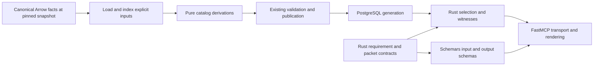

# Design review: libraries for the catalog and evidence product

Retired source citations below are historical paths within this review's recorded baseline
and dated inspection scope, including any working-tree limitations. They do not point to
replacement owners. Recover committed source through [Git history](../../README.md#historical-recovery);
the findings and their original evidence strength remain unchanged.

## 1. Scope, outcome and coverage

**Target review, 2026-09-28 — Revise the contract and catalog-computation boundaries; retain the
storage and analysis architecture.** The compelling immediate additions are **Schemars** for
Rust-owned wire schemas and **Rust `jsonschema`** for independent schema conformance. Add
**`trybuild`** with the nominal-ID contract if its compile-fail cases justify a dedicated harness.
Use more of existing SQLx and FastMCP. Salsa and Ascent remain separate, conditional experiments;
neither is a prerequisite for the first differentiated product.

All recommendations and expected benefits below are **Proposed**. Library capabilities and current
source observations are **Interface-checked, 2026-09-28**, unless explicitly attributed to earlier
receipts. No proposed integration was compiled, benchmarked or deployed in this review.

**Disposition update, 2026-09-28:** the operator adopted the recommended direction through
[ADR-0073](../../adr/0073-catalog-wire-contracts.md) and the updated product design/plan. Implementation
remains Proposed. [Forward-plan §6.2](../../plans/behavioral-model-forward-plan_2026-09-24.md#62-product-target-findings-and-recommendation-disposition)
now owns CLF/F01–F03 status, and its §7 owns conditional library activation. The assessment below
retains its original evidence strength; design adoption is not finding closure.

| Field | Scope |
|---|---|
| Subject | [External library review](../../external-review-postgresl-libraries-supporting-catalog-approach.md), assessed against `3076848`, rather than its earlier `d9eb2ee` baseline |
| Authority | [Product owner §14](../../design/sections/api-and-evidence-product.md), ADR-0071/0072, [forward plan PR2–PR6 and §6.2](../../plans/behavioral-model-forward-plan_2026-09-24.md#30-consolidated-execution) |
| Standard | Core 3.0, code-intelligence profile 1.1 and library-context binding; design tier, target purpose; Codex with independent source-review assistance |
| Product consumer | Agents expressing exact API/configuration/evidence requirements and receiving attributable, jointly applicable witnesses; optional behavioral queries remain available |
| Examined | Rust/Python request and packet boundaries, catalog construction and dependency declarations, Arrow/PG projection ownership, SQLx call sites, exact Salsa family, library documentation and sources |
| Not examined | A fresh whole-system qualification, every extraction/model path, all transitive dependency features, or benchmark performance; sealed confirmation data was neither opened nor used |
| Dirty tree | The supplied external review was untracked at start; its body is preserved, with an H1 added for documentation publication. No implementation or dependency changes are part of this assessment |

### What changes relative to the external review

- PR1 is now implemented and qualified for catalog-only and enriched PG/MCP/recovery paths. Its prior dated evidence is recoverable from Git, not a fresh test run;
  [PR4 evidence](../evidence/2026-09-28_pr4/README.md) owns current qualification. This review does not reopen the repaired profile, constructor or singleton findings.
- MCP already publishes machine-readable schemas, including the operation/ambiguity result union.
  Schemars would remove independent contract definitions, not introduce schema discovery for the
  first time. See [server.py](../../../python/lctx_mcp/src/lctx_mcp/server.py), `get_operation`.
- Schemars 0.9.0/1.2.2, Moka 0.12.16, Roaring 0.11.5 and SeaQuery are already present transitively
  in `Cargo.lock`. A direct catalog dependency is still a new use requiring qualification.
- Pinned **Salsa 0.28.2 has optional persistence**, currently disabled in the workspace. A useful
  experiment need not require a daemon. Persistent cache compatibility and evidence correctness
  still need an explicit design; §8.4 describes that alternative.
- Clorinde's upstream is archived and says it merged back into Cornucopia. Treat it as the history
  of one alternative, not a second maintained candidate. This reinforces, but does not determine,
  the technical decision to keep SQLx. [Upstream notice](https://github.com/halcyonnouveau/clorinde).
- The external document's `chatgpt-content-reference` markers do not resolve to sources. The
  material recommendations below use independently inspected sources instead.

## 2. Responsibilities, dependencies and semantic ownership

**Proposed composition:** keep the existing owners; improve module boundaries before adding an
execution framework. A new crate is unnecessary merely to give the work a name.

| Owner | Responsibility and hidden decisions | Consumer contract / reason for change |
|---|---|---|
| `cpg-schema` catalog/query modules | Canonical fact declarations; finite requirement vocabulary, nominal identities, witnesses, coverage and typed packet contracts | A new predicate or product concept changes its semantic declaration here; Arrow remains the fact contract |
| `cpg-core::catalog` loading adapter | Load an exact fact snapshot and declare every relation and policy input | DataFusion/Delta integration changes stay outside pure derivation |
| Catalog derivation functions | Normalize selected surface forms, associate options/scenarios, derive catalog records from explicit indexed inputs | Supported Python/library constructs change these functions, independently of PG/MCP |
| Existing publication/bundle owners | Validate canonical rows, original evidence closure, units and capability manifest | Publication remains atomic under existing transitions; no Salsa cache becomes canonical |
| `lctx-postgres` | SQLx effects, finite query lowering, generation pinning, bounded hydration and checked physical decoding | Storage/schema evolution; no Python semantics hidden in generated SQL |
| Rust selection owner | Classify each requirement and joint context using attributed rows and existing bounded semantic kernels | Predicate semantics are reusable by exhaustive search, ranked eligibility and comparison |
| `lctx_storage` / `lctx_mcp` | Coarse native calls, existing asynchronous lifetime, transport and rendering | Publish derived schemas and transport structured results; no independently authored selection rules |

The diagram describes representation flow. SQLx stays in the PG adapter; Schemars describes the
wire representation; neither becomes a dependency of the Python semantic extractors. SQL planning
and the semantic classifier compose through typed records rather than a second query language.

### Fact and fidelity ownership

| Family | Authority / identity | Fidelity and coverage | Derived consumers |
|---|---|---|---|
| Declarations, parameter syntax/provider observations, structural type terms | Existing pinned Ruff/Pyrefly inputs and `cpg-schema`; original fact/node IDs | Extracted/provider-resolved, with conflicting or absent observations retained | Catalog signatures, options, structural predicates |
| Public exposures, bindings and ordered signatures | ADR-0072 catalog rows; member and binding identities remain distinct from declaration IDs | Derived under roots/profile; source-known does not imply effective-wrapper-known | Packets, selection, browse and retrieval units |
| Options/scenarios/deployment | PR2/PR3 attributed contracts; source revision, intent and configuration owner | Proposed extraction/association with explicit unresolved context | PR4 witnesses and PR5 deployment packets |
| Requirement results | One Rust classifier; requirement ID plus member/binding/signature/configuration context | Proposed supported/contradicted/unresolved/conflicting selection states; separate from five behavioral verdicts | All selection consumers |
| Ranking witnesses | Addressable unit and ranking-policy identity | Heuristic relevance; never sufficient evidence of semantic support | Search explanations and original evidence expansion |
| Incremental memo / dense index / interned string | Private computation identity, bounded by cache version or generation | Rebuildable mechanism; never a new fact/provider or canonical identity | Optional acceleration only |

No library supplies the meaning of “declared parameter,” “same configuration,” or “usable example.”
Those remain domain contracts. Reflection, schema validity, SQL typing and cache hits cannot confer
that meaning on an otherwise unsupported record.

## 3. Contracts, constraints and isolated verification

**Proposed contract design:** establish the small shared vocabulary alongside PR2, then implement
the complete classifier after PR2/PR3 produce its evidence. Do not delay options and scenarios
until the whole PR4 engine exists.

| Boundary | Contract and enforcement | Failure / independent verification |
|---|---|---|
| Request JSON → Rust | Tagged finite requirement enum; explicit domain/operator/quantifier, selection and joint-context policy; bounded lists and text; reject unknown variants/fields | Pure decoder controls before PG work; no implicit ignored requirement or Pydantic coercion policy |
| IDs → selected records | Private nominal wrappers around existing `Id`/`Digest`; syntax/width at decoding, membership and relation role under pinned generation | Wrong nominal type fails compilation; valid-looking foreign or wrong-role ID fails lookup; no new hash scheme |
| Facts → derived catalog | Validated input bundle plus explicit relation indexes, roots/profile/provider/policy versions and coverage | Pure known-answer cases without acquiring a library or starting a database; missing evidence stays unresolved or fails required closure |
| Predicate → match | Result includes basis, coverage, contextual witnesses and conflict state | Two individually matching overloads do not imply one admissible invocation; complete declaration absence does not imply keyword rejection |
| Typed response → JSON/MCP | Rust serializable envelope and generated output schema; original evidence links and omission/refusal state | JSON-schema conformance plus real FastMCP listing/call round-trip; flat row portions derive from existing declarations |
| Cache → reused result | Complete input identity, explicit equality and output provenance; unchanged meaning can reuse only the appropriate layer | Clean versus reused output agrees on both semantic records and current evidence; invalid cache can be discarded without changing published truth |

Prefer `PublicMemberId`, `BindingId`, `SignatureId`, `EvidenceId`, `TypeTermId`, `SnapshotId`,
`GenerationDigest` and `RetrievalUnitId` at the request/witness/hydration seams. Do not rewrite every
generic Arrow column to achieve that. Conversion from generic storage IDs is explicit and local.
Newtypes prevent accidental category substitution; they do not prove that a value belongs to a
particular generation or that its evidence establishes the requested predicate.

For new request text, choose one published length unit. A reasonable migration preserves the MCP
500-character bound as a Unicode-scalar limit and treats encoded request bytes as a separate
resource limit. The Rust schema, decoder and transport must agree. This is a proposed compatibility
choice, not a silent change to today's native 2,000-byte policy. Specify missing versus null,
integer versus boolean/coerced number, valid Unicode, ID spelling and default handling explicitly.

A finite predicate descriptor records: argument schema, domain and supported quantifiers,
relations/capabilities read, witness type, completeness scope and explanation template. Rust enum
matching provides exhaustiveness. This can generate vocabulary help for `browse_library` and
consistent rejection messages without a plugin registry or general optimizer. Semantic evaluation
remains executable Rust; the descriptor is not another authored copy of those decisions.

## 4. Composition and execution

**Proposed compilation flow:** `load_catalog_facts → indexed inputs → pure derivations → canonical
rows and evidence → retrieval/embedding → existing publication`. Loading indexes once is useful
without memoization. Keep suitable bulk joins in DataFusion rather than transferring every join
to Rust hash maps. Index only relations reused by the selected derivations, preserving one-to-many
observations and deterministic output ordering.

| Stage / question | Projection and method | Precision, budgets and evidence |
|---|---|---|
| Assemble complete source API contract | Public members under selected roots plus supporting declarations outside those roots; ordered signature/parameter, ancestry and type-argument relations | Exact over captured declarations/provider observations, not runtime equivalence; preserve alternatives, source facts and unresolved effective surface |
| Associate configuration and scenarios | PR2/PR3 typed links, source order and bounded context; indexes by signature, declaration parent, field owner and scenario | Supported associations only; no all-fields propagation or negative test presented as successful deployment |
| Select against requirements | PG narrows within a pinned generation; Rust classifies contextual witnesses and coverage; same eligible groups feed every ranking leg | At most the planned 16 terms; finite supported operators; bound witness/intermediate growth and report refusal before claiming completeness |
| Establish joint applicability | Intersect compatible binding/signature/configuration contexts; use existing conditions only with compatible atom/context identities | Independent matches, modeled compatibility and demonstrated combination remain distinct; conflict and uncertainty survive aggregation |
| Rank and explain | Existing exact vectors, lexical/name channels and proposed finite unit/view catalog | Ranking is heuristic; preserve actual winning unit and semantic witness separately; never rank an incomplete top-k as exhaustive selection |
| Publish and serve | Existing Arrow/Delta validation, PG import/readiness/selection, artifact closure and pinned service lifetime | Schema generation cannot replace FK/evidence checks; no mixed-generation packet or request-time source import |
| Rebuild | Coarse immutable artifacts first; catalog policy, retrieval renderer/spec and response policy have their own dependencies | Cache hits do not omit required current provenance; live generation changes still use the established publication path |

No new graph projection or arbitrary traversal engine is selected. For finite type-argument closure,
the universe is the selected subjects' reachable type terms; directed parent→child edges preserve
roles, ordinals and supporting facts. An indexed worklist suffices. Recursive multi-relation
inference is a different workload and is the only proposed Ascent trigger.

## 5. Change and failure scenarios

These are source-traced or proposed walkthroughs, not executed tests in this review.

| Scenario | Current propagation or gap | Proposed localized route / settling check |
|---|---|---|
| Add `declares_parameter` with kind/default and existential variant scope | Strings and limits appear in Rust and Python; operation facets carry no contextual signature witness | Schema-owned request/result variants, catalog evidence, one Rust evaluator; generated schema/transport follows. Mutually exclusive overload control |
| Change a text limit or add a packet field | Independent validation and packet declarations can drift; F01 gives a present example | Shared bounded type/field declaration, generated input/output schemas, conformance corpus; Unicode, null and unknown-field controls |
| Add a PR3 deployment scenario outside brief seeds | Catalog construction currently mixes loads, derivation and downstream embedding preparation | New explicit inputs and pure association function; existing independent evidence roots/publication. No brief requirement |
| Upgrade a provider or change public roots | Provider meaning and negative membership are dependencies even if selected row content looks unchanged | Rebuild key records provider/root/profile/policy and group membership; missing/new member controls |
| Move source spans without changing an API signature | Cached packet could preserve old evidence IDs/coordinates if equality ignores attribution | Reuse semantic shape only where safe; rebind evidence from current snapshot and validate closure; clean/reused output equality |
| Delete an option declaration or its supporting example | Positive-row dependency lists cannot represent absence or removal by themselves | Track relation/group membership and coverage as inputs; delete controls for both coarse and any Salsa reuse |
| Add comparison or another rendering | A Python requirement interpreter would reproduce selection semantics | Thin composition of existing typed classification/packet results; no new semantic owner |
| Concurrent repeated identical request | Duplicate hydration may justify a cache, but no measured bottleneck exists here | Optional Moka initializer sharing under a full generation/policy key; cancellation, error and memory controls |
| Reload a persisted incremental cache under changed code | In-process query identity is not a cross-version compatibility promise | Disposable cache envelope with producer/feature/schema/input compatibility; reject incompatibility and recompute |

## 6. Correctness and fidelity gates

Verdicts concern the reviewed extension boundaries, not a new certificate for the deployed system.

| Gate | Verdict | Evidence / required action |
|---|---|---|
| G1 Authority | **fail** at wire contract | F01: independently editable Rust/Python constraints and response declarations; move to one owner with generated lowerings |
| G2 Semantic fidelity | **unresolved** for new requirements | §14.7 specifies the right distinctions; schemas alone do not implement variant scope, absence or joint witnesses |
| G3 Validity | **unresolved** for proposed wire migration | Qualify schema/decoder/transport compatibility and runtime membership; no claim that shape validation proves relational validity |
| G4 Hidden behavior | **pass at proposed boundary** | Explicit loader, pure derivations, offline schema resolution and effect adapters; no proposed hidden source/SQL reads in tracked functions |
| G5 Consistency and recovery | **unresolved for optional engines** | Existing publication retained; new caches/timeout paths need bounded failure and cold-equivalence qualification before adoption |
| G6 Transformation and reuse | **unresolved** | F03 plus negative dependencies and evidence equality must be settled before using catalog dependency declarations for reuse |
| G7 Truthful capability claims | **pass for this review** | Source/documentation strength, historical receipts and unrun integrations are distinguished; no speedup or differentiation asserted |
| G8 Library leverage | **pass for recommended direction** | Use schema generation/validation and existing query/transport features; no generic incremental or inference engine rebuilt bespoke |
| CI-G1 Fidelity | **unresolved for PR2–PR4 implementation** | Preserve provider roles, unknowns, source/effective differences and independent-versus-joint support; no new current false claim demonstrated here |
| CI-G2 Evidence closure | **unresolved for reuse/migration** | Existing closure contract retained; current-generation rebinding and typed packet round-trips still need implementation evidence |
| CI-G3 Evaluation integrity | **pass for review conduct** | No sealed evaluation inputs inspected or used; library capabilities were examined as implementation documentation, not compiler gold |

## 7. Findings and applicability

The following stable **CLF/F01–F03** findings are source-grounded architectural findings. Current
disposition transferred to forward-plan §6.2 under ADR-0073; §11 records the ownership route.
Existing AP findings retain their own identities and completion criteria.

### F01 — Wire contracts repeat semantic decisions across Rust and Python

**Interface-checked; priority: before extending the PR4 query contract.**
[Rust `Where::validate`](https://github.com/paul-heyse/library-context/blob/0bc8ea11171d6fd96827a8e250964d3de5b3b4ce/crates/lctx-postgres/src/repository.rs) at lines 60–94 independently
defines request shape, facet acceptance and a 2,000-byte limit.
[Python `FacetTerm`/`Where`](https://github.com/paul-heyse/library-context/blob/0bc8ea11171d6fd96827a8e250964d3de5b3b4ce/python/lctx_mcp/src/lctx_mcp/operations.py) at lines 23–71 repeat
names, kinds and 500-character limits. Rust denies unknown fields; these Python models do not
declare that policy. For example, a 501-character ASCII value is permitted by the Rust length
check and rejected by the Python field constraint, independently of whether that facet exists.
The current facet-name parity test covers names, not the whole contract.

Hydration returns generic JSON maps while Python separately declares catalog packet records
(`operations.py:153–283`; [hydration.rs](https://github.com/paul-heyse/library-context/blob/0bc8ea11171d6fd96827a8e250964d3de5b3b4ce/crates/lctx-postgres/src/hydration.rs):18–57).
Adding Schemars only to `Where` leaves that larger ownership problem in place. Extending a
requirement or packet currently requires repeated semantic edits and knowledge of both validators.

**Principles:** FP-04/05, DP-01/02/03/16/24; A2 violated, G1 fail.
**Correction:** schema-owned typed requests, witnesses and envelopes; mechanically reuse flat
row declarations; generated schema attached to a thin MCP boundary. Remove superseded Python
semantic declarations and string-key packet assembly for migrated typed sections, retaining
genuinely presentation-specific models.
**Closure:** trace one new predicate and packet section through a single definition, plus focused
schema/Serde/real-MCP controls for enum, ID, unknown fields, Unicode length, missing/null and result
unions. Existing supported facet behavior has an explicit migration adapter, not silent reinterpretation.

### F02 — Catalog derivation lacks an isolated input boundary for planned growth

**Interface-checked; priority: alongside PR2/PR3.**
`catalog::contracts` (`crates/cpg-core/src/catalog.rs`):496–530 loads numerous complete
relations and immediately derives output; additional type relations load at 1055–1057. The function
scans parameters for each signature (893–895), docs for each parameter (940–944) and all type
arguments on every closure round (1091–1103). `populate` also combines fact reads, facet/text
construction and embedding work. Existing maps help, but do not provide a pure derivation interface.

Adding options/scenarios therefore risks expanding a mixed effect/algorithm function and makes
isolated semantic controls depend on a DataFusion session. This is a locality/testability finding;
the inspection establishes repeated scans, not a measured performance bottleneck.

**Principles:** FP-01/03/06, DP-10/17/18; A1/A3 extension gap.
**Correction:** explicit load/index/derive/materialize seams; indexes by declaration owner,
signature, parameter-doc owner/name, ancestry identity and type parent where reused. Preserve
multi-valued alternatives rather than silently overwriting them in maps. Keep suitable bulk
relational work in DataFusion. No Salsa or Ascent is necessary to establish these boundaries.
**Closure:** new supported surface/scenario derivations accept ordinary immutable inputs; known
answers require no unrelated acquisition/embed/PG setup; output ordering and evidence remain equal
to the retained end-to-end path. Measure before claiming speed or adding more representations.

### F03 — Catalog table reads declare no scanned dependencies

**Interface-checked; priority: before any dependency-based catalog reuse.**
`catalog.rs:440–449` builds `Relation { deps: &[], sql: SELECT * FROM T::NAME, ... }`.
[`Relation`](https://github.com/paul-heyse/library-context/blob/0bc8ea11171d6fd96827a8e250964d3de5b3b4ce/crates/cpg-schema/src/query.rs):22–29 defines `deps` as the tables scanned.
[`sql::fetch`](../../../crates/cpg-core/src/sql.rs):120–139 currently does not use that field, so
this is **not evidence of a present stale-cache failure**. It is an untruthful declaration that
cannot safely become a dependency contract for the planned rebuild path.

**Principles:** FP-04, DP-09/18/21; G6 unresolved for proposed reuse.
**Correction:** declare the actual table dependency or use a truthful table-loading abstraction.
Separately include roots, membership, coverage, provider and policy dependencies; a scanned-table
list alone does not make incremental invalidation complete.
**Closure:** inspect the complete dependency inventory and exercise addition/removal, previously
missing lookup and evidence-only changes before admitting reuse. Trigger: PR2 loader refactor or
PR5 coarse rebuild implementation, whichever first consumes this boundary.

### Other observations and principle judgments

Generic `Id`/`Digest` are intentional storage primitives, not a newly demonstrated corruption bug.
Nominal wrappers are an appropriate strengthening of the new high-risk witness boundary. Likewise,
the absent typed classifier is already **AP/F04 / PR4**, not an additional surprise finding.

FP-01/03/06 are unresolved for catalog extension until F02's boundary is explicit. FP-04/05 are
violated at the duplicated wire boundary (F01); their canonical Arrow/derived-PG direction remains
sound in the inspected declarations. FP-02 is unresolved for the optional reuse lifecycle, with
existing generation ownership retained. DP-13/14/16 are satisfied by the proposed targeted use of
libraries; DP-09/11/12/15/20/23 remain qualification obligations where caches, recursion or schema
migration are introduced. CI-01–06/10/11/13 constrain the proposed input, witness and reuse design;
CI-07–09 add no reason to introduce a new inference/graph engine for simple catalog projection.

## 8. Library fit and total complexity

### 8.1 Adopt Schemars for the shared wire contract

**Recommendation: adopt direct use, starting from locked Schemars 1.2.2**, with derive support and
only required integration features. Its Serde-aware `JsonSchema` derive supports field names,
defaults and enum representations; separate generation settings describe deserialization and
serialization. Explicitly choose draft2020-12 rather than a movable default.
[Generation settings](https://docs.rs/schemars/1.2.2/schemars/generate/struct.SchemaSettings.html),
[Serde-aware generation](https://github.com/GREsau/schemars/blob/master/README.md).

The product benefit is one agent-visible vocabulary shared with actual Rust request/packet types.
Use it for finite predicates, witnesses, result groups, packet sections and bounded request options.
Keep artifact/Arrow schemas authoritative in their existing domain; do not derive canonical facts
from JSON Schema or add a reflection framework to every row.

Implementation direction:

1. Add a focused wire module under `cpg-schema`. Generate reusable flat components from existing
   table/query-row declarations where the wire shape agrees; nested packet composition is a
   separate typed Rust contract. Use explicit adapters when persistence and presentation differ.
2. Give nominal IDs their actual string schema, not the underlying byte-array schema. Bounded types
   expose constraints from the same policy declarations as decoding. Custom Rust validators do not
   automatically become JSON Schema constraints; identify which checks are structural and which
   require generation membership or semantic context.
3. Emit input and output schemas separately, with disjoint tagged variants and closed request
   objects. Version the wire contract and schema-generation settings. Snapshot generated assets
   using existing `insta`; do not treat a changed schema fingerprint alone as a compatibility proof.
4. Expose schemas from the native boundary to the existing MCP service. Recommended Python route:
   a small FastMCP `Tool` adapter with generated `parameters`/`output_schema`, a bounded `run`,
   Rust-owned decode/validation and existing lifespan/error handling. FastMCP 4.0.5's inspected
   `tools/base.py:231–249,349` and `FastMCP.add_tool` support that route. A custom Tool must own its
   input validation; FunctionTool's Pydantic validation is not automatically inherited.
   [FastMCP Tool contract](https://gofastmcp.com/python-sdk/fastmcp-tools-base).
5. Migrate tool families incrementally, preserving names and explicit compatibility where required.
   Remove the migrated duplicate Pydantic semantic models rather than merely publishing a schema
   alongside them. Keep rendering and text budgets in their actual owner. Retain the native
   asynchronous cancellation/lease behavior.

This chooses the smaller schema-to-tool adapter over a second generated-Python-model toolchain.
If a concrete Python consumer needs static model classes later, generate them from this same
contract; do not reopen authority in hand-written Pydantic declarations. Actual MCP dialect,
root-object, `$defs` and union behavior require the transport acceptance controls in §10.

### 8.2 Adopt Rust `jsonschema` for conformance; selectively add `trybuild`

**`jsonschema`: recommended dev dependency first.** Current upstream documentation inspected is
0.58.2; select and lock the exact release/features during implementation. Compile validators once
per schema, then validate shared request fixtures and emitted response JSON. Use
`default-features = false`, an explicit draft, approved embedded references and `.offline()`;
an unresolved reference must fail construction. Choose format assertion policy explicitly.
[Validator and offline behavior](https://docs.rs/jsonschema/0.58.2/jsonschema/).

This supplies a useful independent check that a schema emitted by one library describes JSON
accepted/emitted by another. It is not a second semantic classifier. Prefer typed deserialization
plus shared domain validation in production; do not validate the same payload twice without a
dynamic-schema consumer. Schema-valid integer `1.0`, coercion, enum tagging and null/default
behavior need explicit parity decisions. Schema conformance cannot establish evidence existence,
release alignment or compatible overloads. Bound request bytes/depth before expensive validation;
keep diagnostics bounded. Network schema resolution is unnecessary for fixed product contracts.

**`trybuild`: recommended with a small compile-fail suite if newtypes have public cross-module
consumers.** It provides passing and failing compiler cases with diagnostic snapshots. Prove that
member/signature/evidence IDs cannot be swapped and that a validated witness state cannot be built
through an unchecked public constructor. Pair failures with valid controls; pin/review diagnostics
with the workspace compiler. Existing `proptest`, `insta` and runtime validators remain useful.
For only one private wrapper, a compile-fail doctest is the simpler alternative.
[Trybuild harness](https://github.com/dtolnay/trybuild).

### 8.3 Use ordinary newtypes first; keep validation/builders selective

| Candidate | Compelling capability | Decision and limitation |
|---|---|---|
| Ordinary private newtypes | Nominal category distinction with explicit conversion and canonical encoding | **Adopt at wire/witness seams.** No dependency or persistent identity migration needed |
| [`nutype`](https://github.com/greyblake/nutype) | Generated checked constructors, errors and validation during its generated Serde deserialization | **Conditional:** repeated bounded scalar invariants justify it. Existing binary IDs need little machinery. Never sanitize source/default/evidence text; verify any schema integration matches the checked decoder |
| [`garde`](https://github.com/jprochazk/garde) | Contextual field validation and structured error paths | **Defer:** deriving `Validate` still requires calling validation. It does not make construction valid automatically. Revisit if many independent request-form constraints outgrow the small shared decoder |
| [`bon`](https://github.com/elastio/bon) | Builders whose type state tracks required fields | **Defer:** useful for a difficult construction API, but presence of fields does not prove evidence closure, membership or joint applicability |

Never infer safety from `#[serde(transparent)]` or `#[sqlx(transparent)]` alone. A validated scalar
needs checked ingress on every relevant path. SQLx codecs belong in the PG adapter; a domain
`try_from`/constructor remains the validity boundary. Generation membership is a runtime concern
even with nominal IDs.

### 8.4 Salsa: credible experiment after a pure boundary, not selected infrastructure

**Existing family:** salsa/salsa-macros/salsa-macro-rules **0.28.2**, constrained by ty/ruff and
[pins](../../pins.md). `cpg-flow::FlowDb` is provider-private and freshly created by its `index`
entrypoint. Keep a potential catalog database separate. The Salsa skill indexes 0.28.4, so this
review checked 0.28.2 source before transferring the persistence claim.

Compelling capabilities are dynamic dependency tracking, change propagation and equality-based
backdating, memoized query results, interned identities, explicit input updates and database event
instrumentation. They fit repeated catalog derivation over changing inputs. They do not make
ambient SQL/files/embedding calls tracked, make whole-table inputs granular, or provide Delta/PG
publication. [Salsa model](https://github.com/salsa-rs/salsa/blob/master/book/src/plumbing/fetch.md).

**Persistence correction:** local 0.28.2 `Cargo.toml` exposes `persistence`; `src/database.rs:166–199`
implements `dyn Database::as_serialize`/`deserialize`; `tests/persistence.rs` covers `persist`
inputs, interned/tracked structs and query results. This permits evaluating cross-process reuse
without claiming it is already enabled or compatible with this workspace's feature union.
[Exact source](https://docs.rs/crate/salsa/0.28.2/source/src/database.rs),
[exact persistence tests](https://docs.rs/crate/salsa/0.28.2/source/tests/persistence.rs).

The experiment has two legitimate lifecycle candidates: a bounded repeated-compilation worker,
or a **disposable, version-qualified persisted cache** restored for a CLI invocation. Compare both
against the simpler coarse-stage reuse already selected by §14.10. Persistent cache inputs include
compiler/query-layout/schema/feature identity and relevant provider/policy versions. No promise of
cache compatibility across upgrades is assumed. Reject incompatible cache state and recompute;
never deserialize it into the authoritative canonical or serving store.

Necessary design before an experiment:

- Load immutable module/member/signature/doc groups through explicit inputs, including collection
  membership and missing lookups. Coverage, roots, profile and model/policy inputs participate.
  Merely wrapping each complete table in one input risks whole-catalog invalidation.
- Separate **semantic shape** from **current evidence binding** where dependencies permit reuse.
  A shape-preserving span/provider-attribution change must still produce current evidence IDs,
  snapshot fields and citations. Do not suppress equality changes on evidence-bearing outputs.
  Existing catalog rows embed `snapshot_id`; source evidence derives from facts and source bytes
  (`catalog.rs:1175–1195`), so arbitrary cross-snapshot row reuse is invalid.
- Keep canonical rows and evidence as explicit outputs, not diagnostic accumulators. Model memory,
  cancellation and failure at the worker boundary; do not catch arbitrary failures and publish a
  partial catalog. Persisted memoization is not an evidence-retention protocol.
- Keep established SCC/worklist semantics for behavioral fixed points. Query-cycle handling does
  not define the domain's recursion semantics.

Admission experiment: cold compile versus doc-only change, signature change, member insertion/
deletion, missing-evidence change, source-coordinate change and policy change. Compare complete
canonical outputs/evidence after rebuilding, including after cache reload; report query executions,
wall time, peak/retained memory and cache size. Reject adoption if benefit over coarse reuse is
small or correctness requires disabling most reuse. No pin upgrade or daemon is warranted now.

### 8.5 SQLx: strengthen the existing adapter instead of replacing it

**Recommend broader use of existing SQLx 0.9.0 capabilities.** `query!`/`query_as!` and file-based
checked macros are candidates for stable generation and fixed catalog reads. Runtime `query_as`
with `FromRow` decodes a typed result; it does not provide the same compile-time database checking.
Refresh offline metadata against the migrated disposable database using the existing SQLx check
route. Retain real-PG nullability/type controls; manual type overrides are assertions to justify.
[Checked-query contract](https://docs.rs/sqlx/0.9.0/sqlx/macro.query.html),
[runtime query mapping](https://docs.rs/sqlx/0.9.0/sqlx/fn.query_as.html).

`cache.rs:38–63` already demonstrates checked macros. Stable serving queries in `repository.rs`
are candidates as PR4 touches them. However, `Hydration::fetch_keys` intentionally gets identifiers
from the executable serving inventory, binds data, applies row/byte budgets and decodes through
the Arrow projection contract. Preserve that generated adapter; replacing it with separately
hand-written queries for every relation would recreate a second schema inventory.

| Alternative | Decision / reason |
|---|---|
| [Cornucopia](https://github.com/cornucopia-rs/cornucopia) | Strong SQL-first typed code generation with real-schema checking and custom type mappings. **Do not add:** introduces another generated client contract and rust-postgres execution integration where SQLx already owns roles, leases, migrations and cancellation |
| [Clorinde](https://github.com/halcyonnouveau/clorinde) | Merged into Cornucopia and archived; assess any future need against the consolidated project |
| [SeaQuery](https://github.com/SeaQL/sea-query) | **Conditional:** useful if a real finite SQL-lowering implementation develops repeated syntax construction. Does not supply predicate semantics or checked result/evidence equivalence. Existing small inventory-driven hydration is not that trigger |
| [`postgres-types`](https://github.com/rust-postgres/rust-postgres/tree/master/postgres-types) | Correct codec family for rust-postgres consumers, not a drop-in SQLx codec. Keep SQLx `Type`/`Encode`/`Decode` on the existing adapter; do not change driver ownership for nominal IDs |

Typed result structs, and SQLx `Json<T>` only where genuinely variable JSON has an existing column,
can replace generic maps at selected boundaries. They are no reason to put core query dimensions
in JSONB or to derive canonical Arrow schemas from a PostgreSQL code generator.

### 8.6 Ascent: one recursive relational consumer is the admission condition

**Conditional, not immediate.** Ascent's Rust-integrated rules, recursive fixed points, stratified
negation and lattice relations could replace difficult bespoke multi-relation inference. The
available reasoning skill inspects Ascent 0.8.1; this workspace does not currently link it. A future
probe must select and lock its full family. [Ascent capabilities](https://github.com/s-arash/ascent).

Potential consumer: supported alias/registration/association propagation that genuinely requires
mutually recursive relations with explicit rule provenance. Current finite type closure is too
simple; use an indexed worklist. Ordinary joins belong in DataFusion/PG; existing graph algorithms
and semantic SCC passes keep their owners. Do not introduce an engine just because a rule can be
written in Datalog.

If admitted, tuples retain relationship identity, derivation rule, scope and evidence references.
Do not encode epistemic states as a lattice that picks the strongest assertion: conflicting facts
must remain conflicting. Stratified absence is valid only over a complete declared domain.
`generate_run_timeout`/`run_timeout` offers cooperative time bounding; it is not a hard row/memory
ceiling or a complete result after timeout. Recompute the affected finite closure after deletion
unless a separate deletion-maintenance contract is proved. Compare to the existing worklist on
cycles, reconvergence, parallel evidence, unknown targets and removals.

**Differential Dataflow:** defer until continuous insert/delete view maintenance is itself a named
product requirement. Immutable snapshot compilation does not currently justify its timestamp,
frontier and differential-update model.

### 8.7 Representation and cache candidates

These have compelling capabilities but no demonstrated current cost requiring adoption. The
decision is conditional use at a named kernel, not blanket rejection of dependencies.

| Library | Capability and fit | Trigger / boundary |
|---|---|---|
| [`typed-index-collections`3.5.0](https://docs.rs/typed-index-collections/3.5.0/typed_index_collections/) | `TiVec`/`TiSlice` distinguish local member/signature/evidence index domains; close to ordinary vector interfaces | Preferred simple choice if PR4 needs multiple dense side arrays. Keep canonical-ID maps and generation scope. Slices rebase indices; do not treat them as stable entity maps |
| [`cranelift-entity`0.136.1](https://docs.rs/cranelift-entity/0.136.1/cranelift_entity/) | `PrimaryMap`, secondary maps and entity sets for densely assigned typed handles | Choose over TiVec if a kernel needs that full primary/secondary-map composition. No reason to introduce a Cranelift compiler backend; qualify its standalone dependency/MSRV fit |
| `slotmap` / generational arenas | Detect stale handles after mutable deletion/reuse | No current immutable-catalog consumer. Generation-local canonical maps already solve current lookup needs |
| [`lasso`](https://github.com/Kixiron/lasso) | Build interner, then read-only `RodeoReader` or smaller key→string `RodeoResolver` | Profile repeated short paths/names first. Avoid source-text interning and a second interner for Salsa-owned values. Local keys never become persisted identities |
| [`roaring`](https://github.com/RoaringBitmap/roaring-rs) | Compressed integer sets, intersection/union/difference; u32 bitmap and u64 treemap | Sparse candidate/evidence-set workload compared with existing dense `fixedbitset`. Map canonical 128-bit IDs to local ordinals without truncation; no witnessed speedup yet |
| [Moka](https://github.com/moka-rs/moka) | Async cache initialization sharing for concurrent misses, expiry and weighted capacity | Repeated expensive immutable-generation selection/hydration. Full generation/request/semantic-policy/rank/render key; errors and cancellation qualified; TTL is eviction policy, not correctness |

Moka weighted capacity is an eviction policy rather than a strict process-memory ceiling. Preserve
existing request and concurrency budgets. Cache only immutable reusable outputs, not a live SQL
lease, mutable selection pointer or credentials. Prefer one cache at the owner that actually repeats
work; do not stack Python, FastMCP middleware and Rust caches over the same answer. Existing FastMCP
response caching lacks these domain keys by default, so enabling it globally is not equivalent.

### 8.8 Remaining survey families

**Proposed disposition only:** these groups were assessed for an actual product consumer; this
review does not claim version/build qualification for every package in the broader inventory.

| Candidates | Decision and meaningful revisit condition |
|---|---|
| [`typify`](https://github.com/oxidecomputer/typify) | Defer unless a stable externally owned JSON Schema must generate Rust types. Current authority flows Rust→schema. Dynamically discovered Python type terms are data, not new Rust code to compile |
| `facet`, `bevy_reflect`, `scale-info`, `serde-reflection`, Specta | No immediate consumer beyond what selected Serde/Schemars supplies. Revisit a real reflection/binary metadata/TypeScript client requirement; do not replace Python type analysis or Arrow contracts |
| `egg`/`egglog`, `ena` | Conditional pure rewrite/equivalence or unification workload with explicit laws. No Python equivalence from effects, overloads or uncertain aliasing; finite requirements need no equality-saturation optimizer |
| Z3, SAT libraries, OxiDD | Retain existing BDD/primitive models. Activate only for a named product question outside their expressive/budget contract, with unknown-preserving qualification |
| `strum`, `enum-map`, `serde_with`, `derive_more`, `bon` | Local convenience with a repeated consumer; reuse already linked facilities when suitable. Persistent codes and encodings stay explicit and append-only, never derived from enum position |
| `imbl`, `rpds`, `ecow`, small-vector libraries | Measure clone/branch/allocation workload first. Persistent collections may help repeated snapshots; do not replace standard maps/vectors wholesale |
| ECS, new syntax trees/parsers, dynamic plugin systems | No new owner needed for the finite catalog. A specific new document format still gets its own parser evaluation under PR3; that does not justify another Python analyzer |
| `uom`, Symbolica, optimization solvers | No compiler/catalog consumer here. Analyzing scientific libraries does not require executing their mathematics |
| Protobuf, Cap'n Proto, FlatBuffers, `rkyv` | Defer to an actual protocol/zero-copy consumer. Existing Arrow IPC and Serde contracts suffice; persisted caches also need compatibility and validation, regardless of serialization speed |

## 9. Alternatives and tradeoffs

| Alternative | Change locality / semantics | Machinery and decision |
|---|---|---|
| Keep current Rust/Python declarations and add parity fixtures only | Can detect more drift but still requires repeated semantic edits for every predicate/packet change | Simplest interim repair; insufficient target for PR4/PR5 growth |
| **One Rust contract + Schemars + thin Tool adapter** | Definition, decoding and typed envelope share an owner; relational validation stays in Rust | Recommended. Costs schema settings/versioning and a small explicit transport adapter; removes duplicate semantic models |
| Generate Python model classes from the schema | Useful when Python genuinely manipulates typed domain records | Additional generator/runtime mapping and coercion surface. Revisit that consumer, not needed merely to transport JSON |
| Replace SQLx with SQL-generated rust-postgres clients | Strong typed SQL route in a SQL-first application | Poor fit here: changes established effects/lifecycle while leaving requirement semantics unresolved |
| Pure indexed derivations + coarse immutable reuse | Explicit input/test seam and predictable rebuild identities | Recommended first; may redo some unaffected fine-grained work |
| Salsa for selected derivations, in memory or persisted | Automatic dependencies can localize repeated edits | Conditional experiment; equality, negative membership, memory and persistence compatibility must earn the extra lifecycle |
| Ascent everywhere or a broad reflection/plugin layer | Some generic mechanics become declarative | No supported scenario pays for the competing representations/ownership; defer to specific recursive/reflection needs |

## 10. Verification and uncertainty

**Interface checks performed, 2026-09-28:** current source and lockfile inspection; Context7
resolve→query for Schemars, jsonschema, Salsa, SQLx, Ascent, nutype, garde, bon, Cornucopia, lasso,
Roaring, Moka, trybuild, SeaQuery and rust-postgres; official upstream/rustdoc checks for material claims. Context7 did not
return relevant typed-index-collections or cranelift-entity matches; official rustdoc was used.
Current Context7 snippets were not treated as exact pinned APIs when local source differed.
The FastMCP and reasoning skills supplied version-scoped routes; Salsa 0.28.2 source settled its
persistence capability. No license was used as an exclusion reason.

| Proposed check | What it would establish | Current outcome |
|---|---|---|
| Locked focused build of direct Schemars/jsonschema use and exported schemas | Dependency/features/MSRV fit, with no Arrow/DataFusion family change | **not_run**; no dependencies added in this review |
| Shared invalid/valid request corpus through Rust, schema validator and real FastMCP | Advertised versus accepted shape, coercion/default policy, IDs and Unicode limits | **not_run**; required at contract implementation |
| Typed packet and evidence round-trip through PG/native/MCP | Complete output schema, nominal conversion, original evidence and generation scope | **not_run**; existing PR1 receipts do not qualify the proposed migration |
| Pure derivation fixtures and retained canonical comparison | F02 isolation and meaning preservation, including shuffled input and alternatives | **not_run**; proposed functional controls |
| SQLx checked-query refresh plus affected real-PG cases | Fixed-query schema compatibility; dynamic projection remains separately validated | **not_run**; proposed as stable queries migrate |
| Salsa reload/change/cold-equivalence and Ascent/worklist comparisons | Correctness and measured value of each optional engine separately | **not_run**; conditional experiments, not product admission gates |
| New full product gate, real pilot and independent comparison | Assembled product behavior and actual differentiation | **not_run**; outside this documentation review; existing PR0 parity/admission blocks remain |

No precise speed, memory saving or comparative product gain is established by source inspection.
Future implementation follows targeted functional tests first, then formatting and integrated
qualification after the full authorized functional scope; editable fastdev environments remain the
working route. A review-only documentation check is recorded in STATUS separately.

## 11. Proposed integration into the current plan and authority

This section records the recommended changes adopted through ADR-0073 and the forward plan; it
is not a parallel execution or status owner. Existing/spec'd additive queries and behavioral
structures are retained. Adoption changes the target, not this review's implementation evidence.

| Existing package | Recommended addition / owner | Removal and acceptance obligation |
|---|---|---|
| PR2 contract prerequisite | `cpg-schema`: nominal IDs, finite requirement/witness vocabulary and Schemars wire foundation; settle schema/Serde/FastMCP ownership before new fields multiply | Migrate a narrow existing request/packet path, with explicit compatibility and F01 controls; do not implement every PR4 predicate ahead of its evidence |
| PR2/PR3 catalog growth | `cpg-core::catalog`: explicit loader/index/pure derivation boundary and truthful dependencies; type options/scenarios using shared identities | Close F02/F03 through actual new product derivations; remove superseded mixed derivation paths after consumer migration |
| PR4 selection and retrieval | Rust classifier and PG lowering use the typed contract; extend SQLx static checking; return contextual and ranking witnesses; schema vocabulary feeds help/browse | Close AP/F04/F05 plus migrated portion of F01; remove duplicate facet decisions/string-key packet definitions, not retained additive query capabilities |
| PR5 agent tools / rebuilds | Thin schema-backed FastMCP tools, conformance controls and coarse rebuild identity; consider Moka only if repeated-request cost is demonstrated | Real MCP discover/call controls and artifact/evidence equality; preserve pinned lifetimes and complete signatures |
| Optional work after explicit trigger | Salsa repeated-build experiment; Ascent recursive relation experiment; typed collections/interner/bitmap profiling | Each has a named consumer, simpler baseline, measurable benefit and deletion/replacement scope; none blocks PR2–PR6 |
| PR6 qualification | Existing product tasks and independent comparison consume the finished shared contract | Demonstrate differentiation using the existing admission rules; adding libraries alone closes no product objective |

**Finding disposition:** forward-plan §6.2 owns CLF/F01's PR2/PR4/PR5 wire migration, CLF/F02's
PR2/PR3 derivation boundary and CLF/F03's PR2 declarations/PR5 reuse qualification under these
stable IDs. AP/F02–F06 and retained semantic findings keep their existing owners and criteria.

**Decision route:** ADR-0073 records the selected shared wire/schema, MCP validation and pure
catalog boundaries, with their design owners updated together. A local refactor within that
contract needs no further ADR. Selecting Salsa persistence or a new inference owner would be a
separate lifecycle decision; accepted ADR-0071/0072 remain unchanged. Direct dependency adoption
needs no pin-check (dependencies float, ADR-0125), records the enabled features and uses appropriate focused probes.

## 12. Architectural judgment and decision

| Judgment | Current extension boundary | Recommended target at Proposed strength |
|---|---|---|
| A1 Localizes expected change | **unresolved**: larger option/scenario work would expand mixed loading/derivation functions | Explicit indexed inputs and pure domain transforms localize new supported constructs; no generic framework needed |
| A2 Encodes meaning structurally | **violated** at duplicated wire decisions; new contextual requirements remain unimplemented | One typed contract, nominal IDs, explicit status/context and generated schemas give the planned predicates a credible route |
| A3 Composes rather than assembles | **satisfied for retained storage/publication direction; unresolved for catalog derivation isolation** | Reuse Arrow/DataFusion/Delta, SQLx and FastMCP; make optional engines replace a named mechanism behind an existing contract |

**Decision: Revise before extending these boundaries.** Adopt the wire-contract/schema direction
and pure catalog input boundary in detailed PR2–PR4 execution; keep SQLx and use its checked-query
features selectively. The immediate new library value is Schemars plus schema conformance, with
small type-contract tests where useful. Salsa/Ascent and performance structures are credible
conditional tools with explicit admission conditions, not a second catalog pivot.

This is a bounded target assessment. It neither overturns PR1's dated qualification nor certifies
the enclosing product, optional incremental/inference engines, remaining semantic backlog or
differentiation from Context7.
