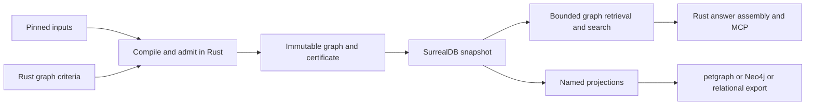

# Independent target review: an admitted graph in SurrealDB

**Verdict: hard pivot now.** Choose SurrealDB 3.3 as the primary persistence and serving engine,
and replace the compilation/publication boundary as part of that pivot. Do not first complete a
redesigned PostgreSQL implementation. Do not migrate existing generations, retain compatibility
readers, build dual writes, or preserve rollback databases. The operator has explicitly chosen a
rebuildable design-phase system; a clean rebuild from pinned inputs is the migration strategy.

The target is **Proposed, assessed 2026-10-05**. This review recommends the architecture; it does
not implement or activate it. Current snapshots are disposable. The ability to produce a new
validated snapshot and pin it while answering questions remains a useful product guarantee.

**Capability follow-up, 2026-10-05:** the
[SurrealDB capability assessment](design_review_surrealdb-capabilities_2026-10-05.md)
refines this target with database-local operations, snapshot-pinned executable definitions and a
detailed native/integration adoption inventory. Its execution-placement recommendations qualify
the host-Rust placement described below; Rust semantic ownership remains the common principle.

The central change is an **admitted, attributed graph as the compiled artifact**. Rust owns what
the graph means and whether its contents are admissible. SurrealDB persists it, indexes it and
retrieves connected evidence. Analytics and external databases consume named projections of that
artifact. This is a substantive simplification only if compilation stops using the database as
its working memory and routine serving stops proving the whole database again.

## 1. Scope and independence

Design/target review of compilation, assurance, persistence, identity, serving and downstream
projections at clean `main`, `c032da47b337b660845bce8b4e61e97c6c663b52`. The root inspected decisive
source and integrated separate code-mapping, library-contract and fresh design-reviewer advice.
All investigation was static. Existing 2026-10-05 receipts retain their original scope.

The functional objective is [DESIGN §1.1](../../design/DESIGN.md#section-1-1) and the
[API/evidence product](../../design/sections/api-and-evidence-product.md): coding agents find an
API, understand its invocation and configuration, and inspect the original evidence and limits.
The user's instructions govern the target. Existing graph exclusions, PostgreSQL decisions,
stage layouts, receipt mechanisms and review procedures are not architectural constraints.
Core 3.2 and code-intelligence 1.3 supply assessment vocabulary, not reasons to retain machinery.
This document covers the template's twelve content slots; their content is grouped by argument.

This recommendation differs from the earlier
[store review](design_review_surrealdb-graph-store_2026-10-05.md). Its diagnosis largely holds.
Its case for postponing the store choice overweights preserving existing operational mechanisms
and implementing an intermediate backend. Given disposable data and the requested graph target,
compiler decoupling is dependency order *inside one pivot*, not a separate migration to finish first.

## 2. What does not scale in the present operations

**Interface-checked source, 2026-10-05; historical observations explicitly attributed.**

| Operation | Evidence | Architectural consequence |
|---|---|---|
| One physical table for each declared relation | `lctx-postgres/src/generations/ddl.rs:191` loops over declarations and names tables from them. Existing model inventory has 878 relations and 3,309 reference fields. | A semantic extension expands physical DDL, grants, framing and lookup surfaces even when its storage behavior is ordinary. |
| Repeated reference closure and framing | `stage_validation.rs:179` issues an anti-join per applicable reference field; `receipts.rs` and `validation_session.rs` frame/check data at several boundaries. | Work scales with reference fields, repeated boundaries and scanned data. Compatible input streams and proof hits already reduce some repetition; they do not remove the architecture's repeated database crossings. |
| Whole-producer validation inside store transactions | `validation_session.rs:457–497,615–651` calls `finish()` while its connection remains in a transaction. `connection_options.rs:34` sets a 30-second idle cap. | Expensive CPU work is coupled to transaction lifetime and locks. Raising the timeout preserves that coupling. |
| Whole-store preparation for small answers | The [serving inventory](../evidence/2026-10-05_surrealdb-pivot-lanes/a8-serving-query-shapes.md) finds about 95 classification relations, retrieval data and native inventory loaded at startup. | Every server inherits broad catalog/source state before handling a small request. This is a second scaling problem beside query round trips. |
| Chained hydration and expensive explanations | A8 counts 243 hop call sites, about 170 single-key sites. `evidence_service.rs:557–627` scans and hashes entire derivation relations inside a bounded explanation walk. | Request cost can depend on unrelated corpus size despite a small result bound. These are source counts, not measured calls per request. |
| Broad invalidation identity | `lctx-model/build.rs:18–46` includes model/macro source bytes, manifests and the workspace lockfile. | A nonsemantic edit changes installation compatibility. Existing `Id<T>` is structurally keyed, not directly a source-text hash; run/support identity can nevertheless propagate broad producer fingerprint changes. |

The [earlier operational receipt](design_review_surrealdb-graph-store_2026-10-05.md#f01) reports
about 28 minutes of extraction, about an hour of reference checks and a terminated lifecycle
connection, leaving roughly 16.6 million facts rows. The precise failing `finish()` is inferred,
not isolated experimentally. That is sufficient evidence of an operationally bad composition;
it is not proof that PostgreSQL cannot handle the workload.

The 8–10k-line compensation estimate is a useful inventory of mechanisms, not a verified net
deletion count. Likewise, the relation inventory is not 878 natural graph edges. It includes
values, attributed observations, n-ary facts, coverage, proofs and implementation lifecycle data.
The target should preserve consequential meaning while discarding obsolete operational modeling.

The cost objective is a bounded number of bulk passes over compiled content, plus the actual
analysis work. Ordering and reference checks may require external sort/merge work. Serving should
pay for indexed candidates and the examined evidence frontier, with explicit limits. Neither a
graph database nor a certificate makes arbitrary analysis or unrestricted path enumeration cheap.

## 3. Target ownership and compilation

**Proposed.** Five responsibilities are enough; these need not become five new crates.

| Owner | Owns | Consumer receives |
|---|---|---|
| Rust semantic model | Kinds, typed properties, endpoint roles, identity recipes, qualifications, coverage, operation semantics and invariants | Typed values and graph criteria |
| Compiler | Pinned capture, normalization, semantic analysis, catalog construction and admission | An immutable admitted graph with content manifest and validation certificate |
| SurrealDB adapter/publisher | Physical family mapping, value codec, bulk loading, indexes, stored-content verification and publication | A published snapshot handle |
| Rust application service | Selection meaning, claim admissibility, ranking policy, bounded graph requests and packet assembly | Evidence-closed MCP responses |
| Projection consumer | A named topology/export and its algorithm or destination mapping | Rebuildable derived artifacts with source identity |

The compiler reads completed typed inputs from an attempt-owned workspace. It does not require a
database role, transaction or persisted stage receipt to run normalization. Stage dependencies
still matter; per-relation database privileges do not express them. Ordinary Rust operations and
explicit input views can enforce which completed inputs an operation consumes.

Use bounded columnar batches and spillable temporary segments, with external ordering and
set-based reference checking where appropriate. Existing Arrow/DataFusion mechanisms are useful
here. Do not promote the current `MemoryGeneration` unchanged: `memory.rs:190` concatenates and
sorts whole relations and collects keys, potentially making several resident copies. A charged
allocation that refuses at scale is an honest failure, not a scalable implementation.

Row shape and identity checks happen at construction. References are resolved against admitted
indexes; forward or cyclic construction uses a private pending batch until closure is established.
An unresolved Python target is a valid typed uncertainty value. A missing internal graph endpoint
is an invalid artifact. Partial producer outputs cannot become admitted evidence merely because
their Rust structures decode.

Once inputs and relevant certificates are immutable, analyses can reuse their prepared topology
within the attempt. No requirement remains to write a stage, read it back, rebuild its graph and
rerun its producer before the next stage can use it. Temporary segments are compiler working data,
not a second authoritative published database.

## 4. A graph-native SurrealDB representation

**Proposed, with 3.3 primitives Interface-checked.** Use a modest number of physical families chosen
for access patterns. A useful initial decomposition is entities; assertion/value records;
artifacts/evidence; runs/derivations/coverage; retrieval units; and a few classic relation families
for semantic links, participants, support and premises. Split a hot family when a real query needs
it. Neither one table per declaration nor one universal unindexed edge bag is a target requirement.

Semantic kinds and typed payloads are Rust-owned discriminated values. A closed common envelope
can be schema-enforced by SurrealDB; kind-specific admission remains Rust's responsibility.
Generated secondary checks are defense in depth, not a second authored model. Small, exclusively
owned values may be nested properties. A value that needs independent identity, citation or reuse
stays addressable. Do not preserve a join merely because the old schema needed a separate table.

**Entities and assertions differ.** An API entity identifies the subject. A provider's statement
about it is an attributed assertion. Conflicting type observations stay separate assertions;
they are not last-writer-wins updates of an entity's `type` property. A relationship assertion has
its own logical identity, kind, endpoints, scope, qualification and evidence links. Parallel
assertions between the same endpoints survive. Isolates survive independently of edges.

Use ordinary, identity-bearing SurrealDB relation records for suitable binary assertions.
`INSERT RELATION` supplies their graph adjacency; ordinary `INSERT` into an edge-shaped record
does not establish that same traversal representation. Do not make `(in,out)` unique unless the
semantic key really requires it. Use reified assertion/derivation nodes with role-labelled
participant and ordered premise links for n-ary facts. A derivation records its rule/revision,
inputs, conclusion, assumptions and outcome. It does not embed a duplicated transitive proof tree.

Provenance is compact edge/assertion metadata plus links to shared immutable run, source and
evidence records. It remains walkable. Classic relation records can themselves be endpoints;
3.3 source explicitly prohibits that only for lightweight relations
(`surrealdb-core-3.3.0/src/doc/edges.rs:72–105`). This edge-to-edge use is Interface-checked;
the product has not qualified it. Reification remains a straightforward encoding when preferable.

`TYPE RELATION ... ENFORCED` is useful for endpoint existence, but it does not prove semantic
subtype or snapshot membership. Those are graph admission obligations. The documented
[relation and table contracts](https://surrealdb.com/docs/reference/query-language/statements/define/table)
support table-union endpoints, not arbitrary Rust semantic constraints.

**Identity has separate scopes.** Preserve logical identity from semantic keys. Record source
capture hashes where exact analyzed bytes matter. Record compiler/provider implementation
identity as provenance and proof-reuse dependencies. Hash canonical declarations and invariant
revisions for semantic contract identity. Give the physical lowering its own format revision.
Map logical IDs to typed SurrealDB record IDs using canonical string components, avoiding numeric
composite-ID equivalences. A storage-code/comment edit should not invalidate the installation or
rename unrelated API entities. A changed meaning must still invalidate affected proofs.

**Snapshots are deliberately simple.** Initially use a separate database for each new build and
a small control database for publication/selection. An unpublished database receives bounded
loads. The publisher drains its only loader before certification, closes that writer context and
makes the snapshot available through read-only serving credentials. The application has no legal
operation to mutate published graph content. Administrative access remains a trusted recovery
capability, as it effectively is today.

Record the ready snapshot's manifest atomically in the control database; selection is a separate
small update. No transaction spans compilation or a full load. A crash before publication leaves
an unreachable staging database; a crash after publication leaves an already sealed artifact.
This relies on the selected engine's durable commit/recovery contract, which implementation must
exercise. It is not a native SurrealDB frozen-database guarantee.

Each serving process pins the snapshot identifier/database once. Retirement closes those readers
before dropping the database. For this single-operator design, supervised reader ownership can
be simpler than renewable distributed leases. Retain only snapshots with a current consumer;
there is no automatic historical archive or structural-sharing scheme. Existing PostgreSQL
snapshots are rebuilt, not converted. No store mutation is performed by this review.

## 5. Assurance that does useful work once

**Proposed.** The trust boundary is a controlled compiler and publisher operating on pinned inputs,
plus an ordinary reliable storage engine. It is not a hostile compiler or an unrestricted database
administrator. Comparable assurance comes from checking distinct failure classes at their owners.

| Boundary | Check | Frequency and purpose |
|---|---|---|
| Typed construction | Shape, ranges, key consistency, duplicate/conflicting identities, fidelity and reference roles | While building; reject malformed graph elements |
| Compiler admission | Reference closure, domain invariants, required outcomes/coverage and applicable independent certificates | Once over completed inputs; reject semantically inadmissible output |
| Stored realization | Canonically decode stored bodies, logical IDs, endpoints, roles and membership; compare counts and full-content digests with the admitted artifact | One streaming reconciliation before publication; catch dropped, changed, extra or wrongly mapped data |
| Publication | Loader stopped, certificate/manifest bound, required indexes ready, readable via intended query paths | One small transition; prevent partial visibility |
| Serving | Pin, compatible contract, returned types, local evidence binding and request budgets | Per request, proportional to requested work |
| Qualification/debugging | Independent known answers, adversarial small graphs, determinism and targeted replay | When relevant code changes or an anomaly needs diagnosis |

The certificate binds full payloads, not only keys; model/checker revisions; actual input content;
coverage; analysis settings; and the embedding specification. Physical realization verification
also covers any denormalized serving fields, so an intact opaque payload cannot conceal an
incorrect graph used by queries. The current full-content hashing in `model.rs:738–759` is a
useful foundation. The earlier prototype's same-ID changed-content blind spot is not acceptable.

This captured, finite domain makes type/key/reference integrity and many semantic counterexamples
readily checkable and debuggable. That supports a simpler operational trust model. It does not
make unrestricted Python behavior decidable: behavioral claims remain relative to their stated
model, with dynamic boundaries and unknowns visible.

A hash proves preservation of admitted bytes, not semantic truth. Admission and independent
compiler controls supply the semantic assurance. Running the same producer again on identical
inputs does not independently challenge its logic. Removing universal producer replay therefore
removes substantial repeated work without removing an independent oracle.

Certificates need precise claims:

- An SCC certificate needs internal strong connectivity witnesses as well as a partition and
  acyclic condensation order. An order alone accepts an incorrectly merged component.
- A witness path establishes that path, not every possible path or absence of another.
- A post-fixpoint establishes closure/soundness under the declared transfer model, not necessarily
  the least fixpoint or the strongest precision claim.
- A PageRank residual can check convergence; it does not certify seeded community reproducibility.
- Existing premises establish trace closure; they do not show that every required output exists.

For total derivations, compare output/outcome keys against an independently defined input
obligation universe, including explicit failure and unknown outcomes. Equal row counts alone
are insufficient. For exhaustive enumeration, verify a complete expansion/stop inventory or
retain a narrowly scoped check where no cheaper sufficient certificate exists. Do not replace
an exactness contract with a weaker certificate under the same label.

Algorithm correctness and reproducibility are primarily code qualification responsibilities.
Every compile need not recompute exact kNN, normalization or every ranking solely to compare a
function with itself. Where runtime completeness genuinely relies on recomputation, keep that
specific check until its replacement is adequate. This is a targeted obligation, not permission
to reinstate the entire replay framework.

Storage indexes are engine mechanisms. Use the proper relation-write path, wait for index
readiness and qualify relevant query paths; do not build an independent database implementation
to distrust every index on every request. Suspected corruption triggers an explicit audit or
rebuild. Routine explanations never scan and hash unrelated relations.

## 6. Serving and search from the same graph

**Proposed.** A request has an explicit snapshot, semantic selection, allowed evidence path and
budgets for examined candidates/edges, depth, time and response bytes. Rust owns interpretation;
SurrealQL performs batched retrieval. Use native traversals for fixed evidence chains and indexed
frontier queries for variable-depth explanation. Small templates/typed functions are sufficient;
do not introduce a general query language or a new workflow framework.

For example, feature discovery retrieves eligible API entities and witnesses; an operation packet
retrieves selected signatures/options and their assertion IDs; evidence expansion follows support
and premise relations to exact original spans. The server returns the qualification and coverage
that make those links meaningful. Missing required evidence is a contract failure or explicit
unknown response, not permission to serve an unsupported claim.

Move filters and bounded candidate retrieval into the engine where they faithfully implement the
model's predicate. Keep semantic classification in Rust over the narrowed domain. Precompute
frequently used search/selection fields during compilation and include them in the certificate.
Do not load every source occurrence merely to resolve a public name. Unusual semantic queries may
need a broader domain; charge that work and return a declared partial/refusal outcome if necessary.

Replace repeated offset pagination over a fully recomputed domain with snapshot-bound keyset
cursors where ordering permits. Retrieve an extra item or retain an unexpanded frontier to detect
continuation. Exact totals can come from certified counters or a completed enumeration; otherwise
report the remainder as unknown. A response limit alone does not bound database work.

Native recursion does not supply the required completeness semantics. For evidence explanation,
batch the current frontier, retain edge identities, use a visited set and stop before exceeding
the work budget. A user question explicitly limited to three hops can be complete within that
scope. An operational cutoff of an unbounded question is partial. Native shortest-path `NONE`
cannot by itself establish unreachable.

SurrealDB full-text and vector indexes can nominate candidates beside their evidence. Rust keeps
eligibility, channel fusion and claim rules. Moving BM25 tokenization/scoring is an intentional
retrieval change, not a presumed bitwise match to the current Python implementation. Record the
analyzer/ranking specification and assess task quality. Search is ranked discovery; it need not
pretend to exhaust the public surface.

Preserve the [pinned embedding specification](../../../specs/embedding/qwen3-embedding-8b.json):
Qwen3-Embedding-8B, the exact model/tokenizer/service identities, 4096-to-1024 MRL admission,
query/document templates, float32 normalized output and 2048-document-token cap. Canonical vector
bytes and their digest remain authoritative; an engine-native numeric array is an indexed
lowering. This preserves signed-zero/byte identity without relying on a database float roundtrip.
Cache by complete spec and text identity; pin actual consumed winning values in the snapshot.

Exact neighbor analytics can remain in Rust. HNSW can accelerate explicitly approximate search
nomination, but cannot silently replace an exact-neighbor result. Readiness must check that the
required index exists: the pinned skill records HNSW queries returning empty without one.
[SurrealDB index documentation](https://surrealdb.com/docs/reference/query-language/statements/define/indexes)
provides the build/readiness mechanisms; it does not establish this product's recall or ranking.

## 7. Second-order benefits: a reusable graph artifact

**Proposed.** This is the strongest additional reason for choosing the graph target. The expensive
work of capturing, attributing, normalizing and admitting facts becomes reusable across consumers.
Changing a projection, index or graph algorithm need not rerun providers or reconstruct meaning
from hundreds of storage-specific tables.

Define a small export contract over a pinned snapshot: selected semantic kinds and endpoint roles,
context and coverage, required vertex universe, edge direction/multiplicity, self-loop and isolate
policy, weights, canonical identities, provenance retention, and declared losses. The universe
needed to compute a result is distinct from the selector used to display it. Stream nodes and
edges in batches, with a manifest and explicit destination ID mapping. This can use Arrow/Parquet
as interchange without making those files another mutable semantic authority.

| Consumer | Mapping and benefit | Obligation that remains |
|---|---|---|
| petgraph | Map canonical entity IDs to dense local indices; attach assertion IDs to parallel arcs. Reuse the projection across SCC, ranking and other consumers. | Preserve isolates and gaps; declare simplifications and map outputs back to canonical IDs. Memory remains proportional to the chosen topology, not the entire evidence store. |
| Neo4j | Export ordinary binary edges; reify assertions when they have participants, qualifications or other assertions referring to them. Use it for graph exploration or a justified algorithm. | Neo4j is not a byte-for-byte copy: relationship endpoints, nested values and analytical conventions need a destination mapping. Its results retain source/projection/method identities. |
| PostgreSQL, if a consumer needs it | Lower selected graph facts into useful relational tables for joins, reports or external integration. | Tables are a rebuildable export with explicit keys and fidelity, not a second write authority. No reason to rebuild all 878 legacy tables automatically. |
| Research and diagnostics | Extract a closed neighborhood with original evidence, replay an analysis, compare projections and inspect a failing claim. | A sampled neighborhood cannot claim global completeness. Capture its boundary and source root. |

Graph algorithms still need projections. Persisting a typed evidence graph does not make calls,
containment, derivations and similarity one interchangeable topology. The benefit is a shared
source and mapping contract instead of repeated reconstruction of attribution and identity.

Other useful consequences follow: local failures become reproducible subgraph cases; a new
serving journey composes existing evidence links; index rebuilds do not change semantic identity;
analysis results can be attached as attributed artifacts without becoming primary facts; and
future release comparison can use explicit correspondence separate from snapshot identity.
None of these requires structural sharing or all exporters in the first implementation. Build
the petgraph adapter and actual serving paths first; add an external destination for its consumer.

## 8. SurrealDB-specific traps and their cost

**Interface-checked at 3.3.0, with historical Tested boundaries from the local skill and receipts.**
Current Context7 documentation was consulted through `/surrealdb/docs.surrealdb.com`; versioned
source and existing 3.3 observations take precedence where current docs describe other releases.

| Issue | Target treatment | Judgment |
|---|---|---|
| Silent depth truncation; `+path` returns walks | Use bounded edge-aware frontier expansion and explicit completeness. Exclude unrestricted `+path` from application queries. | Manageable; timeout alone is insufficient. Existing real cyclic-graph queries exhausted 6 GiB even at depth 16 with a timeout. |
| `INSERT IGNORE` drops duplicates/unique conflicts | Use ordinary checked bulk inserts. Retry an identified chunk only through exact-content reconciliation; an uncertain outcome never counts as success. | Manageable. [INSERT semantics](https://surrealdb.com/docs/reference/query-language/statements/insert) make ignoring rows unsuitable for admission. |
| Permission-blocked writes return OK with no effect; SDK outer success can contain statement errors | Inspect statement errors, expected affected identities and final readback digest. The loader has an explicit write role; serving has a distinct read-only role. | Manageable; permission enforcement is not a write acknowledgement. |
| No general SQL JOIN operator | Use graph traversals for evidence retrieval and columnar/Rust computation for joins and compilation. | Appropriate workload split; arbitrary comparative analytics may be less convenient in SurrealQL. |
| No equivalent native Arrow/COPY bulk path in inspected 3.3 surface | Bound serialization batches and concurrency; load nodes before dependent edges; build optional indexes after ingest; verify full content once. | Real new adapter cost. No ingest speedup is claimed. |
| Value coercions, record-ID and index traps | Typed IDs, checked numeric encodings, tagged absence and canonical bytes where bit identity matters. Avoid versioned-index snapshots and numeric composite IDs. | A small codec boundary needs focused controls. Schema declarations alone do not remove this obligation. |
| Engine maturity and query resource behavior | Start with a persistent server through the stable SDK, with explicit resource limits and recovery checks. RocksDB has the strongest existing local ingestion evidence. | Material operational risk, acceptable for this rebuildable design-phase system. Avoid coupling production to unstable `surrealdb-core`. |

The [existing native-realization receipt](../evidence/2026-10-05_surrealdb-native-realization/README.md)
loaded 16,563,044 identity records plus 1,035,687 payload records on RocksDB and completed generated
closure checks, peaking at 34.2 GiB under a 48 GiB cap. It did not run all model invariants or
qualify full catalog serving. Its 1,203-table, mutable-membership representation is not this target
and is not a fair estimate of this target's final memory footprint.

The [traversal receipt](../evidence/2026-10-05_graph-analytics-parity/README.md) gives stronger
grounds to reject unbounded walk enumeration than to reject the store. It also shows correct
bounded reachability under its stated start-node convention. The application should use the
safe subset deliberately, without attempting to hide its limits.

## 9. Guarantees, changed mechanisms and revealing scenarios

**Proposed preservation; future implementation qualification is not implied.**

| Guarantee | Target realization | Change or limit |
|---|---|---|
| Immutable, validated, pinnable snapshots | Admit once, verify stored realization, publish sealed database, pin process, drain before retirement | Existing snapshots are discarded. Immutability is enforced through controlled writers and read-only service access; no claim against unrestricted administrators. |
| Evidence closure and attribution | Identity-bearing assertions, complete premise links, same-snapshot endpoints and original source bytes | Closure can be traversed without revalidating unrelated content. A truncated explanation still names the certified claim/evidence root and its incomplete expansion. |
| Typed fidelity and unknown not absent | Typed qualifications, disagreements and coverage nodes; closed input/output obligations | Database `NONE`, missing indexes, timeouts and traversal cutoffs never mean domain absence. |
| Deterministic analytics | Canonical projection order, pinned algorithm/settings/seed, explicit convergence and persisted outputs in Rust | Changing the store need not change algorithm semantics. Heuristic search and analytics stay labelled. |
| Bounded serving | Indexed candidates, batched frontiers, keyset continuation, explicit work/byte budgets | Exact omitted totals are optional when unknown; budgets bound examined work, not just final output. |
| Pinned embedding behavior | Same spec, canonical consumed vectors and deterministic cache keys; search index is derived | Approximate retrieval is a declared policy choice, not an exact analytic substitution. |

A new binary assertion kind changes its Rust definition and genuine production logic; a storage
family accepts its generated encoding without another physical table and lifecycle protocol.
A new n-ary relation may require a reified assertion and participant roles: preserving those
roles is real semantic work, not something to flatten for convenience. A backend/export change
modifies the lowering and mapping checks, not extraction or claim interpretation.

A second provider that disagrees adds an attributed assertion and preserves both supports.
A module with unresolved calls keeps gaps and coverage rather than dropping endpoints. A crash
halfway through bulk load leaves an unpublished artifact that can be discarded and rebuilt.
A new selected snapshot cannot change the snapshot already pinned by a running reader.
These scenarios establish change locality and failure meaning without implementing the future
system merely to justify its design.

## 10. What disappears, what is new, and why choose now

**Proposed deletion boundaries, not measured line savings.** Compile/admit first removes the need
for database-backed stage execution, repeated store validation and checkpoint FK trials,
per-stage reader/writer grants, vocabulary delta tables/views and the PostgreSQL-to-DataFusion
scan transport. Narrow identity scopes remove comment-driven installation invalidation. These
benefits are store-independent.

The logical graph/export contract is also store-independent. SurrealDB makes its persisted
realization and connected queries more direct; it does not uniquely enable export to other engines.

SurrealDB additionally replaces PostgreSQL generation DDL/COPY/pgvector integration and many
hand-chained serving lookups with compact graph families, native adjacency, search indexes and
batched queries. It enables the common graph artifact and convenient projections described above.
It does not remove semantic packet assembly, domain invariants, original-byte handling or native
analytics. The earlier estimate that 7.3k serving lines are semantic work should prevent claiming
that the whole serving implementation disappears.

New work is bounded: graph encoding/value codecs, a spillable compilation workspace, a checked
loader and publisher, index readiness, bounded traversal, and projection adapters for actual
consumers. Counts, digests and a small publication record replace much of the receipt choreography;
they do not need another general assurance framework. A per-record membership history or a
multi-backend runtime would give away much of that simplification.

PostgreSQL with the same compiler decoupling remains a technically viable alternative. It would
fix most observed compilation costs. SurrealDB is worth selecting now because connected evidence
retrieval and reuse as graph projections are central to the intended product, its required
primitives are supported, and there is no installed production data/API migration to protect.
This is a fit and complexity judgment, not a demonstrated throughput comparison.

The migration order is direct: define the admitted graph boundary; make compilation use it;
implement one SurrealDB lowering/publisher; replace serving and petgraph input adapters; remove
the obsolete PostgreSQL paths and regenerate inputs. Do not first repair every PostgreSQL finding,
qualify a temporary backend, preserve snapshots or introduce a compatibility layer. Existing
logical meaning and useful tests can survive without preserving implementation shape.

I would change the store recommendation if ordinary bounded evidence queries still require
broad scans/repeated remote lookups, or if persistent graph ingest/recovery cannot operate within
the available machine budget. I would change a particular query/codec first when its issue is
local. A desire for arbitrary joins or a different graph algorithm justifies a projection before
it justifies replacing the canonical store. None of today's evidence establishes a fundamental
SurrealDB mismatch requiring another pre-design probe.

## 11. Evidence, findings and disposition

No compiler, database, container, embedding service or future-system probe ran in this review.
`just qualify` and real-library compilation are **not_run** for design-only work. Existing source
and operational receipts suffice to choose the target; implementation controls should challenge
actual new boundaries rather than become prerequisites for discussing them.

Decisive source inspected: `crates/cpg-core/src/compilation.rs:460`; `crates/lctx-model/build.rs`;
`domain/identity.rs`, `model.rs:738`, `memory.rs:190`, `embedding/spec.rs`; and
`crates/lctx-postgres/src/generations/{ddl,stage_validation,validation_session,evidence_service}.rs`.
The current owner documents supplied functional meanings; the pinned SurrealDB skill, exact
3.3 source, Context7 and official documentation supplied library contracts.

Existing F01–F14 keep their stable identities and their
[current disposition owner](design_review_surrealdb-graph-store_2026-10-05.md#11-authority-changes-and-dispositions-slot-11).
This review neither closes them nor schedules their PostgreSQL remedies. Upon accepting the
pivot, one implementation plan should absorb their surviving functional obligations and mark
obsolete implementation-specific remedies superseded.

| Target finding | Consequence and owner | Closure/revisit evidence |
|---|---|---|
| GN01: admission and physical execution need separate contracts | Compiler/model; incorporates the cause behind F01/F02/F03/F05/F08/F09/F12/F14 | A store-free compile, bounded workspace, adequate completeness checks and a faithful stored-content roundtrip |
| GN02: serving needs indexed, bounded graph requests | Rust application service and SurrealDB adapter; incorporates F04/F13 | A representative deep claim-to-source journey whose work excludes unrelated graph records; truncation and missing-evidence cases |
| GN03: export semantics must be explicit | Projection consumers; future Neo4j/relational adapters are consumer-triggered | Preserved identity, parallel edges, isolates, role mappings and declared losses on the first actual export |

**Planning follow-up, 2026-10-05:** GN01–GN03 are scheduled by the
[graph-native replacement coordinator](../../plans/graph-native-pivot-plan_2026-10-05.md#7-sole-finding-disposition-and-optional-capabilities),
which owns their current execution disposition. Corrections remain Proposed; authoring the plan
does not close or qualify them. GN03 external adapters retain their actual-consumer trigger.
Subsequent ADR/DESIGN edits should replace the old operational
architecture coherently; they are decision recording, not evidence that the target already works.
This requested review changes no accepted ADR or production code.

## 12. Architectural judgment and bounded decision

**Static judgment of the Proposed design, 2026-10-05.**

| Judgment | Verdict | Reason |
|---|---|---|
| A1 Localize change | Satisfied for the target | Semantic extension, compiler execution, storage lowering and projection replacement have separate owners; local domain checks require no database. |
| A2 Encode domain meaning | Satisfied for the target | Entities, assertion identity, qualification, coverage and derivation govern admission and serving. A generic untyped graph would not satisfy this judgment. |
| A3 Extend through composition | Satisfied for the target | New journeys and analyses reuse the admitted graph through bounded retrieval and named projections. No universal framework is required. |

FP-01–FP-06 are satisfied in the proposed responsibility split. Relevant DP-01–12, DP-15–16,
DP-18–24 and CI-01–13 are addressed by the ownership, admission, projection and assurance
contracts above. CI-07 is satisfied by keeping relational computation, topology and semantic
fixed points with suitable engines instead of demanding that SurrealQL perform all three.

For the **future implementation**, G1/G2/CI-G1 (authority/fidelity), G3/CI-G2 (validity/evidence),
G5 (publication/recovery/bounds) and G6 (projection/reuse/embedding) remain **unresolved** until
implemented and checked. G4/CI-G3 have a clear Proposed preservation route through pinned inputs
and sealed evaluation data. G7 passes for this review's explicitly bounded evidence claims; G8
passes for the inspected library choices and bounded bespoke responsibilities. These are separate
from product qualification and do not turn an unimplemented target into a tested system.

**Bounded decision: Accept scoped as the target design; hard pivot now.** The existing architecture
needs replacement at the identified boundaries. Comparable assurance does not require preserving
its repeated checks, operational protocols, data or source layout. Implementation order starts at
the compiler's admitted graph, then uses SurrealDB as the one primary store and serving engine.
