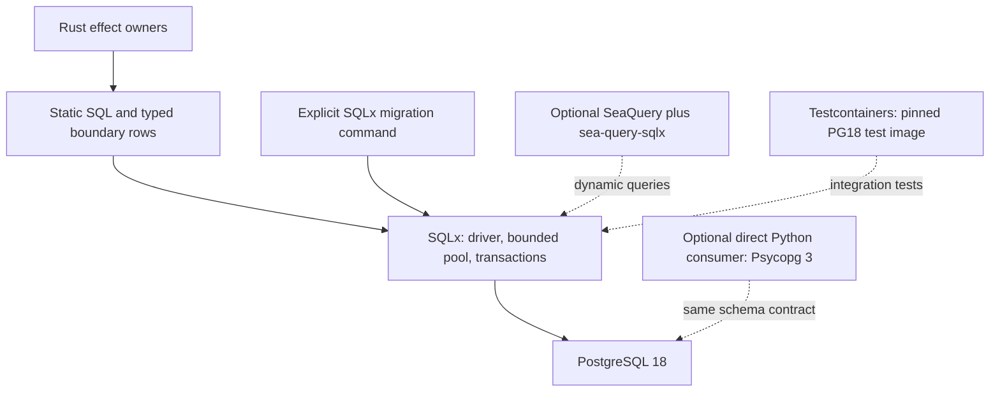

# PostgreSQL application stack assessment

## 1. Scope, outcome and coverage

**Recommendation — Proposed, 2026-09-27:** standardize the application boundary on
**SQLx 0.9 with Tokio, SQLx's pool and SQL migrations, and Rustls**. Use real PostgreSQL 18
integration tests through Testcontainers. Add SeaQuery only for substantial dynamic SQL,
pgvector only for database similarity search, and Psycopg 3 only for a direct Python database
consumer. Keep Cornucopia plus the Rust-Postgres family as the strongest alternative.

This choice covers prospective transactional workflows and immutable serving projections as
well as the cache. It does not depend on PostgreSQL remaining a small cache. SQLx supports
explicit PostgreSQL SQL and types; choosing it does not foreclose server functions, extensions,
indexes or transactions. The separate [storage assessment](design_review_postgresql-storage_2026-09-27.md)
owns the adoption-scope analysis and F01–F04. This follow-up revisits its library choice and
assesses the external stack, rather than reopening canonical storage ownership.

| Field | Scope |
|---|---|
| Subject | User-supplied `docs/external-review-postgresl-options.md`; current source at `1a42c580e3d96071d1f293bb3b6565667f4069a2`; existing and planned PostgreSQL consumers |
| Standard / tier / purpose | Core 3.0, code-intelligence 1.1, [repository binding](../design_principles/binding/library-context.md); design / target, bounded to stack selection |
| Reviewer / method | Codex with independent source reviewer; Context7 for Cornucopia, SeaQuery and pgrx; primary API documentation and exact released crate archives; repository and read-only host inspection |
| Evidence vocabulary | Repository code is **Implemented / source-inspected**; upstream contracts are **Interface-checked**; choices, benefits and integration routes are **Proposed**. All inspection dated 2026-09-27 |
| Exclusions | No dependency installation, Cargo resolution or compilation of the proposed stack; no database objects, extension, container or benchmark created; no product qualification |
| Working tree | External write-up and concurrent Stage 3 discharge review were untracked inputs and are preserved. Product source, manifests, lockfiles and accepted architecture are unchanged |

The external advice is strongest on SQL-first access, one driver family, real database tests,
and separating extension development from application access. Its chemical-component,
`Phase` and thermodynamic-model examples do not describe this repository's domain. They
cannot establish that PostgreSQL-native authored types should become our central abstraction.

## 2. Responsibilities, dependencies and semantic ownership

| Owner | Current contract and reason for change | Implication for PostgreSQL access |
|---|---|---|
| `cpg-schema` | [table.rs](https://github.com/paul-heyse/library-context/blob/0bc8ea11171d6fd96827a8e250964d3de5b3b4ce/crates/cpg-schema/src/table.rs), line 145, generates rows, Arrow schemas, keys and checks; [query.rs](https://github.com/paul-heyse/library-context/blob/0bc8ea11171d6fd96827a8e250964d3de5b3b4ce/crates/cpg-schema/src/query.rs), line 3, generates query-result schemas/decoders | Transport mappings follow these declarations. A generated SQL row is legitimate, but does not replace Arrow authority |
| Codebooks and semantic IDs | [codebook.rs](https://github.com/paul-heyse/library-context/blob/0bc8ea11171d6fd96827a8e250964d3de5b3b4ce/crates/cpg-schema/src/codebook.rs), line 1, owns append-only Int16 values | A PostgreSQL enum is not automatically a better representation. Preserve numeric code and identity contracts; derive database constraints when needed |
| `cpg-core` effects and `lctx` orchestration | Compile, validate, publish, build generations; explicit configuration | Private PostgreSQL modules own connections, SQL, row conversion and operational transactions; reuse the existing pinned Tokio runtime |
| Stage 4/5 semantic owners | [Forward plan §4](../../plans/behavioral-model-forward-plan_2026-09-24.md#4-stages-4-and-5): TOML → Rust definition AST → DataFusion SQL; framework/lifecycle models and bounded semantics | Current DataFusion SQL is not a ready PostgreSQL query catalog. Moving computation would be a separate design change |
| Serving and native semantics | [generation.py](https://github.com/paul-heyse/library-context/blob/1a42c580e3d96071d1f293bb3b6565667f4069a2/python/lctx_mcp/src/lctx_mcp/generation.py), line 963, loads checked IPC; [SemanticExecutor](../../../python/lctx_semantics/src/lib.rs), line 246, holds a pinned immutable index | A database projection must preserve generation identity, evidence and unknowns. The semantic kernel remains independent of connection setup |
| Prospective operator workflow | [Manual review target](../../design/sections/synthesis-and-serving.md#104-grounding-checks); accepted target, not implemented | A real candidate for PostgreSQL-owned operational events and explicit migrations, without making compiler facts editable |

**Proposed dependency direction:** orchestration → PostgreSQL effect module → SQLx/PostgreSQL;
the effect module also consumes schema contracts. Neither `cpg-schema` nor analytics/native
semantic kernels acquire a database dependency. Start with modules in the existing effect
owner; introduce a shared database crate only when actual consumers require one.

| Fact/fidelity family | Authority, coverage and identity | SQL boundary requirement |
|---|---|---|
| Extracted and derived behavioral facts | Pinned provider/compiler/model; typed provenance and explicit unknown boundaries; snapshot-qualified IDs | Preserve types, modality, relationship multiplicity and coverage; missing row is not a negative verdict |
| Served claims and support | One validated generation and its support closure | Same-generation joins/cursors and full evidence hydration, independent of ranking |
| Retrieval scores/vectors | Declared embedding/retrieval spec; heuristic discovery | Similarity never becomes semantic proof; reduced vectors require an explicit retrieval contract |
| Cache winners | Exact admitted request/spec and committed Float32 values | Snapshot capture must preserve exact used values; prior assessment F01 owns this adoption condition |
| Operator events | Prospective operational schema with subject revision and actor/provenance | Own their history in one place; a selected revision becomes explicit compiler input if it affects output |

## 3. Contracts, constraints and testing boundaries

**Proposed:** use static SQL with bound values and named boundary rows. Prefer SQLx checked
`query!`/`query_file!` and `query_as!`/`query_file_as!` for stable queries; commit prepared
`.sqlx` metadata and set `SQLX_OFFLINE=true` for ordinary builds/checks, so an ambient
`DATABASE_URL` cannot select online checking. Regenerate/check metadata against a disposable
PostgreSQL 18 schema during query/migration work. Plain runtime `query_as` does not provide
database-backed compile-time SQL checking. Dynamic queries need executed coverage; neither
SQLx nor Cornucopia can statically validate arbitrary runtime SQL.
[SQLx query checking](https://docs.rs/sqlx/latest/sqlx/macro.query.html),
[named result mapping](https://docs.rs/sqlx/latest/sqlx/macro.query_as.html).

| Contract | Enforcement / failure behavior | Meaningful verification |
|---|---|---|
| Type boundary | Validate ID length, codebook membership, nullability, vector shape and exact encoding; decoding failure is an error | Independent round trips including invalid/unknown codes, NULLs and float bits |
| Resource lifetime | One bounded pool per process/database workload; explicit acquire/query deadlines and transaction scope | Exhaustion, cancellation and connection reuse against real PG18 |
| External I/O | Release connections before embedding/network calls; bind values and allowlist structural SQL choices | Delayed embedder plus concurrent cache workers; SQL shape/parameter tests |
| Migrations | One Rust-owned SQL history; explicit migration command, separate from reads; SQLx default migration locking retained | Fresh schema, supported upgrade, conflicting migrators, failed migration and reader compatibility |
| Cache/publication | Database uniqueness establishes a committed winner; exact used-vector receipt makes Delta publication independently rebuildable | Concurrent writers and interrupted retry; rebuild while PostgreSQL is unavailable |
| Projection | Rebuildable analytical data is imported/validated per immutable generation, not silently migrated into new semantic meaning | Incomplete import stays invisible; same answers/evidence as the file generation |

SQLx's migration API has locking enabled by default; its PostgreSQL implementation uses an
advisory lock. This helps serialize migration runners, but does not supply the application's
schema compatibility or cross-store publication protocol.
[Migrator](https://docs.rs/sqlx/latest/sqlx/migrate/struct.Migrator.html),
[PostgreSQL migration implementation](https://docs.rs/crate/sqlx-postgres/0.9.0/source/src/migrate.rs).

## 4. Composition and execution

The proposed base is one application driver family, not a portable database facade:



Importing a serving projection is a staged workflow: read one published generation, bind
its identity, load bounded batches into an unready generation, validate counts/digests/support,
then mark it ready in PostgreSQL. Queries bind that generation throughout. The driver only
executes this protocol; it cannot invent publication or evidence semantics. The projection's
universe is the declared generation, including unresolved facts and parallel relationships;
it is an exact representation, while its ranking component remains explicitly heuristic.

For bulk import SQLx supplies raw COPY streams, requiring correctly encoded text/CSV/binary
data and explicit finish/abort handling. Rust-Postgres additionally supplies a typed binary
COPY writer. That is a real advantage for the alternative; neither is an automatic Arrow
schema-preserving import. Do not build a general binary codec merely to retain a preferred
driver. If large projection imports make this boundary dominant, compare a representative
typed COPY route before committing the importer.
[SQLx COPY](https://docs.rs/sqlx/latest/sqlx/struct.PgConnection.html),
[Rust-Postgres binary COPY](https://docs.rs/tokio-postgres/latest/tokio_postgres/binary_copy/index.html).

## 5. Change and failure scenarios

| Scenario | Owner and propagation | Assessment / settling evidence |
|---|---|---|
| Add a Stage 4 concept or Stage 5 model | Existing schema/compiler declarations and consumers; no new PostgreSQL connection inside semantic analysis | SQLx and Cornucopia can both preserve this. Neither justifies relocating the semantic authority |
| Add operator-review status/history | Operational module adds a migration and parameterized queries; compiler consumes an explicit event revision only if required | SQLx is sufficient. A large stable query catalog may make Cornucopia generation worthwhile |
| Add a serving facet | Serving request contract → projection/query → same-generation results | Existing [Where](https://github.com/paul-heyse/library-context/blob/0bc8ea11171d6fd96827a8e250964d3de5b3b4ce/python/lctx_mcp/src/lctx_mcp/operations.py), line 73, has bounded facet conjunctions, kind and path prefix. Fixed bound SQL or SQLx QueryBuilder is initially adequate; inspect query plans before generalizing |
| Add genuinely variable joins/expressions | Typed query AST and one PostgreSQL renderer/binder | SeaQuery can replace growing bespoke assembly without replacing the chosen driver or semantic AST |
| New analyzed release/schema | New snapshot and generation; existing semantic hash rules; rebuild derived analytical projection | Driver-neutral. Operational history migrations and analytical rebuilds are different lifecycles |
| Connection loss, competing cache fills, interrupted import | PostgreSQL effect owner implements bounded retry/idempotency and preserves publication receipt | Requires PG18 execution; a typed query API alone cannot establish correctness |
| Semantic filtering becomes transfer-bound | Measure bounded batch retrieval into the current native executor, then a shared pure kernel invoked server-side | A possible pgrx experiment; current one-time IPC loading supplies no evidence of such a bottleneck |

## 6. Correctness and fidelity gates

These judgments concern the **Proposed stack boundary**, not implemented PostgreSQL behavior.

| Gate | Verdict and evidence | Remaining boundary |
|---|---|---|
| G1 Authority | pass in proposed selection: current schema authority and one migration history explicit | Adoption must maintain the mappings in §2 |
| G2 Semantic fidelity | unresolved for integration: no round trips executed | Invalid code, NULL, identity, vector and evidence tests in §3 |
| G3 Validity | unresolved for integration: database/schema admission not built | Fresh/upgrade/type rejection checks |
| G4 Hidden behavior | pass in proposed selection: database effects isolated; ordinary builds offline | Verify no ambient database is consulted during builds |
| G5 Consistency/recovery | unresolved for integration | Previous storage assessment F01/F02 plus transaction/migration fault tests |
| G6 Transformation/reuse | unresolved for integration | Projection equivalence and exact cache replay |
| G7 Truthful capability claims | pass for this assessment: source inspection and proposals separated from tests | No performance/compatibility qualification claimed |
| G8 Library leverage | pass for selected stack: driver, pool, migrations and optional binder reuse existing mechanisms | Revisit typed COPY before writing generic encoding machinery |
| CI-G1 / CI-G2 | unresolved for a new projection; typed verdict and same-snapshot evidence obligations retained | Independent semantic/evidence equivalence cases |
| CI-G3 | n.a.: this stack selection adds no evaluation/compiler inputs | Preserve current reference isolation during implementation |

## 7. Findings and applicability

No new product defect is established by this follow-up. The external manifest is a proposal,
not installed code. The following corrections are concrete adoption findings, separate from
the earlier storage review's F01–F04.

Current disposition for both reviews has transferred to the
[forward plan §6.1](../../plans/behavioral-model-forward-plan_2026-09-24.md#postgresql-findings);
the [PostgreSQL implementation plan](../../plans/behavioral-model-forward-plan_2026-09-24.md#postgresql-workstream)
owns work packages. The findings below remain dated assessment evidence, not completion claims.

<a id="F01"></a>
**F01 — The example stack does not complete its intended dependency composition.**
Refinery's selected Rustls feature requires connector 0.13 while the direct connector is 0.14;
SeaQuery needs the selected driver's value binder; Cornucopia's default generated crate can
enable the synchronous driver that the external recommendation intends to exclude. This does
not demonstrate a compile failure: duplicate connector versions can coexist. It does defeat
the claimed single connector/dependency profile. **DP-09/15/16; A3/G8.** The PostgreSQL adapter
owner should use §8's corrected composition if choosing that alternative. Closure: inspect
the actual resolved feature graph and build/execute the representative adapter. The alternative
correction applies if adopting Rust-Postgres/Cornucopia; current disposition is in the forward
plan linked above.

<a id="F02"></a>
**F02 — Default test/generation servers do not establish PostgreSQL 18 compatibility.**
Testcontainers-modules 0.15.0 uses `postgres:11-alpine`; Cornucopia 1.0.1's default container
is `postgres:latest`. These can check a different major than deployment, with incompatible
query/catalog assumptions. **DP-15/22/23; G3/G7.** The test owner must choose the PG18 patch
image/digest explicitly and assert `server_version_num`; extension tests need an explicitly
versioned extension-bearing image. Closure: actual PG18 migration/query integration receipts.
Trigger: first PostgreSQL adapter qualification; current disposition is in the forward plan.

For the selected proposal, FP-01/02/04/06 and DP-01/02/17/18 are **satisfied** by preserved
schema ownership and isolated effects; FP-03/05 and DP-13/14/16 are **satisfied** by concrete
library composition and named optional consumers. DP-15/19/20/23 are **unresolved** at the
integration boundary, as listed in §6. This is not certification of the current enclosing
semantic architecture or its open Stage 3 findings.

## 8. Library fit and total complexity

### Selected application and test libraries

| Library / inspected release | Decision and scope | Why / qualification boundary |
|---|---|---|
| SQLx **0.9.0** | **Select** for Rust PostgreSQL access, pool, transactions and migrations | SQL-first static and runtime queries without ORM entities; integrated lifecycle; offline checked-query route |
| Tokio **1.53.1** | **Reuse existing workspace pin** | Async runtime already owned by application orchestration |
| Rustls through SQLx | **Select one SQLx TLS feature** | No `tokio-postgres-rustls` dependency in this family; explicit root policy and remote hostname verification |
| Testcontainers-modules **0.15.0**, `postgres` | **Select for dev integration tests** | Uses Testcontainers **0.27.x**, reexported by the module crate. The separately latest core **0.28.0** is not this module's dependency; do not upgrade it independently |
| SeaQuery **1.0.2** + sea-query-sqlx **0.9.1** | **Conditional** on a substantial dynamic SQL AST | Adapter accepts SeaQuery 1.0 and SQLx 0.9 and supplies bound values. Ordinary optional filters alone do not earn another AST |
| pgvector Rust **0.4.2**, `sqlx` feature | **Conditional** on PostgreSQL similarity search | Its SQLx range accepts 0.9. The external `postgres` feature selects the other driver family |
| Psycopg **3**, `psycopg_pool` if needed | **Conditional** on a direct Python database consumer | Async MCP access can use AsyncConnectionPool; Python shares the schema contract and does not own another migration history |
| SQLAlchemy | **Defer** | Useful Core/ORM facilities with Psycopg support, but no current Python-owned relational domain requires them; do not layer two independent pools |

Source contracts: [SQLx feature manifest](https://docs.rs/crate/sqlx/0.9.0/source/Cargo.toml),
[Testcontainers module manifest](https://docs.rs/crate/testcontainers-modules/0.15.0/source/Cargo.toml),
[PostgreSQL image defaults](https://docs.rs/crate/testcontainers-modules/0.15.0/source/src/postgres/mod.rs),
[SeaQuery SQLx binder](https://docs.rs/sea-query-sqlx/0.9.1/sea_query_sqlx/),
[pgvector adapters](https://docs.rs/crate/pgvector/0.4.2/source/Cargo.toml),
[Psycopg pooling](https://www.psycopg.org/psycopg3/docs/advanced/pool.html),
[SQLAlchemy Psycopg dialect](https://docs.sqlalchemy.org/en/20/dialects/postgresql.html#module-sqlalchemy.dialects.postgresql.psycopg).

**Proposed feature sketch, not a resolved manifest:**

```toml
# Future workspace dependency; consumer uses workspace = true.
sqlx = { version = "=0.9.0", default-features = false, features = [
    "postgres", "runtime-tokio", "tls-rustls-ring-native-roots", "macros", "migrate"
] }

# Future dev dependency only. Use its testcontainers reexport.
testcontainers-modules = { version = "=0.15.0", default-features = false, features = ["postgres"] }
```

Add JSON/date/UUID features only for actual columns; semantic IDs stay the existing hash
types. The TLS selection is one source-checked option, not a claim about the final workspace
crypto graph: the existing lockfile already contains both Ring and AWS-LC. Resolve and inspect
features when adopting. SQLx's declared MSRV is 1.94, below this repository's 1.98.1; this is
not a compiled compatibility receipt. No pin changes are made by this review.

### Cornucopia and the coherent alternative

**Interface-checked:** Cornucopia **1.0.1** is a serious SQL-first generator. Version 1.0
combines the Cornucopia/Clorinde work and emits a separate query crate, including its manifest,
rather than requiring the older runtime-crate setup. Generated async queries support ordinary
and pooled clients/transactions. It supports custom Rust type mappings and workspace-inherited
dependencies. Generated transport types are derived representations, not inherently competing
authorities. [1.0 migration](https://github.com/cornucopia-rs/cornucopia/blob/main/docs/src/introduction/migration_to_1_0.md),
[connection support](https://github.com/cornucopia-rs/cornucopia/blob/main/docs/src/using_queries/db_connections.md),
[1.0.1 configuration](https://docs.rs/crate/cornucopia/1.0.1/source/src/config.rs).

| Companion | Decision if this alternative is chosen | Composition detail |
|---|---|---|
| tokio-postgres **0.7.18** | Core application driver | PostgreSQL-specific protocol API, pipelining, streaming and typed binary COPY |
| deadpool-postgres **0.14.2** | Pool and prepared-statement cache | Use existing client/transaction integration; do not build a pool |
| postgres-types **0.2.14** | Direct dependency where own mappings/derives need it | Custom enums/domains/composites are supported; ordinary queries alone do not require a direct dependency |
| tokio-postgres-rustls **0.14.0** | One TLS connector | Rustls 0.23 / Tokio-Rustls 0.26; select crypto/root features explicitly |
| Refinery **0.9.2** | One migration owner | Enable `tokio-postgres` only and run on an already-connected client using the chosen TLS connector; avoid also enabling its connector-0.13 feature |
| Cornucopia **1.0.1** | Pinned development generator | Commit generated query crate, regenerate against migrated PG18, inherit workspace pins; no generation/database discovery in normal build.rs |
| sea-query-postgres **0.6.1** | Conditional binder for SeaQuery | Uses SeaQuery 1.0 and postgres-types 0.2; avoids a bespoke Values-to-ToSql adapter |

Sources: [driver](https://docs.rs/tokio-postgres/latest/tokio_postgres/),
[Deadpool](https://docs.rs/deadpool-postgres/latest/deadpool_postgres/),
[type derives](https://docs.rs/postgres-types/latest/postgres_types/),
[TLS manifest](https://docs.rs/crate/tokio-postgres-rustls/0.14.0/source/Cargo.toml),
[Refinery connector requirement](https://docs.rs/crate/refinery-core/0.9.2/source/Cargo.toml),
[existing-client migration examples](https://docs.rs/crate/refinery/0.9.2/source/tests/tokio_postgres.rs),
[SeaQuery PostgreSQL binder manifest](https://docs.rs/crate/sea-query-postgres/0.6.1/source/Cargo.toml).

Cornucopia's generated Cargo defaults include the synchronous `postgres` feature as well as
Deadpool when async generation is selected. Use the generated crate with
`default-features = false, features = ["deadpool"]` for the intended runtime family, and check
the resolved graph. Its default dependency requirements are semver ranges, not forced exact
older versions; `use-workspace-deps` and manifest configuration can honor our pins.
[Generated manifest implementation](https://docs.rs/crate/cornucopia/1.0.1/source/src/codegen/cargo.rs).

### Other proposed libraries and server extensions

**Diesel 2.3.13 + diesel-async 0.9.2:** a credible typed Rust query DSL, including async
PostgreSQL access and async migrations. Prefer it when the Rust relational query model itself
is the desired programming interface. Here it would add a query/schema representation around
an existing Arrow contract and explicit SQL workflows. It is an alternative to SQLx, not an
extra safety layer for SQLx queries. [Diesel async API](https://docs.rs/diesel-async/0.9.2/diesel_async/).

**SeaORM 2.0.4:** reconsider for a substantial conventional entity/relationship application,
such as a separately owned operator application. Its entity and relation workflows do not
currently remove work from our compiler/projection boundary. Using SeaQuery does not require
SeaORM. [SeaORM 2.0 documentation](https://www.sea-ql.org/SeaORM/docs/index/).

**pgvector:** storing embeddings does not imply similarity search. The proposed exact-key
cache needs no extension. Our 4,096-dimensional vectors fit pgvector storage, but exceed ANN
index limits for both `vector` (2,000) and `halfvec` (4,000). Half precision alone does not
solve this. A later search design can use exact search or explicitly qualify reduced/binary
candidate retrieval followed by full-vector reranking. Installing the Rust adapter does not
install the PostgreSQL extension. [pgvector dimensions and indexing](https://github.com/pgvector/pgvector).

**pgrx 0.19:** the correct library when writing a PostgreSQL server extension in Rust, but
not part of the initial application stack. 0.19.3 was current during this inspection; the
external 0.19.2 recommendation is a neighboring patch, not a design error. Server-side code
has PostgreSQL memory-context/thread restrictions: arbitrary Tokio work cannot treat backend
PG pointers/functions as ordinary thread-safe Rust. A future extension needs its own
build/deployment and PG18 test scope. Select matching library/cargo-pgrx versions then; do
not install tooling now merely because it may eventually help.
[pgrx capabilities and threading model](https://github.com/pgcentralfoundation/pgrx).

An extension can be called by SQLx, Rust-Postgres or Psycopg. It does not favor one client
driver. Its useful experiment would run a shared pure semantic kernel over a large SQL-side
candidate set and compare against bounded batch retrieval into the existing executor,
preserving model/generation identity, unknown outcomes and evidence. No current measurement
establishes that this would outperform the existing one-time generation load.

## 9. Alternatives and tradeoffs

| Choice | What becomes easier | Cost / limitation | Decision and revisit condition |
|---|---|---|---|
| Existing Delta and file generations | No new service or migration lifecycle | Poorer fit for future mutable operational records; no PostgreSQL capability yet | Remains implemented baseline; storage decision stays in preceding assessment |
| **SQLx selected** | Static SQL, native transactions/types, one integrated pool/migrator; can map named boundary rows | Checked metadata must stay fresh; nullability overrides require care; raw COPY needs encoding | Best total fit across cache, operational state and projections; revisit for demonstrated driver/API limitations |
| **Rust-Postgres + Cornucopia** | Generated named parameter/result interfaces, rich PostgreSQL mappings, typed binary COPY; generated code builds offline | Separate generation tool/config/output, pool, TLS and migration composition | Choose instead if a growing PG-owned SQL catalog removes significant row/binding boilerplate, or representative COPY/type work materially favors this family |
| Rust-Postgres without Cornucopia | Small direct driver boundary and typed COPY | Handwritten query/row/type coordination unless separately checked | Viable small adapter; weaker default than SQLx's built-in checking/migrations for this project |
| Diesel / SeaORM | Typed relational DSL or entity workflows | Another programming/schema representation without a present consumer advantage | Defer until such an application domain exists |

The strongest case for Cornucopia is its generated query API, not simply keeping SQL visible:
SQLx also accepts ordinary SQL files and maps queries into named structs. Likewise SQLx has
native enum/composite/transparent type derivation; rich PostgreSQL types do not by themselves
force `postgres-types`. Neither family automatically enforces semantic codebooks, evidence
closure or generation pinning. [SQLx type mappings](https://docs.rs/sqlx/latest/sqlx/trait.Type.html).

The recommendation is a fit judgment, not a benchmark result or a claim that fewer crate
names always mean lower complexity. Cornucopia is coherent when its generation workflow earns
its cost. Both alternatives need actual SQL/query metadata and database integration tests.

## 10. Verification and uncertainty

| Inspection / command | Outcome, 2026-09-27 | Scope |
|---|---|---|
| Context7 resolve-library-id → query-docs for Cornucopia, SeaQuery, pgrx | **passed** | Documentation retrieval; claims cross-checked against primary sources, not product execution |
| `python3` read-only urllib/tarfile/tomllib inspection of released crate archives | **passed** | Exact feature/dependency/default inspection for SQLx 0.9.0, Cornucopia 1.0.1, Refinery 0.9.2, adapters, pgvector and Testcontainers modules; no packages installed |
| `psql --version`; `pg_lsclusters`; `pg_isready` (independent reviewer) | **passed** | PostgreSQL 18.6, `18/main` online on 5432 and accepting connections; not an authenticated SQL test |
| `docker version --format '{{.Server.Version}}'` (independent reviewer) | **passed:** 29.8.1 | Accessible daemon; disposable tests are feasible. No image/container was created |
| `just docs-check` | **failed** | Supplied untracked `docs/external-review-postgresl-options.md` has no title/H1; preserved unchanged |
| Scoped publication command below | **passed:** 141 pages, 36 ADR records, offline links | Same publisher/check path, with only the supplied external input excluded in memory; no source/configuration mutation |
| Proposed stack Cargo resolution/build, query generation and PG18 round trips | **not_run** | No adapter is implemented or claimed compatible by execution |
| `just test-all`; `just pilot`; comparative benchmark | **not_run** | Documentation-only assessment; no integrated product or performance claim |

Scoped publication command (the ordinary whole-tree check remains failed):

```bash
uv run --no-project --offline --no-python-downloads python - <<'PY'
import sys
sys.path.insert(0, "scripts")
import docs
original_config = docs.config
def review_config(root):
    settings = original_config(root)
    settings["publication"]["exclude"].append("docs/external-review-postgresl-options.md")
    return settings
docs.config = review_config
sys.argv = ["scripts/docs.py", "check"]
raise SystemExit(docs.main())
PY
```

The initial implementation should test actual boundaries: migration/upgrade, static SQL and
offline metadata, nullable/type round trips, concurrent cache admission, cancellation/pool
reuse, and exact snapshot rebuild with PostgreSQL unavailable. A later projection needs
same-generation evidence equivalence and interrupted import. Comparative driver benchmarks
are justified only when they settle a real bulk-import/serving decision.

## 11. Authority changes and dispositions

This report recommends a stack; it does not accept a storage pivot. Subsequent product work
is described in the [PostgreSQL plan](../../plans/behavioral-model-forward-plan_2026-09-24.md#postgresql-workstream).
The [earlier storage review §11](design_review_postgresql-storage_2026-09-27.md#11-authority-changes-and-dispositions)
owns the adoption route, including affected §B7/§B12/§B13/§B14 and ADR-0043/ADR-0047 cache
contracts. Both reviews retain dated source findings; their current disposition now lives in
the [forward plan §6.1](../../plans/behavioral-model-forward-plan_2026-09-24.md#postgresql-findings).

At adoption, the PostgreSQL effect owner records the driver decision and scope through
ADR + owning DESIGN sections, records any deliberate pin through pin-check, and implements one migration
history. Follow the existing acceptance timing and the operator-requested two-plan split:
PostgreSQL detail lives in its plan, with sequencing and dispositions in the forward plan.
Ordinary semantic development keeps database-independent builds. If the alternative is
selected, replace the SQLx boundary rather than retaining two speculative driver stacks.

## 12. Architectural judgment and decision

| Judgment | Verdict for the selected proposal | Basis |
|---|---|---|
| A1 Localize change | **satisfied** | Schema/model changes stay with their owners; connection/migration mechanics stay at effects; semantic tests need no database |
| A2 Encode meaning structurally | **satisfied** | Existing Arrow/codebook identities remain authoritative; SQL rows are transport; operational records have an explicit owner |
| A3 Extend through composition | **satisfied** | SQLx covers the base; concrete dynamic SQL/search consumers can add compatible adapters; server extensions remain independent |

**Bounded decision: Accept scoped** the SQLx-based stack recommendation at **Proposed /
Interface-checked** strength. **Revise** the external initial manifest before adopting it:
resolve F01/F02 and attach optional components to real consumers. Runtime behavior is
explicitly excluded from acceptance because §6 integration gates are unresolved.

**Enclosing architecture:** PostgreSQL integration remains unimplemented and unqualified;
Stage 3 completion is still governed by the active plan. The next owner is `cpg-core`/`lctx`
for the first agreed PostgreSQL capability and its ADR, migrations, adapter and focused PG18
qualification. SQLx is the recommended stack to carry into that work.
