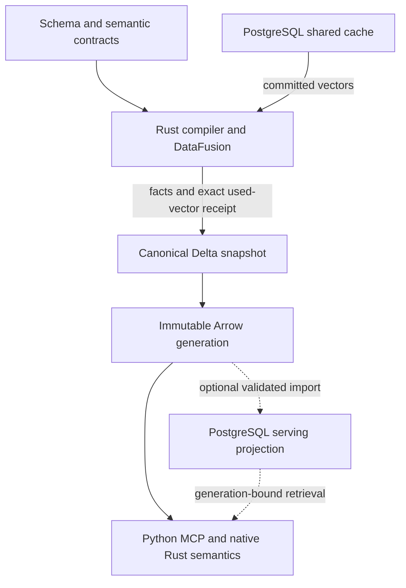

# PostgreSQL storage and capability assessment

The follow-up [PostgreSQL stack assessment](design_review_postgresql-stack_2026-09-27.md)
examines the external Cornucopia/Rust-Postgres proposal and refines the library recommendation.
This report retains the storage-scope analysis and adoption findings F01–F04. Current
disposition has transferred to the [forward plan §6.1](../../plans/behavioral-model-forward-plan_2026-09-24.md#postgresql-findings);
the [PostgreSQL plan](../../plans/postgresql-integration-plan_2026-09-27.md) owns detailed work.

## 1. Scope, outcome and coverage

**Recommendation — Proposed, 2026-09-27:** use PostgreSQL selectively alongside Delta.
The strongest existing-workload candidate is the shared embedding cache. PostgreSQL is also a
good prospective owner for transactional operator/workflow state. Retain Arrow/DataFusion for
compilation, Delta for canonical published evidence, and file generations for current serving.
Evaluate a PostgreSQL serving projection when a concrete indexed-query or scale requirement
appears. Replacing the entire canonical store is technically credible, but presently unearned.

This recommendation identifies an implementation direction and a bounded experiment. It does
**not** establish that PostgreSQL will make the current compiler or server faster. Stage 4's
registry and Stage 5's semantic capabilities do not inherently require another database.

| Field | Scope |
|---|---|
| Subject | Current persistence, cache, generation building, retrieval, native semantic serving, and relevant future capabilities; source inspected at `0359548bc3eb768ce0836827212b38aa239ca6e0` |
| Standard | Core 3.0, code-intelligence 1.1, [repository binding](../design_principles/binding/library-context.md) |
| Tier / purpose | Design / target; adjacent consumers included |
| Reviewer / date | Codex, with independent design-reviewer source assessment; 2026-09-27 |
| Method | Source/contract inspection; Context7 discovery for PostgreSQL 18, SQLx and Psycopg 3; primary upstream documentation, tagged manifests and package metadata; read-only host inspection |
| Evidence vocabulary | Existing code claims below are **Implemented / source-inspected**; upstream API claims are **Interface-checked**; all proposed changes and benefits remain **Proposed**, dated 2026-09-27 unless another date is given |
| Limitations | No PostgreSQL adapter, database benchmark or fault-injection experiment was built. Database login was unavailable. No product qualification claimed |
| Working tree | Existing untracked Stage 3 discharge review preserved. This assessment changes no dependencies, database objects, accepted decisions or product implementation |

The [active plan §1 and §3](../../plans/behavioral-model-forward-plan_2026-09-24.md) remains the
execution authority. Its shared-machine checkpoint recorded 204.0 s total, 107.25 s validation,
32.5 s extraction and 4,258 MiB peak RSS, with fake embeddings. Those are **historical Measured
observations**, not a controlled storage comparison. Neither that receipt nor the current
20-brief checkpoint demonstrates a search-service bottleneck. PostgreSQL adoption does not
resolve the remaining semantic summaries, models or unknown-answer obligations.

## 2. Responsibilities, dependencies and semantic ownership

### Current boundaries

| Component | Responsibility and contract | Evidence / expected reason for change |
|---|---|---|
| `cpg-schema` | Arrow contracts, semantic IDs, append-only codebooks, rules, projection specifications | [Table contracts](../../../crates/cpg-schema/src/table.rs), [embedding contract](../../../crates/cpg-schema/src/embedding.rs); changes when domain meaning changes |
| `cpg-core::attempt` / DataFusion | Construct relations, run shared semantic validation, publish only a valid attempt | [attempt.rs](../../../crates/cpg-core/src/attempt.rs), lines 1342–1409; changes for new compiler stages or publication protocol |
| `cpg-core::delta` / `snapshot` | Physical Delta writes, strict schema checks, exact-version and commit-owned reads | [delta.rs](../../../crates/cpg-core/src/delta.rs), [snapshot.rs](../../../crates/cpg-core/src/snapshot.rs), lines 93–159; owns storage mechanics |
| `cpg-core::embed` | Token admission, batching, vector validation, shared cache admission and committed readback | [embed.rs](../../../crates/cpg-core/src/embed.rs), lines 240–432; both entry points now use one `fill_cache` |
| `lctx-analytics` | Graph/program analysis over declared Arrow input and output | [analytics owner](../../design/sections/analytics.md); no PostgreSQL dependency belongs in these kernels |
| `cpg-core::bundle` | Derive normalized IPC files and manifest from one published snapshot | [bundle.rs](../../../crates/cpg-core/src/bundle.rs), lines 1015–1048; rebuildability, not another writable fact source |
| `lctx_mcp` | Validate/load one generation, retrieve and render typed answers | [generation.py](../../../python/lctx_mcp/src/lctx_mcp/generation.py), lines 932–989; [server.py](../../../python/lctx_mcp/src/lctx_mcp/server.py), lines 522–528 |
| `lctx_semantics` | Bounded native semantic interpretation of the pinned generation | [native executor](../../../python/lctx_semantics/src/lib.rs); database selection does not replace its condition/model semantics |

The current server loads an explicit generation directory once in its lifespan. Its retrieval
is in memory; it does not issue Delta queries. Consequently, moving canonical persistence to
PostgreSQL would not by itself speed up current MCP requests.

### Proposed dependency and data flow

The arrows describe representation flow, not permission for PostgreSQL or Python to redefine
compiler semantics. Operational records have their own authority; a database catalog of Delta
snapshots is a rebuildable index of publication, not its authority.

| Concept | Authority and identity | Update boundary / derived forms |
|---|---|---|
| Facts, verdicts, conditions, support, concept membership | `cpg-schema` plus pinned compiler/model inputs; existing content-derived IDs | New compiler snapshot; PostgreSQL projection preserves meaning and source identity |
| Snapshot publication | Delta `snapshots` append under current §B7 | PostgreSQL may discover/index it after publication; no dual publication vote |
| Shared cache winner, if migrated | One PostgreSQL row per `(spec_hash, input_hash)` | Insert once, read committed winner; frozen used values become canonical snapshot evidence |
| Serving generation | Canonical snapshot plus projection/compiler/spec digests | New immutable generation; readiness and active selection are separate operational concepts |
| Operator reviews, if implemented | Append-only operator events with subject revision and provenance | Selected event revision becomes an explicit later compiler input; never edit a published brief |
| Stage 4 vocabulary and definitions | Authored TOML and typed Rust AST under the existing plan | PostgreSQL can index the compiled catalog; it does not become a second editor for definitions |

### CI fact and fidelity table

| Relation | Provider / fidelity | Coverage and identity | Consumer constraint |
|---|---|---|---|
| Extracted families and graph catalogs | Pinned analyzers; attributed raw facts and declared derivations | Snapshot-qualified semantic IDs; coverage, unresolved endpoints and parallel relationships retained | Storage conversion must preserve provider, kind, modality, multiplicity and evidence |
| Behaviors, summaries and discharges | Pinned model/compiler; claims relative to that model | Five verdicts and explicit boundaries; exact claim/support identities | A SQL filter cannot convert missing rows into refutation or absence |
| Briefs, concepts and witnesses | Programmatic synthesis / planned concept definitions | Same-snapshot typed support; definition and model digests | Hydrate the whole declared support closure, independent of search ranking |
| Lexical/vector search results | Declared retrieval specification; heuristic ranking | One generation and embedding space | Ranking establishes discovery, never semantic truth or exhaustiveness |
| Cache vectors | Pinned embedding specification and admitted request | Spec/input digests plus exact committed Float32 values | Recomputing a lost vector is not assumed byte-identical replay |

## 3. Contracts, constraints and testing boundaries

**Proposed:** add a private PostgreSQL capability module beside the existing effect owners in
`cpg-core`; start with the cache consumer. `lctx` supplies explicit connection configuration and
pool/resource limits. Do not introduce a universal `StorageBackend` abstraction around every
Delta table. A narrow cache interface is justified by its actual substitution and test boundary;
another crate is unnecessary until real sharing requires it. SQLx handles should remain at the
effect boundary, outside `cpg-schema`, analytics kernels and the native condition executor.

| Contract | Proposed enforcement and failure | Isolated verification |
|---|---|---|
| Cache admission | Existing tokenizer/spec/shape/finiteness/norm admission; database PK and structural CHECKs; bounded requests and retries | Real PostgreSQL plus a controlled embedder; a fake provider can test mechanics but cannot qualify live embedding |
| Snapshot completeness | Export every vector actually used by analytics and synthesis before validation; register canonical batches with shared validators | Real Delta publication followed by bundle rebuild with PostgreSQL unavailable |
| Generation readiness | Import only a published generation; verify complete keys, counts, schema/spec/source digests and support closure before marking ready | Interrupted import and repeated import of the same generation |
| Semantic lookup | Bind generation/snapshot in all keys, joins and cursors; keep explicit unknown/partial states | Same declared request over file and SQL projections, including incomplete coverage |
| Domain purity | No connection setup, SQL lookup or mutable head read inside BDD/summary/model evaluation | Existing in-memory semantic tests continue without database setup |
| Operational migrations | One Rust-owned SQL migration history; explicit migration command, separate from read-only query/startup paths | Fresh schema, supported upgrade, incompatible-reader rejection, restore |

### Physical mappings

**Proposed:** mechanical mappings follow the semantic owner; they do not redefine it.

| Existing meaning | PostgreSQL representation / constraint |
|---|---|
| 16-byte semantic ID | `bytea`, non-null where required, `octet_length = 16`; retain the existing hash recipe |
| 32-byte digest | `bytea` with length 32; do not substitute a database sequence, transaction ID or UUIDv7 |
| Append-only Int16 codebook | `smallint` with generated membership enforcement where appropriate; retain append-only numeric meaning |
| Evidence/relationship reference | Composite identity including snapshot or generation; FKs for imported same-database relations where useful |
| Nullable typed field | SQL NULL only for the declared optional field; never a substitute for the five verdicts or coverage states |
| Structured/queryable semantics | Typed columns/child relations; JSONB only for data whose interior is genuinely opaque to the consumer |
| Canonical JSON used in a digest | Preserve original canonical encoding or recompute with the owning canonicalizer; JSONB's rendering is not the hash input |
| Cached vector requiring exact replay | Extension-free `bytea` of a versioned canonical Float32 encoding, dimension/length checks and value digest; decode/check through Rust before Arrow construction |

The cache does not perform similarity search, so it does not need pgvector. A canonical byte
encoding avoids making replay depend on array/text formatting; define its byte order and codec
revision explicitly. A `REAL[]` alternative is acceptable if an independent round trip proves
the required bit-level equality and shape constraints. Semantic checks remain with the compiler;
database constraints add physical admission checks, not a second implementation of the model.

## 4. Composition and execution

### First candidate: shared cache with immutable snapshot capture

**Implemented baseline:** `fill_cache` performs admission and an insert-only Delta merge, then
reads the winning values at the returned version. `attempt.rs:1282–1305` records that version;
`bundle.rs:474–481` joins documents to the pinned cache. The cache already participates in
reproducibility. [Plan W9](../../plans/behavioral-model-forward-plan_2026-09-24.md#6-findings-disposition)
owns the existing correction and remaining qualification; this assessment does not reopen the
corrected lost-winner defect.

**Proposed replacement protocol:**

1. Batch-read immutable rows by the existing full spec/input key. Compute only missing requests;
   run vLLM outside any database transaction. Keep the present over-token-cap and vector checks.
2. Insert admitted values with `ON CONFLICT DO NOTHING` under a primary key. In a subsequent
   statement at READ COMMITTED, read all requested keys and use their committed values, including
   the winning values inserted by other attempts. Check completeness; a database failure aborts
   the attempt explicitly. Preserve completed batches when later embedding work fails.
3. Retain exactly those values in the attempt's typed inputs. Admit no cache UPDATE/DELETE path
   in the first slice. A later eviction policy must account for active attempts.
4. Collect the union of keys used by every consumer, including pre-synthesis analytics and
   operation/brief documents. Write a snapshot-qualified `used_embeddings` relation once before
   validation/publication, carrying spec/input identity, exact values and value digests. Define
   its aggregate receipt digest in the compiler/content identity contract.
5. Validate and publish using the existing Delta protocol. Build and rebuild generations from
   this canonical relation, with no subsequent PostgreSQL read. PostgreSQL is then an admission
   and reuse service; canonical snapshots retain their own replay inputs.

The separate read in step 2 is intentional: a conflicting row can prevent insertion while being
invisible to the INSERT statement's snapshot. `RETURNING` only returns inserted/updated rows;
a single-statement insert-or-select CTE is not assumed to return a concurrent winner.
[PostgreSQL 18 isolation](https://www.postgresql.org/docs/18/transaction-iso.html),
[INSERT](https://www.postgresql.org/docs/18/sql-insert.html).

On an uncertain connection failure, reconnect and reconcile the idempotency key before retrying.
Bound retries and deadlines. Cache misses may compute duplicate candidates concurrently, but the
PK selects one persisted winner. Do not add a distributed lock around the embedding service merely
to avoid duplicate computation unless measurements justify that separate requirement.

During adoption, import the verified existing cache into PostgreSQL once and compare keys and
values; conflicting values need an explicit migration decision. Cut over one cache writer.
Remove its obsolete Delta global-MERGE path and global-cache reader special cases after searching
all consumers. Keep independent race/admission/replay controls, rewritten against the new boundary.
The snapshot capture is an immutable result artifact, not a second mutable cache.

### Optional later serving projection

**Proposed:** keep the Arrow generation as the interchange/rebuild boundary. A Rust importer
loads a new, unpublished PostgreSQL generation using batched inserts or COPY; it validates source
digests and relational closure, then marks that generation ready in one PostgreSQL transaction.
An active-generation pointer may change in that transaction, but each server resolves it only at
startup and holds its generation for its lifetime. Retain generations needed by live readers;
the first deployment can use explicit retention rather than an automatic lease/GC framework.

There is no Delta/PostgreSQL atomic transaction. Recovery enumerates published canonical inputs
and retries missing projections. A crash after Delta publication leaves a valid snapshot awaiting
projection. A crash before PostgreSQL readiness leaves an invisible import. A lost acknowledgement
is reconciled by immutable generation identity and manifest digest. Database outage can block a
database-backed server, but existing file-backed serving and canonical rebuild remain independent.

The native executor still loads typed semantic state. PostgreSQL filters can reduce relational
lookup costs; they do **not** automatically remove native memory use. Avoid per-witness or
per-BDD-node SQL calls. Fetch bounded batches, preserve all referenced evidence, and keep one
semantic interpreter.

### Analysis and projection records

| Question / stage | Universe and method | Precision/model and budgets | Output / evidence |
|---|---|---|---|
| Existing compiler analyses | Declared graph/flow projections; current Rust kernels and DataFusion derivations | Existing model, convergence and refusal contracts unchanged | Snapshot-qualified typed results and witnesses |
| Cache lookup/capture | Exact full keys, one committed winner per key | Exact byte replay; bounded batches/timeouts; unavailable is an error, not an empty hit set | Used-vector relation and receipt digest |
| PostgreSQL relational serving | One complete immutable generation; indexed predicates and joins | Exact only for declared relational semantics; semantic unknowns stay explicit | Existing answer schema and complete support closure |
| Search candidate retrieval | Same-generation documents, declared tokenizer/vector space | Heuristic; ANN requires separately declared approximation and work limits | Ranked candidates; original vectors available for reranking |
| Stage 4 concept lookup / explain | Authored definitions, materialized membership, stored proof graph | Existing definition/model and query budgets; no SQL substitute for BDD implication | Definition digest, premises, rule IDs and spans |

## 5. Change and failure scenarios

| Trigger | Owner / required change | Affected consumers and semantic decisions | Settling evidence |
|---|---|---|---|
| Two compiles produce different valid vectors for one key | Cache owner; atomic insertion and authoritative readback | One decision about the winner; analytics and synthesis consume it | Concurrent sessions with distinct controlled vectors; both receive the same bytes |
| PostgreSQL disappears after publication | Snapshot capture and bundle builder | Rebuild reads canonical used values, never the live cache | Disable/remove the disposable PG instance and obtain identical bundle bytes |
| New library release or model revision | Existing acquisition/schema/compiler owners | Generation/release identity changes; cache keys change only when the embedding spec or exact request text changes. Identical spec/text intentionally reuses vectors across releases, independently of fact identity | Changed-input and unchanged-input identity controls; no new history guarantee |
| Add a Stage 4 concept | Registry AST / schema / compiler | One definition; optional PG projection follows it; Python does not reinterpret the definition | Trace membership and explanation to the same definition digest and witnesses |
| Operator changes a review | New review-event owner, when that workflow exists | Capture a review revision for a later compile; earlier facts/briefs immutable | Two review revisions produce separately attributable results |
| Large filtered discovery corpus | Retrieval owner, not canonical storage | PostgreSQL vs existing exact search vs the deferred index alternative; one chosen ranking policy | Recall, filters, startup, latency, RSS and build-cost comparison |
| Crash during import or activation | Projection importer / catalog | Readiness, selection and canonical publication stay separate; old readers stay pinned | Kill/retry at each boundary; no partial or mixed-generation result |
| Add a fact family | `cpg-schema` and its producer/consumer | Arrow remains authority; PostgreSQL-specific mapping added only if that relation has a SQL consumer | Known-answer relation including unknowns, parallel links and missing support |
| Evolve analytical schema | Existing ADR-0048 rebuild policy | Rebuild canonical current store and derived projection; operational event migrations are separate | Drift rejection plus fresh compile; no copied stale analysis rows |

## 6. Correctness and fidelity gates

These verdicts assess **readiness to adopt PostgreSQL**, not the correctness of unchanged Delta
code. A specified target can have sound boundaries while its implementation gates remain open.

| Gate | Verdict | Evidence / required action |
|---|---|---|
| G1 Authority | pass at Proposed boundary | Arrow semantics, Delta publication, PG cache winner and immutable capture have distinct owners; prohibit dual writable facts |
| G2 Semantic fidelity | unresolved | Physical mapping and optional serving adapter not implemented; round-trip typed verdicts, keys, nulls and evidence |
| G3 Validity | unresolved | Database constraints, complete import admission and real adapter negative cases not exercised |
| G4 Hidden behavior | pass at Proposed boundary | Explicit database effects; no live DB access inside semantic kernels or read-only migration side effects |
| G5 Consistency/recovery | unresolved | Cache races, ambiguous commits, readiness/activation and outage protocol need execution |
| G6 Transformation/reuse | unresolved | Exact vector capture and generation replay require proof; retrieval changes require a declared approximation policy |
| G7 Truthful capability claims | pass for assessment | No speedup, deployment or integration qualification claimed; adoption performance remains unknown |
| G8 Library leverage | pass at Interface-checked scope | Native PG constraints plus established drivers/migration/pooling; bulk/federation alternatives compared below |
| CI-G1 Fidelity | unresolved for new projection | SQL absence, ANN candidate omission and partial coverage must not change verdicts |
| CI-G2 Evidence closure | unresolved for new projection | Composite references and native admission must reject missing/cross-generation support |
| CI-G3 Evaluation integrity | pass at Proposed boundary | Storage design adds no gold input; set benchmark/quality criteria before results and preserve sealed evaluations |

## 7. Findings and applicability

Findings F01–F04 are constraints on the proposed adoption, not claims that absence of PostgreSQL
is a defect. Their current disposition is owned by the
[forward plan §6.1](../../plans/behavioral-model-forward-plan_2026-09-24.md#postgresql-findings),
following the operator's implementation-planning request. The IDs and dated evidence below
are unchanged; planning does not establish implementation or closure.

**F01 — A cache migration must preserve the exact vectors used by published results.**
FP-04/05, DP-09/19, CI-13; A2, G1/G5/G6. The current snapshot names a durable cache version,
and the bundle reads it. Replacing that version with a live PG lookup would break rebuild after
deletion, restore or value replacement. Owner: schema, `embed`, `attempt`, `bundle`. Implement
the snapshot capture in §4 and delete the replaced global-cache route. Closure: same-key races,
value-digest checks, PostgreSQL-offline identical rebuild and restored-cache conflict handling.
Trigger: selecting PostgreSQL as the shared cache.

**F02 — Database search and live tables cannot silently replace generation-pinned semantics.**
FP-02/04/05, DP-08/11/19, CI-04/11/13; A2/A3, G2/G5/G6. Current retrieval, unknown handling,
support closure and native evaluation have specific behavior. FTS ranking, ANN omission or a
join against an active head can change it. Owner: generation importer, retrieval, native/MCP
boundary. Use immutable generation keys; keep native semantics and exhaustive relational queries
separate from ranking. Closure: exact-answer parity, approximation labeling/recall, cross-generation
rejection and failure/read-pinning controls. Trigger: a PostgreSQL serving consumer.

**F03 — Canonical-store replacement lacks an evidenced cost and simplification case.**
FP-01/03/06, DP-15/16/22; A1/A3, G7. Current costs include semantic validation and extraction;
a storage substitution does not remove those. The required Arrow transport, validation, publication
and migration changes are broad. Owner: storage architecture. Compare a representative complete
write/validate/publish/read/rebuild route before choosing replacement. Closure: measured benefit
and a complete authority/compatibility mapping, including what existing machinery is removed.
Trigger: a measured canonical-storage bottleneck or an agreed capability needing PG transactions.

**F04 — A generic PostgreSQL-to-DataFusion bridge is not presently a qualified dependency.**
FP-02/06, DP-15; G2/G6/G7. The inspected provider workspace uses DataFusion 54 and Arrow 58;
this repository requires 55.1.0 and 59.3.0. Arrow conversion also has semantic/type obligations.
Owner: integration boundary. Prefer bounded driver reads into declared Arrow batches for the first
slice. Qualify ADBC or a matching upstream provider only when a bulk/federation consumer exists;
do not introduce another shared-type family or unsafe layout conversion. Closure: matching pins,
type/metadata/null/ordering controls, predicate/limit correctness and a coherent read snapshot.
Trigger: introducing bulk import or federated queries. See §8.

**Source-calibration observations:** some current prose predates recent code. The synthesis
owner still describes W9 admission/readback gaps that `fill_cache` now corrects. The storage
owner names FORMAT 9 while current source/STATUS have FORMAT 10, and describes active-symlink
switching more strongly than the traced implementation: `bundle.rs` stages/renames a generation;
`justfile` smoke-tests explicit paths; the server loads an explicit path. These observations
prevent an incorrect baseline here. Reconcile that prose when its owners are next revised;
they are not reasons to deploy PostgreSQL.

**Foundation assessment:** FP-01/02/03/06 are satisfied at Proposed scope by the narrow effect
boundary and reuse of current semantic consumers. FP-04/05 are satisfied by the specified authority,
capture and readiness protocols, but their implementation remains unresolved under F01/F02.
DP-13/14/16 favor a small SQL capability over a generic backend framework or an ORM-defined
second model. No positive foundation assessment closes an unresolved execution gate.

## 8. Library fit and total complexity

### Rust: SQLx first, with a meaningful runner-up

**Proposed selection: SQLx 0.9.0**, exact version to be qualified by `pin-check` before adoption.
It fits the current Tokio runtime and SQL/relational style, with pooling, transactions, migrations
and optional checked SQL in one library. Use PostgreSQL-specific types rather than `AnyPool`.
Its tagged manifest declares Rust 1.94.0, below this workspace's 1.98.1. That clears an MSRV
screen; it is not a successful dependency solve or compile receipt.
[SQLx](https://github.com/transact-rs/sqlx),
[0.9.0 manifest](https://github.com/transact-rs/sqlx/blob/v0.9.0/Cargo.toml).

| Candidate | Fit and burden | Decision |
|---|---|---|
| SQLx 0.9.0 | Direct SQL, async pool, transactions and one migration mechanism; query macros can use committed offline metadata | Preferred for cache/control/projection work; no ORM needed |
| `tokio-postgres` 0.7.18 + `deadpool-postgres` 0.14.2 | Focused PG driver; pipelining, typed binary COPY facilities, pooled connections; requires choosing a migration owner separately | Strong alternative if COPY throughput/type handling or driver simplicity dominates the first workload |
| Diesel + `diesel-async` | Typed query DSL and ORM/schema model; async PG support exists | Reconsider for a substantial relational application domain; current Arrow authority and direct SQL do not earn the extra model |
| SeaORM | Entity/relationship abstraction and migrations over its driver layer | Same concern; useful elsewhere, not a default for this compiler's typed relations |

Sources: [tokio-postgres](https://docs.rs/tokio-postgres/latest/tokio_postgres/),
[binary COPY implementation tests](https://github.com/rust-postgres/rust-postgres/blob/master/tokio-postgres/tests/test/binary_copy.rs),
[deadpool-postgres](https://docs.rs/deadpool-postgres/latest/deadpool_postgres/),
[Diesel async](https://github.com/diesel-rs/diesel_async),
[SeaORM](https://github.com/SeaQL/sea-orm).
Stable release numbers were checked against package metadata on the assessment date; no claim
of comparative driver speed is made.

Start with `default-features = false` and the necessary SQLx PostgreSQL, Tokio and migration
features; add macros/JSON/type integrations only for actual use. If checked macros are used,
commit `.sqlx` metadata and make normal builds offline; regenerate against an explicit disposable
database during schema/query work. SQL macros check database syntax/types, not behavioral-model
soundness. No ambient developer database should influence routine compilation.
[SQLx offline query checking](https://docs.rs/sqlx/latest/sqlx/macro.query.html).

SQLx exposes raw COPY input/output, not an automatic Arrow importer. Its COPY writer must be
finished or aborted; cancelled output also has connection-reuse consequences. Start small cache
operations with bound queries and bounded batches. Compare existing binary COPY/Arrow tools
before authoring a generic encoder for a later large projection.
[SQLx PgConnection](https://docs.rs/sqlx/latest/sqlx/struct.PgConnection.html).

### Python: agree on Psycopg 3; defer SQLAlchemy

**Proposed:** no Python PostgreSQL dependency for a Rust-only cache slice. If MCP or operator
tools later query PostgreSQL directly, choose **Psycopg 3** (`psycopg`, not `psycopg2`). The
current stable package inspected is 3.3.6 and declares Python 3.14 support. It offers sync and
async access; the separate `psycopg_pool` is available for a long-lived Python consumer.
[Psycopg downloads](https://www.psycopg.org/download/),
[pool lifecycle](https://www.psycopg.org/psycopg3/docs/advanced/pool.html).

Rust should still own migrations, cache admission and projection construction. Python can own
the narrow retrieval SQL its serving adapter needs. Do not create a second Python writer for
the same semantic concepts, or force all DB access through PyO3 merely because most code is Rust.
Bind Python pool startup/shutdown to server lifespan, bound acquisition/query timeouts, and use
short transaction contexts. Even a SELECT can start a Psycopg transaction by default, so avoid
idle transactions across unrelated request work.
[Psycopg transaction behavior](https://www.psycopg.org/psycopg3/docs/basic/transactions.html).

SQLAlchemy is justified if a real Python application needs composable relational queries or an
ORM/unit-of-work domain. That consumer is absent here. If later selected, its explicit
`postgresql+psycopg` dialect supports sync and async engines; choose one pooling owner and one
migration owner. Avoid pairing independent SQLAlchemy metadata/Alembic migrations with Rust
migrations for the same tables. This is a scope choice, not a criticism of SQLAlchemy.
[SQLAlchemy Psycopg dialect](https://docs.sqlalchemy.org/en/20/dialects/postgresql.html#module-sqlalchemy.dialects.postgresql.psycopg).

### Arrow and DataFusion integration

| Candidate | Inspected capability / limit | Recommendation |
|---|---|---|
| Existing Arrow builders + SQLx | Small explicit row sets can be converted into the already-declared contract | Best first boundary; domain-specific mapping, no universal row/Arrow conversion framework |
| Apache ADBC PostgreSQL driver | C/C++ driver wrapping libpq, available through Rust/Python driver managers; COPY-based queries and bulk ingestion; current docs test PG 14–18 | Strong bulk-transfer candidate if transfer becomes material; separately qualify native packaging, Arrow-family compatibility and supported types |
| `datafusion-table-providers` PostgreSQL adapter | Upstream HEAD `950a4792b72f3248c1986b1e1ddf6de617909d0c` declares DF 54 / Arrow 58 (workspace 0.13.1) | Not a drop-in for DF 55.1 / Arrow 59.3; revisit a matching release when federation is needed |

Sources: [ADBC PostgreSQL](https://arrow.apache.org/adbc/current/driver/postgresql.html),
[provider manifest at inspected revision](https://github.com/datafusion-contrib/datafusion-table-providers/blob/950a4792b72f3248c1986b1e1ddf6de617909d0c/Cargo.toml).

ADBC's type matrix is narrower than this repository's Arrow contracts: array reads produce lists,
fixed-size shapes need checking/reconstruction, and unknown PG types can appear as opaque binary.
Do not accept that fallback as a valid semantic column. A future federated provider also needs
truthful filter/limit pushdown and a shared transaction snapshot across related scans; independent
connections to mutable tables do not supply the current immutable-snapshot contract. Materialize
a bounded immutable input once when that is simpler. No remote provider is needed for the cache
proposal.

### PostgreSQL search and optional extensions

**Interface-checked:** PostgreSQL 18 provides B-tree/GIN/GiST and text search; `pg_trgm` adds
indexed trigram similarity and pattern-search support. These are useful for exact paths, facets,
labels and typo-tolerant discovery. Core `ts_rank`/`ts_rank_cd` are different from the existing
Lucene BM25 calculation and tokenizer. A switch requires a retrieval decision and independent
quality evaluation, not a storage-only change.
[Text search](https://www.postgresql.org/docs/18/textsearch-controls.html),
[pg_trgm](https://www.postgresql.org/docs/18/pgtrgm.html).

**pgvector is conditional.** Its documented vector storage capacity includes 4,096 dimensions,
but HNSW/IVFFlat indexing limits are 2,000 dimensions for `vector` and 4,000 for `halfvec`.
Therefore neither directly indexes this project's full 4,096-dimensional specification.
Possible experiments are exact search; a deliberately changed/requalified lower-dimensional
embedding spec; or binary/subvector candidate indexing followed by original-vector reranking.
Reranking does not recover candidates the first stage omitted. Half precision alone does not
solve the dimension limit. The Rust `pgvector` 0.4.2 manifest accepts SQLx `>=0.8,<0.10`.
[pgvector](https://github.com/pgvector/pgvector),
[Rust adapter manifest](https://github.com/pgvector/pgvector-rust/blob/v0.4.2/Cargo.toml).

The [current Qwen spec](../../../specs/embedding/qwen3-embedding-8b.json) and
[retrieval owner §11.1–§11.2](../../design/sections/synthesis-and-serving.md#section-11-1)
govern dimensionality, normalization, lexical abstention, RRF and exact-symbol promotion.
Candidate generation must apply generation/library/spec filters correctly; approximate filtering
can under-return results. `find_operations` must remain exhaustive over its supported model,
including explicit unknowns, regardless of any ANN index used by `search_operations`.

If managed BM25 becomes necessary, **ParadeDB `pg_search`** is worth a targeted comparison with
the existing BM25 path and the deferred LanceDB option. It provides PostgreSQL-integrated BM25
and search facilities, but its tokenizer, ranking, extension/version lifecycle and rebuild cost
still need qualification. No extension is recommended merely to host the cache. Licenses were
not used to reject candidates.
[ParadeDB](https://github.com/paradedb/paradedb).

For actual future durable workers, inspect **apalis-postgres** or **PGMQ** before creating a
general queue framework. Their lifecycle and dependency compatibility require their own choice.
PGMQ visibility timeout does not imply exactly-once compilation effects. Core `SKIP LOCKED`
is suitable for competing queue consumers, not complete semantic queries; NOTIFY is a wakeup
hint, with durable state read from tables. No worker framework is earned by the current plan.
[apalis-postgres](https://github.com/apalis-dev/apalis-postgres),
[PGMQ](https://github.com/pgmq/pgmq),
[locking clauses](https://www.postgresql.org/docs/18/sql-select.html#SQL-FOR-UPDATE-SHARE),
[NOTIFY](https://www.postgresql.org/docs/18/sql-notify.html).

PostgreSQL 18's asynchronous I/O and B-tree skip scans are useful engine capabilities, not an
application speedup receipt. UUIDv7 is available for suitable operational identifiers, but cannot
replace the project's semantic hashes. The recommendation primarily rests on transactions,
indexed keys and constraints, not features unique to release 18.
[PostgreSQL 18 release notes](https://www.postgresql.org/docs/18/release-18.html).

## 9. Alternatives and tradeoffs

| Alternative | Change locality / authority | Total machinery and cost | Assessment / revisit |
|---|---|---|---|
| Current Delta + file generations | Existing compiler/validator/reader contracts; current server independent of a DB | File-oriented global-key lookups/merge; portable serving and no DB administration | Valid baseline; no demonstrated need to replace it during Stage 3 |
| PostgreSQL only for a concrete operational workflow | New coherent owner; canonical facts unchanged | DB process, role, migration and backup lifecycle for a small capability | Good when review/job/catalog consumer is agreed; not a generic platform in advance |
| PostgreSQL cache + Delta immutable capture | Narrow effect substitution; publication retains replay authority | Adds DB but can remove global Delta MERGE/version special cases; duplicates used values across snapshots | Preferred existing-workload experiment; adopt only after race/replay and cost comparison |
| PostgreSQL derived serving | Relational indexing and shared query service; immutable generations retain meaning | Import/index storage, query adapter, retention and service availability; native kernel memory remains | Defer to latency/RSS/filtered-query or multi-library service trigger |
| PostgreSQL canonical persistence, DataFusion retained | Could use one DB transaction for publication and native PK/FK enforcement; Arrow still semantic contract | Broad transport/schema/read/publication rewrite; SQL validators and custom UDFs do not transfer automatically | Credible alternative for a future measured comparison; not selected now |
| PostgreSQL replaces both persistence and relational compiler | A single relational engine could remove duplication if all semantics migrate | Largest SQL dialect/UDF/type/reproducibility change; adds DB dependency to compiler transforms | No evidence earns this scope |
| SQLite for local operational metadata | Can own local transactions without a daemon | Another embedded backend, weaker rationale when PG service/shared clients are wanted | Simpler single-process comparator, not an additional backend to implement |

PostgreSQL can efficiently store analytical facts too; “row store” is not grounds for rejecting
it. Conversely, installing it does not make the existing Arrow/Delta path wasteful. The decisive
comparison includes validation scans, joins, bulk conversion, index build/WAL, recovery and the
code removed. A PK/FK can replace a corresponding physical integrity check where the semantic
contract is equivalent; it cannot replace model-specific evidence, coverage or BDD validations.

Whole-store replacement would also need explicit immutable snapshot namespaces and retention.
Ordinary MVCC transaction snapshots are not the existing durable historical-version API.
[ADR-0048](../../adr/0048-schema-rebuild-policy.md) already chooses fresh current-store rebuilds
on schema change; do not invent historical compatibility obligations as a reason for adoption.
Within a supported store/generation, reproducible published reads still matter.

## 10. Verification and uncertainty

### Work performed on 2026-09-27

| Command / inspection | Outcome and scope |
|---|---|
| Source/contract reads identified in §§2–5; independent reviewer inspection | **passed:** responsibility and change-path reconstruction; source evidence, not executed product conformance |
| Context7 `resolve-library-id` / `query-docs`; primary source reads in §8 | **passed:** capability/interface research; no dependency installation or compatibility build |
| `just docs-check` | **passed:** 140 canonical pages, 36 ADR records, agent lint and offline links; documentation integrity only |
| `psql --version`; `pg_config --version` | **passed:** installed client/development version `18.6 (Ubuntu 18.6-1.pgdg24.04+2)` |
| `pg_lsclusters`; `pg_isready` | **passed:** `18/main` online on 5432 and accepting connections; `16/main` down on 5433 |
| `psql -X -w -d postgres -At -v ON_ERROR_STOP=1 -c '…'` | **blocked:** attempted metadata read failed because role `paul` does not exist |
| `sudo -n -u postgres psql …` for read-only metadata | **blocked:** passwordless administrative access unavailable; no credentials or roles changed |
| `rg --files /usr/share/postgresql/18/extension` filtered for candidate control files | **passed:** `pg_trgm` and `pg_stat_statements` control files present; none found there for `vector`, `pg_search`, `pg_cron`. Database-enabled extensions and backend patch version remain unverified |
| PostgreSQL integration, concurrency, recovery and performance experiments | **not_run:** no adapter and no accessible test-database role; this is an assessment |
| `just test-all`; `just pilot` | **not_run:** product unchanged; integrated implementation-end qualification remains separate |

### Proposed first experiment and decision criteria

Create an isolated, disposable PG 18 database with an application role as part of an authorized
implementation/spike. Do not benchmark through the superuser or use an operator's unrelated
database. Test one SQLx cache route and real Delta capture, not a mock storage provider.

| Question | Experiment / acceptance condition |
|---|---|
| Does the database preserve the contract? | Independent 16/32-byte ID, nullable field and 4,096-Float32 byte round trips; wrong length, non-finite value and wrong-spec rejection |
| Is cache admission correct? | Two sessions race with distinct valid vectors; exact winner returned to both; over-cap input never inserted; incomplete batches retain completed rows |
| Can failure be reconciled? | Disconnect around commit, rollback, timeout and retry; idempotency key distinguishes committed from missing work |
| Is canonical replay independent? | Publish with captured used vectors; stop PG; rebuild and compare every IPC/manifest byte; restore/evict cache without changing the prior generation |
| Does it earn the service? | Compare cold/warm reads and fills at current and larger key counts, one and several concurrent compiles; measure whole compile as well as cache stage |
| Is serving worth moving later? | Compare identical semantic requests and declared ranking policies; measure startup/RSS, p50/p95 latency, throughput, index build and filtered recall at representative size |
| Does the stack integrate? | Exact Cargo/uv pins, selected features, one Arrow/DataFusion family, normal offline build, Python 3.14 wheel/extension checks only if Python is added |

Register acceptable latency/memory/operational tradeoffs before running the comparison. Do not
pick an arbitrary performance percentage or treat a tiny key-lookup win as a compiler win.
Adopt when correctness/replay hold and either a real transactional capability or a material
end-to-end cost reduction justifies the extra service. Otherwise retain the baseline and the
recorded revisit trigger.

**Operational work is part of the proposal:** explicit DSN/config ownership; bounded pools and
statement/lock/acquisition timeouts; local socket access for the installed service or configured
TLS for remote use; migration/import/query role separation as needed; backups for non-rebuildable
operator data; cache loss/replay policy; monitoring using existing tracing and optional
`pg_stat_statements`; account for database RAM/WAL alongside compiler and vLLM resources.
Serving reads should not keep transactions open for a process lifetime. Immutable generation IDs
provide that stability without a long MVCC snapshot. These are adoption costs, not new process
gates for this review.

## 11. Authority changes and dispositions

No ADR was accepted by this assessment. The subsequent
[PostgreSQL plan](../../plans/postgresql-integration-plan_2026-09-27.md) now owns detailed
adoption work; [forward plan §6.1](../../plans/behavioral-model-forward-plan_2026-09-24.md#postgresql-findings)
owns current finding disposition. ADR-0065 is a proposal; this dated assessment is not closure.

| Proposed step, in dependency order | Authority / owner | Findings and deletion obligations |
|---|---|---|
| Select the cache experiment and state its success criteria | Operator / storage owner; schedule in the current plan if chosen | F01/F03; avoid a second plan |
| Decide cache authority and immutable capture | ADR responding to ADR-0043 and ADR-0047 and affected §B7/§B12/§B14; update storage and embedding owners | F01; ADR-0043 and §B14 explicitly bind the canonical cache/version semantics; accepted records remain immutable; snapshot/schema/compiler migration is explicit |
| Qualify SQLx and implement one cache owner | `pin-check`, `cpg-core`, narrow SQL migrations | F04; no unused ORM, provider framework or PG vector extension |
| Replace global cache path after parity and measurement | `embed`, schema, attempt, bundle and readers | F01; delete replaced Delta global writer and unneeded reader branches after consumer search |
| Add operator/workflow state when a consumer lands | Its coherent domain owner and explicit input-capture contract | Preserve snapshot semantics; no mutable review/vocabulary backdoor |
| Choose indexed serving only on its trigger | New ADR responding to ADR-0043, §B12/§B13 and the LanceDB deferral; generation/retrieval owners | F02/F04; compare engines at trigger, delete the replaced retrieval path once selected |
| Consider wholesale canonical replacement only with evidence | Separate storage target decision under §B3/§B7 and ADR-0047/0048 | F03; map every current reader/validator and name removed complexity |

The server can remain entirely unchanged for the first cache slice. Integrate and qualify that
slice with focused database/Delta checks first; run `just test-all` and the appropriate real pilot
at the integrated implementation boundary. Live embedding conformance remains distinct from a
fake-embedder pilot.

## 12. Architectural judgment and decision

| Judgment | Verdict | Scope / action |
|---|---|---|
| A1 Localize change | **satisfied, Proposed hybrid target** | Cache/operational effects have narrow owners; schema/analytics/native semantics remain locally testable. Wholesale replacement remains unresolved |
| A2 Encode meaning structurally | **satisfied, Proposed target specification** | One semantic authority, explicit exact-vector capture, immutable generation keys and separate readiness/activation. Implementation mapping remains open |
| A3 Extend through composition | **satisfied, Proposed hybrid target** | Existing compilation/publication/bundle stages compose with driver capabilities; later consumers are conditional, not a generic database framework |

**Bounded decision: Revise before adoption.** The hybrid direction is recommended; F01–F04 and
the unresolved integration/fidelity/recovery gates prevent treating it as deployment-ready.
There is no finding that PostgreSQL's absence makes the current bounded architecture invalid.

**Enclosing architecture:** not certified by this storage assessment. Stage 3 completion and
integrated product acceptance remain owned by the active plan. PostgreSQL's strongest immediate
case is a measured, reproducibility-preserving cache substitution. Its larger potential is
transactional workflows and indexed serving when those consumers exist. The next concrete step
is that bounded cache experiment and its authority decision, not a whole-store migration.
