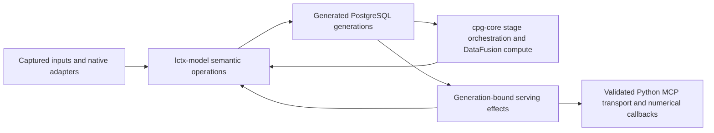

# Semantic-model incremental alignment

**Design / Target review · 2026-10-02**

**Decision: Revise.** Keep the cutover’s architecture and improve its remaining boundaries incrementally. The central model, generated relational contracts, immutable generations, explicit uncertainty and thin Python transport are useful foundations. The principal remaining concerns are semantic preparation inside the persistence service, erased native refusal distinctions, repeated policy bindings, and extension contracts that still depend on knowing several private inventories.

These concerns do not justify another whole-system migration. They have bounded remedies within existing modules and crates. Some remedies alter contracts and identities deliberately; they must retain provenance, uncertainty, exact canonical bytes and independent controls. This assessment does not restart or complete Phase 5 qualification.

## 1. Scope, baseline and evidence

| Field | Scope |
|---|---|
| Subject | Current source across lctx-model, its macros, native extraction/flow, normalized transformations, cpg-core, lctx-analytics, PostgreSQL generations/services, native serving and Python MCP transport |
| Baseline | /home/paul/library-context, main, HEAD e4a66fd0edc46e55770fafc1e91047aa138a359d, plus 116 preserved dirty tracked paths |
| Preservation record | /tmp/lctx-incremental-alignment-baseline_2026-10-02.json records the coordinator’s exact dirty-path hashes |
| Standard | [Core/template 3.2 and code-intelligence profile 1.3](../design_principles/standard.toml); [library-context binding](../design_principles/binding/library-context.md) |
| Tier / purpose | Design / Target |
| Reviewer | Independent delegated design reviewer, integrated by the coordinator; two read-only component mappers and coordinator crosscut inspection |
| Method | Static source, types, current owners and existing receipts; bounded code mapping followed by independent inspection of decisive evidence |
| Outcome sought | A coherent set of incremental improvements after semantic cutover phases 0–5 |
| Excluded execution | New qualification, activation, measurements, implementation and remediation |
| Evidence maturity | Diagnoses below are source-inspected / Implemented observations. Remedies are Proposed. Historical Tested receipts retain their recorded date and boundary. No benefit is Measured |

The functional target includes pinned acquisition and attributed facts; normalized relationships and declared projections; finite behavioral analyses; governed analytics; programmatic synthesis and retrieval; and generation-bound catalog, evidence and native answers.

The selected change scenarios are: adding a fact family or predicate; upgrading an analyzer; adding an analytic or finite authored model; changing a numerical implementation or policy; adding a packet/rendering; changing input membership; and exercising cancellation, budgets, unknowns and isolated transformations. These are credible variation axes of the existing product, rather than hypothetical reasons to introduce frameworks.

The current checkpoint matters. [STATUS](../../../STATUS.md) says qualification was stopped at the operator’s request and serving activation is unqualified. The final Phase 5 NEXTEST_TEST_THREADS=8 PYO3_PYTHON=.venv/bin/python just test-all produced 927 passing workspace Rust tests and two skipped tests, then 228 passing Python tests. Its separate PostgreSQL repetition stopped after 349 passes, eight SIGINT exits, two skipped tests and 27 tests not run; doctests were not run. The complete command therefore did **not** pass. Composite hygiene passed within its recorded tree.

The final-source pinned FastMCP Catalog compilation was interrupted in callable-aspect normalization with staging unselected. Behavioral compilation, final real-library journeys and activation remain not_run. These are qualification limits, not newly inferred source defects, and remain at [Phase 5 plan §10](../../plans/semantic-model-phase5-detailed-plan_2026-10-01.md#10-finding-routes-limits-and-current-state).

This review does not certify every file, every finite model, arbitrary runtime Python behavior, retrieval quality, total RSS, performance or live embeddings. Source coverage followed current owners and adjacent consumers; it did not exhaust every invariant, packet hydrator or provider translation, inspect sealed heldout data, or conduct an end-to-end flow audit.

Decisive inspected-file SHA-256 values, 2026-10-02:

| File | SHA-256 |
|---|---|
| crates/lctx-postgres/src/generations/native_service.rs | f58b79c4a45b96c0fdf38db7a94d35aeb8429ded285c5a56cc07a588a8c2bd58 |
| crates/lctx-model/src/domain/native_requests/evaluate.rs | 94fecef11a58819599e114ba23f8e2328d609293fcec7729575c9271bcad30a2 |
| crates/lctx-model/src/domain/analytics/build.rs | b72edad3d6821c642606306ec3efb516425587fabb548b354ad2371167c7f8ab |
| crates/lctx-model/src/domain/serving/schema.rs | 924ab6802e78315a365cd7c9b479b936625a40585a84f43d2b5253d51cfaec3d |
| crates/cpg-core/src/compilation.rs | 9408e3379ea13b45874d3d930191d1a6d1eb4f3cab4560f48e9344c95b541ab4 |
| justfile | 4d474387e5cc0cea206065c8b404ba81d9c5e3a492d99220f8572d80a6f7e852 |

## 2. Responsibilities and semantic ownership

The direction to preserve is:

This is a responsibility map, not a crate dependency graph or a claim that every implemented boundary already follows it.

| Owner | Responsibility and reason for change | Consumer contract |
|---|---|---|
| lctx-model and macros | Domain distinctions, identity, declarations, semantic operations, invariants and derived representations; changes when meaning changes | Typed records and checked operations; generated schemas/lowerings and shared validators |
| cpg-extract / cpg-flow | Captured analyzer inputs and provider-specific interpretation; changes on analyzer revision or native representation changes | Attributed observations, coverage, spans and explicit uncertainty; no native handles downstream |
| Normalized model modules | Correspondence, ownership, call/event alternatives, effective callable interpretation and projections | Pure transformations over declared typed inputs, charged state and total outcomes |
| cpg-core | Acquisition/stage ordering, completed-input access, compute adaptation and publication | Runs declared operations without independently supplying their meaning |
| Model analysis/synthesis/retrieval modules | Finite proof, analytic conversion, classification, findings, assertions, documents and ranking policy | Model-relative outcomes and evidence closure; heuristic outputs cannot establish behavioral controls |
| lctx-postgres | Generation lifecycle, leases, receipt verification, canonical reads and controlled serving effects | One pinned generation, explicit release/refusal, no transparent replay after uncertain effects |
| Python MCP | Generated tool registration, transport and qualified numerical effects | Closed Rust schemas, original execution grants and bounded final bytes |

### Fact and fidelity table

| Family/result | Provider and revision | Fidelity and coverage | Identity and consumers |
|---|---|---|---|
| Syntax, declarations, signatures and types | Captured pinned Ruff/Pyrefly producer and build revision | Native attributed observations; unavailable/display-only distinctions retained | Qualified provider/context/source identities; normalized correspondence and catalog |
| Flow and places | Pinned ty semantic index through the declared second-parse adapter | Behavioral-only request; Catalog NotRequested is distinct from partial or unavailable | Captured range correspondence and typed places; Entry, Local and finite composition |
| Normalized entities/calls/bindings | Model-owned normalization policy | Derived correspondence; ambiguous/unresolved alternatives retain premises | Nominal entity, event and relationship identities; projections, catalog and analysis |
| Graph topology | Declared projection and canonical stored snapshot | Exact over its declared universe and call policy, with source assessment | Semantic IDs remain separate from graph indices; structural and SCC consumers |
| Behavioral conclusions | Selected model/catalog and finite operation definitions | Five verdicts; explicit incomplete evidence, modality and proof limits | Nominal invocation, qualification and proof membership; synthesis and native requests |
| Analytic conclusions | Selected method, projection and source-bound definition | Heuristic ranking/community/neighbor outputs; exact bounded concept operations under context | Run-local partitions and typed source links; navigation and qualified synthesis |
| Assertions/documents/retrieval | Model-owned deterministic construction | Evidence status, omissions and original sources remain explicit | One generation’s nominal closure; serving packets, resources and ranking |

The central declaration authority is substantive. Derive code generates keys, codecs and schemas from declared fields; semantic validators remain ordinary owned functions ([model macros:303](../../../crates/lctx-model-macros/src/lib.rs#L303), lines 303–345 and 421–500). ValidatedModel validates references and hashes owned semantics and declarations ([model.rs:109](../../../crates/lctx-model/src/domain/model.rs#L109), lines 109–176). Record identity and payload digest remain different concepts.

Fact-family declaration, scheduled provider coverage and frontier membership are also distinct, and centrally joined by admission ([admission.rs:304](../../../crates/lctx-model/src/domain/admission.rs#L304), lines 304–350 and 473–529; [stages.rs:657](../../../crates/lctx-model/src/domain/stages.rs#L657)). There is no demonstrated need for another invariant or capability registry.

## 3. Contracts and isolated testing

Several boundaries already support local reasoning:

- ProviderStage is a small declaration/run contract. StageContext bounds transfer and restricts typed output construction ([bundle.rs:82](../../../crates/cpg-extract/src/bundle.rs#L82), lines 82–107 and 132–183).
- Normalization inventories feed model operations, validators and effectful drivers ([inventory.rs:1](../../../crates/lctx-model/src/domain/normalized/inventory.rs#L1); [normalize/mod.rs:31](../../../crates/cpg-core/src/normalize/mod.rs#L31)).
- Rows validates construction, rejects conflicting payloads under one identity and charges retained state ([rows.rs:17](../../../crates/lctx-model/src/domain/normalized/rows.rs#L17)).
- Stored graph preparation verifies completed sources and budget ownership; consumers borrow graphs under their own stage access ([analysis_graphs.rs:93](../../../crates/cpg-core/src/analysis_graphs.rs#L93), lines 93–235).
- Generation registration, poisoning, publication and leased reads have identifiable enforcement points. Cancellation during completion cannot authorize replay of the same uncertain transition ([lifecycle.rs:109](../../../crates/lctx-postgres/src/generations/lifecycle.rs#L109), lines 109–154, 564–615 and 711–736).
- Serving retains the actual worker/query grant after caller cancellation and drains it before original guard release ([runtime.rs:50](../../../crates/lctx-postgres/src/generations/runtime.rs#L50), lines 50–60, 167–184 and 227–293).
- Synthesis uses one kind/status policy and canonical support closure; text does not become semantic input ([assertions.rs](../../../crates/lctx-model/src/domain/synthesis/assertions.rs); [policy.rs](../../../crates/lctx-model/src/domain/analysis/policy.rs)).

The principal testing-boundary exception is native preparation, discussed in F02. Existing model-native functions can be tested locally, but their generation-to-prepared-context composition contains semantic decisions in the PostgreSQL service. Testing that composition currently entails persistence/service setup.

Shared replay validators are valuable enforcement, but agreement with replay is not independent evidence of semantic correctness. Preserve the source-written controls, native fixtures, damaged-generation controls and CPython oracle when changing any of these boundaries.

## 4. Composition and analysis contracts

| Stage/question | Projection, method and interpretation | Limits, publication and evidence |
|---|---|---|
| Normalization | Provider-local correspondence and declared relationship semantics; pure typed transformations | Charged inventories; explicit unresolved/ambiguous outcomes; shared closure validation |
| Stored projections | Declared node/arc roles, direction, multiplicity and call policy | Canonical snapshots and source assessments; local indices remain temporary |
| Structural analysis | Named callable/definition topology plus source/binding evidence; exact under declared scope | Explicit traversal limits and witnesses; incomplete dispatch is retained |
| Local/execution/models/Summary | Entry and binding admission, phase-specific operations, finite models and SCC proof semantics | Separate depth/proof/work/member bounds; unsupported substitution and incomplete premises remain uncertainty |
| Analytics | Directed weighted ranking, declared undirected community layers, bounded concepts and neighbors | Recorded outcomes, seeds and diagnostics; heuristic conclusions remain restricted |
| Synthesis | Completed nominal parents, qualified typed conclusions and deterministic templates | Missing outcomes produce explicit omissions; canonical bytes and exact support retain provenance |
| Retrieval | Complete family corpus, explicit eligibility, lexical/vector channels and model-owned fusion | Numerical callbacks produce scores; Rust owns semantic eligibility, identity and ranking |
| Serving | One admitted generation and original guard; canonical typed hydration | Preparation/request memory, CPU/query admission, cumulative deadlines and final byte admission |

The library placement is largely appropriate. DataFusion serves relational compute, petgraph topology supports named graph consumers, Leiden remains a qualified numerical mechanism, and Python BM25S supplies arithmetic over Rust-owned corpus and tokens. Behavioral proof is not replaced by graph reachability.

The concern is how future changes are bound to these operations, rather than wholesale mechanism selection.

## 5. Change scenarios

| Scenario and kind | Existing route | Assessment |
|---|---|---|
| Add a fact family — domain concept | Typed relation/support declaration, append-only family, provider coverage, frontier and consuming normalization | Central admission catches several omissions. A new semantic invariant still needs its owning declaration and independent challenge; generated shape alone cannot prove it |
| Upgrade analyzer — mechanism | Native adapter, build/revision identity and attributed observation contracts | Appropriate locality. Requalify changed native meanings rather than assuming interface compatibility |
| Add selection predicate — domain concept | Model vocabulary, classification/algebra and wire schema | Semantic owner is appropriate; discovery of existing numeric alternatives needs F07 |
| Change analytic policy — policy | Definition/parameters plus numerical/concept kernels | Repeated executable binding creates F03 |
| Add analytic/workflow — composition | Model method/output contracts and cpg-core stage orchestration | Finite scope is appropriate; dispatch/preparation phase knowledge is repeated, F04 |
| Add relation/invariant dependency — contract | Stage-specific predecessor closure builders | Repeated closure mechanics require cross-owner knowledge, F05 |
| Add native preparation case — domain concept | Existing Entry/native operations plus PostgreSQL preparation | Semantic matching and indexing are coupled to storage, F02; refusal distinctions are lost, F01 |
| Substitute numerical implementation — mechanism | Explicit complete numerical scores and Rust-owned corpus/fusion | Viable seam; preserve complete zero scores, eligibility and finite validation. No general provider framework is needed |
| Add packet/rendering — representation | Model DTO/schema plus canonical hydrator and mapping metadata | Intentional multiple layers, not automatically duplicate authority. Maintain exact canonical originals and support; no concrete mapping omission was established |
| Change input membership — instance/revision | Captured manifests, context and conservative production/model fingerprints | Safety is strong. Broad invalidation is a possible future optimization, not an identity collision found here |
| Cancellation, budget or unknown — failure | Poisoned attempts, retained workers, typed outcomes and explicit uncertainty | Preserve existing guarantees; native reason propagation needs F01 |
| Isolated transformation — testing | Pure typed model functions and charged fixtures | Strong for normalization/analysis; native prepared composition should gain the same boundary through F02 |

## 6. Correctness and fidelity gates

These verdicts concern the inspected design, not completed release qualification.

| Gate | Verdict | Evidence and limit |
|---|---|---|
| G1 Authority | **fail** | Native semantic preparation lives outside the declared semantic owner; analytic policy has repeated executable definitions, F02/F03 |
| G2 Semantic fidelity | **fail, narrow** | Native refusal reasons are erased and replaced with a different generic reason, F01. No broader type/relationship loss was established |
| G3 Validity | **pass, static inspected scope** | Declared model invariants, construction conflicts, admission and stored replay provide identifiable enforcement |
| G4 Hidden behavior | **pass, scoped** | Captured inputs, provider/build identity and ambient refusal inspected; operational telemetry is separate from semantic records |
| G5 Consistency/recovery | **pass, static inspected scope** | Attempt poisoning, publication, original leases and retained serving work are explicit. Full real-library activation qualification remains outside this decision |
| G6 Transformation/reuse | **pass for current inspected contracts; extension needs revision** | Source-bound receipts, nominal parents and prepared graphs preserve reuse meaning; F05 concerns duplicated extension mechanics, not an observed invalid current reuse |
| G7 Truthful capability claims | **pass at stated maturity** | STATUS distinguishes implemented/scoped receipts from interrupted Q0, not_run journeys and inactive serving. F08 repairs discoverability of that state |
| G8 Library leverage | **pass, scoped** | Established engines are used at suitable boundaries; specialized semantics justify owned operations. No source evidence warrants another framework or store |
| CI-G1 Fidelity | **fail, narrow reason propagation** | F01 misstates the cause of native uncertainty. This review found no heuristic promoted to a behavioral fact or empty incomplete answer promoted to absence |
| CI-G2 Evidence closure | **pass, static inspected scope** | Canonical source/qualification/support, receipt-bound reads and native actual-row membership checks are retained |
| CI-G3 Evaluation integrity | **pass, inspected paths** | Gold remains separate from compiler/model inputs; independent controls and oracle expectations remain preserved. No parameter tuning or reference leakage was established |

## 7. Findings

### F01 — Native uncertainty loses its authoritative cause

**Priority: High.** Principles: FP-04/FP-05, DP-02/DP-21, CI-02/CI-04; A2, G2, CI-G1.

NativeInventory::context and NativeContext::from_entry distinguish MissingEvidence, DefaultStabilityUnknown and IncompatibleContexts ([inventory.rs:79](../../../crates/lctx-model/src/domain/native_requests/inventory.rs#L79); [ingress.rs:37](../../../crates/lctx-model/src/domain/native_requests/ingress.rs#L37), lines 37–93). Native preparation discards these results through Err(_) => ContextState::Unexamined(entry) ([native_service.rs:276](../../../crates/lctx-postgres/src/generations/native_service.rs#L276), lines 276–278, 331–333 and 425–427). native_requests::unexamined then supplies EntryValueUnknown ([evaluate.rs:14](../../../crates/lctx-model/src/domain/native_requests/evaluate.rs#L14), lines 14–55).

The verdict remains conservatively Unknown, but the reported cause is no longer the cause established by the owning operation. A user cannot distinguish missing premises from an unsupported default-stability proof or incompatible context. Extensions can add precise refusals that disappear at the same boundary.

**Correction — Proposed:** retain the exact typed context refusal with the unexamined entry and pass it through the model-owned unexamined assessment. Preserve the original path, proof, qualification and Unknown verdict. Do not admit scalar assignments or strengthen conclusions because a reason is now more precise.

**Closure:** independently constructed cases for each reachable refusal must retain its exact code through native packet/transport; the admitted twin must preserve current behavior. This can be corrected before the larger F02 extraction.

**Disposition:** required correction; execution status remains here until an active plan adopts this ID. It does not automatically reopen stopped Q0.

### F02 — Native prepared semantics are entangled with persistence

**Priority: High.** Principles: FP-01/FP-03/FP-04/FP-06, DP-08/DP-17/DP-18; A1–A3, G1.

The PostgreSQL native service does more than acquire verified rows. It matches reads and guard operands by structural occurrence/range, selects owners/formals, constructs context indexes and decides which local/guard/summary paths populate them ([native_service.rs:130](../../../crates/lctx-postgres/src/generations/native_service.rs#L130), lines 130–190 and 265–480). Request-time code also reconstructs the permitted formal universe from catalog/callable/slot/link rows ([native_service.rs:820](../../../crates/lctx-postgres/src/generations/native_service.rs#L820), lines 820–878).

Many individual proof operations correctly delegate to lctx-model. Their composition nevertheless establishes domain meaning in the persistence service. Adding a native path family or changing occurrence correspondence requires understanding leases and generation preparation to modify or independently test a semantic transformation.

**Correction — Proposed:** introduce an ordinary model-owned prepared-native construction operation over typed, explicitly admitted inputs. It should consume the required inventory, checked proof operations and budget, and produce contexts, paths, exact refusals and the permitted formal domain. PostgreSQL retains receipt validation, epoch reads, original guard ownership, reservations and publication/transport effects. No new crate or general executor framework is required.

The important alternative is to leave small presentation-only joins in the service while moving only decisions that establish native applicability, correspondence or path meaning. This is preferable to mechanically relocating the entire service.

**Preserve:** opaque Entry/native/rebase constructors; actual stored-row membership checks; no fabricated stored citations for private continuation witnesses; original condition identity; five verdicts; unsupported heap/runtime limits; original guard and cancellation retention.

**Closure:** a bounded typed fixture can construct and challenge native preparation without PostgreSQL, including crossed context/formal, ambiguous occurrence and unsupported-default cases. Actual store/transport controls must still challenge receipt/lease integration.

**Disposition:** required boundary correction. F01 is a prerequisite meaning that the new result must preserve, not a reason to delay its small repair.

### F03 — Analytic policy records and executable bindings require coordinated edits

**Priority: Medium.** Principles: FP-02/FP-04, DP-01/DP-06/DP-08/DP-24; A1/A2, G1.

Analytic definition construction records method parameters and a recipe ([build.rs:61](../../../crates/lctx-model/src/domain/analytics/build.rs#L61), lines 61–95). Execution separately selects ranking::Parameters::retained(MAX_WORK) ([build.rs:336](../../../crates/lctx-model/src/domain/analytics/build.rs#L336)), whose damping, tolerance and iteration defaults are independently defined ([ranking.rs:25](../../../crates/lctx-model/src/domain/analytics/ranking.rs#L25)). Community grid/seeds/iterations are authored inside its kernel ([communities.rs:127](../../../crates/lctx-model/src/domain/analytics/communities.rs#L127), lines 127–145); concept support/work settings are supplied separately ([attributes.rs:692](../../../crates/lctx-model/src/domain/analytics/attributes.rs#L692)).

Current source digests and recipe text identify the implemented behavior. This is **not** evidence of an existing identity collision, nor proof that the summary fields falsely claim a single community run. The architectural consequence is policy change propagation: changing a retained numerical policy needs coordinated edits to records, binding and executable defaults.

**Correction — Proposed:** make a small owned policy/binding construct supply both persisted parameter/profile records and actual kernel arguments. Keep algorithm mechanics separate. A structured community profile may represent the grid while retaining run-specific observations; it should not flatten forty runs into one seed/resolution.

**Alternative:** retain fixed policies but have their constructors supply the records and executable settings together. User-configurable algorithms are not required.

**Closure:** inspect one policy change and show it changes execution settings and declared identity from one authored definition; retain numerical known answers, convergence/limit distinctions and heuristic restrictions.

**Disposition:** required before the next analytic-policy change; eligible for an independent incremental package now.

### F04 — Upper compilation repeats workflow membership in string dispatch

**Priority: Medium.** Principles: FP-03/FP-05/FP-06, DP-06/DP-16/DP-17; A1/A3.

Upper compilation separately knows the Catalog-phase stage-name list, the graph-preparation consumer list and the large stage-name execution match ([compilation.rs:381](../../../crates/cpg-core/src/compilation.rs#L381), lines 381–415 and 426–610). Stage declarations already define dependencies and identities. An additional analytic/workflow must update these private lists consistently; adding its declaration alone is insufficient.

The normalized driver provides a proportionate precedent: a finite Normalization value owns its declaration and runner ([pipeline.rs:18](../../../crates/cpg-core/src/normalize/pipeline.rs#L18), lines 18–76).

**Correction — Proposed:** use a finite upper-stage binding that supplies declaration, runner, publication phase and required prepared capabilities together. Keep the semantic dependency schedule authoritative and hard-layer checkpoints explicit. This is a closed orchestration binding, not a plugin registry.

**Closure:** a source-traced additional stage has one route binding and is scheduled/executed exactly once in its intended phase. Missing bindings refuse explicitly; graph preparation remains source/budget-bound and shared.

**Disposition:** required extension correction; independent of F03.

### F05 — Predecessor closure mechanics are independently reconstructed

**Priority: Medium.** Principles: FP-03/FP-05/FP-06, DP-06/DP-08/DP-16; A1/A3.

C1, selection, analytics and synthesis independently traverse model references/invariant inputs, decide which facts or vocabulary require completed-store closure, and assign epochs/deduplicate; several also reject owner-output dependencies ([C1 build.rs:1055](../../../crates/lctx-model/src/domain/catalog/evidence/build.rs#L1055), lines 1055–1095; [selection build.rs:633](../../../crates/lctx-model/src/domain/selection/build.rs#L633), lines 633–678; [analytics build.rs:650](../../../crates/lctx-model/src/domain/analytics/build.rs#L650), lines 650–740; [synthesis production.rs:104](../../../crates/lctx-model/src/domain/synthesis/production.rs#L104), lines 104–158).

Different owners legitimately have different output sets and vocabulary epochs. The repeated mechanism nonetheless forces a change to closure semantics to be understood and applied across several builders. Name-only deduplication and stage-specific epoch assignment also demand hidden knowledge when a new consumer needs more than one epoch of the same nominal relation.

**Correction — Proposed:** extract a small model-owned closure builder parameterized by the legitimate differences: owned outputs, allowed lower-layer sources and explicit vocabulary epochs. Preserve (relation, epoch) distinctions rather than generalizing them away. Stage owners continue to author what they consume and which epoch is valid.

**Alternative:** first share only relation/reference/invariant traversal and retain owner policy locally. This is safer if a complete helper would obscure important differences.

**Closure:** inspect existing declarations for equivalence and challenge an added invariant dependency, an own-output cycle and a legitimate two-epoch input. Existing source-bound read and grouping-order controls must remain intact.

**Disposition:** required before expanding mixed-epoch/dependency behavior; a bounded extraction is worthwhile now. This finding does not assert a current failed read.

### F06 — The complete test recipe repeats the same PostgreSQL-owning tests

**Priority: Medium.** Principles: FP-03/FP-06, DP-16/DP-23.

just test-all runs check, whose Rust test command is release-profile workspace Nextest. It then runs test-postgres, which repeats the same four workspace packages under the same default profile, INSTA_UPDATE=no, and no distinct test feature/environment ([justfile:21](../../../justfile#L21), lines 21–25, 73–74 and 216–220; [.config/nextest.toml](../../../.config/nextest.toml)). The latter recipe additionally owns an image prerequisite and CLI build.

The repeated execution does not establish a different integration configuration. It lengthens the complete gate and presents repeated coverage as a separate qualification phase. The stopped Phase 5 receipt demonstrates the practical boundary, but establishes no measured speedup from changing it.

**Correction — Proposed:** retain the useful standalone PostgreSQL command and its prerequisite/build operations, while executing each intended test set once in the integrated gate. Put image readiness before tests that need it. If a repeated run is deliberately retained as a stability challenge, name that distinct purpose and conditions.

**Preserve:** real disposable PostgreSQL tests, oracle independence, compile-fail/doc contracts, strict snapshots and existing failure receipts.

**Closure:** recipe inspection and one later authorized complete-gate receipt show identical intended coverage without accidental duplication. No qualification run is authorized by this review.

**Disposition:** independent tooling improvement; does not close Q0 or any product finding.

### F07 — Generated discovery schemas omit the meanings of numeric alternatives

**Priority: Medium.** Principles: FP-02/FP-06, DP-02/DP-24; A1.

The model retains code labels, but [serving/schema.rs:33](../../../crates/lctx-model/src/domain/serving/schema.rs#L33) emits only integer enum values. Python tool registration supplies a generic name-based description ([wire.py:213](../../../python/lctx_mcp/src/lctx_mcp/wire.py#L213)); the finite route inventory names the request/response types ([dispatch.rs:90](../../../crates/lctx-model/src/domain/serving/dispatch.rs#L90)). Server instructions explain evidence philosophy, not which numeric Mode, Quantifier or EvidenceBasis value expresses the caller’s intent ([vocabulary.rs:19](../../../crates/lctx-model/src/domain/selection/vocabulary.rs#L19), lines 19–36 and 84–89; [server.py:15](../../../python/lctx_mcp/src/lctx_mcp/server.py#L15)).

An agent can obtain a schema-valid choice while lacking the meaning needed to choose correctly. Correct invocation therefore depends on out-of-band implementation knowledge, contrary to the product’s feature-discovery and correct-use target.

**Correction — Proposed:** derive labeled schema alternatives from the existing codebook authority, preserving numeric values and append-only codes. Add concise operation/field semantics at the model-owned route/DTO boundary and consume them in registration. oneOf alternatives with const and authoritative titles/descriptions are one viable representation; a documented extension annotation is another if the pinned client treats it better.

**Preserve:** numeric serialization, exact decode and existing closed schemas. Annotation changes affect wire identity, and source changes may affect model identity; plan the intentional contract migration and appropriate requalification rather than pretending they are free.

**Closure:** an inspected generated declaration teaches the meaning of each decision-relevant code without consulting Rust/Python internals; existing numeric wire controls remain valid. No additional documentation registry is needed.

**Disposition:** required discovery-contract improvement before expanding the tool vocabulary.

### F08 — Current navigation and binding prose describe retired boundaries

**Priority: Low.** Principles: FP-06, DP-21/DP-22/DP-24.

The [architecture map](../../design/README.md) still describes Phase 5 as proposed/reconstruction-awaited while newer §15.12, accepted [ADR-0114](../../adr/0114-generation-serving-contracts.md) and current source describe implemented serving pending qualification. The [binding](../design_principles/binding/library-context.md) retains dormant cpg-schema/returning-normalization descriptions, and product-target prose uses future tense for implemented flows ([api-and-evidence-product.md:91](../../design/sections/api-and-evidence-product.md#section-14-3), lines 91–105). These are stale navigation/authority descriptions, not evidence of active serving.

**Correction — Proposed:** reconcile the existing map, binding and product owner with current executable owners and STATUS. Describe implemented contracts separately from the explicitly stopped qualification and unavailable activation. Update the owner rather than adding another progress document; accepted ADRs remain immutable.

**Closure:** owner-to-decision-to-open-work navigation reaches the current component and single disposition owner without conflicting implementation labels.

**Disposition:** low-priority documentation correction, independent of qualification. Do not change interrupted/not_run outcomes to passed.

## 8. Library fit and proportionality

Pinned library skills were consulted as offline capability context; [current pins](../../pins.md) include DataFusion 55.1.0, Arrow 59.3.0, petgraph 0.8.3, Leiden 0.8.1 and SQLx 0.9.0. This review proposes no dependency upgrade and makes no fresh library runtime qualification claim.

| Capability | Decision |
|---|---|
| Relational compute | Retain DataFusion and generated typed relations. The findings do not justify moving semantic algorithms into generic SQL merely because it is available |
| Topology/SCC | Retain petgraph and branded stored projections. Preserve universe, multiplicity and deterministic semantic-ID mapping |
| Numerical communities | Retain qualified Leiden integration; improve policy binding rather than inventing another algorithm |
| Ranking | The owned weighted kernel has explicit canonical accumulation, dangling mass, limits and residuals. A library substitution is viable only if it preserves those obligations |
| Generation effects | Retain SQLx, explicit transactions and original lease protocol. No second store or generic recovery framework is justified |
| Numerical retrieval | Retain the coarse Python arithmetic seam with complete scores and Rust-owned semantics |
| Shared closure/preparation | Prefer ordinary functions and existing typed structures. New crates, registries or services would add burden without addressing the diagnosed causes |

The simplest viable architecture remains the current cutover with these seams corrected. A general plugin/workflow framework would increase lifecycle and configuration work. A wholesale model split would endanger useful shared authority. Directly relocating every service line into the model would also be excessive: only domain decisions and pure construction belong there.

## 9. Further worthwhile increments and revisit triggers

These are opportunities rather than additional demonstrated violations.

1. **CPU execution and observability.** Some analytic/structural/Summary transformations run synchronously within async stage code ([analytic.rs:141](../../../crates/cpg-core/src/analytic.rs#L141); [structural.rs:174](../../../crates/cpg-core/src/structural.rs#L174); [semantic_summaries.rs:94](../../../crates/cpg-core/src/semantic_summaries.rs#L94)), while other adapters use spawn_blocking. Before adding a long-running kernel, settle its execution/cancellation contract and retained ownership. Moving work to a blocking thread alone does not make it cancellable. A later bounded control should distinguish caller responsiveness, cooperative stopping and actual worker drainage.
2. **Preparation reuse inside synthesis.** synthesis::production::Data::visit fans a batch into several sub-inventories ([production.rs:35](../../../crates/lctx-model/src/domain/synthesis/production.rs#L35)). A focused inspection can identify common immutable rows worth decoding/preparing once. Share only proven common inputs; retain each operation’s declared dependency and validation scope. Any memory or speed claim needs later measurement.
3. **Packet dependency discoverability.** Packet mapping metadata and actual hydrators are separate representations. No concrete missing source was established. On the next packet addition, consider a typed output binding or focused consistency control if it reduces a demonstrated omission risk; do not introduce a projection language.
4. **Conservative invalidation.** Whole-owner model and broad producer source fingerprints are fail-closed safety choices ([model build.rs](../../../crates/lctx-model/build.rs); [producer_fingerprint.rs](../../../scripts/producer_fingerprint.rs)). If repeated unrelated edits make rebuilds materially expensive, separate revision scopes only after defining complete dependencies and equivalence. Preserve unused-sibling/input-membership invalidation; no current collision was found.
5. **Safe diagnostic metadata.** The bridge already exposes a stable coarse StorageError.kind, and its text preserves that category ([serving.rs:21](../../../python/lctx_storage/src/serving.rs#L21)). Structured public refusal metadata may help programmatic clients later. This is not grounds to expose SQL/configuration details or claim that the category is currently absent.
6. **Next domain extensions.** A new fact family, finite model or predicate should use the existing typed owner and independent controls. General heap identity, broad scalar/type proofs and multi-variant Summary qualification remain separately triggered work, not implied prerequisites for these refactors.

These opportunities broaden the improvement set across responsiveness, preparation, discoverability, identity and diagnostics without converting every unexamined area into a defect.

## 10. Verification and uncertainties

| Claim | Evidence and outcome |
|---|---|
| Central declarations, generated lowerings and lifecycle owners exist | **Implemented / static inspected**, 2026-10-02 |
| F01 reason erasure and F02 misplaced semantic composition | **Implemented / static inspected**, cited constructors and consuming branches |
| F03–F05 extension propagation | **Implemented / static inspected**, declaration, kernel and orchestration/closure consumers |
| F06 duplicated test configuration | **Implemented / static inspected**, recipes and default Nextest configuration |
| F07 schema discoverability limitation | **Interface-checked**, generated schema construction and transport registration inspected |
| Phase 5 current functional receipt | Historical partial/composite receipt, 2026-10-02; complete just test-all **interrupted**, not passed |
| Real-library serving/activation | **not_run**, operator stopped qualification |
| Remediation correctness/performance | **not_run**; remedies remain Proposed |
| Retrieval quality, live embeddings, speed and total RSS | **unresolved / unmeasured** within this review |

Suitable later checks are attached to each finding. None requires a new evidence folder merely because this is a review. New probes should settle a material premise, and implementation acceptance should follow the repository’s targeted-then-integrated timing.

A new native prepared operation must be challenged with legitimate unsupported/default cases so it does not reject valid admitted paths, fabricate proof, or turn unknown into absence. A shared dependency closure must preserve legitimate multiple epochs. Policy unification must preserve community grids and run-specific diagnostics. Discovery annotations must preserve the numeric protocol.

## 11. Authority, disposition and ordering

This review is a dated assessment, not a competing execution ledger. Until an implementation plan adopts these findings, their status is **open in this review**. A later plan should reference stable IDs and become the single current disposition owner.

Existing cutover findings keep their original identities and disposition at [parent cutover §8](../../plans/semantic-model-cutover-plan_2026-09-29.md#8-findings-disposition) and [Phase 5 plan §10](../../plans/semantic-model-phase5-detailed-plan_2026-10-01.md#10-finding-routes-limits-and-current-state). In particular, semantic-data-model F10 (serving authority) and F05 (served condition remainder) remain at those owners; this review supplies relevant new evidence rather than replacing their status. F02 is a new scoped diagnosis of current native preparation; it does not silently reopen every earlier serving-authority finding or close them by implication. The previous assembled Phase 5 review’s F01/F02 remain closed within their recorded codec/assertion boundaries.

Changes to enduring boundaries or policy decisions use the ADR route and amend the owning architectural section. Pure orchestration/closure extractions within accepted meaning may need only owner clarification and validation. F07’s wire/model identity consequences must be explicit. Model-source changes can also intentionally rotate the captured semantic contract for F01–F05; preserve the hard cutover and plan regenerated stores/projections against the final accepted tree. There is no old-format compatibility obligation.

Consequence-based priority and prerequisite order differ. This is a recommendation for subsequent authorized work, not a restart instruction:

| Window | Work | Relationship |
|---|---|---|
| Before broader native qualification | F01 exact refusal propagation, then F02 pure native preparation | F01 is a small independent correction; its preserved result meaning constrains F02. F02 separates semantic construction from receipt/lease effects |
| Before agent-facing MCP journeys | F07 discovery semantics | Preserve numeric values and explicit wire/model identity changes |
| Before the next integrated gate | F06 gate composition | Improve execution while retaining every intended control |
| Alongside unaffected validation or feature work | F03 analytic policy; F04 finite stage binding; F05 closure mechanics | Correct before corresponding policy/workflow/mixed-epoch extensions. Distinct causes, not one framework; F03/F05 share analytics/build.rs and require coordinated ownership |
| Independent documentation work | F08 current-owner reconciliation | No product qualification required to reconcile implementation labels |
| Triggered exploration | Section 9 opportunities | Activate on a real consumer or unresolved cost/behavior question |

No correction needs compatibility readers, legacy IDs, dual stores or weakened independent controls. Parallel validation here means validation unaffected by those edits; final product acceptance must use the integrated tree. Product feature scheduling remains subject to the existing PR6/qualified-serving boundary.

## 12. Architectural judgments and decision

| Judgment | Verdict | Reason |
|---|---|---|
| A1 Localize change | **violated** | Native preparation requires persistence context; analytic policy, stage membership and closure mechanics require coordinated private edits; tool choices require hidden codebook knowledge |
| A2 Encode domain meaning explicitly | **violated, bounded** | The core model is substantial, but native reason erasure and semantic composition outside its owner leave supported meanings insufficiently governed |
| A3 Extend through composition | **violated, bounded** | Existing pure primitives compose well; upper-stage routing and repeated dependency construction still encode workflow knowledge independently |

Foundations FP-01–FP-06 are supported across much of the inspected system, but each has concrete remaining violations in the findings. Relevant supporting-rule judgments are therefore mixed: identity, provenance, declared projections, lifecycle and evidence closure are satisfied within inspected scope; semantic reason propagation, policy authority, discoverable contracts and extension locality need revision.

**Bounded decision: Revise.** The architecture should evolve through the findings above, retaining its current foundation. F01/F02/F03 are domain/authority corrections; F04/F05/F07 remove specific barriers to extensions and correct use. F06/F08 are worthwhile independent improvements. The additional triggered opportunities do not independently prevent acceptance.

**Enclosing architecture: needs bounded revision at Implemented maturity.** It is not rejected and does not require a wholesale overhaul. This review supplies no complete Phase 5 release qualification, real-library acceptance or operator activation claim. The qualification stop remains in force. The next design step is a dependency-ordered remediation plan for these bounded findings, owned by the coordinator and affected components.
