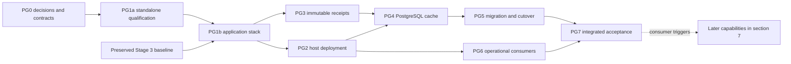

# Plan: PostgreSQL deployment and integration

**Status: PG0–PG7 implemented, deployed and accepted 2026-09-27; F1–F10 conditional.** The operator
requested this distinct plan and coordination with the behavioral-model forward plan. This
document owns PostgreSQL work packages, deployment, verification and later capability adoption.
The [forward plan](behavioral-model-forward-plan_2026-09-24.md#postgresql-workstream) owns
cross-workstream sequencing; its [§6 PostgreSQL table](behavioral-model-forward-plan_2026-09-24.md#postgresql-findings)
is the single current disposition owner for the six source-review findings. Stage 3–5 semantic
work remains in that plan. The operator has authorized implementation of PG0–PG7. F1–F10 retain their explicit consumer
triggers; authorization does not establish a missing trigger or runtime qualification.

Architecture: [accepted ADR-0065](../adr/0065-postgresql-services-and-vector-receipts.md),
[storage §6.5](../design/sections/storage-and-publication.md#section-6-5),
[serving §11.4](../design/sections/synthesis-and-serving.md#section-11-4).
Evidence: [storage review](../design_review/reviews/design_review_postgresql-storage_2026-09-27.md)
(**PGS/F01–F04**) and [stack review](../design_review/reviews/design_review_postgresql-stack_2026-09-27.md)
(**PGK/F01–F02**). Those qualified IDs keep their original source meaning.

## 1. Outcome, scope and baseline

Deploy one application database in the installed PostgreSQL 18 cluster and integrate it through
SQLx. The first production scope is the shared embedding cache, an operational compile-attempt
journal, and reconciled snapshot/generation discovery through explicit CLI consumers. Preserve
Delta publication and immutable file serving. Later operator review, indexed serving, dynamic
query composition and server extensions have concrete entry/exit conditions in §7.

| Scope | Implementation target | Boundary |
|---|---|---|
| Compile-time embeddings | PostgreSQL admits/reuses immutable winners; Delta captures every consumed value | Includes E0/kNN, operation views and brief documents; no change to the embedding model or ranking specification |
| Compilation operations | `lctx runs list/show` exposes attempts, stage observations and failure/interruption state | Operational history, not semantic facts or a second publication authority |
| Publication discovery | `lctx snapshots/generations list/show` and explicit reconciliation index existing published outputs | Rows can be reconstructed from Delta/manifests; readers still pin a selected snapshot/generation |
| Deployment and development | Local PG18 database/roles, migrations, offline Rust builds, disposable tests, resource limits, observability and recovery | Reuse the installed cluster; no second host cluster or production container by default |
| Planned capabilities | Manual review events, read-only SQL projections, relational and ranked search, richer query ASTs | Implement only with their consumers, architecture changes and semantic/operational qualification |
| Unchanged computation | Arrow/DataFusion, analytic kernels, extraction, native semantics and programmatic synthesis | No automatic canonical-store, query-engine, ontology or ORM migration |

**Pre-integration baseline, source-inspected 2026-09-27 at `7c08c69`:**
`cpg-core::embed::fill_cache` already shares token admission, insert-only Delta merge and
committed readback between both embedding routes. `attempt.rs` records the global cache
version; `bundle.rs` reads that version. W9 remains the owner of its outstanding live checks.
Current bundle FORMAT is 10. A cache migration is a reproducibility change, not a repair of
the already-corrected local-vector race. No PostgreSQL application dependency existed at that baseline. Current implementation uses SQLx and snapshot-local vector receipts.

**Host evidence from the reviews, 2026-09-27:** installed client/development version 18.6;
`18/main` online on port 5432; `16/main` down on 5433; Docker daemon accessible. Login as the
default `paul` database role failed because the role is absent, and passwordless postgres-admin
access was unavailable. The operator subsequently provisioned the dedicated database/roles through the reviewed bootstrap; HBA remained unchanged. `pg_trgm`/`pg_stat_statements` control files were present; the deployed service now reports 180006 and only `plpgsql` enabled. Current configuration and recovery receipts are in the linked qualification evidence.

## 2. Stack and feature policy

The initial SQLx/Testcontainers graph is resolved and compiled (2026-09-27); exact pins are in
[the pins page](../pins.md#postgresql-services-adr-0065-verified-2026-09-27). Later library rows
remain candidates. Runtime qualification is recorded below, separately from dependency selection.

| Layer | Initial selection | Later scope and constraint |
|---|---|---|
| SQLx 0.9.0 | `default-features=false`; `postgres`, `runtime-tokio`, `macros`, `migrate`, one Rustls feature | Owns PostgreSQL driver, pool, transactions, checked/runtime queries and migrations; no parallel driver/pool/migrator |
| Tokio 1.53.1 | Existing workspace dependency | Reuse application runtime; bounded tasks, no per-operation runtime |
| Rustls via SQLx | Selected `tls-rustls-ring-native-roots`; remote TLS runtime qualification remains conditional | Local Unix socket needs no TLS; remote connections require explicit trust and hostname verification |
| sqlx-cli | Pin alongside SQLx for query metadata work; development tool only | `cargo sqlx prepare --workspace` / `--check`; normal builds force `SQLX_OFFLINE=true` |
| testcontainers-modules 0.15.0 | `postgres`, default features disabled; its Testcontainers 0.27.x reexport | Explicit PG18 patch/digest, allocated ports and readiness SQL; do not independently add core 0.28 |
| SeaQuery 1.0.2 + sea-query-sqlx 0.9.1 | Deferred until a substantive dynamic SQL consumer | Use the driver's binder; simple filters may use fixed SQL or SQLx QueryBuilder |
| pgvector Rust 0.4.2 | Deferred; later use `sqlx` feature | Separate server extension pin/deployment; exact-key caching does not need it |
| Psycopg 3 + psycopg_pool | Deferred until direct Python database access | Async pool scoped to FastMCP lifespan if selected; one schema/migration owner; Python 3.14 qualification |
| SQLAlchemy | Deferred until a Python-owned relational application needs Core/ORM composition | Psycopg dialect; choose one pool owner, no independent Alembic history over Rust-owned schema |
| ADBC / DataFusion PostgreSQL provider | Deferred for bulk Arrow transport or federation | Must satisfy one Arrow 59.3 / DataFusion 55.1 family and semantic conversion/read-consistency tests |
| pgrx / cargo-pgrx | Deferred server-extension experiment | Separate extension package, matching versions, PG18 target; no extension dependency in application kernels |
| Cornucopia / Rust-Postgres family | Documented alternative, not an additional installed family | Reopen for a PG-owned query catalog or typed COPY advantage; correct PGK/F01/F02 first |

Do not enable every type/backend feature. Bind semantic IDs as existing fixed-length bytes,
codebooks as checked numeric codes and spec JSON through its canonical encoder. Timestamp/JSON
support can be added with operational columns. SQLx checked macros check database SQL/types,
not model semantics. Runtime SQL and any manual nullability override need real database cases.
Do not put connection strings, credentials or live schema discovery into build scripts.
[SQLx offline workflow](https://github.com/transact-rs/sqlx/blob/main/sqlx-cli/README.md).

## 3. Ownership and persistence contracts

| Component / proposed surface | Responsibility and change | Consumers / deletion obligation |
|---|---|---|
| `crates/cpg-core/src/postgres/` (implemented modules) | Typed configuration, pool construction, migrations, cache and operational SQL; driver errors mapped at this boundary | `lctx` and embedding orchestration; no universal StorageBackend framework |
| `crates/cpg-core/migrations/` (implemented) | One embedded/versioned SQL migration history for app schemas | Explicit `lctx db migrate`; no implicit migration on reads or compile startup |
| `cpg-schema::embedding`, table groups, rules, content identity | Declare `used_embeddings` rows, canonical value/receipt recipes and shared validators | Ordinary snapshot table/read mode; remove obsolete global-cache declarations after all consumers migrate |
| `cpg-core::embed` and analytics orchestration | Shared admission, cache access and an attempt-owned record of exact values consumed | E0/kNN, operation views, brief documents; remove cached-version API coupling |
| `attempt`, `snapshot`, `bundle`, schema rules | Persist/freeze receipt before publication; validate/use snapshot-local vectors | Rebuild/diff/query use Delta only; delete global-cache reader exceptions and bundle joins |
| `lctx` | Explicit db/config commands, import/reconciliation, diagnostic reporting and operator commands | Preserve extraction/query/bundle and embeddingless paths without a database dependency |
| `lctx_mcp`, `lctx_semantics` | Existing immutable serving/native interpretation | Initial cache/operations scope requires no database package here |
| Existing `justfile`, dependency and doctor checks, pins | Bounded PG tests, offline query metadata, deployment instructions and actual pins | Add commands with concrete consumers; keep ordinary pure tests database-free |

### 3.1 Application schemas

Names below are implemented by migrations 202609270001/2; SQL migrations own
operational column detail, while `cpg-schema` owns semantic/Arrow contracts.

- **`lctx_cache`**: spec records plus `embedding_values`, unique on `(spec_hash,input_hash)`.
  Runtime privileges allow SELECT/INSERT, not replacement/deletion. Store a versioned exact
  Float32 byte encoding, dimension, value digest and necessary admission metadata. Spec/input
  hashes are 32-byte values; request hash and semantic identity recipes do not change with a
  database-generated key. Validate canonical spec equality on collision.
- **`lctx_ops`**: attempt identity and append-only events; a current-state projection may be
  updated transactionally. Store revision, idempotency/event key, stage/outcome, timestamps and
  bounded diagnostics. No full source/request/vector payload in operational logs.
- **Discovery tables in `lctx_ops`**: canonical snapshot/generation identifiers, digests,
  locations and reconciliation status. Delta/manifests remain their source of truth.
- **`lctx_serving`**, later only: immutable generation-qualified projected relations and readiness
  metadata. It has no active implementation in PG1–PG7.

Backups distinguish immutable replay inputs, disposable cache/index rows and non-rebuildable
operational/operator history. PostgreSQL schemas provide ownership and privileges, not semantic
independence from the compiler's contracts. Avoid JSONB for structures the query/validator must
understand; never hash PostgreSQL's JSONB rendering in place of the owning canonical encoder.

### 3.2 Exact-vector receipt and cache protocol

1. An attempt consults its retained values first, then reads missing keys from PostgreSQL in
   bounded batches. Validate retrieved values and spec metadata before use.
2. Admit uncached request text through the same tokenizer/spec rules. Compute embeddings
   outside any database transaction/leased connection. Insert only validated values with
   `ON CONFLICT DO NOTHING`, committing successful batches even if later embedding work fails.
3. In a **subsequent statement at READ COMMITTED**, read every requested key and return committed
   winners. Check completeness and preserve request ordering. Do not assume an insert-or-select
   CTE's statement snapshot can see a concurrent winner. Reconcile ambiguous commits by key on
   a new connection before bounded retry. SQLSTATE classification belongs in this owner.
4. Retain the exact committed bytes actually consumed by every embedding caller. The same key
   within an attempt has one value. If cache restoration/recreation yields a conflicting value,
   reuse the already-frozen attempt value or fail explicitly; never silently mix values.
5. Persist the union as snapshot-qualified `used_embeddings` exactly once, before shared
   validation and the `snapshots` append. Include E0/analytics-only keys as well as serving
   documents. A pending attempt's retained data may spill to its owned workspace under a
   memory budget; finalization deduplicates/sorts without re-reading the live cache.
6. Hash the actual values through a versioned canonical Float32 byte representation and a
   sorted receipt recipe owned by `cpg-schema`. Include the receipt digest in content identity;
   spec/key-only identity is insufficient when served vectors can differ. Store the canonical
   embedding spec with the snapshot. Declare compiler/schema and any required bundle-format
   changes; no backend OID, cache version or server identity becomes a semantic ID.
7. Shared validators prove unique keys, legal spec/shape/value/digest, same-snapshot identity,
   and coverage of every required consumer key. Bundle construction reads only this relation.
   No-embedding snapshots have the declared empty relation/receipt behavior; fake and live
   specs remain distinct. A full cache hit continues to require no live embedder.

[PostgreSQL 18 transaction visibility](https://www.postgresql.org/docs/18/transaction-iso.html)
supports the separate read in step 3. Initial cache maintenance offers no online eviction or
replacement. Later retention must preserve in-flight attempts; snapshot replay is independent
because values have already moved into immutable canonical evidence.

## 4. Dependency-ordered implementation

**Execution checkpoint, 2026-09-27:** PG0 decisions are accepted through ADR-0065/0066/0067;
PG1a's standalone SQLx/Testcontainers probe passed against PostgreSQL 180006. PG1–PG6 are implemented and deployed. PG7 runtime receipts are recorded in §8. The operator's request to execute now reorders integration before
Stage 3 P7; the [forward plan](behavioral-model-forward-plan_2026-09-24.md#postgresql-workstream)
records baseline preservation and separate identities/results. Every core/schema/analytics Rust
source changes compiler identity; external compiler-affecting SQL must be inventoried too.

### PG0 — Settle authority, schemas and success criteria

**Owner:** storage/schema architect and operator. **Dependencies:** both reviews and current
source inventory. **Deliverables:**

- Accept/refine ADR-0065 when implementation is selected; before changing the cache contract,
  supersede ADR-0043 and ADR-0047 through the ADR skill with self-contained replacements.
  Carry forward unrelated FastMCP/ranking/spec, graph/identity, publication and evidence clauses.
  ADR-0025's independent native-executor proposal is not implicitly accepted by this work.
- Finalize semantic receipt, cache codec, operational event states, migration ownership and
  runtime/configuration contracts from §3. Separate rebuildable projections from authored data.
- Record representative current/larger key counts and one/several concurrent compiles; define
  acceptable latency, peak memory, storage/WAL growth, recovery and service-management costs
  before measurements. Accept correctness plus a justified operational capability or end-to-end
  benefit; a small key-lookup improvement alone is insufficient.
- Inventory every `embedding_cache`, global read-mode and cache-version consumer, fixture,
  rule, digest recipe and known answer; make the deletion checklist concrete.

**Exit evidence:** governing documents agree, architecture review's conditions have owners,
test cases and benchmark criteria are written before execution. No product finding closes solely
on this decision. **Deletion:** retire superseded ADRs only after surviving clauses and all live
references have moved; preserve review IDs and historical provenance.

### PG1 — Qualify the Rust boundary and disposable database workflow

**Owner:** `cpg-core`/`lctx`, dependency/test tooling. **Dependencies:** PG0; PG1b requires
the preserved baseline and recorded reorder above. PG1 is complete only after both parts.

**PG1a — standalone qualification:** exercise SQLx/Tokio/Rustls, the disposable PG18 fixture
and candidate migrations/queries in an isolated probe package under the existing design-evidence
route. Keep it outside hashed production sources and the root dependency graph; no root manifest,
lockfile or source inventory changes. Record source/build/runtime scope explicitly. This may
establish interfaces and a database route; it is not product integration.

**PG1b — application integration under the recorded reorder:**

- Resolve candidate pins/features with pin-check; keep one Arrow/DataFusion/object_store family.
  Add the private SQLx boundary, domain error mapping and bounded configuration. Inspect crypto,
  pooling and driver features; no unused alternative driver, ORM or vector extension.
- Extend the existing compiler-input inventory/digest for any compiler-affecting external SQL
  used through `query_file!` or related APIs (or keep it inline in hashed Rust sources). A query
  changing cache admission/receipt selection cannot evade identity because it moved to `.sql`.
  Record source/output identity changes and known answers. Operational-only migrations/queries
  retain their own schema/query revision; operational row values never enter semantic identity.
- Create the SQL migration history and explicit `lctx db migrate/status/check` routes. Migration
  command uses the migration role and default locking; application starts verify supported schema
  version and refuse incompatible versions. Query inspection never creates/changes schemas.
- Implement one reusable dev fixture using module-reexported Testcontainers, an explicit PG18
  patch/digest and allocated ports. Wait for authenticated readiness and assert server version.
  Create test roles/grants with bootstrap privileges, then run adapter tests as application roles.
- Add pinned sqlx-cli preparation commands; commit `.sqlx` metadata. Set offline mode for normal
  Cargo checks even if `DATABASE_URL` is present. Explicit metadata checks use a newly migrated
  disposable schema and cover all production query features/targets.
- Add focused `just test-postgres` and `just sqlx-check` commands (now implemented); lack of Docker/image/auth reports `blocked`, never a skipped success. Image fetching
  is explicit setup; pure Rust/model tests and embeddingless fixtures remain database-free.

**Exit evidence:** actual PG18 SQLx connection/TLS configuration checks, migrations/upgrade and
lock behavior, type round trips, stale metadata rejection, offline build with unreachable DSN,
pool exhaustion/cancellation/reuse; `just deps`. **Deletion:** no hand-written generic pool,
migrator or value binder; remove spike-only runtime variants after selection.

### PG2 — Deploy and operate the local PostgreSQL service

**Owner:** operator with `lctx` deployment tooling. **Dependencies:** PG1; authenticated admin
access to the intended cluster is a named prerequisite. A disposable test database does not
establish permission or credentials for the installed service.

- Read actual server version, data/config locations, socket, database/role names, HBA rules and
  extensions. Reuse `18/main`; leave the separate PG16 cluster and unrelated databases alone.
- Provision dedicated `lctx` database, a non-login schema owner if useful, migration identity
  and non-superuser application identity with only required schema privileges. A read role is
  introduced with a real read-only consumer. Database ownership/DDL is never the runtime role.
- Prefer local Unix-socket peer mapping when the operator account can be narrowly mapped to
  the application role; otherwise use loopback SCRAM with a protected credential file. Do not
  broaden HBA to `trust`. Remote use requires explicit TLS verification and access policy.
- Implement one documented runtime configuration path and precedence: explicit CLI/config
  selection, dedicated secret source and redacted diagnostics. SQLx build-time DATABASE_URL is
  separate from product runtime configuration. No automatic discovery of arbitrary databases.
- Set bounded pool/acquisition/query/lock/idle-transaction limits and retry budgets; budget RAM,
  connections, disk and WAL alongside Rust compilation and vLLM. Establish values from measured
  workload/host resources, not a generic tuning profile; retain normal durability defaults.
- Extend existing doctor/status output with connectivity, server/schema version, effective role,
  readiness and clear failed/blocked outcomes. Reuse tracing for timings, retries, SQLSTATE and
  pool pressure; omit query values/credentials. `pg_stat_statements` is an optional observability
  step requiring configured preload/restart and measured need, not automatic service disruption.
- Write a concrete operations runbook at implementation time: configuration, migrations, start/
  stop via the existing service manager, backup/restore, cache loss, reconciliation, upgrades and
  rollback. Back up durable records before they are relied upon; perform a restore drill into
  an isolated database. Define retention and acceptable recovery point/time for authored data.

**Exit evidence:** app-role connection and denied DDL, migration-role execution, clean restart,
missing/wrong credential diagnosis, restore drill and resource receipt. **Deletion:** remove
bootstrap credentials from application configuration; no production test-superuser dependency.
Sources: [peer mapping](https://www.postgresql.org/docs/18/auth-peer.html),
[HBA matching](https://www.postgresql.org/docs/18/auth-pg-hba-conf.html),
[backup choices](https://www.postgresql.org/docs/18/backup.html),
[pg_stat_statements setup](https://www.postgresql.org/docs/18/pgstatstatements.html).

### PG3 — Make snapshots own all consumed vectors

**Owner:** `cpg-schema`, `embed`, analytics orchestration, `attempt`, `snapshot`, `bundle`.
**Dependencies:** PG0/PG1 and the preserved Stage 3 baseline. This precedes cache substitution.

- Add `used_embeddings` and its shared invariants/known answers using the existing table/schema
  declarations. Version the value codec/receipt and include actual-value identity in the owning
  content recipe. Schema snapshots are reviewed migrations; use ADR-0048 fresh stores.
- Change embedding return/input ownership to carry committed values and consumed-key evidence
  through E0, operation views and synthesis. Keep one attempt receipt collector with bounded
  memory/spill ownership. Do not collect only the final brief/vector join.
- Write the receipt once, validate before publication, and switch bundle queries to snapshot-local
  values. In this intermediate slice the existing Delta cache can still supply those values;
  the production default does not change until PG5. Do not ship two permanent writer modes.
- Keep semantic declaration/rule ownership; adapt dataset inventories, snapshot row counts,
  hashes, fixture snapshots and serving known answers only where the contract actually changes.

**Exit evidence:** E0-only/operation-only/brief-only/overlapping keys; no-embedding/fake/live
spec separation; corrupt value/hash/missing-key rejection; repeat-key consistency and deterministic
ordering; rebuild every IPC and manifest byte from the published Delta snapshot while the cache
is inaccessible. **Deletion:** bundle dependence on the global-cache version; temporary data
copying/collection must have no consumer after final receipt publication.

### PG4 — Integrate PostgreSQL cache admission and recovery

**Owner:** `postgres::cache`, `embed`, CLI configuration. **Dependencies:** PG1–PG3.

- Implement §3.2 with bounded reads/inserts and prepared bound SQL; use database uniqueness to
  select winners. Preserve existing tokenizer, response count/index, shape/finiteness/norm and
  model/spec checks. No connections held across vLLM calls.
- Check application roles cannot UPDATE/DELETE winners. Handle commit ambiguity through
  re-read, not blind recomputation or a false success; bounded retry exhaustion aborts the
  attempt and leaves previously committed cache batches available.
- Make cache availability explicit: a cache-backed compile requires the configured database;
  database failure is an error, with no silent fallback to another mutable cache. Extraction,
  `--embedder none`, Delta query/diff/bundle and file serving continue without PostgreSQL.
- Expose cache-stage counters and bytes/duration through existing tracing. Measure bounded
  insert batching before considering COPY; reuse typed COPY/Arrow tools before authoring a
  general codec if a real bulk consumer needs one.

**Exit evidence:** two sessions proposing distinct valid vectors return the same committed
winner; concurrent insert visibility, wrong-spec/length and over-cap rejection; completed batch
survival; forced disconnect/rollback/timeout/retry and connection reuse; cache unavailable before
and after publication; restored cache conflicts do not alter a published generation.

### PG5 — Import, cut over and remove the old mutable cache path

**Owner:** migration CLI and storage owner. **Dependencies:** PG4 and PG0 acceptance criteria.

- Quiesce the old shared-cache writer for the migration window. Export from an explicit verified
  Delta cache version into the dedicated PG schema; record source version, key/value/spec digests,
  counts and import identity. Resume imports by key with explicit conflicting-value reports.
- Verify old cache admission as well as vector bytes. Older caches may predate shared tokenizer
  admission; a hash alone proves no token count. Reconstruct exact requested text from pinned
  inputs to qualify such rows, or leave them inactive/unimported until re-admitted. Do not trust
  all legacy entries merely because their vectors have the right shape.
- Compare all imported keys/values and run same-input old/new route controls with the same
  committed vectors. Preserve the frozen evaluation baseline; operational measurements record
  cache warmness, service patch/config, concurrent workload and whole-compile costs.
- Switch one production cache writer and configuration default. Remove Delta `merge_global`
  cache use, global-cache table/read-mode registrations, `register_empty_globals` special cases
  that have no remaining consumer, recorded-cache-version plumbing and old bundle/rule joins.
  Search all readers/tests/docs before removing generic helpers; retain anything still consumed.
- Preserve independent tokenizer/race/replay tests at the new boundary. Publish a fresh canonical
  store under new schema/compiler identity; do not copy old analysis tables or claim old-format
  compatibility. Hold prior binary/config/store temporarily for controlled rollback.

**Exit evidence:** migration rerun is idempotent; conflicts fail with an actionable classification;
one active writer; cache-independent published replay; agreed capability/cost case; deleted paths
have no live readers. **Rollback:** stop new writers, preserve new snapshots/receipts and durable
PG operational data, restore prior binary/config with its prior store. New receipts are not
reverse-migrated into old analysis. Remove rollback assets only under the existing retention policy.

### PG6 — Add operational consumers without another semantic authority

**Owner:** `cpg-core` operational module and `lctx`. **Dependencies:** PG1/PG2; integrate after
baseline preservation and converge with PG5 at PG7.

- Add explicit CLI consumers for compile-run list/show, snapshot/generation list/show and
  reconciliation. No web application or distributed worker scheduler is required.
- Register attempt identity and append bounded/idempotent stage/completion/error observations.
  Missing completion means `unfinished` with terminal outcome unknown; a legitimately running
  compile also lacks completion. Classify `interrupted` only with explicit restart/process
  evidence or operator reconciliation, never elapsed time alone. Do not invent a lease or
  infer semantic failure from a dead process. If an event could not be persisted, emit a
  structured diagnostic; an already-published Delta snapshot remains published.
- Reconcile publication only by consulting authoritative Delta snapshots and validated generation
  manifests. Events written before/after a crash can be missing or stale; retry repairs discovery
  rows. No database row authorizes unpublished data and no cross-store transaction is attempted.
- Keep operational data outside compiler/content digests unless a future workflow explicitly
  promotes a selected revision to an input. Locations, timings and worker/process identities
  cannot change semantic IDs. Service-disabled embeddingless commands do not suddenly require
  PostgreSQL solely for journaling; they report journaling unavailable explicitly when requested.
- Add backup and retention for history that cannot be reconstructed; rebuild discovery indexes
  without treating that as recovery of missing operator events.

**Exit evidence:** missing/duplicate/reordered events and crashes before/after Delta publication
reconcile correctly; stale registry rejected; CLI filters/pagination bounded; no cross-snapshot
selection; publication state matches Delta; operational-only changes leave semantic digests alone.

### PG7 — Integrated qualification, deployment acceptance and handoff

**Owner:** storage/application owners. **Dependencies:** PG5 and PG6.

- Run focused PG checks plus the complete `just test-all` once the integrated scope is ready.
  Integrate required PG checks into the existing acceptance path; unavailable infrastructure is
  a named block. Preserve release-profile build cache and existing target directory.
- Run `just pilot` against the deployed route with the deterministic provider for integration,
  plus a controlled live embedding leg for W9/W16 obligations. The fake provider does not
  establish vector meaning, live conformance or endpoint identity.
- Perform cache-offline generation rebuild/serve, service interruption/restart, backup/restore
  and rollback rehearsals. Measure end-to-end compile time, stage time, peak process/database
  memory, transferred bytes, WAL/storage, cold/warm behavior and concurrent contention.
- Exercise semantic/evidence known answers through the unchanged file server/native executor.
  Storage changes must not silently alter registered ranking, coverage or unknown handling.
  Keep gold references out of compiler inputs and do not tune against sealed heldout data.
- Run assembled design/target review, `just docs-check`, pin/dependency checks and handoff.
  Close only source findings whose evidence is produced; deferred serving/federation work
  remains deferred. Update measured/implemented labels, operating runbook and current receipts.

**Exit:** the service is operable, the initial consumers work, canonical replay is independent,
and the stated benefit justifies deployment. A failed cost case can retain the baseline; record
the decision instead of claiming deployment success. No percentage or mock DB receipt substitutes
for these outcomes.

## 5. Verification inventory and boundaries

| Check family | Independent challenge | Required stage |
|---|---|---|
| Driver/build | Offline build with bogus DSN; real PG18 version assertion; real application-role grants; schema drift/migration lock; a compiler-affecting SQL-file change moves source identity | PG1–PG2 |
| Byte/type fidelity | Known bytes including signed zero, finite boundary values, NULL/length/code errors; spec/digest corruption | PG1/PG3 |
| Concurrency/recovery | Distinct candidate race; commit ambiguity; timeout/cancel/reuse; same key across callers | PG4 |
| Publication/replay | E0-only consumed value; missing receipt; interrupted validation/publish; PG-offline byte-identical bundle | PG3–PG5 |
| Migration | Legacy admission provenance, full key/value comparison, partial import/retry/conflict, one writer | PG5 |
| Operational state | Live unfinished attempt versus confirmed interruption; crash on both sides of Delta publication, stale/missing events, reconciliation and immutable selection | PG6 |
| Deployed scope | Cold/warm/concurrent whole compile; live conformance; restore/rollback; native serving known answers | PG7 |
| Future search | Exact semantic parity versus explicitly approximate ranking; filtered recall; generation rejection; evidence closure | F2/F3 in §7 only |

These are the acceptance inventory; executed commands and outcomes are in §8 and its linked evidence. Use the existing evidence-folder
route for material probes and measured comparisons. Give each command `passed`, `failed`,
`blocked` with prerequisite, or `not_run`; label facts Proposed/Interface-checked/Implemented/
Tested/Measured at their actual strength and date. Keep runtime model tests independent of DB
setup; use real PostgreSQL for database semantics.

## 6. Design, planning and documentation integration

| Document/owner | Implemented integration / continuing obligation |
|---|---|
| This plan | PG0–PG7 receipts in §8; F1–F10 keep their entry/exit conditions here until obligations move |
| Forward plan | Coordinates Stage 3/4/5 sequencing and owns all six PostgreSQL finding dispositions |
| ADR-0065/0066/0067 | Accepted service/receipt decisions and self-contained replacements for ADR-0043/0047; ADR-0025 remains a separate proposal |
| DESIGN §B14, storage §6.1–6.5, serving §11.1/§11.4 | Current receipt/cache/publication contracts and conditional capability map; no claim of implemented SQL serving |
| Pins, CLI help, README, runbook, justfile | Resolved dependency/tool/image pins, deployed configuration, explicit migrations and real-server checks, recovery/retention/rollback procedures |
| AGENTS, design map | Both plans routed with distinct ownership; no separate progress register |
| Source and assembled reviews | Dated evidence/IDs retained while findings and qualification links remain consumers |
| STATUS | Current integrated result, Stage 3 boundary and next action; no duplicated finding register |

## 7. Later capabilities and adoption triggers

The architecture's durable capability map is [storage §6.5](../design/sections/storage-and-publication.md#section-6-5)
and [serving §11.4](../design/sections/synthesis-and-serving.md#section-11-4). The work packages
below reserve concrete scope without installing unused dependencies or changing current semantics.
The whole applicable library surface remains eligible; this is not an API allowlist.

| Package | Trigger and dependency | Implementation / authority / verification |
|---|---|---|
| F1 Operator/manual-review workflow | A selected manual-review consumer under §10.4; PG7 operations/migrations | Append review events against exact subject revision with provenance and optimistic concurrency. Compile an explicitly selected event revision into attributed facts before publication; never patch a published brief or infer approval from a missing event. Backup/restore, conflicting-review and frozen-input replay cases; owning ADR clarifies the accepted but unimplemented review target |
| F2 PostgreSQL serving projection | Measured startup/RSS/latency or multi-generation discovery need beyond file serving; PG7 | Import immutable normalized relations with generation/snapshot/schema/compiler/spec digests; staged load/validate/ready; each server pins one generation at startup for its lifetime and every key/join/cursor carries it. Preserve five verdicts, unknown/exhaustiveness and whole support closure. Retain native semantic evaluation and compare all exact tool answers. Decide Rust SQL access versus direct Python Psycopg at the actual boundary; revise §B13/ADR-0043 successor before server DB access |
| F3 Database retrieval / pgvector / text search | Existing ~10^5-vector/filtered-ANN-with-FTS trigger or measured retrieval bottleneck; F2 design | Compare PostgreSQL with existing exact retrieval and the accepted LanceDB trigger. Adopting PG instead requires its decision update. Separate server extension/client pins. At 4,096 dimensions, ordinary `vector`/`halfvec` ANN indexes do not fit (2,000/4,000 limits): qualify exact scan, explicitly changed reduced spec, or binary candidates plus full reranking. PG FTS/trigram scores do not silently replace registered BM25/RRF/name promotion. Predeclare recall/latency/filtered-evidence controls |
| F4 Dynamic relational queries | A typed consumer needs variable joins/expressions, not merely optional current facets; F2 or an operational query owner | Compose SeaQuery + sea-query-sqlx with allowlisted identifiers and bound values; mapping remains derived from domain meaning. Snapshot SQL shapes and execute null/array/adversarial-value cases. Stage 4 definition AST remains Rust→DataFusion; it is not replaced by a PG-specific AST |
| F5 Bulk COPY / Arrow transport / federation | Representative imports or scans show row conversion/query transfer dominates; PG7 or F2 | Compare SQLx batching/COPY and Rust-Postgres typed COPY, then ADBC/matching DataFusion provider. One compatible family, exact Arrow schema/metadata/IDs/null/float semantics, ordering, pushdown/limit correctness and one coherent read view. No generic provider layer before a real query consumer; PGK/F01 applies if changing drivers |
| F6 Direct Python workflow / SQLAlchemy | Python gains genuine relational ownership or a direct PG retrieval consumer; F1/F2 | Psycopg 3 baseline; lifespan-scoped AsyncConnectionPool, bounded cancellation and Python 3.14 install/type/round-trip qualification. SQLAlchemy Core/ORM only when it removes query/entity work; one pool and one Rust-owned migration history. No duplicate semantic model or Python condition interpreter |
| F7 Notifications / durable jobs | Polling cost or actual background work needs wakeups/work claiming; PG6 | SQLx PgListener/NOTIFY can signal changes; durable rows/events remain truth and reconnect rereads them. Use short transactions and row claiming only with a consumer; retries/idempotency/crash recovery precede queues. LISTEN/NOTIFY alone is not durable delivery; no speculative scheduler/pg_cron |
| F8 pgrx extension | Measured large SQL-side candidate transfer dominates a served computation; F2 | Compare bounded batch fetch into existing executor versus a shared pure Rust kernel in PG18. Separate extension crate/toolchain/deployment, PG memory/thread/cancellation rules, exact model/generation identity and evidence/unknown preservation. Ordinary SQL built-ins first; do not move whole analysis/Tokio into a backend |
| F9 Canonical-store replacement | End-to-end measured storage bottleneck or agreed capability requiring PG canonical transactions | Separate architecture scope under §B3/§B7, PGS/F03; map all writes, validators, IDs, readers, publication/rebuild and removed machinery. Row-store reputation or installation alone is insufficient |
| F10 Retention / replicas / pooling proxy | Measured cache growth, connection pressure, remote clients or recovery requirement | Workload-specific cache eviction with in-flight protection, immutable projection retention, backup/WAL/PITR or replication and pooler session semantics. Do not combine advisory locks/prepared statements/LISTEN with transaction pooling without qualification; no production topology expansion by default |

PostgreSQL supports broader native relational capabilities (arrays, JSONB, constraints, indexes,
CTEs, windows, partitioning, generated columns, transactional DDL and isolation choices). Apply
them through the selected SQLx boundary when a named schema/query benefits; they do not require
another client library. New operational columns can use database-native types; compiler codebooks
and content identity still follow their existing declarations.
[Notifications are transaction/session behavior](https://www.postgresql.org/docs/18/sql-notify.html),
not the event history itself. Future indexing qualifications follow the
[pgvector limits](https://github.com/pgvector/pgvector) and the stack review's alternatives.

## 8. Finding traceability, finish and current verification

| Source | Work / acceptance owner |
|---|---|
| PGS/F01 exact consumed vectors | PG0, PG3–PG5, PG7; canonical receipt and PG-offline byte replay |
| PGS/F02 generation-pinned serving | F2/F3; exact answer/evidence parity, rank contract and failure/read-pinning controls |
| PGS/F03 whole-store benefit | PG0 bounds scope; F9 owns any replacement comparison |
| PGS/F04 unqualified Arrow/DataFusion bridge | PG1/PG3 direct typed conversion; F5 owns bridge-specific qualification |
| PGK/F01 external-stack composition | Deferred to F5/reconsidered Cornucopia: correct and execute that graph. PG1 qualifies the separate SQLx choice and does not close this finding |
| PGK/F02 server version defaults | PG1/PG2/PG7 actual PG18 assertion and pinned production/test images |

Current dispositions, including closure evidence and deferred triggers, live
only in the [forward plan table](behavioral-model-forward-plan_2026-09-24.md#postgresql-findings).
PG0–PG7 completion means deployed initial scope with runtime evidence; F1–F10 are conditional
work, not a requirement to install every library before accepting the base. Keep an executed
but unsuccessful experiment distinct from a supported product feature.

**Implementation checkpoint, 2026-09-27:** PG0–PG7 are implemented, deployed and qualified. `just test-all` passed: 430 ordinary Rust tests, 8 real PostgreSQL tests, 154 Python tests, strict lints, dependency/gold policy and fresh-schema SQLx metadata. The scoped documentation publication passed 146 pages; full `just docs-check` still rejects the unchanged supplied external review for its missing H1. The operator-provisioned PG18.6 database has migrations 202609270001/2. Fresh fake/live pilots, controlled live conformance, cold/warm byte parity, PostgreSQL-offline replay, populated backup/restore, prior-binary rollback and whole-CLI reconciliation passed. Exact commands, counts, identities, costs and limits are in the [qualification evidence](../design_review/evidence/2026-09-27_postgresql/README.md).

| Package | Delivered scope and verification owner |
|---|---|
| PG0 | ADR-0065/0066/0067 accepted; predecessor clauses transferred, baseline preserved, success budgets registered |
| PG1 | SQLx 0.9.0/Rustls/Tokio, offline query metadata, stale-metadata negative control, exact PG18 test image, explicit migration/check commands; dependency and full-gate receipts |
| PG2 | Local roles/config/service, bounded resources and sanitized errors, populated consistent backup and isolated restore, operating runbook |
| PG3 | Ordinary `used_embeddings`/`embedding_uses` tables, exact codec/digest/coverage, compiler106 schema migration, shared validation, byte-identical immutable replay |
| PG4 | One cache writer, immutable winner readback/retry, retained per-attempt values, bounded batches/pool, real race/failure/restore controls |
| PG5 | Pinned legacy import with tokenizer re-admission and conflict receipts; old mutable/global-cache readers removed; all 2,463 old/new served fake vectors byte-equal; rollback control |
| PG6 | Attempt/event CLI and scoped canonical discovery/reconciliation, unknown recovered history, optional journaling, moved/missing/mixed-store CLI controls |
| PG7 | Source review accepted scoped; complete `just test-all`, fresh fake/live and concurrent pilots, conformance/replay/recovery passed; measured costs and scoped documentation result in evidence |

[Assembled review](../design_review/reviews/design_review_postgresql-change_2026-09-27.md):
**Accept scoped** for source ownership/composition; executed runtime evidence is maintained
separately from that review's cutoff. [Operating runbook](../postgresql.md) owns configuration,
import, reconciliation, backup, retention and rollback. The measured initial cache budgets and
operational/replay capabilities support retaining this deployment; whole-compiler speedup is
not established by shared-host pilot timings.

F1–F10 retain their consumer triggers and keep this plan current. No direct Python database
package, query builder, search extension, federation provider or pgrx application dependency is
added. Remote deployment/HA and arbitrary embedding-endpoint attestation remain unqualified;
Stage 3 semantics and its independent acceptance remain open in the forward plan.
