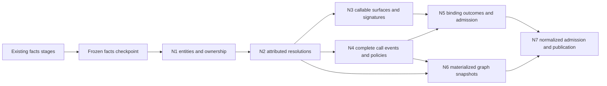

# Phase 3: normalized semantic relations — detailed design and execution plan

**Implemented; composite gate passed, 2026-09-30.** This is the detailed Phase 3 design subordinate to the
[cutover plan](semantic-model-cutover-plan_2026-09-29.md). The parent owns phase sequencing,
the completed P0–P2 receipts and cross-phase finding dispositions; §11 below owns the newly
scheduled P3 packages and their implementation status. [DESIGN §15](../design/sections/semantic-model.md)
owns the architecture. Current decision owners are [ADR-0105](../adr/0105-analysis-vocabulary-epochs.md)
for retained cumulative-generation decisions (superseding ADR-0101), and
[ADR-0103](../adr/0103-normalized-graph-materialization.md) for stored graphs. ADR-0105's Phase 4
epoch extension is an accepted target, not part of these Phase 3 receipts.

**Evidence boundary.** Source and pinned interfaces were inspected against `e4ab3ea` on
2026-09-30. The [investigation receipt](../design_review/evidence/2026-09-30_phase3-design/README.md)
records resolved features and 13 passing existing reader/runtime tests at the design baseline.
R1–R3/N1–N7/X are **Implemented / focused-Tested**, including persisted native graph snapshots;
§11 and the [qualification evidence](../design_review/evidence/2026-09-30_phase3-qualification/README.md)
own current receipts. Full-library comparisons and remaining measurements were stopped at user direction; Q below
records the resulting qualification boundary. P0–P2's assembled qualification remains valid only
within its stated facts scope. This document does not activate production analysis or serving.

## 1. Outcome and design decisions

Phase 3 turns attributed facts into reusable normalized identities, explicit resolutions,
effective-callable assessments, complete signature variants, stored binding outcomes, named
call-policy views and declared program projections. A consumer must be able to ask which
semantic object an observation denotes, which alternatives remain, which policy admitted a
relationship, and which evidence and coverage justify the answer.

The implementation exit is `lctx compile <library> --through normalized --profile
catalog|behavioral`: one self-contained published generation containing L0 facts and L1
relations. Publication does not select it. Facts compilation remains supported. Requests for
analysis, catalog or serving continue to refuse with their actual frontier.

The selected design is:

1. Keep typed Rust domain authority, PostgreSQL 18 and DataFusion/Arrow. Their current capabilities
   fit the required work; changing the engine/store would add a new qualification burden without
   correcting the semantic defects identified here.
2. Build fresh cumulative generations in one attempt. Introduce private reads of completed
   stages; do not retain every facts batch until normalization ends or publish intermediate facts.
3. Normalize only through evidence-backed correspondences. Provider spelling, row order and
   provider agreement alone are not equivalence or runtime certainty.
4. Keep source signatures and effective behavior separate. Arbitrary decorator transformations
   remain explicitly unknown with the current producer envelope.
5. Evaluate call policy once in the model and store typed admissions. Generate SQL views over
   those admissions, rather than maintaining independent Rust and SQL predicates.
6. Reuse the pure binder and owner rule. Persist their outcomes and premises, including refusals.
7. Build and serialize every named typed program projection during normalization. Reconstruct
   them for each new collection lifecycle; hydrate them for analysis. Canonical records retain
   semantic authority, and petgraph indices remain private computational coordinates.

The review considered reopening P0–P2 broadly. The required foundation changes are frontier
admission, stage completion/read capabilities, coordinated resources, and normalization's
interpretation of call identity. The facts' attribution, canonical condition vocabulary, typed
codec and generation lifecycle are retained. There is no compatibility migration or legacy-ID map.

## 2. Baseline and Phase 3–5 responsibility map

### 2.1 Design baseline and changes required

| Boundary | Evidence at design baseline | P3 consequence |
|---|---|---|
| Model and facts | `lctx-model::domain`, native producers and shared validation are implemented; P0–P2 exit is scoped-Tested | Extend the same manifest and lowerings. L0 assertions stay immutable and attributed. |
| Ownership and calls | [occurrence owner](../../crates/lctx-model/src/domain/occurrence_owner.rs), [declaration links](../../crates/lctx-model/src/domain/declarations.rs), [binder/policies](../../crates/lctx-model/src/domain/calls.rs) exist | Materialize and adapt these owners to complete normalized inputs; do not invent new classifiers. |
| Stage execution | [stages](../../crates/lctx-model/src/domain/stages.rs) require a writer for every input and retain batches for downstream readers | Distinguish handoff from completed-store input without duplicating dependency declarations. |
| Reader registration | [runtime](../../crates/cpg-core/src/model_runtime.rs) checks stage identity/schema but accepts an arbitrary provider | Replace public arbitrary registration with validated, source-bound input handles. |
| Generation store | [lifecycle](../../crates/lctx-postgres/src/generations/lifecycle.rs), receipts and DDL specialize facts; stage receipts land at seal | Generalize frontier contracts and add atomic completed-stage receipts before P3 reads. |
| Legacy normalized layer | [derived relations](../../crates/cpg-schema/src/derived.rs), [graph catalog](../../crates/cpg-schema/src/graph.rs), [projections](../../crates/cpg-schema/src/projection.rs) remain dormant | Recover requirements and independent answers; replace their identities, schemas and selection semantics. |
| Effective callables | `symbol_records` extracts undecorated signatures; `surface` has dormant descriptor/wrapper classification | No arbitrary effective signature is currently established. Model this limit explicitly. |

### 2.2 Downstream contracts and exclusions

| Consumer/phase | P3 supplies | Later owner retains |
|---|---|---|
| P4 flow and summaries | Complete event alternatives, policy admissions, validated binding sets, occurrence/parameter/place links, canonical conditions and family availability | Transfer derivation, entry-value stability, SCC fixed point/widening, guard rebasing, obligations/discharge and verdicts |
| P4 type/guard analysis | Structural TypeTerms, attributed named-type links, test-leaf/operand-type relationships and complete/recovery MRO status | Class-set/scalar/exhaustiveness conclusions and guard-refutation semantics |
| P4 topology/analytics | Declared universes, role arcs, evidence mapping and bounded petgraph adapter | SCC scheduling, PageRank, communities, FCA/RCA and optional kNN with named consumers |
| P4 catalog | Public exposures, source/effective callable distinctions, ordered variants, field identities, original document/deployment references | Requirements, configuration relationships, scenarios, authored registration/protocol models, catalog conclusions and retrieval units |
| P5 serving | Self-contained generation closure, family/normalized availability, typed identities and generated relation/view inventories | Native executor/MCP, wire shapes, preparation/hydration, cursors, budgets, reconstruction and end-to-end journeys |

P3 does not infer runtime absence from declared parameter absence, expand override dispatch,
construct an object's class as an actual receiver, interpret arbitrary decorators, prove default
values/normal completion, restore transfer algorithms, or qualify product differentiation.
These are retained obligations with named downstream owners, not discarded functionality.
PR6 and new product features remain behind P5. The older research Stage 3 queue is a different
sequence from cutover Phase 3 and is not activated by this document.

## 3. Domain contracts and identity

All names in this section are proposed Rust contracts, not claims that the types exist. They
belong in cohesive modules under `lctx-model::domain::normalized`; orchestration belongs in
`cpg-core::normalize`, and topology adapters in `lctx-analytics`. No new crate is required.
Every stored record uses the existing bounded derive, nominal references, generated codec,
declared keys and shared invariant mechanism. Tables and graph endpoints are lowerings.

### 3.1 Entities and correspondence

Use nominal relations for callable, class, parameter and field entities, and reuse `Module`,
`Occurrence`, `TypeTerm`, `Place` and other existing vocabulary where their meaning already fits.
A finite tagged `EntityRef` refers to those kinds at heterogeneous boundaries such as projections;
it is not a generic attribute store. Callable entities distinguish source definitions, provider
synthetics and provider-qualified external callables. Module and class body owners are execution
owners but are not falsely labeled function callables.

| Contract | Semantic key and meaning | Required evidence/invariants |
|---|---|---|
| `CallableEntity`, `ClassEntity` | Source arm: definition occurrence and kind. Synthetic/external arm: provider-qualified symbol and declared kind | Source/stub occurrences remain distinct. A synthetic callable is a supported entity, not failed declaration attachment. External symbols from different providers remain distinct without a proved correspondence. |
| `ParameterEntity` | Source parameter occurrence; external/synthetic slot: callable, signature variant and raw slot | A declaration link establishes a source parameter. Name alone never joins a formal. |
| `FieldEntity` | Class entity and field name, with distinct declaration/observation links | Does not claim instance storage, initialization, or mutation semantics. |
| `SymbolEntityResolution` | Provider symbol × analysis context × normalization policy revision | Exactly one total outcome: Resolved, Ambiguous, Unresolved. Candidate member rows and typed reasons preserve all correspondence evidence. |
| `SymbolEntityEvidence` | Resolution × candidate entity × declaring observation/support | Equality of source declaration anchors establishes correspondence; repeated support does not strengthen it. |
| `OccurrenceOwnership` | Occurrence | Owner occurrence from the sole owner rule; typed module/class/callable owner link when available; no provider graph caller substitution. |
| `PublicExposure` | Access module × context × public-name assertion | Preserve exposed spelling, traced/untraced origin and all target alternatives. Source/stub exposures and conditional declarations remain separate. |

Normalization operates inside one frozen input/context. Group `SymbolDeclaration` observations
by symbol and context, retain candidate occurrences, validate kind compatibility, and emit a
unique entity only when every applicable supported declaration agrees. A conflicting candidate
cannot be discarded because another is easier to map. For symbols without source declarations,
use the explicit provider origin/kind to distinguish supported synthetic/external entities from
unresolved source correspondence. Do not guess that every missing declaration is synthetic.

Cross-provider equivalence is derived from those resolutions to the same occurrence-based entity;
it is not a union-find over names, signatures or transitive guesses. Source and stub entities may
have a `SourceStubCorrespondence` relationship supported by captured module origins and matching
declaration evidence, but are never merged. Public declaration selection follows attributed
provider/context resolution, not the legacy last-definition rank. A display preference may later
choose a presentation without changing the alternatives.

Qualified names, public paths and display labels are presentations. Semantic keys omit timestamps,
temporary paths, insertion order and graph indices. Normalization policy/code and all input
content enter the production digest. Changing policies creates a new generation; it does not
reinterpret stored rows.

### 3.2 Callable surfaces and signatures

`EffectiveCallableAssessment` is keyed by source callable × context × ordered decorator chain.
Its result separates effective identity, signature availability, descriptor binding and body
admission. A source signature remains inspectable even when any effective component is unknown.
The outcome carries typed Known, Unknown or Conflicting alternatives with source premises;
absence of an assessment is a validation failure for an in-scope callable.

Rules are deliberately complete for the supported envelope:

- With no decorator and consistent structural signature evidence, retain the source callable and
  its variants. Preserve async, generator and native trait observations without inferring execution.
- Recognize a single exact builtin `staticmethod`, `classmethod` or `property` only through
  unshadowed lexical resolution and agreeing native traits. The model owns descriptor adjustment;
  metadata recognition and body admission are different results.
- Preserve decorator applications in source order and interpretation order (bottom-up). Multiple
  descriptors, arbitrary wrappers, `wraps`, registration and context-protocol decorators retain
  their source relations but yield effective-unknown where the current evidence cannot establish
  the transformation. No last-name match or pilot-specific recognizer establishes semantics.
- Source and provider signature variants stay distinct with their provenance. Do not union
  independent overload parameters into one callable contract. Preserve positional ordering,
  keyword kinds, default-slot presence, collectors and NativeUnavailable/ParamSpec/Ellipsis forms.
- A descriptor-adjusted callable signature records the raw signature and adjustment. Receiver
  insertion/removal is performed once: call binding consumes the raw formal list plus receiver
  evidence; the exposed signature is a presentation contract, never fed back to insert it again.
- Source literal defaults remain source syntax evidence. A `Default` binding means an omitted
  formal selects its definition-time slot, not that a particular runtime value exists.

`SignatureVariant` links a callable/context and its complete ordered raw `Signature`, plus any
explicit descriptor adjustment. `SignatureSlot` links each formal to its raw `SignatureParameter`
and, where established, `ParameterEntity`. Do not reconstruct annotations from display strings.
Provider structural TypeTerms remain the type authority.

A generalized decorated-callable producer is not required to complete P3: unknown is a supported
answer, with coverage. If selected later, it requires its own typed L0 observation, producer
mapping and independent controls before effective-known claims expand. It cannot be smuggled
into the normalizer as reparsing or runtime execution.

### 3.3 Occurrences, lexical relationships, types and places

Materialize `OwnerTable` through its existing structural sweep; compare against `owner_of` on
independent fixtures. Process one source's ancestor-closed occurrence set at a time. Headers,
defaults, decorators and bases belong to their evaluation owner; declaration bodies open their
own owner. Lambdas, module/class bodies and nested scopes remain representable.

Normalize lexical, import, ancestry and document-mention targets as **total attributed
resolutions**. Each source observation gets an outcome plus zero or more candidate-member rows;
missing/ambiguous correspondences never disappear through an inner join. Preserve binding-event
identity, context, explicit builtin identity, module origin, relationship kind, MRO order and
Complete/Recovery/Cyclic status. A document mention is mention evidence, not usage or invocation.

`TypeEntityLink` maps only named structural references in TypeTerms to their symbol resolution.
It does not replace provider-qualified term identity or merge structurally similar terms across
providers. `TestOperandTypeLink` is keyed by flow test leaf × matching type observation; match the
exact operand occurrence, context and `TypeRole::TestOperand`. A separate total leaf outcome
retains missing operand, no matching observation, alternatives and unavailable/NotRequested input.
The link is evidence for P4, not a guard conclusion or a class-set assertion.

`TypeBinderAssessment` is total over native `TypeVariable` identities. Resolve the provider module
to its captured source and interpret its anchor only in that coordinate space. A model operation
selects the unique innermost supported declaration/type-alias/assignment binder enclosing the
anchor, using captured structural occurrences; equal candidates remain ambiguous. Never prefer
`.py` over `.pyi` or infer a captured binder from a synthetic/native coordinate. Retain explicit
OutsideCapturedScope, UnsupportedNativeOrigin, Unresolved and Ambiguous outcomes with candidate
evidence. Source-backed scoped/PEP 695 variables and synthetic origins have independent controls.

P2 `FlowCallStep` already names exact call and operand occurrences and validates them against
typed `CallSyntax`/`CallArgument`; preserve that proof rather than reconstructing the old span
join. N4 adds total `FlowCallEventLink` outcomes from each qualified value-path observation and
ordered step to the matching explicit normalized event in the same context. Preserve the path,
step ordinal and callee/argument role. NoReportedEvent and ambiguous event correspondence stay
explicit. Equal sink occurrences do not merge different paths. This is call/source linkage,
separate from `TestOperandTypeLink`, and establishes no transfer or normal-completion claim.

Keep existing P2 `PlaceRoot`/`Place` identities and structured paths. Add `PlaceEntityLink` for
established source roots: Formal/Entry to the parameter occurrence entity; callable ports to
their owner; Field/Global to their declared owner/name; Local to its lexical scope and name;
Occurrence to the exact event. Formal and Entry remain different. A missing entity link is typed
unresolved, not a new place encoding. External formals use explicit signature-slot entities in
binding outcomes; P4 owns any extension to transfer port vocabulary needed to compose them.

## 4. Complete call events, policy and binding

### 4.1 Event assembly before selection

`NormalizedCallEvent` identifies occurrence × ordered `CallOrigin` × context. Channel and phase
remain explicit alternatives within that event, not information erased by grouping. Two implicit
origin sequences at the same occurrence are distinct events. Event owner comes from
`OccurrenceOwnership`; native caller attribution remains a premise.

`NormalizedCallAlternative` references the raw target, resolution, support and symbol resolution,
retaining destination, receiver, modality, approximation, phase and channel. A resolved entity
link does not make a Candidate target Definite. Duplicate provider evidence may map to one
semantic alternative but every support and unresolved remainder survives separately.

`EventAssessment` consumes the **complete** set of declared provider/context resolutions and
members before filtering by a consumer policy. Uniqueness is computed on established normalized
destinations, not provider IDs or row counts. A provider's partial/open/recovery resolution, an
unmapped candidate, or a disagreement prevents complete unique admission. Provider agreement is
not independent proof of completeness. New and Init form the declared constructor phase group
for event completeness but retain separate destinations, signatures and bindings. A resolved
constructor phase cannot erase its unresolved sibling.

The model privately constructs `CompleteEvent` from this assessment and complete candidate set.
Consumers cannot manufacture it from a filtered query. Raw policy helper call sites and their
tests migrate to this normalized input at N4; no alternate raw Summary admission remains active.

### 4.2 One policy evaluation and five generated views

`CallPolicyAdmission` stores event × alternative × named policy with the assessment and evidence
that admitted it. `CallPolicyAssessment` records a total per-event/policy result, including
no-admission and its reason; a policy view's empty membership does not establish absence.
The model-owned evaluator runs once over `CompleteEvent`/explicit incomplete assessments.
Shared validators re-evaluate stored admissions. Generated PostgreSQL and DataFusion views
join the membership relation to canonical alternatives; their only policy selection is its code.
This avoids a custom predicate language and separately authored Rust/SQL admission logic.

| View | Exact supported interpretation |
|---|---|
| Invocation | Direct-channel AnalyzerAssertion alternatives, Definite or Candidate, in Call/PropertyGet/PropertySet phases; preserve implicit origin and dispatch status. Definition arcs are separate. |
| Dataflow | Direct non-override function/method alternatives in Call/Init with Definite or Candidate modality. Membership is eligibility for P4 analysis, never a completed transfer. |
| Summary | Direct function/method alternatives in Call/New/Init, complete unique normalized phase-group assessment, exact/definite resolution and target, known receiver. A valid complete binding variant is additionally required at composition admission. |
| Usage | Definite or Candidate alternatives supported by AnalyzerAssertion or SourceObservation; preserve origin and channel. |
| Association | All alternatives, including Potential and unresolved, with modality, origin and uncertainty disclosed. This is evidence association, never invocation or behavioral proof. |

The Association rule follows the current executable policy and independent Potential test. The
parent's historical blanket statement that Potential is excluded from every policy must not be
used as a new requirement. Override expansion and object-to-class receiver binding remain P4;
Invocation may expose the named override member, whereas Dataflow/Summary refuse binding through
the dispatch set.

### 4.3 Stored binding attempts and admission

Persist `CallBindingAttempt` for each event × normalized alternative × signature variant. A
candidate with no usable signature still gets an attempt with a typed unavailable/refused outcome.
Store the whole `CallSyntax` argument digest, raw signature, receiver evidence, outcome and owned
reason. Successful `CallBinding` members name the formal slot and `BindingSource`/`BindingKind`/
`BindingProjection`: actual, default slot, empty collector, whole value, positional element or
keyword element. Ordering and the complete binding-set digest are explicit.

Each attempt also records `BindingAuthority`: source-signature inspection or established effective
invocation. The latter names the exact `EffectiveCallableAssessment`, context, effective target,
descriptor adjustment and compatible raw variant. A successful source-signature binding remains
inspectable when the effective callable is unknown, but cannot authorize invocation of that body.
Effective unknown/conflicting/unsupported outcomes get their own typed refusal assessment even
when source binding succeeds; no consumer may promote source authority from a successful bind.

The existing `calls::bind` is the only argument algorithm. Its current boundary requires raw
destination symbol equality with `Signature.symbol`; that check cannot simply survive the move
to normalized identities. Refactor its semantic input to a private `ApplicableSignature` token
constructed by the model from the exact target resolution, signature-owner resolution, equal
normalized callable, equal input/context, signature authority and receiver/descriptor premises.
Cross-provider raw symbols may differ only when both resolve by supported declaration evidence
to that same entity. Do not forge a new raw target, relabel a provider signature or join by name.
Retain the original IDs/supports and parameter declarations in the token and stored attempt.
Unproved applicability yields an Undetermined attempt. One shared argument-shape algorithm sits
behind this boundary; migrate current callers/tests and remove the superseded raw equality API,
without adding a second binder or a compatibility adapter.

Feed the binder complete raw variants and
complete actual lists; preserve its positional-only, duplicate-keyword, variadic, unknown-receiver,
unsupported-unpacking and NativeUnavailable refusals. Do not drop failed variants before deciding
whether a call is uniquely bound. A total `BindingSetAssessment` covers the exact effective
target/phase's declared variant set: each variant is Bound, ProvenIncompatible or Undetermined.
Only a conclusive argument/signature mismatch is ProvenIncompatible. NativeUnavailable,
ParamSpec/Ellipsis, unsupported unpacking, unknown receiver or unavailable effective semantics
remain Undetermined. One Bound plus any Undetermined variant is not unique; one Bound with all
other variants ProvenIncompatible may be unique. Multiple Bound variants remain alternatives.
Store the full variant-set identity, classifications and evidence digest; an omitted variant is a
validation failure. Constructor sibling phases remain premises of event completeness.
Shared stored validation reconstructs inputs and reruns the
binder, checking exact members and outcome. Successful reconstruction privately yields
`ValidatedBoundCall`, which P4 composes; arbitrary stored member rows cannot serve as that token.

`CompositionAdmission` at the P3/P4 boundary requires the Summary policy assessment, correct
occurrence owner, normalized unique target, one admitted complete binding variant and all their
premises. It additionally requires established effective-invocation authority and positive body
admission for the exact target/context/descriptor and raw variant being composed. Unknown or
conflicting effective behavior, or metadata-only descriptor recognition, refuses that token.
The token includes the total binding-set assessment and requires exactly one Bound variant with
every other variant ProvenIncompatible; a refusal of uncertain semantics cannot count as exclusion.
P3 implements/validates this token but does not run the composition engine. It must
retain the target/phase mapping required by existing composition contracts; P4 performs any
provider-owner-to-normalized-owner cutover before producing transfers. No legacy ID bridge is used.

## 5. Declared program projections

Extend relation metadata with finite typed endpoint-role declarations where a named projection
uses a relationship. A `ProjectionSpec` selects relation roles, named call policy, universe,
direction, multiplicity/weight policy and required availability. Use ordinary Rust types and
functions, not a graph DSL or another manually maintained graph schema catalog.

P3 provides callable-invocation, definition/containment, import/reference and public-exposure
projections with their corresponding evidence and uncertainty. A spec never makes an untyped
union of these meanings. Type/document relationships remain relational unless a named topology
consumer selects them. Definition-time and potential relationships cannot become executable
call arcs through a graph flag.

`ProjectionInput` selects the current completed/readable source's canonical entity universe,
typed arcs and unresolved side records. Validate both endpoints against that universe; a missing
endpoint is a contract failure, while an unresolved destination is a valid side record. Keep
isolates. Output selectors apply after the complete algorithm universe is constructed.

Build one immutable `petgraph::Graph<EntityRef, ArcId, Directed, u32>` per built-in spec and
input/context during normalization. Sort entities and arcs by canonical IDs; retain parallel
edges and self-loops. Prepare stable incoming/outgoing iteration on hydration. Bound capacities
before converting to u32; graph indices never escape the adapter. Borrowed filtered/reversed
views may serve analyses. GraphMap loses parallel identity, and StableGraph deletion guarantees
have no consumer in this immutable full-rebuild lifecycle.

Every arc points to its typed canonical relation and evidence. P4 may request an explicit collapse
policy retaining member IDs; P3 does not persist transitive closure or all-pairs paths. Program,
derivation and stage graphs remain distinct.

**Materialized graph lifecycle (operator revision, 2026-09-30; ADR-0103).** N6 emits total
`ProjectionSourceAssessment` records with availability/gaps and builds all named graph snapshots.
The actual petgraph object uses `serde-1`, with a pinned Postcard binary wrapper identifying format,
projection version, input revision, analysis context and petgraph version. Generation-owned BYTEA
chunks keep transport rows bounded. Normalized admission requires the complete snapshot set and
checks it against canonical projection inputs. Graphs are fully reconstructed on every collection
lifecycle; there is no graph reuse hash or incremental invalidation machinery. Ordinary generation
content receipts continue to cover stored relations uniformly. Consumers hydrate the serialized
graph without repeating SQL edge reconstruction. Canonical relational records remain authoritative.

The shared budget covers simultaneous graph, serialized buffers, validation and hydrated indexes.
Test roundtrip topology/evidence, isolates, parallel arcs, loops, empty graphs, deterministic input
order, wrapper/version mismatch, malformed/truncated/trailing bytes, missing chunks and resource
refusal. Measure construction, serialization and hydration separately at Q before claiming speedup.

## 6. Cumulative frontiers and private stage reads

### 6.1 Generation composition and frontier authority

Choose a self-contained cumulative generation: Facts = L0; Normalized = L0+L1; later Analysis
and Catalog extend that closure; Serving adds generated read projections. P3 implements Facts
and Normalized only, plus conformance harness support. No empty future-layer tables advertise
unimplemented capabilities.

`FrontierDescriptor` in the model owns relation membership, required capability/coverage units,
checkpoint order, validators, admission kind and selectability. Store DDL, control-row checks,
leases and selection consume validated descriptors rather than switching on Facts independently.
`FrontierAdmission` is privately produced by the matching model validator, binding frontier,
model, schedule, completed input/output content, coverage and normalization-policy digests.
The PostgreSQL owner persists this opaque validated receipt and lowers its declared details.

Fresh `compile --through normalized` acquires/captures input once and runs the combined facts and
normalization schedule in one attempt. It neither selects nor publishes a temporary facts
generation. External published-generation inputs are not accepted by the P3 stage API. P4's
coarse rebuild may add an explicit validated import stage that copies a complete input closure
and records source generation/content before computation; that future route cannot use the
arbitrary provider-registration escape hatch. A normalized generation has no retention dependency
on another generation and is retired under the existing single-generation protocol.

Facts and Normalized remain explicitly selectable for inspection, preserving the existing facts
operator behavior. Selection alone grants no serving capability: P5 must require its serving
frontier and admission. Compilation still never changes the pointer automatically.

### 6.2 Stage completion and facts checkpoint

Add store-backed stage completion without weakening whole-generation publication:

1. The sole scheduled writer emits validated batches through the existing sink. Each relation
   has one writer and can include explicit empty output. P2 vocabulary contributions retain
   their current assembly ownership.
2. After all output streams/COPY operations finish, close and drain that stage's input sessions.
3. `complete_stage` uses the lifecycle connection and the existing lock order. Acquire installation
   shared, generation exclusive, then output table locks in canonical relation order. Do not take
   the attempt lock shared: the lifecycle already holds it exclusively.
4. Lock each output table `ACCESS EXCLUSIVE`, revoke importer INSERT, persist the output row-count/
   content receipts and stage outcome, then grant importer SELECT for those completed tables.
   Commit all outputs and receipts atomically. A write already in flight is drained before freeze.
5. Only acknowledged completion yields a private `CompletedRelation<R>` handle bound to attempt,
   generation, producer stage, relation/model/schema and content receipt. Later writes refuse in
   both typed API and PostgreSQL permissions. Completion does not grant serving access.

Once every facts output is completed, run the existing shared facts validators/admission against
the frozen L0 scope and write an immutable **facts checkpoint** inside the attempt. It records
facts content and per-family/scope availability. This is the prerequisite for the first normalized
stage, not a published generation or a second facts store. Failure terminates the attempt.

Later normalized stages consume only completed dependencies and use their declared shared input
invariants; an operation requiring a cross-relation invariant may start only after all its inputs
exist and that invariant has passed on their frozen receipts. Same-stage cyclic references are
validated together before downstream consumption. Final seal/validation checks cumulative content,
all required invariants, exact planned/completed outputs and the matching frontier admission.
No earlier receipt authorizes a changed relation digest.

### 6.3 Input transport and capability API

Extend each declared stage input with its transport: `Handoff` or `CompletedStore`. This is one
input declaration with two execution mechanisms, not duplicated dependency lists. Existing small
P2 native handoffs keep their behavior. Store-read consumers do not increment retained-batch
handoff counts; a completed-store handle replaces the need to keep those batches alive.

`StageSession::register` takes a source-bound `StageTable<R>` constructed only from the current
stage's `ReadPermit<R>` and a matching completed handle. Raw `Arc<dyn TableProvider>` registration
becomes private. A typed handoff adapter uses reserved batches and a built-in `MemTable`, with
the same source identity checks. Test constructors stay under test support and cannot authorize
production reads. Schema equality alone is insufficient.

Keep planning and execution behind a stage-owned query wrapper. Replace the public unrestricted
`DataFrame` return with a prepared query whose execution methods perform availability, source and
scan-capacity admission. Internal planning may use DataFrames; production callers cannot obtain
a plan/stream that bypasses admission through `collect`, `execute_stream` or direct physical-plan
execution. Cancellation and output-budget ownership remain attached to that wrapper.

An `AttemptReadSession` uses importer credentials and read-only provider connections. Its private
binder validates the exact live attempt capability, generation, completed receipts, model/physical
identity and requested relation set. Every connection holds a shared generation lease through
its stream/drain lifetime. Published readers retain their separate published-only lease protocol;
the serving role cannot access staging outputs. Fork transport mechanics are shared, authorization
is owned by `lctx-postgres`, and DataFusion registration stays in `cpg-core`.

The owning stage drops plans/streams and explicitly drains/closes this pool before a transition
takes the generation lock exclusively. A retained table after close refuses with a typed Closed
error. An abandoned attempt leaves no publishable generation; outstanding reader leases protect
its tables until drains finish, then normal interrupted-attempt cleanup can proceed.

### 6.4 Availability, lifecycle and concurrency

Read handles expose availability with the relation. A stage declares `RequireComplete` or
`ObserveAvailability` per semantic input group. The latter receives an explicit Complete,
Partial, Unavailable, NotRequested or NoScope value and must emit the corresponding normalized
outcomes. Bare empty batches cannot satisfy an unavailable input. Coverage remains scoped; a
generation-level aggregate never proves completeness for a narrower assertion.

Close provider-session F04 in the fork: shared Closing/Closed pool states prevent future acquisitions
through every clone; close drains in-flight work and physically closes connections before returning.
An unconfirmed bounded drain leaves a terminal unusable session and a classified failure.
The cancellation/drain guard starts before awaiting `query_raw`. Confirmed drains return
capacity; transport loss or unconfirmed drain makes the session terminal without reconnection.
Keep the connection and its reservation charged through drain. Fork changes receive a new pinned
revision and the normal pin-check/dependency workflow; they are not edited in Cargo's checkout.

A streaming query can hold multiple provider connections concurrently. Before polling, inspect
the final physical plan and compute a conservative upper bound from all remote scan instances and
their partitions, including repeated reads of one relation. Reserve that capacity atomically for
the query; a plan with an unknown bound or demand above the configured capacity refuses with a
typed resource reason before executing scans. Do not use a semaphore that can deadlock partially
started joins. Split oversized queries into explicit bounded intermediate stages instead.

P3 runs one stage/query at a time; DataFusion may use the existing eight compute partitions.
The provider returns one partition per declared table scan, so additional compute partitions do
not automatically multiply a remote scan; the physical plan is the authority. Add importer
provider capacity to `RoleConfig`: default 8 provider + 2 SQLx connections, explicitly reserved
within a combined 10-connection importer budget; configurable provider cap 1–32 with two SQLx
slots retained. Keep serving defaults unchanged. Validate available configured/server capacity
before starting an attempt; owner/lifecycle connections are separately accounted and reported.

### 6.5 Normalized coverage and totality contract

The frontier declares normalized capability groups and their scopes, alongside the existing facts
family requirements. Scope uses the existing input/artifact coverage identity plus analysis context
where the source observations are context-qualified. Derive expected scopes from captured uses and
declared contexts, never from whichever output rows happened to be produced.

| Capability group | Scope and required premises | Handling of optional/unavailable evidence |
|---|---|---|
| Entity and occurrence ownership | Each analyzed Python source/context; admitted artifacts and syntax | Declaration/symbol evidence is observed with its availability. Syntactic owner materialization still completes when provider correspondence is unavailable. |
| Symbol/reference/import/ancestry resolution | Each declared source/context or input/context matching the originating family grain | Every originating observation has a total outcome. A wholly unavailable family has an explicit scope outcome, not fabricated source observations. |
| Source and effective callable surfaces | Each signature-family source/input scope and context | Preserve every native variant and unavailable slot; missing signatures or unsupported transformations stay typed outcomes. |
| Calls and policy assessments | Each call-family source/context scope | Every reported event has a complete assessment input set, even if that set says partial/unresolved. No reported events plus incomplete input never means no calls. |
| Binding attempts | Each call-family source/context scope, with explicit signature/receiver dependencies | Missing signatures still produce event/alternative-level refusal. Record signature scope availability as a premise independently of call coverage. |
| Test operand/type and place links | Flow-family source/context scope, with type/declaration dependencies | Catalog emits NotRequested for flow-derived groups. Behavioral input may be partial/unavailable; leaf-level outcomes preserve missing type/operand evidence. |
| Projection inputs | Input/context and selected spec, covering its complete declared universe | Carry every dependency's scoped availability and unresolved side records. A whole-input aggregate cannot erase a missing artifact scope. |

`NormalizationCoverage` is keyed by computation/capability × scope × context and links the exact
input coverage sets, producing stage, policy revision and completed output receipts. Seventeen
finite capabilities refine the groups above: source/entity universe and ownership, symbol
correspondence, references, imports, ancestry, types/binders, mentions, callable surfaces, calls,
bindings, place/test-operand links, four named projections, public exposures and flow-event links.
Their single owner is `normalized::coverage::Capability`; each declares its anchor family,
dependencies and owning producer. Computation receipts attest the complete producing stage;
a capability does not thereby claim every other output of that stage.

A final coverage writer uses acknowledged completed-stage handles through the existing bounded
stage mechanism. Shared input/context/family premise sets retain every original ProviderCoverage
ID once, including its reason and scope, and outcomes link those sets. The local anchor preserves
Unavailable/NotRequested; Complete requires every required family across the input/context to be
complete, conservatively retaining cross-source uncertainty. NoScope requires an empty admitted
anchor universe. Completed-stage readers can run the same typed scoped-outcome operation over
the private facts checkpoint before final assembly. Shared frontier admission recomputes exact
outcome, premise membership and frozen output receipt equality; omitted scopes and substituted
receipts refuse publication.

Keep computation completion separate from evidence availability. A normalizer can complete a
total `Unresolved` assessment over partial evidence; this does not promote that evidence to
Complete. NoScope requires an empty declared scope universe, NotRequested requires the profile
contract, and Unavailable/Partial retain their original reason and scope. Combine inputs by a
typed capability operation that retains the premise vector, not a numeric maximum of enum codes.
The publication requirement is successful total normalization over every admitted input and
explicit outcome for every declared scope. It does not require every native family or effective
callable to become known. Failed computation, missing outcomes or resource refusal terminate the
attempt and prevent publication.

## 7. Library choices, resource envelope and alternatives

Resolved pins/features and exact evidence are in the [library investigation](../design_review/evidence/2026-09-30_phase3-design/README.md#library-evidence-and-limits).

| Capability | Selected mechanism | Alternatives and reason |
|---|---|---|
| Equijoins, alternatives, coverage aggregation, stable grouping | DataFusion 55.1.0 SQL/DataFrame over declared Arrow 59.3.0 inputs | PostgreSQL-only semantic SQL would duplicate the compute boundary; hand maps for all relational work repeat generic machinery. Use charged maps only for domain algorithms/indexes needing them. |
| Query consumption | `execute_stream`, bounded typed output conversion and sink COPY | `collect`/`cache` retain the whole result; use only for an explicitly admitted small relation. Streaming does not bound sort/hash state. |
| Policy views | Model evaluator → typed membership rows → generated views | Handwritten Rust+SQL predicates can diverge; a new universal expression DSL is unnecessary for five finite policies. |
| Stage input data | Completed PostgreSQL relation with declared schema; `MemTable` for existing handoffs | All-memory handoffs extend facts lifetimes; Arrow IPC/Parquet spools introduce another materialization lifecycle before a measured need. Linked published generations add leases, retention and cross-generation reference machinery. |
| SQL effects/codecs | SQLx 0.9, SeaQuery 1.0.2, pgpq 0.12, existing domain/serde_arrow Arrow-59 codec | An ORM or second application driver adds authority/lifecycle work without solving normalization. Keep provider-internal Rust-Postgres confined to its adapter. |
| Topology | petgraph 0.8.3 immutable directed multigraph with typed weights and borrowed views | GraphMap loses parallel-arc identity; mutable StableGraph index guarantees are not needed. CSR would trade useful visit traits for a benefit not yet measured. |
| Fixed points or generic reasoning | None added in P3 | Ascent/datafrog/another incremental engine has no P3 consumer requiring it. P4 must select its engine from actual transfer/fixed-point semantics. |
| Frontend semantics | Existing attributed Pyrefly/Ruff/ty facts and exact structural links | Reparse, name heuristics or executing fixtures would introduce competing semantic inputs. |

For DataFusion joins, define key multiplicity and NULL semantics before SQL. Use left/anti joins
to preserve unresolved sources. Do not use `any_value`, a window winner or DISTINCT to erase a
conflict; first prove unique membership, then project the unique value. Explicit ordering is
required only where order has meaning or for deterministic canonical construction. SQL result
metadata/types must be checked against generated schemas before typed decode; do not use casts
that silently convert invalid values to NULL. Bound parameters, never interpolated values.

One `AttemptRuntime` owns the pool from acquisition/capture through facts, normalization, validation
and publication. Pass its `ResourceBudget` to native providers, sinks, retained indexes, graph
adapters and reads; do not create the current separate fixed facts budget beside DataFusion's
pool. Preserve current defaults (64 GiB reservation ceiling, eight compute partitions, 4,096 rows/
8 MiB transfer target, 64 MiB maximum row) until qualification supports a change. These are ceilings,
not allocation targets or a promised total RSS bound.

P3 defaults to **no disk spill**, configured explicitly on the DataFusion disk manager. A query
that exceeds the shared pool refuses; it does not silently use ambient `/tmp`. This makes the
first resource contract finite and testable. Enabling spill later requires a measured workload,
an attempt-owned directory, byte quota, cleanup and operator-specific evidence. PostgreSQL buffers,
provider internals and allocator retention retain the measured external-allowance distinction from
P0–P2. Plan shape, scan demand, stage time, rows/bytes, reservations and sampled RSS are reported
separately. No speedup is claimed before the P3 pilot.

## 8. Stage graph and implementation packages

The stage graph follows relation dependencies. The following groups are implementation packages;
split stages inside a group when an input must await another writer. Do not create cycles between
vocabulary assembly and consumers. New normalized vocabulary has its own writer and does not
append to a completed L0 relation.

| WP and dependency | Concrete work and owner | Required acceptance/deletion boundary |
|---|---|---|
| D0 — first | Reconcile this proposed design/ADRs and assemble the expected-answer inventory; `lctx-model`/design owners | Fresh design/target review; complete scope, no unknown required architecture choice. Implementation acceptance of ADRs precedes changed contracts. |
| R1 — D0 | Model-owned frontier descriptors, cumulative relation sets and generic admission receipt; `lctx-model`, store lowerings | Facts/conformance behavior retained; normalized tables precisely scoped; adding a test frontier needs no store dispatch arm. Read schema snapshot diffs before acceptance. |
| R2 — R1 | Atomic stage completion, completed-source handles and frozen facts checkpoint; `lctx-postgres`, `domain::stages` | Late/direct writes versus freeze, atomic failure, failed-stage abort-only, invalid checkpoint refusal, exact planned outputs. Remove handoff retention for CompletedStore consumers. |
| R3 — R2 | Attempt reader, source-bound registration, availability inputs, shared budget, physical scan admission; `cpg-core`, role owner, provider fork | F04/F06/F07 controls, >2-scan join, too-small capacity refusal, cancellation/drain, wrong-attempt/source refusal, no staging serving access. Remove arbitrary public provider registration. |
| N1 — R3 | Nominal entities, total symbol correspondence, ownership, public exposure; model contracts + DataFusion construction | Exact/missing/conflicting declaration mappings; source/stub, synthetic, namespace, conditional definitions, headers/class/module owners; independent scalar owner comparison. |
| N2 — N1 | Lexical/import/ancestry/type/mention resolutions, type-binder assessments, Place links and test operand joins | Total outcomes preserve unmatched rows and all evidence; no guessed type structure/MRO completion or synthetic anchor attachment. Re-home corresponding legacy derived-table answers. |
| N3 — N2 | Effective assessments using N2 lexical outcomes, exact descriptor operation, complete signature/slot relations | Source-known/effective-unknown; shadowed/multiple/arbitrary decorators, native unavailable variants, default-slot distinction. Move supported surface semantics out of dormant catalog authority. |
| N4 — N2 | Complete event assembly, flow-path/event links, normalized uniqueness, policy assessments/admissions and generated views | Five-policy independent truth table; same-event multiple providers and constructor phases; Potential Association; path identity; no Summary over filtered/incomplete inputs. Retire raw policy admission route. |
| N5 — N3,N4 | Binding attempts/members, signature authority, stored binder validation and private composition admission | All variant successes/refusals preserved; source parameter links; exact rerun equality, effective-target/body admission, unknown receivers/unpacking, no default-value claim; tampered complete-set refusal. |
| N6 — N2,N4 | Typed role declarations, total projection sources, persisted snapshots and bounded hydration; `lctx-model`, `lctx-analytics` | Independent graph shapes, isolates/parallel arcs, unresolved evidence, selector/universe separation, canonical order, overflow/resource refusal. Retire migrated legacy projection authority. |
| N7 — N5,N6 | Combined driver, normalized admission, CLI reporting and inspectors; `cpg-core`, `lctx`, store | Both profiles publish without selection; failed normalization publishes nothing; facts still works; analysis/serving refuses explicitly. |
| X — N7 | Re-home P3 test expectations and retire only last-consumer legacy declarations; all affected owners | Import/dependency search proves no migrated P3 path uses old IDs/schema/SQL. P4/P5 obligations and sources remain usable as recovery evidence. |
| Q — X | Whole-scope qualification, assembled design/target review, current owners and handoff | §10 phase-exit evidence; disclose all skips and downstream exclusions. |

Each package begins with named contract changes and its independent controls, then production
construction, then focused checks. New test target names in §10 are prescribed additions.
No formatting/lint/integrated gate runs between these packages. Commit coherent slices on main,
preserving unrelated work. Review R1–R3 as an assembled boundary before scaling N1–N7; review the
normalized semantic contract at N4/N5 before downstream qualification. These are bounded reviews,
not a standing modeling exercise for each edit.

### 8.1 File and API change map

Paths marked new are proposed module boundaries, not extra packages or required file counts.

| Owner surface | Planned change |
|---|---|
| `crates/lctx-model/src/domain/admission.rs`, `stages.rs`, `record.rs` and manifest registration | R1/R2: declared frontiers/checkpoints, stage input transport, completed handles and normalized validators/coverage; preserve generated codecs and append-only codes. |
| `crates/lctx-model/src/domain/normalized/` (new) | N1–N5: cohesive identity/resolution, surfaces, complete-event/policy and binding operations with nominal relations. Pure operations take validated inputs and explicit budgets, without store/session dependencies. |
| `crates/lctx-model/src/domain/calls.rs`, `occurrence_owner.rs`, `value.rs` | Reuse owner and place vocabulary; move policy/binding applicability to complete normalized input without copying the argument-shape algorithm. Review existing tests/callers before removing the old entry points. |
| `crates/lctx-model/src/domain/projection.rs` (new) and relation metadata | N6: endpoint roles, spec, source assessment, typed arc references, binary snapshot codec and shared validation; no petgraph index is a domain ID. |
| `crates/lctx-postgres/src/generations/{ddl,lifecycle,receipts,lease,locks}.rs`, `control.sql`; `roles.rs` | R1–R3: generic descriptor lowering, completed-stage transaction/checkpoint, private read capability, scoped availability and explicit importer capacity. Update control-schema version/checks as a migration. |
| Provider fork `pool.rs`, `conn.rs`, `bounded.rs`; workspace pin and `docs/pins.md` | R3: shared terminal close, early drain guard, attempt-reader transport and scan reservations. Change the fork source, prove its controls, then update the pinned revision; never patch Cargo's cache. |
| `crates/cpg-core/src/{model_runtime,generation_read,facts}.rs` and `normalize/` (new) | R3/N1–N7: owned query wrapper, source-bound registration, combined runtime/schedule, typed normalization stages and bounded sink conversion. |
| `crates/lctx-analytics/src/graph.rs` or a focused successor | N6: expose the model-owned immutable materialization adapter to analysis; the model keeps the shared snapshot validator beside its codec, leaving dormant P4 analytics consumers inventoried. |
| `crates/lctx/src/compile.rs` and generation/query command owners | N7: normalized frontier option, one acquisition/runtime, cumulative report and availability-aware inspection; later-frontier refusals retained. |
| Dormant `cpg-schema::{derived,graph,projection}` and legacy `cpg-core` consumers/tests | X: remove migrated ownership after expectations move; retain exact P4/P5 consumers from §9. |

For every stage, its declaration names exact relation inputs/outputs, invariants, transport,
profile, coverage contribution and code/config identity before construction is wired. The domain
record derives generate the column schema; this plan deliberately does not create a second SQL
column catalog. Implementation's declaration/snapshot diff is the reviewable schema migration.

## 9. Migration, deletion and authority

The historical 22 derived families are an obligation inventory, not a target table count:

| Legacy family | Target/recovery route |
|---|---|
| ProviderNodeMap, ProviderClassMap, SyntheticCallables | N1 entities and total symbol resolution |
| Exports | N1 attributed PublicExposure; preserve source/stub and public-origin alternatives |
| Signatures, Parameters | N3 variants/slots; N5 formal binding links |
| Resolutions, ArgumentResolutions, CallTargets, SiteTargets | N2 total lexical/source links; N4 normalized events; N5 attempts |
| AncestryTargets | N2 ordered attributed ancestry links; completeness retained |
| OverrideTargets | Preserve N4 explicit dispatch alternative/named member; expansion remains P4 |
| IdentifierTargets, ImportTargets | N2 total reference/module resolution |
| FlowValueCallLinks | P2 exact call/operand proof plus N4 total flow-path/event linkage; preserve path and role, no transfer proof |
| TypeClassTargets, TypeBinders | N2 structural named-type links and explicit type-binder assessments; P4 class/scalar/guard derivation |
| MentionTargets | N2 source-backed mention resolution; P4 association strength |
| Nodes, Edges, GraphGaps, EdgeKinds | N6 typed role-generated projection sources, uncertainty and inventories |

The dormant compile suite mixes phases. Re-home its derived-table expectations and the operand/type
tamper control in P3; retain its transfer, default/completion, handler, protocol, model and summary
expectations for P4. The dormant graph suite's normalization/projection answers return in N6.
Partition by assertions, not by filename. Keep the parent's Git recovery anchor and snapshots until
the last retained expectation has a current owner. No old Delta test harness or compatibility IDs
are reconstructed.

P3 removes only migrated declarations/helpers and their old production consumers. `cpg-schema`,
legacy `lctx-model::decl/id/legacy`, dormant query/wire/catalog contracts and shared legacy modules
remain while a P4/P5 consumer still needs them. The final removal inventory names each survivor's
consumer and phase. No whole-crate deletion is presumed at P3 exit.

### 9.1 Executed ownership inventory (2026-09-30)

The normalized compile route (`lctx/src/compile.rs`, `cpg-core/src/normalize/`,
`lctx-model/src/domain/{normalized,projection}/`) has no `cpg_schema`, legacy ID, `lctx_id`
or old derived-SQL import. Read-only `rg` inspection of those paths returned no matches.
N4 removed the raw `CallCandidate`, `CallSiteFacts`, `CallSiteTargets`, `TargetSet` and raw
`CallPolicy::admits` authority; independent call/site controls now exercise stored normalized
memberships. No compatibility API was introduced. N6 adds computational snapshots to the same
normalized generation; they are not an alternative semantic store.

| Retained legacy declarations | Current consumer; deletion boundary |
|---|---|
| ProviderNodeMap, ProviderClassMap, SyntheticCallables | P4 `cpg-core::{flow_model,catalog,surface}` and `lctx-analytics::{source_call,parameter_identity,lexical_identity}`; remove when those consumers take typed N1 identities. |
| Exports, Signatures, Parameters | P4 `cpg-core::{catalog,surface}` and the `cpg-schema::public` SQL; remove with catalog contract migration. |
| Resolutions, ArgumentResolutions, CallTargets, SiteTargets | P4 `lctx-analytics::{source_call,call_binding,completion}` and the dormant producer/rules graph; remove when composition consumes N4/N5 private admissions. |
| AncestryTargets, OverrideTargets | P4 catalog/class/dispatch consumers and graph registry; N2 preserves ancestry and N4 preserves explicit dispatch, while expansion remains P4. |
| IdentifierTargets, ImportTargets, MentionTargets | P4 graph/catalog/association declarations reached through `cpg-core::producer` and `cpg-schema::{derived,graph,rules}`; replace that producer closure before deletion. |
| FlowValueCallLinks, TypeClassTargets, TypeBinders | P4 `flow_model`, `behavior` and graph/rules closure; retain transfer, guard, protocol and completion expectations until their typed cutover. |
| Nodes, Edges, GraphGaps, EdgeKinds and legacy ProjectionSpec | P4 `cpg-core::{analyze,producer,validate}` and `lctx-analytics::{pass_a,ranking,communities,graph}`. None is read by normalized compilation; remove when these named analytics migrate. |
| `cpg-schema`, `lctx-model::{decl,id,legacy}`, query/wire/serving contracts | Mixed P4/P5 modules, `cpg-core::{bundle,retrieval}` and Python/native serving adapters. Whole-crate deletion remains outside P3. |

Dormant assertion recovery is by meaning. `dormant/compile.rs` derived-text/key/variant/Unicode/
re-export/source-stub assertions map to `domain_normalized`, native `normalized_entities`,
`normalized_relations`, `normalized_callables`, `normalized_events`, `normalized_bindings` and the
explicit source/stub, Unicode/re-export/ordinal and dataclass/conditional controls in
`cpg-extract/tests/normalized_recovery.rs`;
source signature ordinals and provider-qualified alternatives remain explicit. Its operand/type
mutation maps to N2's shared-validation controls. Transfer, call completion, summary, handler and
protocol assertions remain P4, with recovery anchor `9efce30` in the parent plan.
`dormant/graph.rs` shape, lineage, repeated-run/order and doctored-output expectations map to N6's
pure snapshot and native projection controls plus cumulative publication repeatability. The new
contract intentionally separates definition arcs from invocation. Legacy node/edge enum counts
are not preserved as a second schema. Shared snapshot validation refuses missing chunks, sources,
coverage and gaps. The dormant files retain P4-specific algorithm expectations; their Delta
harness is not restored.

The migration changes model/schema digests. During implementation, inventory project generations
and active readers, quiesce readers, rebuild from pinned inputs and retire obsolete project state
under the existing authorization and preservation rules. Protect unrelated service data, pinned
inputs and benchmarks. Do not add old-format readers, dual writers or legacy identity maps.
Document raw/schema changes as migrations in commits. The qualification step rebuilds only project-owned generation state after a read-only inventory.

The parent plan remains the single current disposition owner for existing cross-phase findings.
It links P3 obligations to these packages and retains P4 residuals. New review findings scheduled
solely into P3 are tracked in §11. Reviews remain dated evidence; acceptance of a proposed ADR
does not close an implementation finding.

## 10. Verification and phase exit

### 10.1 Independent semantic and architectural controls

| Suite to add/extend | Cases and required answer |
|---|---|
| `lctx-model/tests/domain_normalized.rs` | Source/stub remain different; equal declaration anchors establish correspondence; conflicting/missing links remain explicit; repeated supports do not strengthen evidence; Unicode/NUL and synthetic/external kinds round trip. |
| `domain_effective_callables` | No decorator, exact descriptors, shadowing, stacks, arbitrary wrappers/registration, ParamSpec/Ellipsis/NativeUnavailable; source contract stays usable while effective unknown remains visible. |
| `domain_normalized_calls` | Distinct origins at equal site; duplicate-provider equivalent targets; conflicting target; open remainder; direct/higher-order; New+Init; override; Association Potential. Independent expected membership for all five policies, including empty outcomes. |
| `domain_call_bindings` | Positional-only/keyword/default/empty collectors/variadic elements/receiver cases; supported cross-provider signature applicability and foreign-entity/context negative twins; one bound variant plus incompatible versus undetermined alternatives; incomplete argument/variant sets; stored tampering; arbitrary wrapper whose source signature binds but whose composition admission refuses; compatible effective-target/context/body positive twin; validated token construction only from full inputs. |
| `cpg-core/tests/normalized_relations.rs` | Tiny frozen typed inputs through declared stages, total joins, independent owner oracle, operand/type absent/ambiguous/profile cases, native type-variable binder scopes and source/stub twins, equal-sink distinct flow paths, row-order and batch-boundary permutation equality. |
| `lctx-model` projection unit controls and `cpg-extract/tests/normalized_projections.rs` | Isolates, parallel events, self-loops, cross-file cycle, diamond, external entities, unresolved side records, reverse/filter views, selector retaining intermediate nodes, canonical IDs and capacity refusal. |
| Real PG18 `stage_reads`/`normalized_generations` | Output freeze/late write race, stage receipt atomicity, abandoned stage, closed retained table, early/mid-stream cancel, lost transport, too few scan slots, wrong attempt/schema/source, unrequested family and read/cleanup race. Serving cannot read staging. |
| CLI normalized controls | Both profiles, publish without selection, unavailable later frontiers, unchanged selected generation on failure, inspection availability and exact generation digest/report. |

Reuse independent fixtures and authored expected answers; do not derive every oracle from the
same policy evaluator or generated declaration. Mutation twins must demonstrate that each critical
control fails for the defect it targets. Gold references, skills and sealed evaluation tasks never
enter acquisition, compilation, parameter tuning or expected-output generation.

Architectural scenarios at the design checkpoints: add one normalized relation without store
frontier dispatch edits; add a policy instance without another consumer classifier; replace a
read mechanism while preserving source/availability contracts; upgrade a provider without
merging its private identities; add a P4 analytic using a declared projection without a new graph
catalog; test a pure normalization operation without acquisition, PostgreSQL or MCP setup.

### 10.2 Commands and timing

During implementation use `python3 scripts/build_environment.py -- cargo check -p <touched-crate>`
and `cargo test --release -p <owner> --test <focused-suite>` through the same wrapper.
Store suites use the real disposable PG18 harness. Snapshot changes are reviewed before
`cargo insta accept`; never automatically accept a diff or renumber codebooks.

After X completes: run `just fmt` once, then `just test-all`. Run fresh `facts` and `normalized`
FastMCP pilots for catalog and behavioral profiles; repeat normalized behavioral compilation and
compare canonical content excluding attempts/timestamps/measurements. Invoke the built CLI's
`compile fastmcp --through normalized --profile catalog|behavioral` with explicit database config.
Do not select pilot generations automatically. Use targeted reruns only for failures or material
changes, and report a composite receipt honestly.

Measure stage elapsed time, row/byte cardinality, join expansion, live scan count, peak reservation,
sampled/process RSS and database size. Compare cumulative Facts versus Normalized under the same
pinned inputs, configuration and warm/cold conditions; do not claim kernel timings as end-to-end
benefit. Run a budget below the observed necessary reservation and a deliberately insufficient
scan budget: both must refuse without publication or selection change. The normal default-budget
pilot must complete; hard speedup targets are not invented before a baseline exists.

Then conduct assembled design/target review, update owning documentation, run `just adr lint`
and `just docs-check`, and perform the handoff. Library-catalog regeneration belongs to the
implementation scope's final repository workflow, after functional checks; a catalog is not an
acceptance gate. P4/P5/product qualification stays separately `not_run`.

P3 exits only when all scheduled functionality, migrated independent controls, deletion obligations,
real-store/lifecycle checks and both normalized profiles pass; the assembled review accepts the
supported scope; and every P4/P5 handoff has a concrete contract. An unknown effective callable
under the explicitly supported envelope is an honest output, not a waived defect. Missing
required ownership, lost alternatives, unhandled availability or unbounded failure is not exit.

## 11. Current package status and finding routes

**2026-09-30: functional scope implemented; composite gate passed.** The independent
[assembled implementation review](../design_review/reviews/design_review_phase3-exit_2026-09-30.md)
is **Accept scoped** after F01/F02 correction and reinspection. A1–A3 are satisfied within the
inspected supported scope; serving remains P5. ADR-0103 supersedes the initial graph decision
in ADR-0102. Runtime, semantic normalization and graph persistence have focused controls;
the [qualification evidence](../design_review/evidence/2026-09-30_phase3-qualification/README.md)
owns the composite gate and store rebuild. The user stopped additional full-library output
comparisons; unrun pilot-scale measurements remain explicitly unqualified.

| Package | State and bounded receipt |
|---|---|
| D0 | Accepted ADR-0101/0102 and retained the independently reviewed design and migration inventory; 2026-09-30. |
| R1 | Implemented: model-owned frontier closure/validators/selectability and generic `FrontierAdmission`; store dispatch removed. Passed `cargo check -p lctx-model -p lctx-postgres` and release `domain_admission` (10) + `generation_stages` (1), through the build-environment wrapper, 2026-09-30. Normalized declaration/admission activates only with N7. |
| R2 | Implemented: acknowledged atomic completion, content receipts, input transports, private completed handles and shared-validator checkpoint. Control-schema migration. Passed release `domain_memory`, `domain_resources`, `domain_stages`, `generation_stages`, `stage_reads` (direct-write race, cancellation, atomic rollback) and native `stage_checkpoint`; commands through `scripts/build_environment.py --`, 2026-09-30. Foundation review follows R3. |
| R3 | Implemented / focused-Tested, 2026-09-30: private attempt reads, scoped availability, invariant/reference eligibility receipts, whole physical-scan admission, charged prepared results/source lifetimes, terminal drain/close, shared runtime/coordinator, importer capacity. Release `domain_admission` (10), `stage_checkpoint` (1), `generation_read` (11), `model_runtime` (3), `stage_validation` (1 with three cases) passed; fork `bound_lifecycle` (3) passed; exact fork `a41da22` root reader suite (11) passed. Commands use the build-environment wrapper. `just build-features` passed with no changes. [Foundation review](../design_review/reviews/design_review_phase3-foundation_2026-09-30.md): Accept scoped after F01/F02/O1 corrections. Full pin/phase gates remain Q. |
| N1 | Implemented / focused-Tested, 2026-09-30: nominal entities, total supported symbol correspondence, distinct field observation/declaration evidence, source-local ownership, attributed public exposures; charged completed-store stage and shared exact-output validator. Native origin distinguishes def statements, synthesized methods, callable source fields and unavailable origin; schema migration. Passed wrapped release `normalized_entities` (4), real PostgreSQL `normalized_stage` (1), `domain_symbols` (11), `typed_symbols` (5), and `domain_owner` (2); `cargo check -p cpg-core` passed. Composite controls include corrected facts-only fixture scope and retained capture accounting. N1–N5 assembled review and schema snapshot acceptance remain at their scheduled boundaries. |
| N2 | Implemented / focused-Tested, 2026-09-30: total typed relationship outcomes, original observation/candidate premises, exact provider-module binder coordinates and operand/context/role joins; shared exact-output invariant and charged completed-store driver. Wrapped release `cpg-extract --test normalized_relations` (7), `cpg-core --test normalized_relations` (2 real PostgreSQL profiles; renamed from N1 `normalized_stage`), and `lctx-model --test domain_normalized` (3 pure/codec controls) passed. The dormant operand/type tamper expectation is exercised through the shared typed validator. Native fixtures disclose the actual reported source/stub coordinate; explicit coordinate twins test both without inventing provider output. Remaining mixed-suite assertion recovery/deletion stays under X. |
| N3 | Implemented / focused-Tested, 2026-09-30: total callable/context outcomes, independently qualified identity/signature/descriptor/body components, exact builtin descriptor recognition, both decorator orders, complete raw variants/slots and parameter-entity evidence; charged stage and shared exact-output validation. Wrapped release `cpg-extract --test normalized_callables` (4), `lctx-model --test domain_effective_callables` (5 pure controls), and `cpg-core --test normalized_relations` (2 real PostgreSQL profiles through N3) passed. Initial compile/test fixture failures and the strengthened row-validation tamper setup were corrected before focused reruns. Arbitrary wrappers, uncertain qualifiers and unavailable forms cannot grant body authority. Assembled review remains after N5; mixed legacy answer recovery/deletion remains X. |
| N4 | Implemented / focused-Tested, 2026-09-30: total events, raw site/resolution/alternative supports, normalized phase uniqueness, private `CompleteEvent`, five total policy assessments/memberships and exact flow-path/event links. Removed the public raw policy/uniqueness route and migrated its independent controls. PostgreSQL and source-bound DataFusion views share membership-only SQL; DataFusion requires the completed invariant owner and preserves three-scan physical admission. Wrapped release `domain_calls` (15), `domain_sites` (11), `cpg-extract --test normalized_events` (2) and `cpg-core --test normalized_relations` (2 real profiles through N4, including all five view counts) passed. The final multi-package command also reran the seven N2 native controls successfully. `cargo check -p cpg-core` passed during development; its unused-import warning was removed before the release controls. Complete phase/binding qualification remains N5/Q. |
| N5 | Implemented / focused-Tested, 2026-09-30: normalized signature applicability, the sole binder with typed incompatible/undetermined failures, total stored attempts and formal-slot members, complete effective variant sets and private composition admission. Tokens replay N1–N4 plus exact bindings; uncertain correspondence, unknown variants/receivers, unpacking, source-only wrappers, missing signature coverage or body authority refuse admission. Wrapped release `domain_calls` (16), `domain_composition` (11), `domain_normalized` (4), `domain_sites` (11), native `normalized_bindings` (5), `normalized_entities` (4), `normalized_relations` (7), and core `normalized_relations` (2 real PG profiles through N5) passed as focused composite receipts. `cargo check -p cpg-core` passed. Initial fixture/compile errors and a mistaken native test assumption about provider identity were corrected; a separate pure control proves differing provider symbols. [N1–N5 review](../design_review/reviews/design_review_phase3-normalization_2026-09-30.md): Accept scoped after F01/F02 corrections and independent reinspection. Final wrapped release `domain_effective_callables` (6), native `normalized_callables` (4), `normalized_bindings` (5), and core `normalized_relations` (2 profiles) passed; incidental native relationship controls (7) also passed. Conditional signature/async/body premises cannot grant context-wide authority. |
| N6 | Implemented / focused-Tested, 2026-09-30: model-owned roles, canonical universes and typed parallel arcs; four immutable petgraph Graph snapshots per input/context, versioned Postcard encoding in generation-owned BYTEA chunks, charged hydration and private runtime indices. Shared publication validation hydrates and compares against canonical inputs without rebuilding the graph. Wrapped release model projection unit controls (4, including empty and 70,000-node multi-chunk snapshots), native `normalized_projections` (3), and core `normalized_relations` (2 real profiles) passed. `cargo check -p lctx` passed. Initial fixed-array Serde/Arrow mismatch and malformed-header test setup were corrected before reruns. ADR-0103 replaces per-request construction; no graph reuse hash. |
| N7 | Implemented / focused-Tested, 2026-09-30: cumulative normalized frontier, complete producer preflight, private facts checkpoint, seven normalization stages including final scoped coverage, atomic publication and explicit selection. Wrapped release core `normalized_generation` (4) and CLI `compile_facts` (1, five profile/frontier compiles) passed, including deterministic repeated content, failure after the facts checkpoint, cleanup and unchanged selected prior generation. The same current-source run passed both core profiles, all three native projection controls and seven native relationship controls. Shared DataFusion PeakRecordingPool records global and per-stage reservations; RSS sampling covers blocking normalization work. |
| X | Implemented / focused-Tested, 2026-09-30: §9.1 inventories every retained legacy family and its named P4/P5 consumer. No legacy authority is imported by normalized compilation. Wrapped release native `normalized_recovery` passed three independent source/stub, Unicode/re-export/signature-ordinal, dataclass and conditional-declaration controls recovered from dormant assertions. Whole-crate deletion remains at the actual downstream ownership boundaries. |
| Q | Composite `just test-all` gate passed after scoped repairs: all 34 initial failures covered by corrected suites; 129 affected contract controls and 257 PG repeat tests passed; 219 Python passed/56 skipped; remaining gate components and release CLI build passed. Reviewed model snapshot accepted (72 new relations, six invariants, native function-origin field); actual store rebuilt with five retained-service fingerprints unchanged. Facts/catalog FastMCP command passed (528.641s), published unselected. Additional full-library comparison, behavioral/repeat, graph hydration timing and measured-budget refusal are **not_run at user direction**; the started normalized pilot was stopped and aborted, store check passed. Assembled implementation review is Accept scoped; pilot-scale performance/envelope remains unqualified. Evidence and exact commands: [qualification receipt](../design_review/evidence/2026-09-30_phase3-qualification/README.md). |

The [assembled design review](../design_review/reviews/design_review_phase3-plan_2026-09-30.md)
owns dated evidence for these new findings; this table owns their current disposition.

| Finding | Design correction and closure evidence | Implementation obligation |
|---|---|---|
| [Phase 3 plan F01](../design_review/reviews/design_review_phase3-plan_2026-09-30.md#F01) | Closed as a design gap by static reinspection, 2026-09-30: §4.3 requires effective-invocation/body authority and a total Bound/ProvenIncompatible/Undetermined variant-set assessment. | N3/N5 implemented and focused-Tested: native wrapper/body and total unknown-variant controls passed. Full phase qualification remains Q. |
| [Phase 3 plan F02](../design_review/reviews/design_review_phase3-plan_2026-09-30.md#F02) | Closed as a design gap by static reinspection, 2026-09-30: §4.3 replaces raw provider-symbol equality with private normalized `ApplicableSignature` premises, retaining the sole shape algorithm and original attribution. | N5 implemented and focused-Tested: pure cross-provider positive and foreign entity/context/input negatives passed. Full phase qualification remains Q. |
| [Foundation F01](../design_review/reviews/design_review_phase3-foundation_2026-09-30.md#F01) | Corrected and focused-Tested: source-bound read capability requires owned and declared shared invariants plus nominal closure over frozen/checkpoint premises; durable receipts are checked by every connection. | Closed at R3; normalized stages must declare complete shared input premises. |
| [Foundation F02](../design_review/reviews/design_review_phase3-foundation_2026-09-30.md#F02) | Corrected and focused-Tested: prepared plans and streams retain source provider/batch reservation owners after session and stage finish. | Closed at R3; detached handoff control passed. |
| Foundation O1 (same review) | Corrected and focused-Tested: fork lease retains reservation through drain; failed bounded drain aborts transport without a second uncharged drain. | Closed at R3; confirmed and failed drain controls passed at `a41da22`. |
| [Normalization F01](../design_review/reviews/design_review_phase3-normalization_2026-09-30.md#F01) | Corrected / focused-Tested: only Definite, Exact, unconditional correspondence premises can resolve a candidate; all tentative support remains. Pure qualifier twins and native/PG reruns passed. | Closed by independent reinspection; N1/N3 own qualifier sufficiency, including signature/async/body components. |
| [Normalization F02](../design_review/reviews/design_review_phase3-normalization_2026-09-30.md#F02) | Corrected / focused-Tested: public binding-token verification replays the complete N1–N4 closure before admission. Standalone event validation returns no authority token. Forged lower correspondence/owner/lexical/support controls passed after recomputing higher results. | Closed by independent reinspection; N5 owns full lower-premise replay. |
| [Phase 3 exit F01](../design_review/reviews/design_review_phase3-exit_2026-09-30.md#F01) | Corrected in implementation: final scoped normalization coverage with shared exact lower premise sets and frozen output receipts; family audit includes cross-source Types/Lexical dependencies and distinct exposure/flow-event capabilities. Pure scope and real-store controls are recorded in Q evidence. | Closed by independent source reinspection and focused controls; final current-source qualification remains Q. |
| [Phase 3 exit F02](../design_review/reviews/design_review_phase3-exit_2026-09-30.md#F02) | Corrected in implementation: invocation-selected events retain assessment uncertainty as graph side records; known arcs remain. A native known-target/open-remainder twin and a wholly outside-policy twin exercise this boundary. | Closed by independent source reinspection and focused controls; final current-source qualification remains Q. |
| Normalization O1 (normalization review), exit O1 | Complete charged typed input/index/output collections implement semantic joins; DataFusion currently supplies source-bound transport and scan admission. Lower replay temporarily materializes charged closures by layer. | Pilot-scale stage/replay reservation and RSS measurement is **not_run at user direction**; retain this obligation if performance qualification resumes. No streaming-join or pilot-scale memory improvement claim. |

Exit review O2 is a **P4 handoff**: add scoped read-only algorithm methods/adapters over the
hydrated graph when implementing SCC, ranking or communities. Keep runtime indices private and
reuse the stored graph; do not reconstruct its edges per request.

| Existing finding/obligation | P3 package and closure evidence | Current disposition owner |
|---|---|---|
| provider-session F04 | R3: terminal close and guarded early drain, retained-table/early-cancel controls | Parent §8 provider-session table |
| provider-session F06; store-lifecycle F08 | R1–R3: cumulative frontier, source-bound completed receipts; foreign-generation registration impossible; no store-specific frontier dispatch | Parent §8 store/provider tables |
| provider-session F07 | R3/N7: validated scoped availability reaches typed readers and normalized outcomes | Parent §8 provider-session table |
| core C04; semantic-model F02/F09 | N1/N4/N6: proved equivalence, one policy owner and declared projections; later consumer closure remains P4 where applicable | Parent §8 |
| composition F04; P0 exit scenario 2 | N4/N5: complete normalized event, owner and binding admission token; composition engine still P4 | Parent §8 composition/P0 tables |
| Resource-slice F07/F08 and provider observation O1 | R3/Q: charged bounded readers, physical-plan connection admission and measured growth envelope | Parent §8 and source review's observation |
| Stored occurrence ownership; test-leaf/operand join | N1/N2: shared owner/scalar oracle, exact attributed operand join and missing-input outcomes | Parent §6 |
| Raw-field and dormant answer preservation | N1–N6/X: §9 per-family recovery, retained P4/P5 expectations | Parent §5–§6 |

Open questions about a future P4 algorithm, arbitrary decorator semantics, spill tuning or P5
wire layout do not block this bounded design because no P3 supported behavior depends on choosing
them. They remain explicit downstream design obligations rather than defaults an implementer
must guess.
