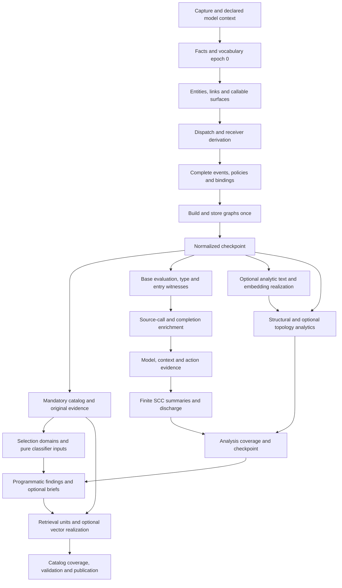

# Phase 4: analysis and catalog — detailed design and execution plan

**Accepted execution target, 2026-09-30.** This document specifies cutover Phase 4, including the upstream
prerequisites its consumers expose. Package receipts below distinguish implementation and qualification.
The [parent cutover plan](semantic-model-cutover-plan_2026-09-29.md) owns cross-phase sequence and
finding disposition; this document owns Phase 4 contracts, packages and acceptance controls.
[DESIGN §15](../design/sections/semantic-model.md) remains the accepted semantic authority.
[ADR-0105](../adr/0105-analysis-vocabulary-epochs.md) and
[ADR-0106](../adr/0106-typed-analysis-and-catalog.md) record the accepted decisions and alternatives.

**Inspected baseline:** main at 73187700fff553a0ca74abecdcfb7e8429c06617, 2026-09-30.
Concurrent after-turn tooling/instruction changes are outside this design.
The [Phase 3 plan §11](semantic-model-phase3-detailed-plan_2026-09-30.md#11-current-package-status-and-finding-routes)
owns its composite automated qualification and explicitly unmeasured pilot-scale costs.
Source/interface observations here are **Interface-checked** on the date above; all new contracts,
algorithms and benefits are **Proposed** unless an individual receipt says otherwise.

## 1. Outcome, scope and decisions

Phase 4 publishes a self-contained generation containing facts, normalized relations, typed
analysis results, a mandatory public API/evidence catalog and deterministic retrieval inputs.
Every conclusion has one semantic owner, explicit applicability and coverage, and same-generation
evidence. A library can have a usable catalog while behavioral analysis is NotRequested or Partial.

The implementation preserves these decisions:

1. **One model.** Ordinary types and operations in `lctx-model::domain` own interpretation,
   applicability, identities, invariants, verdicts, selection and synthesis policy.
   PostgreSQL owns durable relations; DataFusion owns relational compute; analytics kernels own
   algorithm execution. SQL, Python, adapters and renderers do not redefine these meanings.
2. **One full collection.** Capture once and build cumulative frontiers in one fresh attempt.
   No partial fact updates, external-generation import, legacy-ID translation or compatibility path.
3. **Stored graphs.** Complete graph inputs before constructing native petgraph projections.
   Build and store them once per full collection; hydrate and borrow them for repeated algorithms.
   Canonical relations remain authoritative. No graph reuse hash or request-time edge reconstruction.
4. **Immutable vocabulary epochs.** A bounded set of shared vocabulary relations can acquire new
   rows through immutable, explicitly closed prefixes. Lower-stage readers retain their original
   prefix and validation receipts. Ordinary relations still have one frozen output writer.
5. **Finite proofs.** Exact finite witnesses, unresolved alternatives and recursion residuals
   remain distinct. Witness DAGs never depend recursively on final aggregate summaries.
6. **Mandatory catalog, optional enrichment.** Brief seeds, behavioral proofs, communities,
   embeddings and successful optional analyses do not define the public API universe.
7. **Current library mechanisms first.** Retain the pinned BDD kernel, petgraph, Leiden,
   DataFusion/Arrow and existing storage/client libraries. Preserve the small weighted PageRank,
   finite worklist and bounded FCA kernels where the available replacements lose required semantics.
8. **No scope inflation.** Restore retained capabilities and repair their exposed contracts.
   General effect/exception/role recursive research, unrestricted dynamic Python, a capability
   ontology, new solvers, ANN tuning and PR6 comparative evaluation retain their existing triggers.

### 1.1 Phase 4 and Phase 5 responsibility map

| Boundary | Phase 4 owns | Phase 5 owns |
|---|---|---|
| Publication | Cumulative analysis/catalog relation closure, outcomes, invariants and canonical artifacts | Generated serving views/grants/indexes and server admission |
| Behavior | Transfers, execution/completion evidence, finite summaries, obligations, discharge and verdicts | Pure native request execution over those results and bounded explanations |
| Catalog | Public slots, configuration, original scenarios/deployment, associations and checks | Complete API packets, section expansion, browse and comparison |
| Requirements | Finite predicate/domain types, closure evidence, shared pure classification and conjunction | Wire encoding, request validation, candidate loading and result pagination |
| Retrieval | Addressable units/fragments, lexical text, embedding specifications and exact consumed vectors | Query embedding, BM25/exact-vector scoring, fusion and winning-unit expansion |
| Evidence | Canonical references, derivation sources and original artifact closure | Exact-byte hydration, response budgets and stable cursors |
| Lifecycle | One attempt and atomic generation publication; compile never selects | One published generation lease per server; startup, cancellation and retirement interactions |
| Qualification | Independent semantic controls and real-store Phase 4 acceptance | Real native/MCP journeys; later product comparison remains PR0/PR6 |

Do not confuse cutover Phase 4 with the older research “Stage 4 capability registry.”
That registry is not automatically activated. No Phase 4 conclusion claims Phase 5 is available.

## 2. Baseline and implementation seams

### 2.1 What is reused and what changes

| Inspected owner | Current state and consequence | Phase 4 decision |
|---|---|---|
| `domain/normalized/{entities,links,callables,events,bindings,coverage}` | P3 owns correspondence, public exposure, callable components, complete events, binding sets and scoped availability | Consume these contracts; do not repeat signature, descriptor, owner or uniqueness inference in catalog/behavior |
| `domain/projection/snapshot.rs` | MaterializedGraph stores a native Graph; public access is typed iteration, adjacency and reachability | Add borrowed algorithm views, preserving private indices and stored object ownership |
| `domain/stages.rs` and completed-stage store | Contributors precede one writer; completion freezes whole relations | Add vocabulary epoch publication before scheduling P4 consumers |
| `domain/transfer.rs` | TransferKey still owns an `Id<ProviderSymbol>` | Migrate derived transfer ownership to normalized callable EntityRef; raw provider symbols remain premises |
| `domain/composition.rs` | CallFrame accepts admission booleans and returns flattened obligation reasons | Consume private validated normalized admission; return subject-specific outcomes for the complete alternative domain |
| `conditions/stability.rs` | Guard-only witness rule is validator-private; substitution references CallArgument | Share entry-value derivation with producers; bind substitutions through stored CallBinding including receivers |
| `domain/derivation.rs` | Global conclusion-to-step-to-premise DAG check already exists | Preserve it; introduce finite witness occurrences before recursive aggregate publication |
| `domain/record.rs` | Scalar lacks a floating-point representation | Add a checked finite metric scalar; vector bytes remain an explicitly versioned codec |
| `lctx-analytics` and dormant core modules | Valuable kernels/controls still depend on cpg-schema and old IDs | Recover their semantics over the new model, then remove old authorities |
| `cpg-core::{catalog,surface,catalog_domains}` | Reconstruct public contracts and descriptor classifications from legacy rows | Build catalog-specific conclusions over P3 owners |
| `cpg-schema::selection` | Pure classifier depends on wire types | Move semantic types and classifier into model; P5 wire depends on them |
| `scripts/producer_fingerprint.rs` | Already includes crates/*/models, scripts, specs and producer sources | Preserve that closure and explicitly record authored catalog identity; do not claim model bytes are currently unhashed |

### 2.2 Responsibilities and allowed dependencies

- **lctx-model:** analysis/catalog concepts, operation contracts, pure domain transformations,
  declarations, shared validators, profile/capability policy and borrowed topology contract.
- **lctx-analytics:** bounded computational kernels over explicit validated inputs. No SQLx,
  acquisition, environment discovery, service client or hidden policy lookup.
- **cpg-core:** stage declarations and execution, DataFusion joins, admitted loading, kernel
  invocation, external embedding effects and typed result publication.
- **lctx-postgres:** lowering, private delta ingestion, epoch/ordinary-output completion,
  generation lifecycle, artifact storage and read capabilities. It does not classify semantics.
- **cpg-extract/cpg-flow:** native facts only, with explicit behavioral dependency context
  requirements prepared before extraction.
- **lctx-embed:** the existing effectful embedding client contract.
- **lctx CLI:** explicit profile/frontier/options, preflight and outcomes. Python remains dormant
  for P5 and never gains an independent semantic implementation.

No new crate or provider framework is needed. Pure domain transformations can stay ordinary
functions. Shared validators call the same authoritative operations, while independent tests use
hand-expected answers or separately implemented oracles.

## 3. Prerequisite: immutable shared vocabulary

### 3.1 Why ordinary stage contributions cannot work

Composition creates new predicates, evaluation atoms, BDD nodes, places and qualifications.
Those relations already belong to facts. Schedule::build orders their writer after all
contributors, while normalization requires the facts writer's completed checkpoint.
Adding an analysis contributor therefore creates a real dependency cycle. Reopening a completed
table would invalidate existing receipts and let a lower reader observe later vocabulary.

Choose a finite, model-declared vocabulary assembly mechanism. It is not a general multiwriter
table facility and does not permit modifying an existing semantic row.

### 3.2 Closed epochs and physical lowering

The initial whitelist is **Literal, LiteralSet, LiteralSetMember, PlaceRoot, PathSegment,
AccessPath, Place, Predicate, EvaluationAtom, ConditionNode, Condition and AssertionQualification**.
Binding-source/projection rows remain with their normalized writer. Facts, attribution,
coverage, analysis conclusions and support relations are not generally appendable.

- One VocabularyAssembly semantic owner admits these records. Its declared publication epochs
  are nodes in the schedule; each epoch depends on its previous closed prefix and named contributors.
- Domain identity and schema stay unchanged. The store adds an internal introduced_epoch column
  to whitelisted canonical tables. It is storage metadata, never a domain key or user-supplied field.
- Producers stream bounded batches into private, insert-only delta tables. They cannot write
  introduced_epoch or update/delete canonical rows.
- An epoch publication group contains the vocabulary delta and ordinary result deltas that
  reference it. A lifecycle-owned transaction merges vocabulary, inserts results, validates the
  candidate prefix and group invariants, freezes ordinary outputs, and records their receipts
  plus the closed-epoch receipt atomically. This avoids immediate-FK failures and a contributor/
  completion cycle; it also avoids retaining the entire result set in memory.
- Producers return a ComputedStage with sealed delta receipts, not CompletedRelation. These
  receipts permit group closure but never stored reads. Every planned output, including empty
  outputs, must be sealed; all COPY operations finish before close. Hold the existing attempt
  lifecycle lock and acquire deterministic relation locks, revoke delta INSERT, and verify frozen
  content before merging. Only the group's committed acknowledgement completes its stages.
- Replace blanket staging-table INSERT grants with explicit delta-only grants for this group.
  Canonical bases receive no importer writes; growing vocabulary bases receive no importer reads.
- Equal IDs with identical payload deduplicate; conflicting payloads fail the attempt. Earlier
  rows never change. New memberships cannot mutate an old literal set's declared meaning.
- Retain the current load-then-generated-FK-validation mechanism: load all group rows, validate
  generated references inside close, and install permanent generated FKs at final seal. Current
  FKs are not DEFERRABLE. Additional semantic reference checks require the same generation and
  visible prefix; a reference to a later epoch is invalid even if its base row exists.
- Full candidate-prefix validation includes canonical condition closure, guard legality,
  literal-set membership, shared qualifiers and the ordinary outputs' invariants. A failed close
  exposes neither vocabulary nor result receipts; unconfirmed commit uses the existing terminal
  recovery protocol.
- A failed/unconfirmed close poisons the attempt; no partial acknowledgement or in-place retry.
  Successful closure drops merged deltas while retaining receipts. Final publication rejects
  unclosed groups, missing outputs and remaining ingestion privileges.

For reads, lower immutable security-barrier views with a **literal closed epoch bound** and
explicit semantic columns. Importer read connections receive SELECT on these views, never on
growing canonical vocabulary tables. No mutable session setting chooses visibility. Existing
source-bound providers register the view selected by their private permit.

CompletedRelation/ReadPermit carry the generation, relation, closed prefix, content receipt,
required invariants and availability. Verification of an old prefix scans that prefix, not the
current whole table. Final seal verifies the last closed prefix and all ordinary outputs;
published readers see the final canonical content only after normal publication.

The plan declares a finite sequence of closes: facts vocabulary; dispatch/receiver vocabulary;
base semantic vocabulary; execution/model vocabulary; summary vocabulary; catalog/synthesis
vocabulary. Split a close only where an actual stage needs another stage's new vocabulary.
No stage reads its own unfinished group. Within one group, pure kernels can share charged immutable
inputs/outputs without pretending those results are already published.

### 3.3 Metadata and profiles

AnalysisInvocation is a new derived-analysis relation; it is not a fake ProviderRun reporting
native fact coverage. It refers to existing input/context, a typed analysis definition,
configuration/model catalog, input invocations and completed source receipts.
A genuinely new AnalysisContext required by configured compilation is declared before the facts
checkpoint. Context identity does not assert that any future analysis has completed.

Catalog profile keeps Flow NotRequested. Behavioral profile augments the native dependency context
with model-required symbols/classes and exact runtime exception classes before provider execution.
The whitelist does not allow late acquisition or changes to captured bytes.

## 4. Normalized admission and graph prerequisites

### 4.1 Dispatch and class-of receiver bindings

Perform these extensions before N6 builds stored graphs in every fresh normalized collection.
They are implementation packages of Phase 4 that amend the normalized layer; they do not append
edges to a previously published graph.

Introduce DispatchAssessment and DispatchMember, keyed to the original normalized event and raw
Overrides premise. Members cite the named method, qualifying override evidence, normalized
receiver class, complete MRO membership and provider/context coverage. Retain the named member
and admitted overriders; incomplete ancestry leaves an explicit open set.

Extend the model's normalized alternative source with a tagged **Native / DerivedDispatch**
reference. A derived source names its original CallTarget and dispatch member. No producer invents
a new raw CallTarget to impersonate a native assertion. Policy evaluation, complete-event
assessments, binding sets, projection roles and validators consume this same declared source.

The projection keeps every known conservative member and its uncertainty. Summary admission still
requires complete applicability; enumeration inside the captured class universe does not prove
that an arbitrary runtime subclass cannot exist. Dynamic/open-world cases retain OverrideDispatch.

For a class method accessed on an object, a derived receiver assessment supplies **ClassOf(actual)**.
Add a typed binding-source/value representation anchored to that actual expression. It is not
identity from the instance and does not prove a concrete runtime class. Raw Receiver::Unknown
evidence is preserved. A concrete class-dependent conclusion requires its own class evidence.

P3's normalized-only route receives these corrected semantics after the preparatory packages pass.
Update the projection/version contracts and rebuild on the next full collection. Facts-only
compilation remains independent.

### 4.2 Composition admission

Replace public summary_admitted/unique_variant booleans with private CompositionAdmission and
ValidatedBoundCall access from normalized verification. Migrate transfer owner to EntityRef and
require the occurrence-owner premise for every call.

The operation enumerates the complete domain:
**source contribution × event alternative × binding variant × applicable callee contribution**.
Each member records an exact result, proven disjointness, semantic dominance, incompatibility,
or a typed obligation. Missing targets, undetermined variants and open remainders are members,
not rows that disappear in a join.

A successful shape binding alone cannot establish effective invocation authority. For known
candidates without positive admission, retain their evidence and conservative outcome; do not
construct an authority token from a count. Complete-set strengthening is owned by the shared
discharge operation, not by a graph traversal.

### 4.3 Borrowed computational topology

Expose NativeGraphView through MaterializedGraph::with_native_graph. Use an invariant generative
brand per callback, separate from the graph borrow lifetime, for its opaque GraphNode/GraphEdge
tokens. An ordinary shared lifetime alone cannot distinguish two hydrated graphs. The higher-ranked
callback cannot return branded values; map algorithm outputs to EntityRef/ArcId inside it.
Delegate required petgraph visit traits to the stored Graph. Token constructors are private;
tokens have no serialization, and mutation/the underlying Graph are not exposed. Compile-fail
controls reject a token from a different view and token escape. A source-level API check precedes
implementing the adapter; no new dependency is required for this narrow generative boundary.

Implement only the visit traits required by SCC/traversal and named analytics. Algorithms remain
in lctx-analytics. Filtered/reversed views borrow the graph. Output selection happens after the
declared algorithm universe is established. A dense kernel-specific array for Leiden or a numeric
iteration is an admitted computational conversion, not a second canonical graph.

Hydrate each named projection once per analysis preparation lifetime; retain its reservation until
all borrowing kernels finish. Do not deserialize a graph separately for every seed, metric or query.

## 5. Shared analysis contracts

### 5.1 Invocation, result and coverage vocabulary

The following proposed relation groups enter domain::analysis_relations(); names are concrete
design names, with all structural fields derived from their Rust declarations during implementation.

| Group | Identity, contents and governing operation |
|---|---|
| AnalysisDefinition / MethodParameters | Typed method and semantic version; explicit parameters, limits, seed and model; no JSON-interpreted domain policy |
| AnalysisInvocation / AnalysisInput | Input/context, definition, source receipts, projection references and parent invocations; parents form a DAG |
| AnalysisOutcome / AnalysisDiagnostic | Completed/Partial/Unavailable/NotRequested with typed reasons; elapsed time and measured diagnostics separate from semantic identity |
| AnalysisCapability / AnalysisCoverage / AnalysisCoveragePremise | Expected capability × scope × context from admitted inputs, exact lower membership and producing receipts; empty observations never define the expected domain |
| TransferWitness / CompositionWitness / SummaryPublication | Finite evidence occurrences, typed premise edges and aggregate publication membership |
| AnalysisObligation / ObligationSubject / DischargeEvidence | Nominal subject, channel/phase, reason, responsible domain, status and exact discharging derivation |
| Finding / FindingMember / FindingSupport | One emitter; typed finding kind, subject/members, invocation and nominal evidence; derived fidelity rather than a producer-chosen status |
| Metric / CommunityMembership / Concept / ConceptIncidence | Algorithm-owned outputs with projection, parameters, coverage and heuristic/exact-under-context interpretation |
| AnalysisPolicy / ModelCatalog | Authored, versioned policies and model definitions, separate from observations/results |

Keep native ProviderCoverage and normalized coverage intact. Analysis coverage references them and
other analysis coverage through typed membership relations. It never overwrites native coverage.
Families remain facts families; retired FactFamily codes for generic findings/graphs stay reserved.

The current provider-attributed Assertion/Support path cannot mint derived evidence by inventing a
ProviderRun. Introduce a typed support-source sum separating NativeAssertion premises from
AnalysisDerivation premises. The latter cites AnalysisInvocation, qualified proposition and exact
nominal evidence. One shared qualification/emission operation derives modality, approximation,
condition and coverage for both paths; native provider attribution remains intact. Migrate the
existing analysis foundation records through this operation rather than duplicating their policy.

A completed computation can have Partial evidence. Refused required execution aborts publication;
a supported analysis boundary produces an explicit partial/unavailable outcome only where that
capability's contract permits it. Missing/corrupt required results are never represented as empty.

### 5.2 Typed metrics and resource contracts

Add FiniteF64 to the field/Arrow/PostgreSQL lowering: reject NaN and infinity, normalize metric
negative zero to positive zero, compare/hash canonical IEEE bits, lower to Arrow Float64 and
PostgreSQL double precision. Metric values are payloads, not finding/member identities.
This policy does not change source Literal float meaning or vector signed-zero bytes.

All retained input indexes, graphs, conversions, BDDs, worklists, proof members, output buffers,
DataFusion operators and validation closures reserve from the same AttemptRuntime.
Use bounded batch streaming for storage and DataFusion relational projection/filter/join/aggregate
where it removes whole-input retention. Pure semantic neighborhoods can use charged maps.

Preserve one admitted heavy stage/query at a time initially; no nested Rayon pools. Keep current
memory defaults and transfer limits, with explicit algorithm limits in MethodParameters.
Spilling remains disabled until a measured need justifies a separately qualified policy.
Reservation bounds are not a whole-process RSS guarantee.

A deterministic semantic work limit records its named obligation and uncovered subject. Failure to
reserve infrastructure memory aborts the owning stage unless a predeclared partial-result contract
can publish a fully validated prefix. Do not catch arbitrary allocation errors and publish success.

## 6. Behavioral evidence and finite composition

### 6.1 Authored models and dependency context

Move parsed model definitions and their semantic operations from cpg-schema into lctx-model.
Keep the pinned external model data under that owner. Catalog revision, bytes, applicability,
phase, source/target paths and per-channel completeness are explicit, digest-bound inputs.

Before behavioral extraction, derive ModelContextRequirements from the selected model catalog:
target modules/symbols, allocation/initialization/protocol members, relevant exception classes and
required MRO closure. Resolve them through the pinned captured environment. Missing definitions
produce model applicability uncertainty, not late imports from the operator environment.

The existing producer source fingerprint already covers model directories. Preserve it across the
move and expose the authored catalog digest in analysis/context configuration. A model catalog
change must change producer/analysis identity even if the analyzed library release is unchanged.

### 6.2 Entry-value witnesses and guard/type derivation

EntryValueWitness::derive is the one operation proving that a specific access sees a parameter's
entry value. Its premises are the normalized owner/formal, exact read/place, parameter definition,
complete provider/context-qualified reaching set and complete flow coverage.
Assignments, nested/nonlocal reaches, unbound alternatives and loop-carried reaches prevent proof.
The stored validator replays the same operation.

Use that witness both for Entry-root port construction and guard stability. Parameter-only reaching
proves binding identity, not arbitrary mutable object state. StabilityBasis owns predicate
eligibility; initially only the existing IsNone/IsValue substitution domain is admitted.
GuardSubstitution references the stored CallBinding, including a bound receiver, and retains
actual value, source atom, call event and witness. Substitution also emits the actual-place
ControlInfluence and its qualification; Selection remains distinct from value transfer.

Derive class sets, exhaustiveness and scalar predicate assessments from structural TypeTerms,
attributed type observations, operand links and Complete MRO evidence. Opaque, truncated,
display-only, open class hierarchies and incomplete coverage remain explicit. Use the retained
bounded finite theory over supported scalars/classes; no string-parsed type claims or new SMT engine.
Only a complete relevant domain can support refutation.

An unsupported captured-cell output emits CapturedStateUnavailable with its declaration and
attempted transfer; append this reason without renumbering codebooks. Keep the local observation.
Foreign formal inputs are disjoint from caller ports; closure outputs are neither globals nor
malformed generations. Full closure-environment modeling is outside this restored envelope.

### 6.3 Execution and completion channels

Preserve the acyclic base/enrichment organization already present in execution.rs:

1. Derive base closed-expression evaluation and source-read evidence.
2. Derive base statement completion, pending outcomes and frame-release evidence.
3. Prepare source calls using independently available binding/default/body/release premises.
4. Derive enriched expression/completion outcomes from those admitted source calls.
5. Apply context protocols/values, modeled identities and action triggers.
6. Produce finite summaries, discharge and behavioral findings.

These are declared dependencies, not “run twice and hope for convergence.” A source call must not
prove its own body completion or default availability. Separate relations represent base evidence
and enrichment; generated final views combine them under one semantic rule.

Retain:
- ordered argument evaluation and short-circuit behavior;
- explicit Return/Raise/Break/Continue and pending-outcome replacement by finalizers;
- handler matching, bare re-raise and handler-name cleanup boundaries;
- definition-time default availability and stability, independently of callee outcomes;
- invocation, normal, exceptional and finally action phases;
- synchronous context acquisition/entry/exit and separate resource identity;
- modeled identity, transfer, effect, callback, resource and exception applicability;
- per-origin reachability, field/global reads, dynamic access and complete-negative premises.

The existing supported channels are restored. This does not promise general recursive effect,
exception or role summaries, arbitrary async/generator lifecycle or arbitrary decorator execution.
Supported positives and unsupported channels coexist explicitly.

### 6.4 SCC semantics and finite proof identity

Use petgraph's iterative SCC algorithm over the stored conservative invocation projection,
canonically ordered callee-first. Include override-derived edges before SCC discovery.
Incomplete topology prevents a completeness claim; it does not erase known finite witnesses.

Retain a deterministic SCC-local worklist. Its qualified worklist-state key contains normalized owner, source
contribution/origin, channel and phase, input/output places, transfer kind, modality,
approximation and canonical condition. It excludes proof ID, arrival order and proof cost.
Distinct invoked guard evaluations remain distinct atoms through their exact lineage.
This is not a redefinition of TransferKey: the domain's transfer aggregation key still excludes
conditions, and final alternatives merge conditions by the existing owned OR operation while
retaining all witnesses. The worklist distinguishes conditions to decide which exact evidence
states have actually been composed and which representative remains admissible.

Keep nondominated depth/cost representatives per key and retain equal-cost evidence separately.
Reprocess callers only for a new semantic state or an improved admissible representative.
Preserve the existing **call-path depth 8** and **proof-step limit 64**, and the existing named
pair/expression/completion/BDD limits as versioned policy values rather than scattered constants.
Queue admission and processing both charge deterministic work.

Unconditional semantic repeats can converge early. Guarded recursion may generate distinct exact
conditions through depth eight; at the boundary emit a stable, subject-specific residual carrying
SummaryDepthLimit. A residual key names SCC, origin, semantic ports/channel and boundary event,
not an ever-growing exhausted suffix. Any abstract transfer representing it is Over-approximate
and cannot establish, refute or discharge. Never identify different invocations' opaque guards
or existentially erase them into an Exact result.

This replaces the unresolved aspiration that all guarded recursion converge without budget
obligations: **exact finite witnesses plus explicit residual uncertainty** is the selected domain.
Retain the existing multiple-lap depth 0/1/2 control; do not stop at the first repeated event.

Witnesses cite raw evidence or earlier witness occurrences. A composition witness references its
caller/callee witnesses, exact binding admission and substitution evidence. Its construction
rank increases and its depth/cost equation is checked. Final aggregate alternatives are published
only after their component closes, citing witness members:

```text
final alternative -> publication step -> finite witness -> earlier witnesses / raw evidence
```

Witnesses do not cite final aggregates. The global derivation DAG validator remains active,
including cross-step cycles. Bounded witness admission may leave an evidence-enumeration
boundary, but response-time witness truncation cannot downgrade an already established conclusion.

### 6.5 Obligations, discharge and verdicts

Persist every applicable origin/target/variant member, including incompatible, open and refused
members. An exact finite-path positive is a different proposition from an all-alternatives
claim. A successful witness never deletes an open sibling.

Use domain::obligation's one priority/discharge/verdict owner. Replace legacy numeric priority
tables. Discharge names the exact obligation subject and an admissible proof; set completion
requires every applicable alternative under the relevant coverage contract.
A later limited proof of an already established identical semantic alternative does not undo it.

Composition returns typed per-member outcomes. Disjointness, dominance, unsupported semantics,
work exhaustion and evidence absence remain distinguishable. The five behavioral verdicts stay
Established, Conditional, RefutedUnderModel, Unknown and NotAnalysed; the four selection states
in §8 are a separate contract. No empty exception/flow table proves absence without closure.

## 7. Topology and concept analytics

| Capability | Selected implementation and semantic contract | Consumer and default |
|---|---|---|
| Delegation/reachability | Borrowed petgraph traversal with canonical tie-breaking; preserve arc IDs, parallel evidence, isolates, boundaries and requested hop bounds | Structural findings/implementation context; restored default |
| SCC scheduling | petgraph 0.8.3 kosaraju_scc over stored invocation topology; canonical component/member order | Finite summaries; behavioral profile |
| Direct usage | Typed normalized Usage policy and deterministic relational aggregation | Default seed/related ordering |
| Weighted PageRank | Retain bounded weighted power iteration, declared damping/dangling treatment, tolerance, iterations and residual | Optional ranking; disabled by default |
| Communities | leiden-rs 0.8.1 without features; GraphDataBuilder conversion with explicit weights, direction/symmetrization, parallel collapse and lineage | Optional grouping/seeds; disabled by default |
| FCA | Bounded existing closure/NextClosure kernel with equal-length FixedBitSet contexts; fcars dev oracle compares concept sets | Optional shared-signature/context suggestions |
| RCA | One declared relational scaling step over calls/handoffs and the same FCA context, then bounded concept enumeration | Optional extension of FCA; requires FCA; no recursive ontology expansion |
| kNN and layers | Existing bounded exact vector similarity over admitted embeddings, no dense all-pairs persistence | Optional doc links/community layer with named consumer |

Direct usage preserves ranking.rs's existing counting contract: each distinct official-usage call
site contributes one, divided evenly among its distinct admitted targets **before** subsystem/public
output filtering. It is not an arc count. Retain incomplete/open target coverage alongside the
score, including after override expansion; a fractional heuristic share is not target certainty.

Petgraph page_rank is not a drop-in replacement for the weighted residual-reporting kernel.
Leiden's petgraph converter cannot reinterpret ArcId weights or choose the product's mixed-layer
normalization. Conversions are explicit and charged; no second semantic graph registry is introduced.
Preserve the legacy community universe of vertices touched by admitted layer pairs; report excluded
isolates explicitly instead of silently changing the partition universe. Analytic kNN admits equal
vector dimensions and finite values before dot products: the legacy zip-based truncation of
mismatched widths must become typed refusal. Threshold, top-k and ID tie-breaking remain explicit.

For each analysis, persist universe, output selector, projection version, direction, multiplicity,
weight policy, parameters, seed, library versions, convergence/diagnostics or explicit unavailable
diagnostics. Compare community partitions by membership, not numeric labels. Heuristic rank and
community membership cannot establish controls, limits, execution facts or behavioral absence.

Retain current technique defaults: communities, PageRank, FCA/RCA, analytic kNN and optional
type/mention/kNN community layers are off. Explicit technique selection records the entire resolved
set in configuration. RCA requires FCA; extra community layers require communities. Recovery of a
technique does not assert product value or reactivate ablation/performance campaigns.

## 8. Catalog, selection, synthesis and retrieval

### 8.1 Mandatory public catalog

Define CatalogMember by the normalized public access slot and owning release/input, independent
of improved resolution or signature knowledge. Member-to-exposure/candidate links retain all
evidence. Do not key the public slot by whichever declaration currently wins.

CatalogInvocation links the member to source/effective signature variants, descriptor/binding
context and applicability. Parameter/type/default rendering follows canonical signature/type rows.
Constructor associations retain own/inherited/synthetic origin. Keep ordered overload variants;
never manufacture a union signature.

Do not restore old catalog copies of signatures, parameters, types, class identity or decorator
classification. Extend the existing callable/aspect authority only for retained property
setter/deleter, context-manager, wrapping and pinned registration metadata. Metadata recognition
does not establish wrapper body, cleanup behavior or callable equivalence.

An unresolved effective surface still exposes known source contracts and original expressions.
Catalog admission requires its own references and scoped outcomes, not flow, brief selection,
analytics seeds or successful embedding.

### 8.2 Options, fields and associations

Use tagged option subjects: parameter slot, configuration field or documented deployment control.
Defaults distinguish absent, unavailable, unknown, literal None, other literal, expression and
factory. Lack of evaluation is never “no default.”

Separate declared associations, exact initialization, exact reads and unresolved link assessments.
An exact field link cites receiver identity, applicable constructor/variant binding, assignment or
read, and relevant alias/mutation qualifications. No all-fields propagation or name-suffix inference.

Every association preserves basis, source origin, event phase, modality and normalized evidence.
A singleton candidate remains a candidate. Catalog-only compilation publishes declarations and
uncertainty; behavioral evidence may establish a more precise field relationship.

### 8.3 Original scenarios, deployment and checks

Reference SourceArtifact/ArtifactChunk and canonical source spans. Catalog evidence does not
introduce a second original-body store. Preserve ordered spans and enclosing context, explicit
option expressions, unresolved setup dependencies and separate extraction, intent, parse, binding,
environment and execution statuses.

Do not remove setup, with/exception structure or preceding mutation to invent a runnable example.
Original Markdown/MDX coordinates and extracted Python coordinates remain separate.
Compilation does not execute source snippets. Supplied TaskReportObservation and deployment
receipts can support typed check conclusions; absent execution remains NotRun.

Release requirements/extras/entry points belong to release subjects once, rather than being
copied onto every API. An all-extras analysis environment cannot prove minimum installation.
Evidence roots cover public contracts, fields, scenarios, deployment and docs outside brief seeds.

### 8.4 Finite requirement semantics

Move the existing finite requirement/domain/witness vocabulary and pure classify/joint operations
to domain::selection. Wire types depend on these operations in P5; the model does not import wire.

Persist contextual selection domains, members and closure evidence. User-specific query results
are evaluated, not exhaustively materialized. Preserve Supported, Contradicted, Unresolved and
Conflicting; discovery is the default, with separate result groups.

- Existential support needs an applicable positive; member-level absence requires complete
  relevant exposure/variant coverage.
- Universal counterexamples stay explicit; an empty domain cannot yield vacuous support.
- Conflict compares compatible contexts. Opposite observations from different overloads are
  not automatically conflicting.
- Whole-conjunction context intersection is required; pairwise compatibility alone is insufficient.
- Runtime conditions join by exact evaluation/context identity, not printed predicate text.
- Missing type evidence, unloaded/unrequested domains and foreign nominal operands cannot
  establish a negative conclusion.
- Each new predicate declares domains, dependencies, witness construction and closure once.

### 8.5 Programmatic synthesis

One model-owned emitter constructs findings and programmatic assertions from typed support.
Finding identity includes kind, semantic subject/member roles and method context; repeated supports
do not strengthen the conclusion. Input invocation links explain how stages composed.

Retain extractive/doc-supported Outcome eligibility; omit an optional brief when no admissible
Outcome exists. Keep per-value facet outcomes, assertion status floor and ceiling, every warning,
limit and unresolved condition. Statistical inputs may support navigation/grouping/doc links,
never a control or behavioral claim. unicode-segmentation remains the sentence boundary mechanism.

Validate every cited finding, witness, member, parameter and original span in the same generation.
Brief text is a reproducible rendering, not an alternative semantic store.

The old mandatory manual-review target conflicts with the absence of a review consumer/workflow.
ADR-0106 adopts conditional operator review under the existing forward-plan F1 trigger:
automated grounding admits explicitly unreviewed briefs; it does not certify extracted prose as
manually checked. No review queue is introduced. D0 accepted that policy and superseded ADR-0005,
carrying its surviving synthesis and evidence contracts into ADR-0106.

### 8.6 Retrieval inputs and embedding realization

Move the finite retrieval-view definitions and deterministic renderer to domain::retrieval.
Keep four families: API/options, source, scenario and documentation/deployment. Briefs are an
additional consumer. A unit may have multiple subjects or no exact API subject.

Separate unit identity, fragment identity, original anchor, rendering version, input digest and
embedding specification. Deduplicate identical family/rendered text for lexical corpus preparation
while retaining every occurrence, subject and anchor. A ranking unit is not a requirement witness.

Persist prepared lexical text, typed fragments, embedding specs and exact consumed vectors through
canonical model relations. No Arrow bundle/import schema returns. Keep the existing f32
little-endian codec, dimension/spec/value-digest checks, finite/unit-norm admission and signed-zero
bytes. P5 pgvector is a derived physical realization, not the authority for these values.

Avoid a scheduling cycle between analytic kNN and later synthesis/retrieval. One model-owned
EmbeddingSpec declaration is completed before either consumer, and one realization service owns
token admission, cache winner selection and canonical vector validation. **AnalysisEmbeddingUse**
is the early producer's record of a vector consumed for normalized declaration/document text;
**RetrievalEmbeddingUse** is the later producer's record for completed retrieval text. Each has one
writer and its own typed subject, exact consumed bytes/spec/input hash and availability. Their
distinct identities describe distinct consumption events, not rival definitions of a vector.
Both use the same value codec and immutable cache policy. No shared multiwriter UsedEmbeddings
table or late append to ArtifactChunk is introduced. Analytic text uses normalized/source inputs
only; it never requires a synthesized brief or retrieval unit. A lexical-only retrieval outcome
does not retroactively change an already completed analytic invocation.
Stored validation requires equal exact winning bytes for every use of the same spec/input hash
within one generation, across both consumption relations. A later use cannot replace an earlier
winner; conflicting bytes abort publication rather than silently changing an analytic input.

The effectful orchestration uses lctx-embed and the retained cache:
- declare Effect::Embedding and selected service/spec/configuration before execution;
- tokenize/admit before service/cache insertion; byte truncation is not token admission;
- key cache lookups by complete spec plus exact input hash;
- freeze the immutable winning value and consumer-use references before passing it to a kernel;
- support cold replay from canonical consumed values without the service/cache;
- disclose lexical-only availability for optional vector failure; reject corrupt required artifacts.

No fake embedding receipt establishes live service behavior or ranking quality. Query-time scoring,
RRF60, exact-name promotion, eligibility-before-ranking, BM25 and exact pgvector execution remain P5.

## 9. Library qualification and alternatives

**Interface-checked, 2026-09-30.** Resolve documentation with Context7, then check the exact pin,
feature set and local source. Current-branch documentation is a navigation aid, not version proof.
The library-utilization catalog is optional context and is not a validation gate.

| Capability | Pin/mechanism selected | Alternatives and decision basis |
|---|---|---|
| Relational compute | DataFusion 55.1.0, Arrow 59.3.0, existing source-bound provider fork a41da22 | Use built-in joins/projection/aggregation; charged maps only for repeated semantic indexes. No federation or alternate SQL semantic owner |
| Topology | petgraph 0.8.3 with serde-1; borrowed visit traits/views; Postcard 1.1.3 alloc snapshots | Keep Graph for immutable compact topology. StableGraph mutation semantics are unnecessary; rustworkx/graphops only if a named algorithm cannot be supplied correctly by current mechanisms |
| Communities | leiden-rs 0.8.1, no features; explicit GraphDataBuilder | Default adapter cannot preserve ArcId/mixed-layer policy; sequential execution avoids extra thread-pool coordination |
| Weighted rank | Existing bounded weighted kernel; Leiden compute_flow can be an independent numerical control under matching parameters | petgraph page_rank lacks the required weight/convergence contract; no library swap for name similarity |
| Boolean conditions | biodivine-lib-bdd 0.6.3 through domain::conditions::Diagram | OxiDD would change manager/storage lifecycle without a measured need. Raw BDD APIs cannot bypass variable reconciliation/work/node limits |
| Recursive composition | petgraph SCC plus domain-specific deterministic worklist | Ascent 0.8.1 and datafrog 2.0.1 provide generic recursion but do not replace condition/witness/residual/resource semantics. No added production dependency |
| Finite theory | Existing model-owned bounded scalar/class operations | Z3 is not selected for restoration; escalation needs a concrete unsupported theory consumer and a separate decision |
| FCA/RCA | fixedbitset 0.5.7; existing bounded kernel; fcars 0.2.2 + bitvec 1.0.1 dev oracle | Library enumeration alone does not supply current budgets, lineage and RCA policy; compare concept sets, not order |
| Typed Arrow/storage | serde_arrow 0.15.1 arrow-59; SQLx 0.9.0; pgpq 0.12.0; existing SeaQuery lowering | Derive schema once; no JSON-domain or handwritten DDL copy. Physical vector adaptation remains explicit |
| Synthesis/client | unicode-segmentation 1.13.3; reqwest 0.12.28 via lctx-embed | Preserve existing focused contracts rather than new sentence/client frameworks |
| P5 contract dependencies | Schemars 1.2.2; jsonschema 0.58.2 dev-only; pgvector Rust 0.4.2/extension 0.8.6; existing bm25s | Verify input/output schema contracts separately; no new vector engine, ORM or lexical policy in P4 |

Pinned source anchors: workspace Cargo.toml/Cargo.lock and docs/pins.md; the rust-graphs,
rust-reasoning, datafusion and sqlx-postgres skills' versioned corpus; existing
domain/conditions/kernel.rs, lctx-analytics/{ranking,communities,concepts,summaries/worklist}.rs,
cpg-schema/embedding.rs and lctx-embed. Exact APIs supporting adoption are inspected again when a
pin or feature changes.

Documentation references:
[petgraph visit](https://docs.rs/petgraph/0.8.3/petgraph/visit/index.html),
[petgraph algorithms](https://docs.rs/petgraph/0.8.3/petgraph/algo/index.html),
[BDD 0.6.3](https://docs.rs/biodivine-lib-bdd/0.6.3/biodivine_lib_bdd/),
[Ascent 0.8.1](https://docs.rs/ascent/0.8.1/ascent/),
[DataFusion 55.1](https://docs.rs/datafusion/55.1.0/datafusion/),
[pgvector](https://github.com/pgvector/pgvector#readme),
[Schemars](https://github.com/GREsau/schemars/blob/master/docs/3-generating.md).
No new speed, RSS or retrieval-quality claim is established by this inspection.

## 10. Stage graph, frontiers and execution packages

### 10.1 Public interfaces

Extend the existing mandatory --through argument to **facts | normalized | analysis | catalog**.
Keep --profile catalog|behavioral, default catalog; keep explicit generation selection separate.
New frontier enum values are Analysis and Catalog, each declared by FrontierDescriptor only when
its full production/validation envelope is implemented. Unsupported serving still refuses before
acquisition or database effects.

Both new frontiers include lower layers. Analysis includes declared analysis outputs and explicit
NotRequested outcomes for inactive capabilities. Catalog includes mandatory catalog, selection
domains, optional synthesis, retrieval inputs and analysis closure. Neither is serving-ready.
Retain current technique configuration semantics and defaults; expose --techniques default or the
existing comma-separated +/- technique vocabulary only for analysis/catalog. Reject contradictory
flags before effects. Embedding enablement/spec remain explicit existing configuration.

generation show and compile JSON add typed analysis/catalog capability outcomes and stage
diagnostics. Existing fields keep their current meaning. No tool reports “ready to serve” from
selection or catalog publication alone.

### 10.2 Dependency graph



Vocabulary closes occur at the dependency boundaries in §3; each publication group drains readers
before its exclusive transition. Conditional behavioral nodes produce explicit NotRequested
outcomes for catalog profile rather than disappearing from the expected capability inventory.
Catalog core construction can precede optional behavior; publication still validates the selected
frontier's complete scheduled envelope.

### 10.3 Ordered packages

| Package | Concrete scope and owner | Prerequisite and completion evidence |
|---|---|---|
| D0 — design lock | Resolve/adopt proposed ADRs, inspect current baseline and partition retained expectations; model/design owners | Independent design/target review; every required choice settled before production edits |
| R0 — vocabulary publication | Model epoch declarations, store delta/group transaction, prefix views/permits/receipts and final seal | D0; real PG prefix isolation, FK, dedup/conflict, rollback/cancel and old-receipt tests |
| R1 — derived result foundation | Analysis definitions/invocations/coverage, FiniteF64, nominal obligations, emitter/proof contracts, contribution APIs | R0; pure ownership/identity controls and real-store invalid-result refusal |
| N0 — model context | Typed authored catalog, dependency requirements, exact exceptions/MRO capture, explicit catalog digest | R1; native model-context positive/missing/version-change controls; catalog Flow unchanged |
| N1 — normalized consumer corrections | Derived override alternatives, ClassOf receiver binding, complete policy/binding verification before N6 | N0; diamond/open-world/classmethod controls and override-induced SCC edge in stored graph |
| G0 — graph algorithm access | Borrowed, generatively branded native views and lifetime/resource ownership; canonical SCC schedule | N1; wrong-view/escape compile-fail, no edge reconstruction, native roundtrip, isolate/parallel/cycle and reservation controls |
| B0 — local semantic foundations | Entity-owned transfers; shared entry witness, guard/type derivation and source contribution identities | R1/N1; rebinding, provider/context, nested reach, scalar/MRO and receiver twins |
| B1 — execution/completion | Base then enriched evaluation, default/body/frame-exit evidence, handlers/finalizers and source-call preparation | B0; retained independent evaluation/completion/frame controls; no circular premise |
| B2 — models and protocols | Context values, modeled identities, actions/phase postconditions, exact exception applicability | N0/B1; invocation-vs-normal and resource-identity controls |
| B3 — summary/discharge | Typed complete alternative outcomes, finite witness DAG, SCC worklist/residuals, coverage and final verdicts | G0/B2; recursion, cap, sibling, proof-cycle and shuffle controls |
| A0 — structural analytics | Pass A–C meanings, direct usage, public paths, findings and evidence through current contracts | G0/B0; independent graph/source controls, no heuristic promotion |
| E1 — embedding foundation and analytic realization | One spec/codec/service contract, normalized analytic text and early AnalysisEmbeddingUse; no catalog/brief input | R1/N1; token/spec/shape, immutable winner and service-free replay controls |
| A1 — optional analytics | Communities, weighted rank, FCA/RCA and retained kNN/layers with explicit selection and consumers | A0; E1 only when vectors requested; oracle/shape/determinism/limit controls; defaults stay off |
| C0 — mandatory catalog | Public slots/contracts/constructors/options; consume normalized authority without flow | N1/R1; no-flow/no-brief/no-seed and signature/constructor/default controls |
| C1 — contextual evidence | Exact field associations, original scenarios/deployment/checks and complete evidence roots | C0; two-field, original-byte, intent/check and outside-seed controls |
| C2 — selection | Finite domain/witness vocabulary, closure and pure classify/joint operations | C1; overload/context/empty/missing-domain/whole-conjunction controls |
| S0 — synthesis | Shared finding/assertion policy, per-value outcomes, optional grounded briefs and source patterns | A0/B3/C2; condition, evidence, status and warning/limit retention controls |
| E0 — retrieval realization | Typed units/fragments/rendering, optional RetrievalEmbeddingUse, canonical exact consumed-value replay | C1/S0 and E1 shared foundation, never its optional analytic output; dedup/anchors/spec/cold-replay/corruption controls |
| F0 — assembly and CLI | Analysis/catalog FrontierDescriptors, profile/technique preflight, capabilities and generation diagnostics | All selected capability producers; both profiles through real PG, lower-frontier refusal controls |
| X0 — ownership retirement | Remove migrated legacy authority and move independent dormant expectations; inventory P5 survivors | F0; active-path dependency/search audit, no compatibility routes |
| Q0 — assembled exit | Full authorized-scope functional acceptance, independent target review, current owner docs and handoff | X0; precise composite receipt and explicit unqualified boundaries |

This is dependency order, not a requirement for artificial one-file commits. Catalog C0–C2 can
develop after N1 independently of behavioral kernels; assembly waits for all retained scope.
Reviews are scheduled after R0/R1, after B3 with its prerequisites, and once over assembled P4.
Ordinary slices use compile checks and targeted tests, not repeated architecture reviews.

## 11. Migration and preservation inventory

A table count is not a target schema. The historical 121 analysis/catalog families preserve
obligations; their independent expectations move to the new authorities before source removal.

| Legacy family/consumer group | Replacement and deletion boundary |
|---|---|
| CatalogCompilation/Members/Bindings/Signatures/Constructors/Parameters/Types/TypeArgs/TypeObservations/Surfaces | C0 public slot/invocation records plus references/views over normalized signatures/types; remove duplicate semantic copies |
| CatalogConfigurations/FieldLinks/Evidence | C1 typed option/link/support conclusions; source/effective uncertainty retained |
| CatalogArtifacts/Spans/Scenarios/Deployments/Associations | Canonical original artifacts/spans plus C1 context/subject/basis relationships; no copied original store |
| CatalogSelectionDomains and wire requirements' semantic types | C2 typed domain/member/closure relations and pure classifier; only transport DTOs remain P5 |
| PublicPaths, Delegations, Handoffs, ArgumentFlows, Guards, ParameterReads | A0/B0 typed structural observations, transfers/influences and exact path evidence |
| Operations/OperationFacets/OperationFacetStatus | Typed per-subject/per-value analysis conclusions and scoped availability; no free-form classifier |
| ValueFlows/Contributions/ReachBoundaries/PredecessorCandidates/Compatibility | B0/B3 transfer witnesses, complete alternative domains, outcomes and obligations |
| AnalysisConditions/AnalysisConditionNodes and FlowTestValueLinks/ExactOrigins | One shared BDD vocabulary/epoch mechanism and current normalized operand links; remove parallel condition authority |
| SummaryComponents/Flows/FlowSteps/Boundaries/OriginCoverage/BehaviorDischarges | B3 finite witness DAG, aggregate publication, typed residuals and central discharge |
| SourceParameterIdentities/SourceModeledIdentities/ModeledAssignmentReturnPaths | Shared entry-value witnesses and B2 modeled identity evidence |
| ModelTargets/Applications/FormalPaths/ArgumentBindings; ModelTransfers/Effects/Callbacks/Resources/Exceptions | Typed model catalog/applicability and channel-specific application records; raw facts stay attributed |
| ModeledCallback/Resource/Transfer/ExactValueTransfer/ArgumentEvaluation/Effect/Exception sites | B2 explicit source-call/model evidence and independent action/value/phase outcomes |
| ExpressionEvaluations/Steps; CallExecutions/Steps; SourceCallBindings/Normals/HeaderSteps | B1 acyclic base/enriched execution relations over stored normalized bindings |
| SourceBodyCompletions/Steps/ReleaseInputs; ReturnCompletionCertificates; ModelFrameExits/Arguments/Steps | B1 body/frame completion certificates, exact premises and refusal outcomes |
| ExitSites, ReturnExit/Entry statuses/steps, StatementCompletions/Steps | B1 ordered completion/pending outcome proof relations |
| HandlerClauses/Types/Actions/ReturnNoneSites; ModeledExceptionHandlerCandidates/Walks/ReturnNonePaths | B1/B2 handler/exception evidence and cleanup boundaries |
| ModelContextProtocols/SourceContextSites/Arguments/ValueIdentities | B2 typed protocol/lifecycle/value evidence |
| ModeledActionAssessments/Postconditions | B2 separately admitted trigger and exit-phase postconditions |
| FieldAccesses/AmbientReads/DynamicAccesses/RaiseSites/Singletons/NegativePremises/Behaviors/Steps | B0–B3 local observations, supported derivations, scoped negative premises and obligations |
| ConceptAttributes/Incidences and analytic invocation/member/witness tables | A1/R1 typed contexts, concepts, metrics, shared emitter and invocation lineage |
| Findings/Evidence/Assertions/AssertionSupport/AssertionPolicy | R1/S0 one model-owned emitter and derived support/status policy |
| Briefs/BriefAssertions/Members/Documents | S0 optional canonical briefs and reproducible rendering |
| EmbeddingSpecs/UsedEmbeddings/EmbeddingUses; retrieval artifacts outside the legacy table macro | E1/E0 shared spec/value operation with separately owned analytic/retrieval consumption records and addressable units |
| Legacy Nodes/Edges/ProjectionSpec and provider/call identity maps | N1/G0/A0 current normalized projections/admission; delete when last active P4 consumer moves |
| cpg-schema query/wire/bundle/serving tables and native/Python consumers | Explicit P5 recovery-only survivors; no active P4 dependency or adapter |

Audit both the legacy analysis macro and consumers outside it. Each removed field must either map
to a current typed meaning, be mechanically derived, or have a documented consumer-based retirement.
Deleting a producer does not retire a capability. Do not delete the whole cpg-schema crate while
P5 still needs its independently partitioned recovery expectations.

Dormant test migration:
- analysis/behavior/compile/syntax/function_implementation/resolved_attribute_access: recover
  P4 transfers, completion, handlers, type/guard and behavior expectations.
- graph: recover remaining analytic/SCC/FCA/community controls; P3 already owns normalized shape.
- catalog/catalog_evidence: recover public contracts, two-field nonleakage, original context,
  candidate associations and checks.
- catalog/pr4 and selection_evidence: split pure classification/rendering/realization controls
  into P4; leave cursor, native, byte pagination and request hydration expectations in P5.
- bundle and serving-specific tests remain named P5 obligations. Their Delta/import mechanics
  never return.

Schema/model/producer/projection revisions change during implementation. Rebuild only project-owned
generations after inspecting state and quiescing readers; preserve retained services, evaluation
assets and benchmark captures. No store mutation is part of this design-document task.

## 12. Verification and acceptance

### 12.1 Independent controls required during implementation

| Area | Discriminating controls |
|---|---|
| Vocabulary lifecycle | Reader at epoch 0 cannot see epoch 1; later row cannot alter old payload or meaning; identical duplicate dedups; FK to future/foreign row refuses; failed/cancelled close exposes nothing; lost commit is Unconfirmed; published readers see final closed content |
| Admission/coverage | Forged event/binding owner/receipt refuses; absent/partial/unrequested/complete-empty stay distinct; no observation does not suppress expected capability coverage |
| Entry/conditions | Formal rebinding, nonlocal reach, loop carry and wrong provider defeat entry proof; implicit/explicit receiver twins agree; mutation-sensitive predicates cannot use binding-only stability |
| Dispatch | Complete/incomplete diamond MRO; unknown subclasses remain open; override-induced cycle appears before graph construction; class-of and object are distinct |
| Recursion/proofs | Guard-free depths 0/1/2; one/two-site opaque guards; g and not-g across invocations; no-base cycle; equal-cost/cheaper witnesses; capped sibling stays open; shuffled input; injected derivation cycle or removed premise refuses |
| Completion/models | Short-circuit skipped operand; normal/failing default; pending return versus replacement finalizer; nested handler/bare re-raise; invocation effect versus normal postcondition; symbolic acquisition versus resource identity |
| Topology/heuristics | Isolates/parallel/self-loop/reconvergence/cross-module cycles; selector does not shrink universe; invalid weights; canonical partitions; FCA oracle sets; explicit non-convergence and work refusal |
| Catalog | No flow/seeds/brief/vector; source/effective uncertainty; ordered overloads, aliases and constructors; None versus unknown default; two fields/unrelated reader; candidate association stays unresolved |
| Evidence/checks | Original MDX/fence byte coordinates, enclosing context, expected-failure intent, API outside brief seeds, release-only requirements, absent/failed execution, unrelated distribution |
| Selection | Existential/universal/empty domains, unloaded types, incompatible overloads/configurations, comparable conflicts, three-way conjunction with pairwise-only overlap, foreign IDs |
| Synthesis/retrieval | Same-generation support closure, identity versus derived wording, per-value outcomes, full warnings, family text dedup retaining anchors, wrong spec/width/nonfinite vector, immutable cache winner and service-free cold replay |
| Assembled store | Real disposable PG18 for both profiles/frontiers; exact shared validation, read/write refusal, stage failure/abort and reconstruction from captured inputs |

Test expectations must not be generated from the same production rules they are meant to challenge.
Use existing fixture answers, hand-constructed semantic twins and existing independent FCA/numerical/
runtime oracles where they test the selected contract. Gold/held-out material never enters compilation.

### 12.2 Commands and timing

During production implementation, use the build-environment wrapper with cargo check on changed
crates and focused release-profile tests. Add real-store cases through the existing disposable
PostgreSQL harness. Review changed schema snapshots before accepting them.

After all functional packages and retirement are complete, run the repository's integrated
functional acceptance and required checks under its then-current command/after-turn ownership.
Do not run formats/lints/full gates after each package. Fix failed checks and report composite
receipts honestly. The assembled design review evaluates source and exercised contracts;
documentation link success is not semantic acceptance.

For **this design-document task**, documentation publication and ADR metadata/index checks belong
to the automatic end-of-turn hook under the current repository instructions; do not run or inspect
those checks manually. Record only receipts actually available, without anticipating hook success.
No production code gate, actual FastMCP compile, embedding campaign, store reset, full-library output
comparison or benchmark is required. The user-stopped Phase 3 pilot/RSS/hydration measurements remain
not_run until explicitly reactivated. Future Phase 4 real-library smoke/measurements must be separately
identified in qualification; their omission cannot support a performance or product-quality claim.

### 12.3 Phase 4 exit

Phase 4 implementation exits when:
- both profiles publish the declared analysis/catalog frontiers through the real store;
- every retained capability has its model contract, producer, validator, explicit availability,
  independent controls and consumer route;
- shared vocabulary, graph hydration and all proof/coverage closures obey their generation boundary;
- no active P4 path imports legacy semantic authority;
- assembled review has no unresolved design/fidelity gap in claimed scope;
- exact check receipts and the remaining P5 contracts are recorded.

Performance measurements, full-library comparisons and served journeys have separate scopes.
A bounded acceptance must name any excluded qualification; it cannot label P5 or PR6 complete.

## 13. Findings, review and change scenarios

The parent cutover §8 remains the current cross-phase disposition owner. The table below maps
its open obligations to packages and closure evidence; it does not close them by accepting a plan.

| Source obligation | Package | Closure evidence |
|---|---|---|
| semantic-data-model F01/F03/F06 | C0/C1/B0 | Explicit default uncertainty, association basis and exact field/reader twin |
| semantic-data-model F02/F09; core C04 | N1/G0/A0/B3 | One normalized policy/admission owner through stored graph and real composition |
| semantic-data-model F04/F05/F07/F08 | R1/B0/B3/S0 | Transfer algebra, one condition owner, typed obligations, emitter/invocation/proof closure |
| semantic-data-model F13 | N0/C1/E0; P5 remainder | Named registration/model applicability and policy/spec identity |
| C4/C5 F02/F04/F06–F09; R1/R4; P0 exit F03 | R0/B0/B3 | Entry witness, private admission, finite recursion residuals, subject-specific outcomes, influence and two-variant guard controls |
| A6–A8 F02/F04/F07 | N1/B0 | Complete dispatch membership, symbolic class-of binding and structural type/refutation coverage |
| core C13 | R1/S0; P5 explanation remainder | Nominal derivation graph and generated index, then bounded serving lookup |
| P3 exit O2 | G0 | Algorithms borrow hydrated native graphs without reconstruction |
| P3 normalization/exit O1 and resource F07/F08 | R0/R1/Q0 | Preserve current reservations/allowances; measurement remains separately unqualified |
| Forward plan product/PR3/PR4 findings | C0–E0; P5 wire remainder | Re-home retained independent controls; historical PR closure is not current P4 qualification |

### 13.1 Change scenarios used for architectural review

| Scenario | Expected change locality and acceptance |
|---|---|
| Add a model using existing channels | One model declaration and actual new domain behavior; context requirements/digests/validation follow existing operations; no new core/Python classifier |
| Add a new analysis over existing facts | Declare inputs, capability/outcomes, method parameters and kernel; store/receipts derive; no extractor change or hand-authored serving schema |
| Replace a graph/numeric kernel | Consumer contract states universe, weights, precision, diagnostics and limits; adapter replacement must preserve them and pass independent controls |
| Add a selection predicate | One domain predicate with dependencies, witness and closure semantics; query/render layers consume its result |
| Add evidence association/rendering | Association uses typed basis and originals; renderer cannot upgrade evidence or alter selection semantics |
| Recollect a changed library/model | Full fresh capture/derivation, one graph construction and self-contained publication; old reader stays on its lease; no incremental repair |

### 13.2 Current design status

Full D0–Q0 execution was authorized on 2026-09-30, including ADR-0106's conditional operator-review policy.
D0 adopts ADR-0105/0106 and preserves the independently reviewed target and §11 migration inventory.
The implementation baseline is clean main `24e86d5`; production sources and dependency manifests
were unchanged from the inspected design baseline at execution start. R0 is in progress: private
delta publication and immutable prefix reads have focused pure and real-store controls, with
additional lifecycle controls pending. R1 is in progress in an isolated worktree. Its finite-metric
lowering was integrated as `a44e3f8`; analysis invocation/support/coverage contracts remain under
implementation. Preparatory G0 graph-view work is integrated and does not establish G0's N1 dependency
or foundation acceptance. All other packages remain not started. Existing descriptions marked Proposed specify accepted
targets whose behavior is not yet implemented or tested; they are not runtime claims.
The [independent assembled review](../design_review/reviews/design_review_phase4-plan_2026-09-30.md)
is **Accept scoped, 2026-09-30**, at Proposed design level. A1–A3 and the document-target gates are
satisfied in the stated envelope; this is a static design judgment, not runtime qualification.

Review F01 identified that a lifetime alone cannot identify a graph. The corrected §4.3 chooses
invariant generative graph brands; the reviewer reinspected that contract. The parent
[§8 disposition](semantic-model-cutover-plan_2026-09-29.md#8-findings-disposition) owns current status:
design addressed, G0 implementation and compile-fail controls pending. The direct-usage counting
rule and cross-consumer vector-winner invariant were also clarified during assembled review.

| Task receipt | Outcome, 2026-09-30 |
|---|---|
| Independent document/source target review | Accept scoped; review above records evidence, exclusions and required future controls |
| Finite metric model controls | passed: `python3 scripts/build_environment.py -- cargo test --release -p lctx-model --test finite_metrics` (2 tests); canonical signed zero, finite extremes, Arrow refusal and normalization |
| Finite metric store controls | passed: `python3 scripts/build_environment.py -- cargo test --release -p lctx-postgres --features testing --test finite_metrics` (1 real PG18 test); roundtrip and raw invalid-value refusal |
| Finite metric independent implementation review | no material findings against isolated commit `882f86a`, whose patch is integrated as `a44e3f8`; this is a bounded review, not R1 acceptance |
| Preparatory G0 graph controls | passed in the isolated graph checkout with `python3 scripts/build_environment.py -- cargo --config 'build.build-dir="/home/paul/.cache/library-context-phase4-graph/build"'`: `build --release -p lctx-model`; `test --release -p lctx-model --doc with_native_graph` (one positive and two compile-fail controls); `test --release -p lctx-model --lib native_borrow` (1); `test --release -p lctx-analytics --lib native_schedule` (3). Includes hydrated native topology, parallel arcs, isolates, canonical SCC ordering and reservation ownership. The public-entrypoint control initially lacked its test-owned scope, corrected before the passing rerun. An earlier shared-worktree build loaded divergent macro artifacts; isolated build directories resolved that collision without cleaning the shared cache. |
| Preparatory G0 independent implementation review | no material findings on the six-file adapter/kernel slice; its identified direct-entrypoint coverage gap is covered by the added public scheduler control. N1 dispatch-induced topology and generation preparation lifetime remain pending. |
| Integrated functional gate, actual-library pilots and performance experiments | not_run; full functional scope and X0 retirement are not complete; previously excluded measurements remain outside scope |
| ADR index/lint, docs publication and other automatic hygiene | not_run by this agent; current repository instructions assign them to the end-of-turn hook; no future result is presumed |

The next implementation boundary is R0/R1 foundation acceptance, followed by N0/N1 and the
dependency-ordered parallel streams in §10.3. Acceptance of the design is distinct from
implementation, semantic qualification, pilot measurements and serving/product acceptance.
